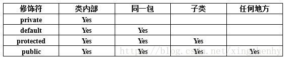
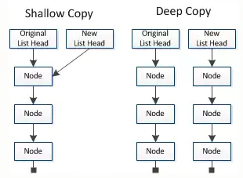
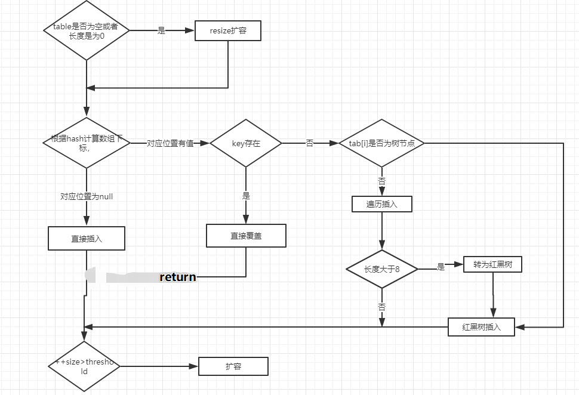
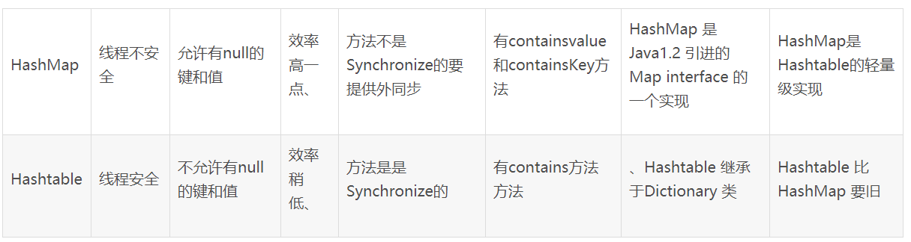
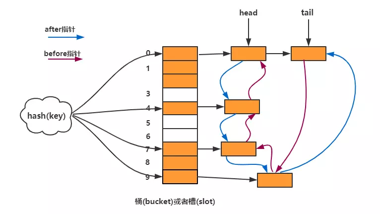

# 0.基础

## 0.1 Java修饰符

- **default** (即默认，什么也不写）: 在同一包内可见，不使用任何修饰符。使用对象：类、接口、变量、方法。
- **private** : 在同一类内可见。使用对象：变量、方法。 **注意：不能修饰类（外部类）**
- **public** : 对所有类可见。使用对象：类、接口、变量、方法
- **protected** : 对同一包内的类和所有子类可见。使用对象：变量、方法。 **注意：不能修饰类（外部类）**。

## 02  异常和错误

 **Throwable包含了错误(Error)和异常(Exception两类)** 

**Exception 包含**：

- 编译时异常（需要自己进行捕获处理）
- 运行期异常 （可以捕获也可以不捕获）  NullPointerException、IndexOutOfBoundsException 

**Error**

- 程序无法处理了直接终止线程

## 03 基本类型占据字节数

- byte 1
- boolean  1
- char  2
- short 2
- int 4
- long 8
- double 8
- float 4

## 04 final的作用

1、被final修饰的类不可以被继承

2、被final修饰的方法不可以被重写

 3、用final修饰的属性必须要直接赋值或者在构造方法中赋值，并且赋值以后不可更改

 **不可变的是变量的引用而非引用指向对象的内容** 

4、被final修饰的参数不可以被更改

当函数参数为final类型时，你可以读取使用该参数，但是无法改变该参数的值。

## 05  String字符串拼接应该使用哪种方式？

- +
- str.concat()
- StringBuffer.append()
- StringBuilder.append()

> 耗费时间
>
> ＋ >concat() >StringBuffer > StringBuilder
>
> String x = "a1" + "a2"; 编译之后代码就变成了
>
> String x = (new StringBuilder("a1")).append("a2").toString()
>
> 上面的操作显然对多次相加不利


## 06  int与Integer的基本使用对比

Integer是int的包装类；int是基本数据类型；
Integer变量必须实例化后才能使用；int变量不需要；
Integer实际是对象的引用，指向此new的Integer对象；int是直接存储数据值；
Integer的默认值是null；int的默认值是0。 

>  由于Integer变量实际上是对一个Integer对象的引用，所以两个通过new生成的Integer变量永远是不相等的（因为new生成的是两个对象，其内存地址不同）。

Integer i = new Integer(100);
Integer j = new Integer(100);
System.out.print(i == j); //false 

>  Integer变量和int变量比较时，只要两个变量的值是向等的，则结果为true（因为包装类Integer和基本数据类型int比较时，java会自动拆包装为int，然后进行比较，实际上就变为两个int变量的比较） 

 Integer i = new Integer(100);
int j = 100；
System.out.print(i == j); //true 

> 对于两个非new生成的Integer对象，进行比较时，如果两个变量的值在区间-128到127之间，则比较结果为true，如果两个变量的值不在此区间，则比较结果为false。

Integer i = 100;
Integer j = 100;
System.out.print(i == j); //true

Integer i = 128;
Integer j = 128;
System.out.print(i == j); //false 

> 对于第4条的原因：java在编译Integer i = 100 时，会翻译成为Integer i = Integer.valueOf(100)。而java API中对Integer类型的valueOf的定义如下，对于-128到127之间的数，会进行缓存，Integer i = 127时，会将127进行缓存，下次再写Integer j = 127时，就会直接从缓存中取，就不会new了。

public static Integer valueOf(int i){
  assert IntegerCache.high >= 127;
  if (i >= IntegerCache.low && i <= IntegerCache.high){
    return IntegerCache.cache[i + (-IntegerCache.low)];
  }
  return new Integer(i);
}

## 07 重写equals方法时为什么要重写hashCode

### **1、首先我们看看对象默认的（Object）的equals方法和hashcode方法**

```java
public booleanequals(Object obj) {
return(this== obj);
}
public native inthashCode();
```

对象在不重写的情况下使用的是Object的equals方法和hashcode方法，从Object类的源码我们知道，默认的equals 判断的是两个对象的引用指向的是不是同一个对象；而hashcode也是根据对象地址生成一个整数数值；


### **2、重写equals**

案例场景：

定义一个User对象有多个属性值姓名、年龄、身份证；


我们写代码的时候会发现，两个new 出来的User()对象 无论他们的的各项值是否一样两个对象equals 永远都是false，两个对象值完全一样放到HashSet里面它会把这两个值完全一样的对象当成两个不同的对象了，这样的话好像HashSet的特性就丢失了；


其实原因就是我们没有重写User 的equals方法，它会调用Object的equals方法，就如上图一样，Object的equals方法是比较对象的引用对象是否是同一个，两个new出来的对象当然不一样。


好了现在需求来了，我们需要两个对象的各项属性值一样的就认为这两个对象是相等的；那么此时我们就需要重写equals方法了；

代码如下：

```java
public classUser {
privateStringname;//姓名
privateStringIdCard;//身份证
private intage;//年龄
/**
* 重写equals
*@paramobj
*@return
*/
@Override
public boolean equals(Object obj) {
 if (obj instanceof User) {
        User user = (User) obj;
 if (user.getIdCard().equals(this.IdCard) && user.getName().equals(this.name) &&      user.getAge() == this.age) {
 return true;
        } else {
 return false;
        }
    } else {
 return false;
    }
}
//......省略N行代码
}
```

**那么现在关键的地方来了：**现在我们重写了User对象的equals方法，但并没有重写hashcode方法。

**（1）首先测试下equals的正确性**

```java
User user1=newUser();
user1.setName("路西");
user1.setAge(18);
user1.setIdCard("430");
User user2=newUser();
user2.setName("路西");
user2.setAge(18);
user2.setIdCard("430");
System.out.println("user1.equals(user2)="+user1.equals(user2));
user1.equals(user2)测试结果为true;
```

**(2)在两个对象equals的情况下进行把他们分别放入Map和Set中**

在上面的代码基础上追加如下代码：

```java
Set set =new HashSet();
set.add(user1);
set.add(user2);
Map map=newHashMap();
map.put(user1,"user1");
map.put(user2,"user2");
System.out.println("set 长度"+set.size());
System.out.println("map 长度"+map.keySet().size());;
```

测试打印结果为：


好了现在问题来了，明明user1和user2两个对象是equals的那么为什么把他们放到set中会有两个对象（Set特性是不允许重复数据的），还有Map也把两个同样的对象当成了不同的Key（Map的Key是不允许重复的，相同Key会覆盖）；

**（3）这里我先抛出结果，至于原理后面再进行描述**

原因是user1和user2的hashcode 不一样导致的；


因为我们没有重写父类（Object）的hashcode方法,Object的hashcode方法会根据两个对象的地址生成对相应的hashcode；

user1和user2是分别new出来的，那么他们的地址肯定是不一样的，自然hashcode值也会不一样。

Set区别对象是不是唯一的标准是，两个对象hashcode是不是一样，再判定两个对象是否equals;

Map 是先根据Key值的hashcode分配和获取对象保存数组下标的，然后再根据equals区分唯一值（详见下面的map分析）


### **3、重写hashcode方法；**

```java
public classUser  {
privateStringname;//姓名
privateStringIdCard;//身份证
private intage;//年龄
/**
* 重写equals
*@paramobj
*@return
*/
@Override
public boolean equals(Object obj) {
 if (obj instanceof User) {
        User user = (User) obj;
 if (user.getIdCard().equals(this.IdCard) && user.getName().equals(this.name) && user.getAge() == this.age) {
 return true;
        } else {
 return false;
        }
    } else {
 return false;
    }
}

@Override
public int hashCode() {
 int result = name.hashCode();
    result = 31 * result + IdCard.hashCode();
    result = 31 * result + age;
 return result;
}
//......省略N行代码
}
```

我们按之前的流程重新测试一遍结果：

```java
User user1=newUser();
user1.setName("路西");
user1.setAge(18);
user1.setIdCard("430");
User user2=newUser();
user2.setName("路西");
user2.setAge(18);
user2.setIdCard("430");
System.out.println("user1.equals(user2)="+user1.equals(user2));
Set set =newHashSet();
set.add(user1);
set.add(user2);
Map map=newHashMap();
map.put(user1,"user1");
map.put(user2,"user2");
System.out.println("set 长度"+set.size());
System.out.println("map 长度"+map.keySet().size());;
System.out.println("user1的hashcode"+user1.hashCode());
System.out.println("user2的hashcode"+user2.hashCode());
```

打印结果：


## 08 public 、protected、default、private




## 09  String在new和直接赋值时的区别

 new是在堆上新建一个对象，直接赋值时指向字符串常量池中 


## 10、String、StringBuilder和StringBuffer的比较

**String**: 是被final修饰的不可变类，每次对其操作都可以生成一个新的对象

 StringBuffer和StringBuilder 都是可变类，任何对它们所指代的字符串的改变都不会产生新的对象，不过StringBuffer是线程安全的，支持并发操作，StringBuilder是线程不安全的，不支持并发操作。 StringBuilder类不是线程安全的，但其在单线程中的性能比StringBuffer高。 


## 11、抽象类和接口的区别


| 比较          | 抽象类                                                       | 接口                                   |
| :------------ | :----------------------------------------------------------- | -------------------------------------- |
| 默认方法      | 可以有默认方法                                               | jdk8之前没有默认方法                   |
| 实现方式      | 使用extends关键字来继承抽象类，如果子类不是抽象类，那么子类需要提供抽象类中的所有方法实现 | 子类通过implements来实现接口，子类需要 |
| 构造器        | 可以有构造器                                                 | 不能有构造器                           |
| 访问修饰符    | 抽象方法有public，protected,default等修饰符                  | 只能public                             |
| 多继承        | 一个子类只能继承一个父类                                     | 一个类可以实现多个接口                 |
| 添加新方   法 | 抽象类中添加新方法可以支持默认实现，因此可以不需要修改子类   | 子类需要重写新方法                     |


## 12、java的三大特性

- 封装

  > 封装隐藏了类的内部实现机制，可以在不影响使用的情况下改变类的内部结构，同时也保护了数据。对外界而已它的内部细节是隐藏的，暴露给外界的只是它的访问方法。 

- 继承

  >   继承是为了重用父类代码。 

- 多态

  > 多态就是指程序中定义的引用变量所指向的具体类型和通过该引用变量发出的方法调用在编程时并不确定，而是在程序运行期间才确定，即一个引用变量倒底会指向哪个类的实例对象，该引用变量发出的方法调用到底是哪个类中实现的方法，必须在由程序运行期间才能决定。 
  >
  >  因为在程序运行时才确定具体的类，这样，不用修改源程序代码，就可以让引用变量绑定到各种不同的类实现上，从而导致该引用调用的具体方法随之改变，即不修改程序代码就可以改变程序运行时所绑定的具体代码，让程序可以选择多个运行状态，这就是多态性。 

## 13、equals 和 == 的区别


1、如果比较的是 **变量** ：只能用 == ,不能用equals

2、如果比较的是引用型：

​	== ： 判断的是引用的地址是否相等

​	equals(): 判断的是引用的值是否相等


## 14、深拷贝和浅拷贝



 **浅拷贝只复制指向某个对象的指针，而不复制对象本身，新旧对象还是共享同一块内存。但深拷贝会另外创造一个一模一样的对象，新对象跟原对象不共享内存，修改新对象不会改到原对象** 

# 1. 集合


## 0 Map vs List vs Set

| 比较     | list                 | set             | map             |
| -------- | -------------------- | --------------- | --------------- |
| 继承接口 | collection           | collection      |                 |
| 实现类   | ArrayList LinkedList | HashSet TreeSet | HaspMap TreeMap |
| 元素     | 可重复               | 不可重复        | 不可重复        |
| 顺序     | 有序                 | 无序            | 无序            |
| 线程安全 | Vector               |                 | HashTable       |


**List(列表)**
  List的元素以线性方式存储，可以存放重复对象，List主要有以下两个实现类：

ArrayList : 长度可变的数组，可以对元素进行随机的访问，向ArrayList中插入与删除元素的速度慢。 JDK8 中ArrayList扩容的实现是通过grow()方法里使用语句newCapacity = oldCapacity + (oldCapacity >> 1)（即1.5倍扩容）计算容量，然后调用Arrays.copyof()方法进行对原数组进行复制。
LinkedList: 采用链表数据结构，插入和删除速度快，但访问速度慢。

**Set(集合)**
  Set中的对象不按特定(HashCode)的方式排序，并且没有重复对象，Set主要有以下两个实现类：

HashSet： HashSet按照哈希算法来存取集合中的对象，存取速度比较快。当HashSet中的元素个数超过数组大小*loadFactor（默认值为0.75）时，就会进行近似两倍扩容（newCapacity = (oldCapacity << 1) + 1）。
TreeSet ：TreeSet实现了SortedSet接口，能够对集合中的对象进行排序

**Map(映射)**
  Map是一种把键对象和值对象映射的集合，它的每一个元素都包含一个键对象和值对象。 Map主要有以下两个实现类：

HashMap：HashMap基于散列表实现，其插入和查询<K,V>的开销是固定的，可以通过构造器设置容量和负载因子来调整容器的性能。
LinkedHashMap：类似于HashMap，但是迭代遍历它时，取得<K,V>的顺序是其插入次序，或者是最近最少使用(LRU)的次序。
TreeMap：TreeMap基于红黑树实现。查看<K,V>时，它们会被排序。TreeMap是唯一的带有subMap()方法的Map，subMap()可以返回一个子树。


## 1 、Map

### 1.0 hashmap是否线程安全，有什么安全的hashmap？：

​	不安全，因为在多线程同时put时或者在扩容时Put都会有线程安全问题。安全可以使用hashtable、Collections.synchronizedMap、ConcurrentHashMap这三类。但前两类都是直接在方法标签上加了synchronized，所以效率很低。而ConcurrentHashMap效率很好，在1.7中，ConcurrentHashMap是用segment数组为锁住一块区域保证安全性。在1.8中ConcurrentHashMap和hashmap的结构完全一样，但更改了put方法。在计算了哈希值和索引后，先判断索引位置是否正在扩容，如果正在扩容就调用一个协助扩容的函数，如果没扩容再判断是否为空，为空则用CAS的方式放入，不为空则用synchronized锁住格子，判断为链表还是红黑树，分别调用对应方式放入。最后再判断一次冲突长度，大于8则转化为红黑树。 


### 1.1 、HashMap&ConCurrentHashMap

[hashmap & currentHashMap]: https://crossoverjie.top/2018/07/23/java-senior/ConcurrentHashMap/

 jdk1.7 ConcurrentHashMap 采用了分段锁技术，其中 Segment 继承于 ReentrantLock。不会像 HashTable 那样不管是 put 还是 get 操作都需要做同步处理， 

> 常见问题



#### 1.1 谈谈你理解的 HashMap，讲讲其中的 get put 过程。

> 1.7 put的过程


- 判断当前数组是否需要初始化。
- 如果 key 为空，则 put 一个空值进去。
- 根据 key 计算出 hashcode。
- 根据计算出的 hashcode 定位出所在桶。
- 如果桶是一个链表则需要遍历判断里面的 hashcode、key 是否和传入 key 相等，如果相等则进行覆盖，并返回原来的值。
- 如果桶是空的，说明当前位置没有数据存入；新增一个 Entry 对象写入当前位置。


当调用 addEntry 写入 Entry 时需要判断是否需要扩容。

如果需要就进行两倍扩充，并将当前的 key 重新 hash 并定位。

而在 `createEntry` 中会将当前位置的桶传入到新建的桶中，如果当前桶有值就会在位置形成链表。


> get 方法


- 首先也是根据 key 计算出 hashcode，然后定位到具体的桶中。
- 判断该位置是否为链表。
- 不是链表就根据 `key、key 的 hashcode` 是否相等来返回值。
- 为链表则需要遍历直到 key 及 hashcode 相等时候就返回值。
- 啥都没取到就直接返回 null 。

#### 1.2 1.8 做了什么优化？

>  1.7当 Hash 冲突严重时，在桶上形成的链表会变的越来越长，这样在查询时的效率就会越来越低；时间复杂度为 `O(N)`。 

因此1.8 重点优化了这个部分，使用了hash表+链表+红黑树来实现

> put操作

1. 判断当前桶是否为空，空的就需要初始化（resize 中会判断是否进行初始化）。
2. 根据当前 key 的 hashcode 定位到具体的桶中并判断是否为空，为空表明没有 Hash 冲突就直接在当前位置创建一个新桶即可。
3. 如果当前桶有值（ Hash 冲突），那么就要比较当前桶中的 `key、key 的 hashcode` 与写入的 key 是否相等，相等就赋值给 `e`,在第 8 步的时候会统一进行赋值及返回。
4. <u>如果当前桶为红黑树，那就要按照红黑树的方式写入数据。</u>
5. <u>如果是个链表，就需要将当前的 key、value 封装成一个新节点写入到当前桶的后面（形成链表）。</u>
6. <u>接着判断当前链表的大小是否大于预设的阈值，大于时就要转换为红黑树</u>。
7. 如果在遍历过程中找到 key 相同时直接退出遍历。
8. 如果 `e != null` 就相当于存在相同的 key,那就需要将值覆盖。
9. <u>最后判断是否需要进行扩容</u>。

> get 操作

- 首先将 key hash 之后取得所定位的桶。
- 如果桶为空则直接返回 null 。
- <u>否则判断桶的第一个位置(有可能是链表、红黑树)的 key 是否为查询的 key，是就直</u>接返回 value。
- <u>如果第一个不匹配，则判断它的下一个是红黑树还是链表</u>。
- <u>红黑树就按照树的查找方式返回值</u>。
- <u>不然就按照链表的方式遍历匹配返回值。</u>

#### 1.3是线程安全的嘛？

线程不安全


#### 1.4 不安全会导致哪些问题？

- 多线程的put可能导致元素的丢失

- put和get并发时，可能导致get为null

  >  线程1执行put时，因为元素个数超出threshold而导致rehash，线程2此时执行get，有可能导致这个问题。 

- JDK7中HashMap并发put会造成循环链表，导致get时出现死循环 

  [连接]: https://www.cnblogs.com/chanshuyi/p/java_collection_hashmap_17_infinite_loop.html

[举例说明]: https://juejin.im/post/5c8910286fb9a049ad77e9a3#heading-4


#### 1.5 如何解决？有没有线程安全的并发容器？

​	currentHashMap

#### 1.6 ConcurrentHashMap 是如何实现的？ 1.7、1.8 实现有何不同？为什么这么做？


其中抛弃了原有的 Segment （ReentrantLock）分段锁，而采用了 `CAS + synchronized` 来保证并发安全性。

> 放弃分段锁的原因
>
> 1. 加入多个分段锁浪费内存空间。
> 2. 生产环境中， map 在放入时竞争同一个锁的概率非常小，分段锁反而会造成更新等操作的长时间等待。
> 3. 为了提高 GC 的效率

也将 1.7 中存放数据的 HashEntry 改为 Node，但作用都是相同的。

其中的 `val next` 都用了 volatile 修饰，保证了可见性。

同样在也在链表大于8时采用红黑树来存储


### 1.2 . HashMap vs HashTable

> **HashTable 是线程安全 Collection**



### 1.3 LinkedhashMap的数据结构


LinkedHashMap是HashMap的一个子类，它**保留插入的顺序**，如果需要输出的顺序和输入时的相同，那么就选用LinkedHashMap。

LinkedHashMap是Map接口的哈希表和链接列表实现，具有可预知的迭代顺序。此实现提供所有可选的映射操作，并**允许使用null值和null键**。此类不保证映射的顺序，特别是它**不保证该顺序恒久不变**。

LinkedHashMap实现与HashMap的不同之处在于，后者维护着一个运行于所有条目的双重链接列表。此链接列表定义了迭代顺序，该迭代顺序可以是插入顺序或者是访问顺序。

注意，此实现不是同步的。如果多个线程同时访问链接的哈希映射，而其中至少一个线程从结构上修改了该映射，则它必须保持外部同步。



> linkedHashMap 构造方法是有意思的，比 HashMap 多了一个 accessOrder boolean 参数。表示，按照访问顺序来排序。最新访问的放在链表尾部。 

如果看 LinkedHashMap 内部源码，会发现，内部确实维护了一个链表：

```java
   public class LinkedHashMap<K,V> extends HashMap<K,V> implements Map<K,V>
{
  static class Entry<K,V> extends HashMap.Node<K,V> {
    Entry<K,V> before, after;
    Entry(int hash, K key, V value, Node<K,V> next) {
        super(hash, key, value, next);
    }

    // 双向链表头节点
    transient LinkedHashMap.Entry<K,V> head;

    // 双向链表尾节点
    transient LinkedHashMap.Entry<K,V> tail;

    // 指定遍历LinkedHashMap的顺序,true表示按照访问顺序,false表示按照插入顺序，默认为false
    final boolean accessOrder;
  }

}
```

当accessOrder=true,访问顺序的输出是什么意思呢？来看下下面的一段代码

```java
LinkedHashMap<Integer,Integer> map = new LinkedHashMap<>(8, 0.75f, true);

map.put(1, 1);
map.put(2, 2);
map.put(3, 3);

map.get(2);

System.out.println(map);

```

输出结果是

```
{1=1, 3=3, 2=2}
```

 可以看到get了的数据被放到了双向链表尾部，也就是按照了访问时间进行排序,这就是访问顺序的含义。 

> 在插入的时候LinkedHashMap复写了HashMap的newNode以及newTreeNode方法,并且在方法内部更新了双向链表的指向关系。

在添加元素的时候，会追加到尾部。

```java
    Node<K,V> newNode(int hash, K key, V value, Node<K,V> e) {
        LinkedHashMap.Entry<K,V> p =
            new LinkedHashMap.Entry<K,V>(hash, key, value, e);
        linkNodeLast(p);
        return p;
    }

    // link at the end of list
    private void linkNodeLast(LinkedHashMap.Entry<K,V> p) {
        LinkedHashMap.Entry<K,V> last = tail;
        tail = p;
        if (last == null)
            head = p;
        else {
            p.before = last;
            last.after = p;
        }
    }
```

> 在 get 的时候，会根据 accessOrder 属性，修改链表顺序：
>
> 同时插入的时候调用了afterNodeAccess()方法以及afterNodeInsertion()方法,在HashMap中这两个方法是空实现,而在LinkedHashMap中则有具体实现,这两个方法也是专门给LinkedHashMap进行回调处理的。
>
> afterNodeAccess()方法中如果accessOrder=true时会移动节点到双向链表尾部。当我们在调用map.get()方法的时候如果accessOrder=true也会调用这个方法,这就是为什么访问顺序输出时访问到的元素移动到链表尾部的原因。

```java
    public V get(Object key) {
        Node<K,V> e;
        if ((e = getNode(hash(key), key)) == null)
            return null;
        if (accessOrder)
            afterNodeAccess(e);
        return e.value;
    }

    void afterNodeAccess(Node<K,V> e) { // move node to last
        LinkedHashMap.Entry<K,V> last;
        if (accessOrder && (last = tail) != e) {
            LinkedHashMap.Entry<K,V> p =
                (LinkedHashMap.Entry<K,V>)e, b = p.before, a = p.after;
            p.after = null;
            if (b == null)
                head = a;
            else
                b.after = a;
            if (a != null)
                a.before = b;
            else
                last = b;
            if (last == null)
                head = p;
            else {
                p.before = last;
                last.after = p;
            }
            tail = p;
            ++modCount;
        }
    }
```

####  LRU的 使用LinkedHashMap

>  可以通过LinkedHashMap来实现LRU(Least Recently Used,即近期最少使用),只要满足条件,就删除head节点。 

```java
import java.util.LinkedHashMap;
import java.util.Map;

public class LRUCache<K,V> {
    private final int CACHE_SIZE;
    private final float LOAD_FACTOR = 0.75f;

    LinkedHashMap<K,V> map;

    public LRUCache(int CACHE_SIZE) {
        this.CACHE_SIZE = CACHE_SIZE;
        int capacity = (int) (Math.ceil(CACHE_SIZE/LOAD_FACTOR)+1);
        map = new LinkedHashMap(capacity,LOAD_FACTOR,true){
            @Override
            protected boolean removeEldestEntry(Map.Entry eldest) {
                return size()>CACHE_SIZE;
            }
        };
    }
    public synchronized void put(K key,V val){
        map.put(key,val);
    }
    public synchronized V get(K key){
        return map.get(key);
    }
    public synchronized void remove(K key){
        map.remove(key);
    }
    public synchronized int sizi(){
        return map.size();
    }
    public synchronized  void clear(){
        map.clear();
    }
    @Override
    public String toString() {
        StringBuilder sb = new StringBuilder();
        for (Map.Entry entry : map.entrySet()) {
            sb.append(String.format("%s:%s ", entry.getKey(), entry.getValue()));
        }
        return sb.toString();
    }

    public static void main(String[] args) {
        LRUCache<Integer,String> cache = new LRUCache(5);
        cache.put(1,"1");
        cache.put(2,"2");
        cache.put(3,"3");
        cache.put(4,"4");
        cache.put(5,"5");
        System.out.println(cache.toString());
        cache.put(6,"6");
        cache.get(3);
        System.out.println(cache.toString());
        //1:1 2:2 3:3 4:4 5:5 
        //2:2 4:4 5:5 6:6 3:3 
    }
}
```

#### LRU Cache的链表+HashMap实现

```java
import java.util.HashMap;

public class LRUCache1<K,V> {
    private final int CACHE_SIZE;
    private Entry first;
    private Entry last;

    private HashMap<K,Entry<K,V>> hashMap;

    class Entry<K,V>{
        public Entry pre;
        public Entry next;
        public K key;
        public V value;
    }

    public LRUCache1(int cache_size) {
        this.CACHE_SIZE = cache_size;
        hashMap = new HashMap<>();
    }
    public void put(K key, V value){
        Entry<K, V> entry = getEntry(key);
        if(entry==null){
            if(hashMap.size()>=CACHE_SIZE){
                hashMap.remove(last.key);
                removeLast();
            }
            entry = new Entry<>();
            entry.key = key;
        }
        //有元素
        entry.value = value;
        moveToFirst(entry);
        hashMap.put(key,entry);
    }


    public V get(K key){
        Entry<K, V> entry = getEntry(key);
        if(entry==null) return null;
        moveToFirst(entry);
        return entry.value;
    }

    public void remove(K key){
        Entry<K, V> entry = getEntry(key);
        if(entry!=null){
            if(entry.pre!=null) entry.pre.next = entry.next;
            if(entry.next!=null) entry.next.pre = entry.pre;
            if(entry == first) first = entry.next;
            if(entry == last) last = entry.pre;
        }
        hashMap.remove(key);
    }


    private Entry<K,V> getEntry(K key){
        return hashMap.get(key);
    }

    //把最近访问的一个元素挪到第一个
    private void moveToFirst(Entry entry){
        if(entry == first) return ;
        if(entry.pre!=null) entry.pre.next =  entry.next;
        if(entry.next!=null) entry.next.pre = entry.pre;
        if(entry ==last) last = last.pre;

        if(first == null || last == null){
            first = last = entry;
            return ;
        }
        entry.next = first;
        first.pre = entry;
        first = entry;
        entry.pre = null;
    }
    //删除链表最后一个元素
    private void removeLast(){
        if(last!=null){
            last = last.pre;
            if(last ==null) first = null;
            else last.next = null;
        }
    }
    @Override
    public String toString() {
        StringBuilder sb = new StringBuilder();
        Entry entry = first;
        while (entry != null) {
            sb.append(String.format("%s:%s ", entry.key, entry.value));
            entry = entry.next;
        }
        return sb.toString();
    }

    public static void main(String[] args) {
        LRUCache1<Integer,String> cache = new LRUCache1<>(5);
        cache.put(1,"1");
        cache.put(2,"2");
        cache.put(3,"3");
        cache.put(4,"4");
        cache.put(5,"5");
        System.out.println(cache.toString());
        cache.put(6,"6");
        cache.get(3);
        System.out.println(cache.toString());
        //5:5 4:4 3:3 2:2 1:1 
        //3:3 6:6 5:5 4:4 2:2 
    }

}

```


## 2、List

### 2.1 ArrayList &LinkedList

ArrayList

- 基于数组来实现
- 初始长度为10 
- 扩容1.5倍，扩容后复制到新的数组之中

LinkedList

- 基于双向链表来实现的
- 每个链表存储了first 和 last指针 

### 2.1 ArrayList 的简单实现

```java

/**
 * 1.ArrayList的简单实现（手写）
 * 2.包括以下方法：
 *              int size();
 *              MyArrayList();
 *              MyArrayList(int initialCapacity);
 *              boolean isEmpty();
 *              Object get(int index);
 *              boolean add(Object obj);
 *              void add(int index,Object obj)
 *              Object remove(int index)
 *              boolean remove(Object obj)
 *              Object set(int index,Object obj)
 *              void rangeCheck(int index)
 *              void ensureCapacity()
 */
public class MyArrayList<E> {
    private Object element[];
    private int size;
    public MyArrayList() {
        this(10);
    }

    public MyArrayList(int capacity){
        if(capacity<0){
            try {
              throw new IllegalArgumentException();
            } catch (Exception e) {
                e.printStackTrace();
            }
        }
        element = new Object[capacity];
    }
    public int size(){
        return size;
    }

    public boolean isEmpty(){
        return size == 0;
    }

    public E get(int index){
        rangeCheck(index);
        return (E) element[index];
    }

    public boolean add(E elem){
        ensureCapacity();
        element[size++] = elem;
        return true;
    }

    public void add(int index,Object obj){
        /*
         * 插入操作（指定位置）
         * 1.下标合法性检查
         * 2.数组容量检查、扩容
         * 3.数组复制（原数组，开始下标，目的数组，开始下标，长度）
         */
        rangeCheck(index);
        ensureCapacity();
        System.arraycopy(element, index, element, index+1,size-index);
        element[index]=obj;
        size++;
    }

    public E remove(int index){

        rangeCheck(index);
        E oldValue =  get(index);
        System.arraycopy(element,index+1,element,index-1,size-index-1);
        size--;
        return oldValue;

    }


    private void rangeCheck(int index){
        if(index <0 || index>size-1){
            try {
                throw  new ArrayIndexOutOfBoundsException();
            } catch (Exception e) {
                e.printStackTrace();
            }
        }

    }
    private void ensureCapacity(){
        if(size == element.length) {
            int newSize = size + (size >> 1);
            element = Arrays.copyOf(element, newSize);
        }
    }
}

```


## 3、Set

### 3.1、TreeSet和HashSet

#### HashSet 

**HashSet有以下特点：**

1 、不能保证元素的排列顺序，顺序有可能发生变化
2、不是同步的
3、集合元素可以是null,但只能放入一个null

> 当向HashSet集合中存入一个元素时，HashSet会调用该对象的hashCode()方法来得到该对象的hashCode值，然后根据 hashCode值来决定该对象在HashSet中存储位置。
> 简单的说，HashSet集合判断两个元素相等的标准是两个对象通过equals方法比较相等，并且两个对象的hashCode()方法返回值相 等
> 注意，如果要把一个对象放入HashSet中，重写该对象对应类的equals方法，也应该重写其hashCode()方法。其规则是如果两个对 象通过equals方法比较返回true时，其hashCode也应该相同。另外，对象中用作equals比较标准的属性，都应该用来计算 hashCode的值。


#### TreeSet

TreeSet是`SortedSet`接口的唯一实现类，TreeSet可以确保集合元素处于排序状态。TreeSet支持两种排序方式，自然排序 和定制排序，其中自然排序为默认的排序方式。向TreeSet中加入的应该是同一个类的对象。
TreeSet判断两个对象不相等的方式是两个对象通过equals方法返回false，或者通过CompareTo方法比较没有返回0

自然排序
自然排序使用要排序元素的`CompareTo（Object obj）`方法来比较元素之间大小关系，然后将元素按照升序排列。
Java提供了一个Comparable接口，该接口里定义了一个compareTo(Object obj)方法，该方法返回一个整数值，实现了该接口的对象就可以比较大小。
obj1.compareTo(obj2)方法如果返回0，则说明被比较的两个对象相等，如果返回一个正数，则表明obj1大于obj2，如果是 负数，则表明obj1小于obj2。
如果我们将两个对象的equals方法总是返回true，则这两个对象的compareTo方法返回应该返回0
定制排序
自然排序是根据集合元素的大小，以升序排列，如果要定制排序，应该使用Comparator接口，实现 int compare(T o1,T o2)方法。

#### HashSet 和TreeSet 的比较

1、TreeSet 是二差树实现的,Treeset中的数据是自动排好序的，不允许放入null值。

2、HashSet 是哈希表实现的,HashSet中的数据是无序的，可以放入null，但只能放入一个null，两者中的值都不能重复，就如数据库中唯一约束。

3、HashSet要求放入的对象必须实现HashCode()方法，放入的对象，是以hashcode码作为标识的，而具有相同内容的 String对象，hashcode是一样，所以放入的内容不能重复。但是同一个类的对象可以放入不同的实例 。


## 


