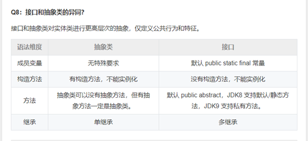
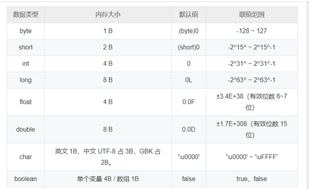

# java基础

## 封装、继承、多态

**封装**：

把客观事物封装成抽象的类，并且类可以把自己的数据和方法只让可信的类或者对象操作，对不可信的进行信息隐藏。封装是面向对象的特征之一，是对象和类概念的主要特性。 简单的说，<font color='red'> 一个类就是一个封装了数据以及操作这些数据的代码的逻辑实体。在一个对象内部，某些代码或某些数据可以是私有的，不能被外界访问。通过这种方式，对象对内部数据提供了不同级别的保护，以防止程序中无关的部分意外的改变或错误的使用了对象的私有部分。 </font>

**继承**：

<font color='red'>是指可以让某个类型的对象获得另一个类型的对象的属性的方法。</font>它支持按级分类的概念。继承是指这样一种能力：它可以使用现有类的所有功能，并在无需重新编写原来的类的情况下对这些功能进行扩展。 通过继承创建的新类称为“子类”或“派生类”，被继承的类称为“基类”、“父类”或“超类”。继承的过程，就是从一般到特殊的过程。要实现继承，可以通过“继承”（Inheritance）和“组合”（Composition）来实现。继承概念的实现方式有二类：<font color='cornflowerblue'>实现继承与接口继承。实现继承是指直接使用基类的属性和方法而无需额外编码的能力；接口继承是指仅使用属性和方法的名称、但是子类必须提供实现的能力；</font>


## 多态的实现原理

[java多态的]( https://www.cnblogs.com/serendipity-fly/p/9469289.html )

**多态的分类**：编译时多态（静态多态，重载）和运行时多态（动态多态）

**多态的实现方法**：子类继承父类（extends）和类实现接口（implements）

多态的实现原理：

Java 的方法调用方式：Java 的方法调用有两类，动态方法调用与静态方法调用。<font color='red'>静态方法调用是指对于类的静态方法的调用方式，是静态绑定的</font>；<font color='cornflowerblue'>而动态方法调用需要有方法调用所作用的对象，是动态绑定的</font>。类调用 (invokestatic) 是在编译时刻就已经确定好具体调用方法的情况，而实例调用 (invokevirtual) 则是在调用的时候才确定具体的调用方法，这就是动态绑定，也是多态要解决的核心问题。JVM 的方法调用指令有四个，分别是 invokestatic，invokespecial，invokesvirtual 和 invokeinterface。前两个是静态绑定，后两个是动态绑定的。本文也可以说是对于 JVM 后两种调用实现的考察。

## 子类的初始化顺序

1. 父类中静态成员变量和静态代码块

2. 子类中静态成员变量和静态代码块

3. 父类中普通成员变量和代码块，父类的构造函数

4. 子类中普通成员变量和代码块，子类的构造函数

##  static可以被继承么  

[static继承]( https://www.cnblogs.com/JMLiu/p/7515795.html )

1,<font color='red'>可以被继承，但是不能被重写</font>，如果父子类静态方法名相同，则会隐藏derive类方法（调用base类的方法）

2.<font color='cornflowerblue'>静态方法是编译时绑定的，方法重写是运行时绑定的。</font>

## 抽象类和接口的区别

抽象类：是用来捕捉子类的通用特性的。它不能被实例化，只能被用作子类的超类。抽象类是被用来创建继承层级里子类的模板。

接口：是抽象方法的集合。如果一个类实现了某个接口，那么它就继承了这个接口的抽象方法。这就像契约模式，如果实现了这个接口，那么就必须确保使用这些方法。接口只是一种形式，接口自身不能做任何事情。

区别：



## 重载，重写

**重写**

 <font color='green'> 	重写指子类实现接口或继承父类时，保持方法签名完全相同，实现不同方法体 </font> 

<font color='red'> 两同 </font>（方法名和形参列表），

<font color='red'>两小</font>（子类方法的返回类型和异常类型必须是父类的对应类型或者其子类型）

<font color='red'>一大</font>（子类的访问权限必须大于等于父类）。

<font color='cornflowerblue'> 只发生在可见实例方法中，不能在静态方法和私有方法中 </font>。

**重载**

​         <font color='green'> 方法名一致，形参列表不同。无所谓返回值多少，不作为判断依据。   </font>

​         对编译器来说，方法名称和参数列表组成了一个唯一键，称为方法签名，JVM 通过方法签名决定调用哪种重载方法  

## jdk和jre

JDK： Java Development Kit，开发工具包。提供了编译运行 Java 程序的各种工具，包括编译器、JRE 及常用类库，是 JAVA 核心。

JRE： Java Runtime Environment，运行时环境，运行 Java 程序的必要环境，包括 JVM、核心类库、核心配置工具。

## jdk8新特性

l lambda 表达式：允许把函数作为参数传递到方法，简化匿名内部类代码。

l 函数式接口：使用 @FunctionalInterface 标识，有且仅有一个抽象方法，可被隐式转换为 lambda 表达式。

l 方法引用：可以引用已有类或对象的方法和构造方法，进一步简化 lambda 表达式。

l 接口：接口可以定义 default 修饰的默认方法，降低了接口升级的复杂性，还可以定义静态方法。

l 注解：引入重复注解机制，相同注解在同地方可以声明多次。注解作用范围也进行了扩展，可作用于局部变量、泛型、方法异常等。

l 类型推测：加强了类型推测机制，使代码更加简洁。

l Optional 类：处理空指针异常，提高代码可读性。

l Stream 类：引入函数式编程风格，提供了很多功能，使代码更加简洁。方法包括 forEach 遍历、count 统计个数、filter 按条件过滤、limit 取前 n 个元素、skip 跳过前 n 个元素、map 映射加工、concat 合并 stream 流等。

l 日期：增强了日期和时间 API，新的 java.time 包主要包含了处理日期、时间、日期/时间、时区、时刻和时钟等操作。

l JavaScript：提供了一个新的 JavaScript 引擎，允许在 JVM上运行特定 JavaScript 应用。

## 基本数据类型



<font color='red'> JVM 没有 boolean 赋值的专用字节码指令，boolean f = false 就是使用 ICONST_0 即常数 0 赋值。单个 boolean 变量用 int 代替，boolean 数组会编码成 byte 数组。 </font>

## 自动拆箱和自动装箱

每个基本数据类型都对应一个包装类，除了 int 和 char 对应 Integer 和 Character 外，其余基本数据类型的包装类都是首字母大写即可。

**自动装箱**： <font color='cornflowerblue'> 将基本数据类型包装为一个包装类对象 </font>，例如向一个泛型为 Integer 的集合添加 int 元素。w

**自动拆箱**： <font color='cornflowerblue'> 将一个包装类对象转换为一个基本数据类型，例如将一个包装类对象赋值给一个基本数据类型的变量 </font>。

<font color='red'> 比较两个包装类数值要用 equals ，而不能用 == 。 </font>

## Object的方法  

<font color='cornflowerblue'>1、equals() </font>

检测对象是否相等，默认使用 == 比较对象引用，可以重写 equals 方法自定义比较规则。equals 方法规范：自反性、对称性、传递性、一致性、对于任何非空引用 x，x.equals(null) 返回 false。

（1）检查是否为同一个对象的引用，如果是直接返回 true；
 （2）检查是否是同一个类型，如果不是，直接返回 false；
 （3）将 Object 对象进行转型；
 （4）判断每个关键域是否相等。
 等价与相等的区别
 对于基本类型，== 判断两个值是否相等，基本类型没有 equals() 方法。
 对于引用类型，== 判断两个变量是否引用同一个对象，而 equals() 判断引用的对象是否等价。

<font color='cornflowerblue'> 2、hashCode() </font>

返回哈希值，HashSet 和 HashMap 等集合类使用了 hashCode() 方法来返回在hash表中对应的位置。散列码是由对象导出的一个整型值，没有规律，每个对象都有默认散列码，值由对象存储地址得出。字符串散列码由内容导出，值可能相同。为了在集合中正确使用，一般需要同时重写 equals 和 hashCode，要求 equals 相同 hashCode 必须相同，hashCode 相同 equals 未必相同，因此 hashCode 是对象相等的必要不充分条件。

<font color='cornflowerblue'>3、toString()</font> 

用于返回以一个字符串表示的 Number 对象值。打印对象时默认的方法，如果没有重写打印的是表示对象值的一个字符串。

<font color='cornflowerblue'> 4、clone()【浅拷贝和深拷贝的区别】 </font>

clone 方法声明为 protected，类只能通过该方法克隆它自己的对象，如果希望其他类也能调用该方法必须定义该方法为 public。如果一个对象的类没有实现 Cloneable 接口，该对象调用 clone 方***抛出一个 CloneNotSupport 异常。默认的 clone 方法是浅拷贝，一般重写 clone 方法需要实现 Cloneable 接口并指定访问修饰符为 public。

用于拷贝对象，分为浅拷贝和深拷贝：

**浅拷贝**： 只复制当前对象的基本数据类型及引用变量，没有复制引用变量指向的实际对象。修改克隆对象可能影响原对象，不安全。
 **深拷贝**： 完全拷贝基本数据类型和引用数据类型，安全。

<font color='red'> 5、finalize() </font>

确定一个对象死亡至少要经过两次标记，如果对象在可达性分析后发现没有与 GC Roots 连接的引用链会被第一次标记，随后进行一次筛选，条件是对象是否有必要执行 finalize 方法。假如对象没有重写该方法或方法已被虚拟机调用，都视为没有必要执行。如果有必要执行，对象会被放置在 F-Queue 队列，由一条低调度优先级的 Finalizer 线程去执行。虚拟机会触发该方法但不保证会结束，这是为了防止某个对象的 finalize 方法执行缓慢或发生死循环。只要对象在 finalize 方法中重新与引用链上的对象建立关联就会在第二次标记时被移出回收集合。由于运行代价高昂且无法保证调用顺序，在 JDK 9 被标记为过时方法，并不适合释放资源。

<font color='cornflowerblue'>6、wait() / notify() / notifyAll()</font>

阻塞或唤醒持有该对象锁的线程。

<font color='cornflowerblue'> 7、getClass </font>

返回包含对象信息的类对象。

## 数组和链表的区别

l **内存空间的连续性**：数组需要足够大的连续内存存储空间；链表中可以不连续且空间利用率高，链表的每个元素存储了下一个元素的地址，使得一系列的随机的内存地址串在一起，所以只要用足够的内存空间，就能为链表分配内存。

l **访问方式**：数组可以随机访问其中的元素，查找速度快；链表不能随机查找，必须从第一个开始遍历，查找效率低，因为存储空间不连续，你无法根据一个索引算出对应元素的地址，所以不能随机访问。

l **元素插入和删除**：数组增删速度慢，每次必须搬移后面的所有数据以保持连续，时间复杂度 O(N)；链表插入删除快，时间复杂度只有o（1）。

l **大小和动态拓展**：数组大小固定，不能动态扩展，数组如果要扩容，需要重新分配一块更大的空间，再把数据全部复制过去，时间复杂度 O(N)；链表大小不固定，可以动态扩展。但由于每个元素必须存储指向前后元素位置的指针，会消耗相对更多的储存空间。

### **ArrayList**和LinkedList区别

1、ArrayList是基于动态数组实现的，LinkedList是基于双向链表实现的
 2、ArrayList支持随机访问，查询速度快，LinkedList访问数据的平均效率低，需要对链表进行遍历
 3、ArrayList删除和插入非尾部元素时候代价高，需要移动大量元素，LinkedList的删除和插入只需要改变指针。


### **ArrayList**的底层实现

1. 以<font color='cornflowerblue'>数组</font>实现，节约空间，但数组有容量限制。超出限制时会增加50%容量，用 System.arraycopy()复制到新的数组，因此最好能给出数组大小的预估值。<font color='cornflowerblue'>默认第一次插入元素时创建大小为10的数组</font>。 ArrayList是一个相对来说比较简单的数据结构，<font color='red'>最重要的一点就是它的自动扩容</font>， 可以认为就是我们常说的“动态数组”。
2.  按数组下标访问元素—get(i)/set(i,e) 的性能很高，这是数组的基本优势。 
3. 直接在数组末尾加入元素—add(e)的性能也高，但如果按下标插入、删除元素 —add(i,e), <font color='red'>remove(i), remove(e)，则要用System.arraycopy()来移动部分受影 响的元素，性能就变差了，这是基本劣势。</font>
4. ArrayList 是容量可变的非线程安全列表，使用数组实现，<font color='red'> 集合扩容时会创建更大的数组，把原有数组复制到新数组 </font>。支持对元素的快速随机访问，但插入与删除速度很慢。ArrayList 实现了 RandomAcess 标记接口，如果一个类实现了该接口，那么表示使用索引遍历比迭代器更快。elementData是 ArrayList 的数据域，被 transient 修饰，序列化时会调用 writeObject 写入流，反序列化时调用 readObject 重新赋值到新对象的 elementData。原因是 elementData 容量通常大于实际存储元素的数量，所以只需发送真正有实际值的数组元素。size 是当前实际大小，elementData 大小大于等于 size。*modCount *记录了 ArrayList 结构性变化的次数，继承自 AbstractList。所有涉及结构变化的方法都会增加该值。expectedModCount 是迭代器初始化时记录的 modCount 值，每次访问新元素时都会检查 modCount 和 expectedModCount 是否相等，不相等就会抛出异常。这种机制叫做<font color='red'>  fail-fast </font>，所有集合类都有这种机制。

### **LinkedList**的底层实现

1. <font color='red'> 以双向链表实现 </font>。链表无容量限制，但双向链表本身使用了更多空间，也需要额外的链表指针操作。 
2. 按下标访问元素—get(i)/set(i,e) 要悲剧的遍历链表将指针移动到位(如果i>数组 大小的一半，会从末尾移起)。 
3. 插入、删除元素时修改前后节点的指针即可，但还是要遍历部分链表的指针才 能移动到下标所指的位置，只有在链表两头的操作—add()，addFirst()， removeLast()或用iterator()上的remove()能省掉指针的移动。
4. LinkedList 本质是双向链表，与 ArrayList 相比插入和删除速度更快，但随机访问元素很慢。除继承 AbstractList 外还实现了 Deque 接口，这个接口具有队列和栈的性质。成员变量被 transient 修饰，原理和 ArrayList 类似。LinkedList 包含三个重要的成员：size、first 和 last。size 是双向链表中节点的个数，first 和 last 分别指向首尾节点的引用。LinkedList 的优点在于可以将零散的内存单元通过附加引用的方式关联起来，形成按链路顺序查找的线性结构，内存利用率较高。

## fail-fast和fail-safe

**fail-fast**：在系统设计中，快速失效系统一种可以立即报告任何可能表明故障的情况的系统。快速失效系统通常设计用于停止正常操作，而不是试图继续可能存在缺陷的过程。这种设计通常会在操作中的多个点检查系统的状态，因此可以及早检测到任何故障。快速失败模块的职责是检测错误，然后让系统的下一个最高级别处理错误。

fail-fast机制，默认指的是Java集合的一种错误检测机制。当多个线程对部分集合进行结构上的改变的操作时，有可能会产生fail-fast机制，这个时候就会抛出ConcurrentModificationException。

```java
public void remove() {

​      if (lastRet < 0)

​         throw new IllegalStateException();

​      checkForComodification();

​      try {

​        ArrayList.this.remove(lastRet);

​        cursor = lastRet;

​        lastRet = -1;

​        expectedModCount = modCount;

​      } catch (IndexOutOfBoundsException ex) {

​        throw new ConcurrentModificationException();

​      }

​    }

​    final void checkForComodification() {

​      if (modCount != expectedModCount)

​        throw new ConcurrentModificationException();

​    }
```

可以看到这里就是抛出ConcurrentModificationException异常的地方，那么modCount和expectedModCount分别代表什么呢？

modCount:ArrayList的成员变量，代表集合的修改次数，初始值为0

expected:Itr的成员变量，代表迭代器预期集合的修改次数，初始值等于创建itr时的修改次数，只有通过迭代器对集合进行操作，该值才会改变。

通过foreach来遍历集合，其实就是通过集合的迭代器（Iterator）来遍历的，如果不通过迭代器来修改集合内的元素，只要他发现有某一次修改是未经过自己进行的，那么就会抛出异常。

<font color='red'> ****fail-safe****字面理解 </font>***安全失败***，java.util包下面的所有的集合类都是快速失败的，而java.util.concurrent包下面的所有的类都是安全失败的。快速失败的迭代器会抛出ConcurrentModificationException异常，而安全失败的迭代器永远不会抛出这样的异常。

  

```java
  List<Integer> list = new CopyOnWriteArrayList<Integer>(){{

​      for (int i=1;i<=10;i++){

​        add(i);

​      }

​    }};

 

​    for (Integer integer:list){

​      if (integer==5){

​        list.remove(integer);

​      }

​      System.out.println(integer);

​    }
```

上面使用CopyOnWriteArrayList这个类来演示fail-safe，这样的集合容器在遍历时不是直接在集合内容上访问的，而是先复制原有集合内容，在拷贝的集合上进行遍历。迭代器遍历的是开始遍历那一刻拿到的集合拷贝，在遍历期间原集合发生的修改迭代器是不知道的。

## List和Set的区别和特点

- List,Set都是继承自Collection接口
- List特点：元素有放入顺序，元素可重复。
- Set特点：元素无放入顺序，元素不可重复，重复元素会覆盖掉。（注意：元素虽然无放入顺序，但是元素在set中的位置是由该元素的HashCode决定的，其位置其实是固定的，另外list可以通过下标来遍历，也可以用迭代器，但是set只能用迭代，因为他无序，无法用下标来取得想要的值。） 

## set的实现方式

- HashSet 通过 HashMap 实现，<font color='red'> HashMap 的 Key 即 HashSet 存储的元素，所有 Key 都使用相同的 Value ，一个名为 PRESENT 的 Object 类型常量。 </font>使用 Key 保证元素唯一性，但不保证有序性。由于 HashSet 是 HashMap 实现的，因此线程不安全。HashSet 判断元素是否相同时，对于包装类型直接按值比较。对于引用类型先比较 hashCode 是否相同，不同则代表不是同一个对象，相同则继续比较 equals，都相同才是同一个对象。
- LinkedHashSet 继承自 HashSet，通过 LinkedHashMap 实现，使用双向链表维护元素插入顺
- TreeSet 通过 TreeMap 实现的，添加元素到集合时按照比较规则将其插入合适的位置，保证插入后的集合仍然有序。

## string stringbuffer 和 stringbuilder 区别

1.<font color='red'> 可变性 </font>：只有String不可变
 2.<font color='red'>安全性</font>：只有StringBuilder不是线程安全的，StringBuffer 是线程安全的，内部使用 synchronized 进行同步

### **1.**    **String**不可变的原因：

<font color='cornflowerblue'>被声明为 final，因此它不可被继承</font>。(Integer 等包装类也不能被继承）。String 类和其存储数据的成员变量 value 字节数组都是 final 修饰的。<font color='cornflowerblue'> 对一个 String 对象的任何修改实际上都是创建一个新 String 对象，再引用该对象。只是修改 String 变量引用的对象，没有修改原 String 对象的内容 </font>。

### 2. String不可变的好处：

（1）可以作为hashmap的key
 （2）String Pool 的需要
 （3）安全性，经常作为参数，保证不可变
 （4）线程安全

### 3. 字符串拼接的方式

① <font color='cornflowerblue'> 直接用 +  </font>，底层用 StringBuilder 实现。只适用小数量，如果在循环中使用 + 拼接，<font color='red'>相当于不断创建新的 StringBuilder 对象再转换成 String 对象，效率极差</font>。

② <font color='cornflowerblue'>使用 String 的 concat 方法</font>，<font color='red'>该方法中使用 Arrays.copyOf 创建一个新的字符数组 buf 并将当前字符串 value 数组的值拷贝到 buf 中，buf 长度 = 当前字符串长度 + 拼接字符串长度。</font><font color='red'> 之后调用 getChars 方法使用 System.arraycopy 将拼接字符串的值也拷贝到 buf 数组，最后用 buf 作为构造参数 new 一个新的 String 对象返回 </font>。效率稍高于直接使用 +。

③<font color='cornflowerblue'>  使用 StringBuilder 或 StringBuffer </font>，两者的 append 方法都继承自 AbstractStringBuilder，该方法首先使用 Arrays.copyOf 确定新的字符数组容量，再调用 getChars 方法使用 System.arraycopy 将新的值追加到数组中。StringBuilder 是 JDK5 引入的，效率高但线程不安全。StringBuffer 使用 synchronized 保证线程安全。

### 4. String a = "a" + new String("b") 创建了几个对象？

<font color='cornflowerblue'> 常量和常量拼接仍是常量，结果在常量池 </font>，<font color='cornflowerblue'> 只要有变量参与拼接结果就是变量，存在堆 </font>。

使用字面量时只创建一个常量池中的常量，<font color='cornflowerblue'>使用 new 时如果常量池中没有该值就会在常量池中新创建，再在堆中创建一个对象引用常量池中常量</font>。因此 String a = "a" + new String("b") 会创建四个对象，常量池中的 a 和 b，堆中的 b 和堆中的 ab。

## final，finalize， finally有什么区别。

finalize的作用以及使用场景，final关键字的作用。

final关键字，final常量存储位置，常量池的好处；

### **1、finalize**

<font color='cornflowerblue'> 一旦垃圾回收器准备释放对象占用的内存空间,将首先调用finalize方法,并且在下一次垃圾回收动作发生,才会真正的回收该对象占用的内存,也就是finalize方法会在垃圾回收器真正回收对象之前调用 </font>。
 使用场景：gc会清理由new分配的内存，finalize清理不是new分配的内存对象，通常用于当对象被回收的时候释放一些资源，比如：一个socket链接，在对象初始化时创建，整个生命周期内有效，那么就需要实现finalize，关闭这个链接。

特殊性：<font color='red'> 一个对象的finalize()方法只会被调用一次，而且finalize()被调用不意味着gc会立即回收该对象，所以有可能调用finalize()后，该对象又不需要被回收了，然后到了真正要被回收的时候，因为前面调用过一次，所以不会调用finalize()，产生问题。所以，推荐不要使用finalize()方法，它跟析构函数不一样。 </font>

### **2、final**

在java中，<font color='cornflowerblue'> final可以用来修饰类，方法和变量（成员变量或局部变量） </font>。

- 用final修饰类的时，表明该类不能被其他类所继承。当我们需要让一个类永远不被继承，此时就可以用final修饰，但要注意：final类中所有的成员方法都会隐式的定义为final方法。
- 使用final方法的原因主要有两个：(1) 把方法锁定，以防止继承类对其进行更改。(2) 效率，在早期的java版本中，会将final方法转为内嵌调用。但若方法过于庞大，可能在性能上不会有多大提升。因此在最近版本中，不需要final方法进行这些优化了。final方法意味着“最后的、最终的”含义，即此方法不能被重写。注意：若父类中final方法的访问权限为private，将导致子类中不能直接继承该方法，因此，此时可以在子类中定义相同方法名的函数，此时不会与重写final的矛盾，而是在子类中重新地定义了新方法。
- final成员变量表示常量，只能被赋值一次，赋值后其值不再改变。类似于C++中的const。<font color='red'> 当final修饰一个基本数据类型时，表示该基本数据类型的值一旦在初始化后便不能发生变化；如果final修饰一个引用类型时，则在对其初始化之后便不能再让其指向其他对象了，但该引用所指向的对象的内容是可以发生变化的 </font>。本质上是一回事，因为引用的值是一个地址，final要求值，即地址的值不发生变化。final修饰一个成员变量（属性），必须要显示初始化。这里有两种初始化方式，一种是在变量声明的时候初始化；第二种方法是在声明变量的时候不赋初值，但是要在这个变量所在的类的所有的构造函数中对这个变量赋初值。当函数的参数类型声明为final时，说明该参数是只读型的。即你可以读取使用该参数，但是无法改变该参数的值。

在java中，String被设计成final类，那为什么平时使用时，String的值可以被改变呢？字符串常量池是java堆内存中一个特殊的存储区域，当我们建立一个String对象时，假设常量池不存在该字符串，则创建一个，若存在则直接引用已经存在的字符串。当我们对String对象值改变的时候，例如 String a="A"; a="B" 。a是String对象的一个引用（我们这里所说的String对象其实是指字符串常量），当a=“B”执行时，并不是原本String对象("A")发生改变，而是创建一个新的对象("B")，令a引用它。

**常量池的好处：**

常量池是为了避免频繁的创建和销毁对象而影响系统性能，其实现了对象的共享。例如字符串常量池，在编译阶段就把所有的字符串文字放到一个常量池中。

（1）节省内存空间：常量池中所有相同的字符串常量被合并，只占用一个空间。

（2）节省运行时间：比较字符串时，==比equals()快。对于两个引用变量，只用==判断引用是否相等，也就可以判断实际值是否相等。【对于基本类型，== 判断两个值是否相等，基本类型没有 equals() 方法。对于引用类型，== 判断两个变量是否引用同一个对象，而 equals() 判断引用的对象是否等价。】

**一个类不能被继承，除了final****关键字之外，还有什么方法**

<font color='orange'> 将一个类的构造器用private修饰，其他类就没有访问权限了。  </font>

### 3、finally

finally作为异常处理的一部分，它只能用在try/catch语句中，并且附带一个语句块，表示这段语句最终一定会被执行（不管有没有抛出异常），经常被用在需要释放资源的情况下。（×）（这句话其实存在一定的问题，finally不会被执行的几种情况）

- 在执行try语句块之前已经返回或抛出异常，所以try对应的finally语句并没有执行。
- 在 try 语句块中执行了 System.exit (0) 语句，终止了 Java 虚拟机的运行。
- 当一个线程在执行 try 语句块或者 catch 语句块时被打断（interrupted）或者被终止（killed），与其相对应的 finally 语句块可能不会执行。还有更极端的情况，就是在线程运行 try 语句块或者 catch 语句块时，突然死机或者断电，finally 语句块肯定不会执行了。

<font color='red'> 易错点：当try和catch中有return，且确保正确运行情况下，在return前会先执行finally ，如果finally中也有return的话，会返回finally中return的结果 </font>

## 泛型

### 1、泛型定义

<font color='red'>泛型是对 Java 语言的类型系统的一种扩展，以支持创建可以按类型进行参数化的类<</font>。可以把类型参数看作是使用参数化类型时指定的类型的一个占位符，就像方法的形式参数是运行时传递的值的占位符一样。允许在定义接口、类时声明类型形参，类型形参在整个接口、类体内可当成类型使用，几乎所有可使用普通类型的地方都可以使用这种类型形参。

### 2、泛型的目的

Java 泛型就是把一种语法糖（在计算机语言中添加的某种语法，这种语法对语言的功能并没有影响，但是更方便程序员使用。Java中最常用的语法糖主要有泛型、变长参数、条件编译、自动拆装箱、内部类等。）<font color='red'> ，通过泛型使得在编译阶段完成一些类型转换的工作，避免在运行时强制类型转换而出现 ClassCastException ，即类型转换异常。 </font>

### 3、泛型的好处：

①<font color='red'> 类型安全。类型错误现在在编译期间就被捕获到了 </font>，而不是在运行时当作java.lang.ClassCastException展示出来，将类型检查从运行时挪到编译时有助于开发者更容易找到错误，并提高程序的可靠性。

②<font color='red'> 消除了代码中许多的强制类型转换 </font>，增强了代码的可读性，编码阶段就显式知道泛型集合、泛型方法等处理的对象类型。

③ <font color='red'> 代码重用 </font>，合并了同类型的处理代码。

### 4、Java的泛型是如何工作的 ? 什么是类型擦除 ?

泛型是通过类型擦除来实现的，编译器在编译时擦除了所有类型相关的信息，所以在运行时不存在任何类型相关的信息。例如List<String>在运行时仅用一个List来表示。这样做的目的，是确保能和Java 5之前的版本开发二进制类库进行兼容。你无法在运行时访问到类型参数，因为编译器已经把泛型类型转换成了原始类型。因为不管为泛型的类型形参传入哪一种类型实参，对于Java来说，它们依然被当成同一类处理，在内存中也只占用一块内存空间。从Java泛型这一概念提出的目的来看，其只是作用于代码编译阶段，在编译过程中，对于正确检验泛型结果后，会将泛型的相关信息擦出，也就是说，成功编译过后的class文件中是不包含任何泛型信息的。泛型信息不会进入到运行时阶段。在静态方法、静态初始化块或者静态变量的声明和初始化中不允许使用类型形参。由于系统中并不会真正生成泛型类，所以instanceof运算符后不能使用泛型类。

### 5、什么是泛型中的限定通配符和非限定通配符

限定通配符对类型进行了限制。有两种限定通配符，一种是<? extends T>可以接受任何继承自T的类型的List，它通过确保类型必须是T的子类来设定类型的上界，另一种是<? super T>可以接受任何T的父类构成的List，它通过确保类型必须是T的父类来设定类型的下界。泛型类型必须用限定内的类型来进行初始化，否则会导致编译错误。另一方面<?>表示了非限定通配符，因为<?>可以用任意类型来替代。

### 6、List<A>类型的list,可以加入无继承关系的B类型对象吗？如何加入

可以通过反射添加其它类型元素。在程序中定义了一个ArrayList泛型类型实例化为Integer对象，如果直接调用add()方法，那么只能存储整数数据，不过当我们利用反射调用add()方法的时候，却可以存储字符串，<font color='red'>这说明了Integer泛型实例在编译之后被擦除掉了，只保留了原始类型</font>。

```java
public class genericsTest {
    public static void main(String[] args) throws Exception {
        ArrayList<Integer> list = new ArrayList<>();
        list.add(1);
        list.getClass().getMethod("add",Object.class).invoke(list,"asd");
        for (int i = 0; i < list.size(); i++) {
            System.out.println(list.get(i));
        }
    }
}
```


