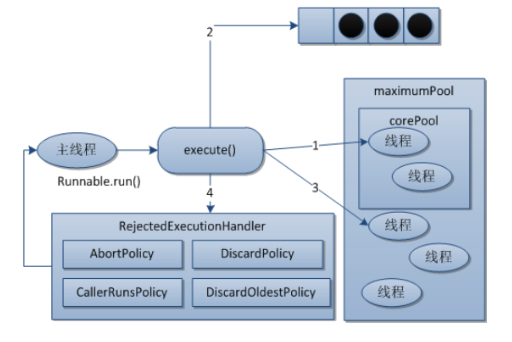
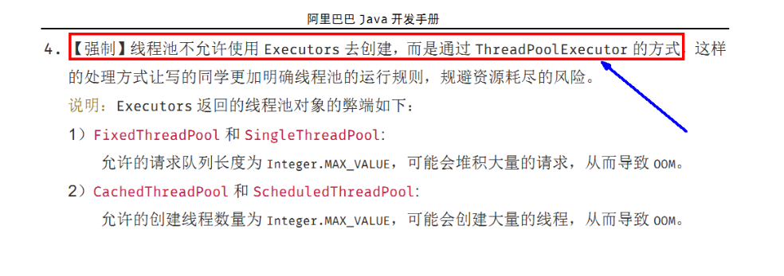
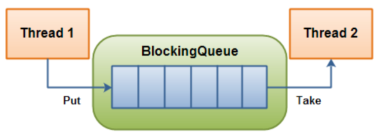
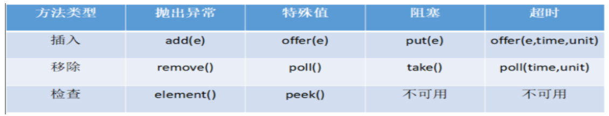
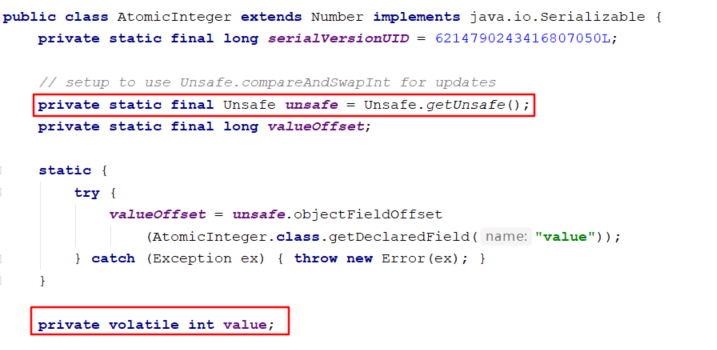
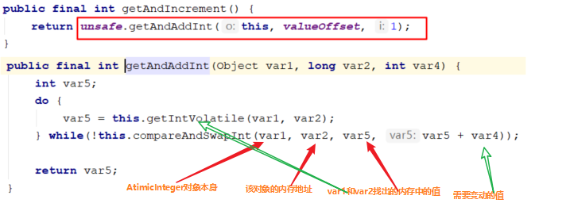
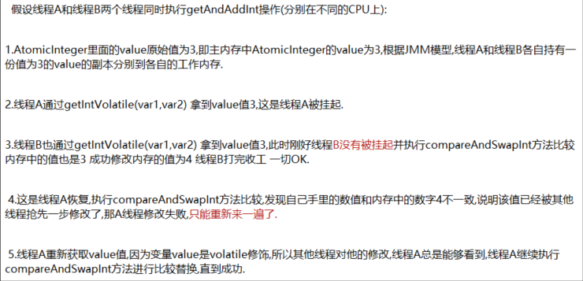
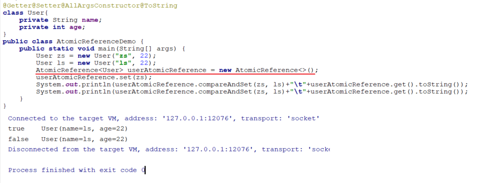

## 1. java并发知识库


### 1.1 线程和进程

<font color='cornflowerblue'> 进程是资源分配的基本单位。 </font>

<font color='cornflowerblue'> 线程是独立调度的基本单位。 </font>

**进程和线程的关系：**

（1）一个线程只能属于一个进程，而一个进程可以有多个线程，但至少有一个线程。

（2）资源分配给进程，同一进程的所有线程共享该进程的所有资源。

（3）线程在执行过程中，需要协作同步。不同进程的线程间要利用消息通信的办法实现同步。

（4）处理机分给线程，即真正在处理机上运行的是线程。

（5）线程是指进程内的一个执行单元，也是进程内的可调度实体。

**线程与进程的<font color='#e54d42'> 区别 </font>**：

（1）调度：线程作为调度和分配的基本单位，进程作为拥有资源的基本单位。

（2）并发性：不仅进程之间可以并发执行，同一个进程的多个线程之间也可以并发执行。

（3）拥有资源：进程是拥有资源的一个独立单位，线程不拥有系统资源，但可以访问隶属于进程的资源。

 （4）系统开销：在创建或撤销进程的时候，由于系统都要为之分配和回收资源，导致系统的明显大于创建或撤销线程时的开销。

（5）进程有独立的地址空间，进程崩溃后，在保护模式下不会对其他的进程产生影响，而线程只是一个进程中的不同的执行路径。线程有自己的堆栈和局部变量，但线程之间没有单独的地址空间，一个线程死掉就等于整个进程死掉，所以多进程的程序要比多线程的程序健壮，但是在进程切换时，耗费的资源较大，效率要差些。

线程的划分尺度小于进程，使得多线程程序的并发性高。

另外，进程在执行过程中拥有独立的内存单元，而多个线程共享内存，从而极大的提高了程序运行效率。

线程在执行过程中，每个独立的线程有一个程序运行的入口，顺序执行序列和程序的出口。但是线程不能够独立执行，必须依存在应用程序中，有应用程序提供多个线程执行控制。

从逻辑角度看，多线程的意义是在一个应用程序中，有多个执行部分可以同时执行。但操作系统并没有将多个线程看做多个独立的应用，来实现进程的调度和管理以及资源分配。这就是进程和线程的重要区别。

### 1.2 死锁

死锁是指多个进程在运行过程中，因为争夺资源而造成的一种僵局，如果没有外力 推进，处于僵局中的进程就无法继续执行。  

<font color='#e54d42'> **死锁原因：** </font>

1. 竞争资源：请求同一有限资源的进程数多于可用资源数 

2. 进程推进顺序非法：进程执行中，请求和释放资源顺序不合理，如资源等待链 

<font color='#e54d42'> **死锁产生的必要条件：**  </font>

1. <font color='cornflowerblue'> 互斥条件 </font>:进程对所分配的资源进行排他性的使用 

2. <font color='cornflowerblue'> 请求和保持条件 </font>：进程被阻塞的时候并不释放锁申请到的资源 

3. <font color='cornflowerblue'> 不可剥夺条件 </font>：进程对于已经申请到的资源在使用完成之前不可以被剥夺 

4. <font color='cornflowerblue'> 环路等待条件 </font>：发生死锁的时候存在的一个 进程-资源 环形等待链

<font color='#e54d42'> **死锁处理：** </font>

1. <font color='cornflowerblue'> 预防死锁 </font>：破坏产生死锁的4个必要条件中的一个或者多个；实现起来比较简单， 但是如果限制过于严格会降低系统资源利用率以及吞吐量 避免死锁：在资源的动态分配中，防止系统进入不安全状态(可能产生死锁的状态)- 如银行家算法。

2. <font color='cornflowerblue'> 检测死锁 </font>：允许系统运行过程中产生死锁，在死锁发生之后，采用一定的算法进行 检测，并确定与死锁相关的资源和进程，采取相关方法清除检测到的死锁。实现难度大。

3. <font color='cornflowerblue'> 解除死锁 </font>：与死锁检测配合，将系统从死锁中解脱出来（撤销进程或者剥夺资 源）。对检测到的和死锁相关的进程以及资源，通过撤销或者挂起的方式，释放一 些资源并将其分配给处于阻塞状态的进程，使其转变为就绪态。实现难度大

### 1.3 守护线程

> 守护线程, 是指在程序运行的时候在后台提供一种通用服务的线程, 比如垃圾回收线程就是一个很称职的守护者, 并且这种线程并不属于程序中不可或缺的部分. 因此, 当所有的非守护线程结束时, 程序也就终止了, 同时会杀死进程中的所有守护线程. 反过来说, 只要任何非守护线程还在运行, 程序就不会终止.

GC垃圾回收就是一个守护线程

- 用户线程和守护线程两者几乎没有区别, 唯一的不同之处就在于虚拟机的离开: 如果用户线程已经全部退出运行了, 只剩下守护线程存在了, 虚拟机也就退出了.

- 将线程转换为守护线程可以通过调用Thread对象的setDaemon(true)方法来实现.

- <u>守护线程应该永远不去访问固有资源，如文件、数据库</u>，因为它会在任何时候甚至在一个操作的中间发生中断

## 2. java 线程创建的方式

### 2.1 继承Thread类

<font color='cornflowerblue'>Thread 类本质上是实现了 Runnable 接口的一个实例，代表一个线程的实例</font>。启动线程的唯一方法就是通过 Thread 类的 start()实例方法。<font color='#39b54a'>start()方法是一个 native 方法</font>，它将启动一个新线程，并执行 run()方法。

```java
public class Mythread  extends  Thread {

    @Override
    public void run() {
        System.out.println("myThread run");
    }

    public static void main(String[] args) {
        Mythread mythread = new Mythread();
        mythread.start();
    }
}
```


### 2.2 实现 Runnable 接口  

如果自己的类已经 extends 另一个类，就无法直接 extends Thread，此时，可以实现一个Runnable 接口。

```java
public class MyRunnable implements Runnable {
    @Override
    public void run() {
        System.out.println("myrunnable interface ");
    }

    public static void main(String[] args) {
        MyRunnable myRunnable = new MyRunnable();
        Thread thread = new Thread(myRunnable);
        thread.start();
    }
}
```


### 2.3 使用 Callable、Future实现有返回结果

<font color='cornflowerblue'> 有返回值的任务必须实现 Callable 接口，类似的，无返回值的任务必须 Runnable 接口 </font>。执行Callable 任务后，可以获取一个 Future 的对象，<font color='#39b54a'>在该对象上调用 get 就可以获取到 Callable 任务返回的 Object 了</font>，再结合线程池接口 ExecutorService 就可以实现传说中有返回结果的多线程了。

```java
public class MyCallable implements Callable<String> {
    @Override
    public String call() throws Exception {
        System.out.println("mycallable here");
        TimeUnit.SECONDS.sleep(4);
        return "1024";
    }

    public static void main(String[] args) throws ExecutionException, InterruptedException {
        FutureTask futureTask = new FutureTask(new MyCallable());
        new Thread(futureTask,"A").start();

        System.out.println(Thread.currentThread().getName()+"...计算完成");
        System.out.println(futureTask.get());

    }
}
```

### 2.4 线程池

线程和数据库连接这些资源都是非常宝贵的资源。那么每次需要的时候创建，不需要的时候销

毁，是非常浪费资源的。那么我们就可以使用缓存的策略，也就是使用线程池。

```java
public class MyThreadPool {

    public static void main(String[] args) {
        ExecutorService threadPool = Executors.newFixedThreadPool(10);
        while(true) {
            threadPool.execute(new Runnable() {
                // 提交多个线程任务，并执行
                @Override public void run() {
                    System.out.println(Thread.currentThread().getName() + " is running ..");
                    try {
                        Thread.sleep(3000);
                    } catch (InterruptedException e) {
                        e.printStackTrace();
                    }
                    System.out.println(Thread.currentThread().getName() + " is stop ..");
                }});
        }
    }
}
```

## 3. 线程池

Java 里面线程池的顶级接口是 **Executor**，但是严格意义上讲 Executor 并不是一个线程池，而

只是一个执行线程的工具。真正的线程池接口是 **ExecutorService**。


### 3.1  Executors实现线程池的几种方法


#### 3.1.1 Executors.newFixedThreadPool(int)

<font color='#39b54a'> 创建一个可重用固定线程数的线程池，以共享的无界队列方式来运行这些线程 </font>。在任意点，在大多数 nThreads 线程会处于处理任务的活动状态。如果在所有线程处于活动状态时提交附加任务，则在有可用线程之前，附加任务将在队列中等待。如果在关闭前的执行期间由于失败而导致任何线程终止，那么一个新线程将代替它执行后续的任务（如果需要）。在某个线程被显式地关闭之前，池中的线程将一直存在。

```java
public static ExecutorService newFixedThreadPool(int nThreads) {
    return new ThreadPoolExecutor(nThreads, nThreads,
                                  0L, TimeUnit.MILLISECONDS,
                                  new LinkedBlockingQueue<Runnable>());
}
```


#### 3.1.2 Executors.newSingleThreadExecutor()

Executors.newSingleThreadExecutor()返回一个线程池（这个线程池只有一个线程）,<font color='#39b54a'>这个线程池可以在线程死后（或发生异常时）重新启动一个线程来替代原来的线程继续执行下去</font>！

```java
public static ExecutorService newSingleThreadExecutor() {
    return new FinalizableDelegatedExecutorService
        (new ThreadPoolExecutor(1, 1,
                                0L, TimeUnit.MILLISECONDS,
                                new LinkedBlockingQueue<Runnable>()));
}
```


#### 3.1.3 Executors.newCachedThreadPool()

创建一个可根据需要创建新线程的线程池，但是在以前构造的线程可用时将重用它们。对于执行很多短期异步任务的程序而言，这些线程池通常可提高程序性能。<font color='#39b54a'>调用 execute 将重用以前构造的线程（如果线程可用）。如果现有线程没有可用的，则创建一个新线程并添加到池中。终止并从缓存中移除那些已有 60 秒钟未被使用的线程</font>。因此，长时间保持空闲的线程池不会使用任何资源。

```java
 public static ExecutorService newCachedThreadPool() {
    return new ThreadPoolExecutor(0, Integer.MAX_VALUE,
                                  60L, TimeUnit.SECONDS,
                                  new SynchronousQueue<Runnable>());
}
```

newCachedThreadPool创建的线程池将corePoolSize设置为0，将maximumPoolSize设置为Integer.MAX_VALUE，它使用的是<font color='cornflowerblue'>SynchronousQueue，也就是说来了任务就创建线程运行</font>，当线程空闲超过60秒，就销毁线程。


#### 3.1.4 Executors.newScheduledThreadPool()

 创建一个线程池，它可安排在给定延迟后运行命令或者定期地执行。  

#### 3.1.5 代码演示

```java
package com.juc.concurrent;

import java.util.concurrent.*;

public class MyThreadPoolDemo {
    public static void main(String[] args) {
        newCachedThreadPool();
    }

    private static void newCachedThreadPool() {
        ExecutorService threadPool = Executors.newCachedThreadPool();
        try {
            for (int i = 1; i <= 10; i++) {
                threadPool.execute(()->{
                    try { TimeUnit.MILLISECONDS.sleep(20); } catch (InterruptedException e) { e.printStackTrace(); }
                    System.out.println(Thread.currentThread().getName() + "\t 办理业务 ");
                });
            }
        } catch (Exception e) {
            e.printStackTrace();
        } finally {
            threadPool.shutdown();
        }
        /* 执行结果
        * pool-1-thread-1	 办理业务 
            pool-1-thread-9	 办理业务 
            pool-1-thread-8	 办理业务 
            pool-1-thread-5	 办理业务 
            pool-1-thread-3	 办理业务 
            pool-1-thread-7	 办理业务 
            pool-1-thread-2	 办理业务 
            pool-1-thread-6	 办理业务 
            pool-1-thread-4	 办理业务 
            pool-1-thread-1办理业务 
        * */
    }

    private static void newSingleThreadExectorTest() {
        ExecutorService threadPool = Executors.newSingleThreadExecutor(); //一池单线程
        try {
            for (int i = 0; i < 10; i++) {
                threadPool.execute(() -> {
                    System.out.println(Thread.currentThread().getName() + "\t 办理业务");
                });
            }
        } catch (Exception e) {
            e.printStackTrace();
        } finally {
            threadPool.shutdown();
        }
        /*执行结果
        * pool-1-thread-1	 办理业务
        pool-1-thread-1	 办理业务
        pool-1-thread-1	 办理业务
        pool-1-thread-1	 办理业务
        pool-1-thread-1	 办理业务
        pool-1-thread-1	 办理业务
        pool-1-thread-1	 办理业务
        pool-1-thread-1	 办理业务
        pool-1-thread-1	 办理业务
        pool-1-thread-1	 办理业务
        * */
    }

    private static void newFixedThreadPoolTest() {
        ExecutorService threadPool = Executors.newFixedThreadPool(5); //一池5个受理线程 ，类似一个银行5和受理窗口
        try {
            for (int i = 1; i <= 10; i++) {
                try {
                    TimeUnit.MILLISECONDS.sleep(10);
                } catch (InterruptedException e) {
                    e.printStackTrace();
                }
                threadPool.execute(() -> {
                    System.out.println(Thread.currentThread().getName() + "\t 办理业务");

                });
            }
        } catch (Exception e) {
            e.printStackTrace();
        } finally {
            threadPool.shutdown();
        }
        /* 执行结果
        *   pool-1-thread-1	 办理业务
            pool-1-thread-2	 办理业务
            pool-1-thread-3	 办理业务
            pool-1-thread-4	 办理业务
            pool-1-thread-5	 办理业务
            pool-1-thread-1	 办理业务
            pool-1-thread-2	 办理业务
            pool-1-thread-3	 办理业务
            pool-1-thread-4	 办理业务
            pool-1-thread-5	 办理业务
        * */
    }


}

```


#### 3.1.6 Executors 创建线程池的弊端

- **`FixedThreadPool` 和 `SingleThreadExecutor`** ： 允许请求的队列长度为 Integer.MAX_VALUE,可能堆积大量的请求，从而导致 OOM。
- **`CachedThreadPool` 和 `ScheduledThreadPool`** ： 允许创建的线程数量为 Integer.MAX_VALUE ，可能会创建大量线程，从而导致 OOM。

#### 3.1.7 Executors  创建线程的底层原理

本质都是调用`new ThreadPoolExecuto()`来创建线程

 


### 3.2 线程池的7个重要参数

```java
 public ThreadPoolExecutor
     (int corePoolSize,//线程池的核心线程数量
      int maximumPoolSize,//线程池的最大线程数
      long keepAliveTime,//当线程数大于核心线程数时，多余的空闲线程存活的最长时间
      TimeUnit unit,//时间单位
      BlockingQueue<Runnable> workQueue,//任务队列，用来储存等待执行任务的队列
      ThreadFactory threadFactory,//线程工厂，用来创建线程，一般默认即可
      RejectedExecutionHandler handler//拒绝策略，当提交的任务过多而不能及时处理时，我们可以定制策略来处理任务
                               ) {
     ***
 }
```

### 3.3 线程池的底层工作原理



1、在创建了线程池后，开始等待请求。

2、当调用execute()方法添加一个请求任务时，线程池会做出如下判断：
  2.1如果正在运行的线程数量小于corePoolSize，那么马上创建线程运行这个任务；
<font color='cornflowerblue'>  2.2如果正在运行的线程数量大于或等于corePoolSize，那么将这个任务**放入队列**； </font>
  <font color='cornflowerblue'>2.3如果这个时候队列满了且正在运行的线程数量还小于maximumPoolSize，那么还是要创建非核心</font><font color='cornflowerblue'>线程立刻运行这个任务；</font>
  2.4如果队列满了且正在运行的线程数量大于或等于maximumPoolSize，那么线程池会**启动饱和拒绝策略来执行**。
3、当一个线程完成任务时，它会从队列中取下一个任务来执行。
4、当一个线程无事可做超过一定的时间（keepAliveTime）时，线程会判断：
    如果当前运行的线程数大于corePoolSize，那么这个线程就被停掉。
    所以线程池的所有任务完成后，**它最终会收缩到corePoolSize的大小**。

### 3.4 线程池的拒绝策略

<font color='cornflowerblue'> 以下内置拒绝策略均实现了RejectedExecutionHandle接口 </font>

#### 3.4.1 **AbortPolicy**(默认)

直接抛出RejectedExecutionException异常阻止系统正常运行

```java
private static void AbortPolicyTest() {
        ExecutorService threadPool = new ThreadPoolExecutor(
                2,
                5,
                2,
                TimeUnit.SECONDS,
                new LinkedBlockingQueue<>(3),
                Executors.defaultThreadFactory(),
                new ThreadPoolExecutor.AbortPolicy());
        try {
            for (int i = 0; i < 10; i++) {
                threadPool.execute(()->{
                    System.out.println(Thread.currentThread().getName() + "\t 办理业务");
                });
            }
        } catch (Exception e) {
            e.printStackTrace();
        } finally {
            threadPool.shutdown();
        }

        // 拒绝策略 new ThreadPoolExecutor.AbortPolicy()
        /* 执行了8 个业务  抛出异常
        * pool-1-thread-1	 办理业务
        java.util.concurrent.RejectedExecutionException: Task com.juc.concurrent.MyThreadPoolDemo2$$Lambda$1/1078694789@3b9a45b3 rejected from java.util.concurrent.ThreadPoolExecutor@7699a589[Running, pool size = 5, active threads = 0, queued tasks = 0, completed tasks = 8]
        pool-1-thread-3	 办理业务
            at java.util.concurrent.ThreadPoolExecutor$AbortPolicy.rejectedExecution(ThreadPoolExecutor.java:2047)
        pool-1-thread-2	 办理业务
            at java.util.concurrent.ThreadPoolExecutor.reject(ThreadPoolExecutor.java:823)
        pool-1-thread-5	 办理业务
            at java.util.concurrent.ThreadPoolExecutor.execute(ThreadPoolExecutor.java:1369)
        pool-1-thread-3	 办理业务
            at com.juc.concurrent.MyThreadPoolDemo2.main(MyThreadPoolDemo2.java:18)
        pool-1-thread-4	 办理业务
        pool-1-thread-1	 办理业务
        pool-1-thread-2	 办理业务
        * */
    }
}

```

#### 3.4.2 **CallerRunsPolicy**

“调用者运行”一种调节机制，该策略既不会抛弃任务，也不会抛出异常，而是将某些任务回退到调用者，从而降低新任务的流量。

```java

    private static void CallerRunsPolicyTest() {
        ExecutorService threadPool = new ThreadPoolExecutor(
                2,
                5,
                2,
                TimeUnit.SECONDS,
                new LinkedBlockingQueue<>(3),
                Executors.defaultThreadFactory(),
                new ThreadPoolExecutor.CallerRunsPolicy());
        try {
            for (int i = 0; i < 10; i++) {
                threadPool.execute(()->{
                    System.out.println(Thread.currentThread().getName() + "\t 办理业务");
                });
            }
        } catch (Exception e) {
            e.printStackTrace();
        } finally {
            threadPool.shutdown();
        }

        // 拒绝策略 new ThreadPoolExecutor.CallerRunsPolicy() 将任务抛给调用者
        /* 执行了10 个业务
        *pool-1-thread-1	 办理业务
        main	 办理业务
        pool-1-thread-4	 办理业务
        pool-1-thread-3	 办理业务
        pool-1-thread-2	 办理业务
        pool-1-thread-3	 办理业务
        pool-1-thread-5	 办理业务
        pool-1-thread-4	 办理业务
        pool-1-thread-1	 办理业务
        main	 办理业务

        * */
    }
```

#### 3.4.3 **DiscardOldestPolicy**

抛弃队列中等待最久的任务，然后把当前任务加人队列中尝试再次提交当前任务。

```java
    private static void DiscardOldestPolicyTest() {
        ExecutorService threadPool = new ThreadPoolExecutor(
                2,
                5,
                2,
                TimeUnit.SECONDS,
                new LinkedBlockingQueue<>(3),
                Executors.defaultThreadFactory(),
                new ThreadPoolExecutor.DiscardOldestPolicy());
        try {
            for (int i = 0; i < 10; i++) {
                threadPool.execute(()->{
                    System.out.println(Thread.currentThread().getName() + "\t 办理业务");
                });
            }
        } catch (Exception e) {
            e.printStackTrace();
        } finally {
            threadPool.shutdown();
        }

        // 拒绝策略 new ThreadPoolExecutor.DiscardOldestPolicy()
        /* 执行了9个业务
        *pool-1-thread-1	 办理业务
        pool-1-thread-3	 办理业务
        pool-1-thread-2	 办理业务
        pool-1-thread-4	 办理业务
        pool-1-thread-2	 办理业务
        pool-1-thread-1	 办理业务
        pool-1-thread-5	 办理业务
        pool-1-thread-4	 办理业务
        pool-1-thread-3	 办理业务

        * */
    }
```


#### 3.4.4 **DiscardPolicy**

该策略默默地丢弃无法处理的任务，不予任何处理也不抛出异常。如果允许任务丢失，**这是最好的一种策略。**

```java
private static void DiscardPolicyTest() {
        ExecutorService threadPool = new ThreadPoolExecutor(
                2,
                5,
                2,
                TimeUnit.SECONDS,
                new LinkedBlockingQueue<>(3),
                Executors.defaultThreadFactory(),
                new ThreadPoolExecutor.DiscardPolicy());
        try {
            for (int i = 0; i < 10; i++) {
                threadPool.execute(()->{
                    System.out.println(Thread.currentThread().getName() + "\t 办理业务");
                });
            }
        } catch (Exception e) {
            e.printStackTrace();
        } finally {
            threadPool.shutdown();
        }

        // 拒绝策略 new ThreadPoolExecutor.DiscardPolicy()
        /* 执行了8 个业务
        *pool-1-thread-1	 办理业务
        pool-1-thread-3	 办理业务
        pool-1-thread-2	 办理业务
        pool-1-thread-1	 办理业务
        pool-1-thread-5	 办理业务
        pool-1-thread-2	 办理业务
        pool-1-thread-3	 办理业务
        pool-1-thread-4	 办理业务

        * */
    }

```


### 3.5 在工作中如何创建线程池



## 4. 线程的生命周期


当线程被创建并启动以后，它既不是一启动就进入了执行状态，也不是一直处于执行状态。在线程的生命周期中，它要经过<font color='#f37b1d'>新建(New)、就绪（Runnable）、运行（Running）、阻塞(Blocked)和死亡(Dead)5 种状态</font>。尤其是当线程启动以后，它不可能一直"霸占"着 CPU 独自运行，所以 CPU 需要在多条线程之间切换，于是线程状态也会多次在运行、阻塞之间切换

​                        

### 4.1 新建状态（NEW ）

当程序使用 <font color='#39b54a'>new 关键字创建了一个线程之后，该线程就处于新建状态</font>，此时仅由 JVM 为其分配内存，并初始化其成员变量的值

### 4.2 **就绪状态（**RUNNABLE) 

当<font color='#39b54a'>线程对象调用了 start()方法之后，该线程处于就绪状态</font>。Java 虚拟机会为其创建方法调用栈和程序计数器，等待调度运行。

### 4.3 运行状态（**RUNNING**)

 如果处于<font color='#39b54a'>就绪状态的线程获得了 CPU，开始执行 run()方法的线程执行体</font>，则该线程处于运行状态。

### 4.4 **阻塞状态（**BLOCKED**）：**  

阻塞状态是指线程因为某种原因放弃了 cpu 使用权，也即让出了 cpu timeslice，暂时停止运行。直到线程进入可运行(runnable)状态，才有机会再次获得 cpu timeslice 转到运行(running)状态。阻塞的情况分三种：

<font color='#e54d42'> **等待阻塞**（o.wait->等待对列） </font>

运行(running)的线程执行 o.wait()方法，JVM 会把该线程放入等待队列(waitting queue)中。

<font color='#e54d42'>**同步阻塞**(lock->锁池)</font>

运行(running)的线程在获取对象的同步锁时，若该同步锁被别的线程占用，则 JVM 会把该线程放入锁池(lock pool)中。

<font color='#e54d42'>**其他阻塞**(sleep/join)</font>

运行(running)的线程执行 Thread.sleep(long ms)或 t.join()方法，或者发出了 I/O 请求时，JVM 会把该线程置为阻塞状态。当 sleep()状态超时、join()等待线程终止或者超时、或者 I/O处理完毕时，线程重新转入可运行(runnable)状态。

### 4.5  **线程死亡（DEAD）** 

线程会以下面三种方式结束，结束后就是死亡状态。

<font color='#e54d42'>**正常结束**</font>

1. run()或 call()方法执行完成，线程正常结束。

<font color='#e54d42'>**异常结束**</font>

2. 线程抛出一个未捕获的 Exception 或 Error。

<font color='#e54d42'>**调用stop**</font>

3. 直接调用该线程的 stop()方法来结束该线程—<font color='#e54d42'>该方法通常容易导致死锁</font>，不推荐使用。

## 5. 线程中的问题

### 5.1 sleep 与 wait 区别 

1. 对于 <font color='cornflowerblue'>sleep()方法，我们首先要知道该方法是属于 Thread 类</font>中的。而 <font color='cornflowerblue'>wait()方法，则是属于Object 类</font>中的。
2.  sleep()方法导致了程序暂停执行指定的时间，让出 cpu 该其他线程，但是他的<font color='cornflowerblue'>监控状态依然保持着</font>，当指定的时间到了又会自动恢复运行状态。
3.  在调用 sleep()方法的过程中，<font color='cornflowerblue'>线程不会释放对象锁</font>。  
4. 而当<font color='cornflowerblue'>调用 wait()方法的时候，线程会放弃对象锁</font>，进入等待此对象的<font color='cornflowerblue'>等待锁定池</font>，只有针对此对象调用 notify()方法后本线程才进入对象锁定池准备获取对象锁进入运行状态。

### 5.2  **start 与 run 区别**  

1. **s**tart（)方法来启动线程，<font color='cornflowerblue'>真正实现了多线程运行</font>。这时无需等待 run 方法体代码执行完毕，可以直接继续执行下面的代码。

2. 通过调用 Thread 类的 start()方法来启动一个线程， 这时此线程是处于就绪状态， 并没有运行。

3. <font color='cornflowerblue'>方法 run()称为线程体，它包含了要执行的这个线程的内容，线程就进入了运行状态，开始运行 run 函数当中的代码。 Run 方法运行结束， 此线程终止</font>。然后 CPU 再调度其它线程。  

## 6. 线程间通信

### 6.1 生产者消费者

现在两个线程，可以操作初始值为0的一个变量

实现一个线程对该变量加1 一个线程对该变量减一的操作

实现交替10 轮 变量的 初始值为0

```java
class AirConditioner{ //资源类
    private  int num = 0;

    public synchronized void increment() throws InterruptedException {
        //1 判断
        if(num!=0){
            this.wait();
        }
        //2 干活
        num++;
        System.out.println(Thread.currentThread().getName()+num);
        //3 通知
        this.notifyAll();
    }

    public synchronized void decrement() throws InterruptedException {
        //1 判断
        if(num ==0){
            this.wait();
        }
        //2 干活
        num--;
        System.out.println(Thread.currentThread().getName()+num);
        //3 通知
        this.notifyAll();
    }
}
/*
* 题目
* 现在两个线程，可以操作初始值为0的一个变量
* 实现一个线程对该变量加1 一个线程对该变量减一的操作
* 实现交替10 轮 变量的 初始值为0
* 1 高内聚低耦合 线程操作资源类
* 2 判断、 通知 、干活
* */
public class ThreadWaitNotifyDemo {
    public static void main(String[] args) {
        AirConditioner airConditioner = new AirConditioner();
        new Thread(()->{
            for (int i = 0; i < 10; i++) {
                try {
                    airConditioner.increment();
                } catch (InterruptedException e) {
                    e.printStackTrace();
                }
            }
        },"生产者").start();
        new Thread(()->{
            for (int i = 0; i < 10; i++) {
                try {
                    airConditioner.decrement();
                } catch (InterruptedException e) {
                    e.printStackTrace();
                }
            }
        },"消费者").start();
    }
}

```

### 6.2 双生产者消费者

变为两个消费者两个生产者

问题：<font color='cornflowerblue'> （也就是下机以后上机必须在从新安检） </font>

多线程交互中 ，必须要<font color='#e54d42'>防止多线程虚假唤醒</font>，也记 <font color='#e54d42'> **（判断只用while 不用if ）** </font>

像在一个参数版本中，中断和虚假唤醒是可能的，并且该方法应该始终在循环中使用

#### 6.2.1 synchronized实现

```java
class AirConditioner{ //资源类
    private  int num = 0;

    public synchronized void increment() throws InterruptedException {
        //1 判断
        while(num!=0){
            this.wait();
        }
        //2 干活
        num++;
        System.out.println(Thread.currentThread().getName()+num);
        //3 通知
        this.notifyAll();
    }

    public synchronized void decrement() throws InterruptedException {
        //1 判断
        while(num ==0){
            this.wait();
        }
        //2 干活
        num--;
        System.out.println(Thread.currentThread().getName()+num);
        //3 通知
        this.notifyAll();
    }
}
/*
* 题目
* 现在两个线程，可以操作初始值为0的一个变量
* 实现一个线程对该变量加1 一个线程对该变量减一的操作
* 实现交替10 轮 变量的 初始值为0
* 
* 1 高内聚低耦合 线程操作资源类
* 2 判断、 通知 、干活
* 3 多线程交互中 ，必须要防止多线程虚假唤醒，也记 （判断只用while 不用if ）
* */
public class ThreadWaitNotifyDemo {
    public static void main(String[] args) {
        AirConditioner airConditioner = new AirConditioner();
        new Thread(()->{
            for (int i = 0; i < 10; i++) {
                try {
                    Thread.sleep(300);
                    airConditioner.increment();
                } catch (InterruptedException e) {
                    e.printStackTrace();
                }
            }
        },"生产者1:").start();
        new Thread(()->{
            for (int i = 0; i < 10; i++) {
                try {
                    Thread.sleep(300);
                    airConditioner.decrement();
                } catch (InterruptedException e) {
                    e.printStackTrace();
                }
            }
        },"消费者1:").start();
        new Thread(()->{
            for (int i = 0; i < 10; i++) {
                try {
                    Thread.sleep(400);
                    airConditioner.increment();
                } catch (InterruptedException e) {
                    e.printStackTrace();
                }
            }
        },"生产者2:").start();
        new Thread(()->{
            for (int i = 0; i < 10; i++) {
                try {
                    Thread.sleep(250);
                    airConditioner.decrement();
                } catch (InterruptedException e) {
                    e.printStackTrace();
                }
            }
        },"消费者2:").start();
    }
}

```

#### 6.2.2 lock 和condition的实现

```java
class AirConditioner1{ //资源类

    private  int num = 0;
    private  Lock lock = new ReentrantLock();
    private Condition condition = lock.newCondition();

    public void increment() throws InterruptedException {
        lock.lock();
        try {
            //1 判断
            while(num!=0){
                condition.await();
            }
            //2 干活
            num++;
            System.out.println(Thread.currentThread().getName()+num);
            //3 通知
            condition.signalAll();
        } catch (Exception e) {
            e.printStackTrace();
        } finally {
            lock.unlock();
        }
    }

    public void decrement() throws InterruptedException {
        lock.lock();
        try {
            //1 判断
            while(num ==0){
                condition.await();
            }
            //2 干活
            num--;
            System.out.println(Thread.currentThread().getName()+num);
            //3 通知
            condition.signalAll();
        } catch (Exception e) {
            e.printStackTrace();
        } finally {
            lock.unlock();
        }
    }
}
/*
* 题目
* 现在两个线程，可以操作初始值为0的一个变量
* 实现一个线程对该变量加1 一个线程对该变量减一的操作
* 实现交替10 轮 变量的 初始值为0
*
* 1 高内聚低耦合 线程操作资源类
* 2 判断、 通知 、干活
* 3 多线程交互中 ，必须要防止多线程虚假唤醒，也记 （判断只用while 不用if ）
* */
public class ThreadWaitNotifyDemo1 {
    public static void main(String[] args) {
        AirConditioner airConditioner = new AirConditioner();
        new Thread(()->{
            for (int i = 0; i < 10; i++) {
                try {
                    Thread.sleep(300);
                    airConditioner.increment();
                } catch (InterruptedException e) {
                    e.printStackTrace();
                }
            }
        },"生产者1:").start();
        new Thread(()->{
            for (int i = 0; i < 10; i++) {
                try {
                    Thread.sleep(300);
                    airConditioner.decrement();
                } catch (InterruptedException e) {
                    e.printStackTrace();
                }
            }
        },"消费者1:").start();
        new Thread(()->{
            for (int i = 0; i < 10; i++) {
                try {
                    Thread.sleep(400);
                    airConditioner.increment();
                } catch (InterruptedException e) {
                    e.printStackTrace();
                }
            }
        },"生产者2:").start();
        new Thread(()->{
            for (int i = 0; i < 10; i++) {
                try {
                    Thread.sleep(250);
                    airConditioner.decrement();
                } catch (InterruptedException e) {
                    e.printStackTrace();
                }
            }
        },"消费者2:").start();
    }
}

```

### 6.3 双线程打印12A34B.....5152Z

#### 6.3.1 synchronized 实现

```java
class TestResource2{
    private int tag =1 ;
    private int num =1 ;
    private char aChar = 'A';

    public synchronized void printNumber() throws InterruptedException {

        while (tag !=1){
            this.wait();
        }
        System.out.print(num++);
        System.out.print(num++);
        tag=0;
        this.notify();
    }

    public  synchronized void printLetter() throws InterruptedException {
        while (tag==1){
            this.wait();
        }
        System.out.print(aChar);
        aChar = (char) (aChar+1);
        tag=1;
        this.notify();
    }
}


public class ThreadWaitNotifyTest2 {
    public static void main(String[] args) {
        TestResource2 testResource2 = new TestResource2();
        new Thread(()->{
            for (int i = 0; i < 26; i++) {
                try {
                    testResource2.printNumber();
                } catch (InterruptedException e) {
                    e.printStackTrace();
                }
            }
        },"printNumber").start();
        new Thread(()->{
            for (int i = 0; i < 26; i++) {
                try {
                    testResource2.printLetter();
                } catch (InterruptedException e) {
                    e.printStackTrace();
                }
            }
        },"printLetter").start();
    }
}

```

#### 6.3.2 lock 和Condition 实现

```java
class TestResource{
    private int tag = 1;
    private int num = 1;
    private char a = 'A';
    private Lock lock = new ReentrantLock();
    private Condition condition = lock.newCondition();

    public void printNumber(){
        lock.lock();
        try {
            while (tag != 1){
                condition.await();
            }
            System.out.print(num++);
            System.out.print(num++);
            tag=0;
            condition.signal();
        } catch (Exception e) {
            e.printStackTrace();
        } finally {
            lock.unlock();
        }
    }


    public void printLetter(){
        lock.lock();
        try {
            while (tag == 1){
                condition.await();
            }
            System.out.print(a);
            tag=1;
            a= (char) (a+1);
            condition.signal();
        } catch (Exception e) {
            e.printStackTrace();
        } finally {
            lock.unlock();
        }
    }

}
/*
* 两个线程，一个线程打印1-52，另一个打印字母A-Z打印顺序为12A34B...5152Z,
*要求用线程间通信
*/
public class ThreadWaitNotifyTest1 {

    public static void main(String[] args) {

        TestResource testResource = new TestResource();

        new Thread(()->{
            for (int i = 0; i < 26; i++) {
                testResource.printNumber();
            }
        },"printNumber").start();
        new Thread(()->{
            for (int i = 0; i < 26; i++) {
                testResource.printLetter();
            }
        },"printLetter").start();

    }
}

```

### 6.4 线程之间定制化调用

多线程之间的调用顺序 实现A->B->c  A打印5次 B打印10次 c打印15次  循环15次

#### 6.4.1 lock和condition实现

```java
class ShareResource{
    private int num = 1 ; //1:A 2:B 3:C
    private Lock lock = new ReentrantLock();
    private Condition c1 = lock.newCondition();
    private Condition c2 = lock.newCondition();
    private Condition c3 = lock.newCondition();


    public void print5(){
        lock.lock();
        try {
            //判断
            while (num!=1){
                c1.await();
            }
            //干活
            for (int i = 0; i < 5; i++) {
                System.out.println(Thread.currentThread().getName()+i);
            }
            //通知
            num = 2;
            c2.signal();
        } catch (Exception e) {
            e.printStackTrace();
        } finally {
            lock.unlock();
        }
    }

    public void print10(){
        lock.lock();
        try {
            //判断
            while (num!=2){
                c2.await();
            }
            //干活
            for (int i = 0; i < 10; i++) {
                System.out.println(Thread.currentThread().getName()+i);
            }
            //通知
            num = 3;
            c3.signal();
        } catch (Exception e) {
            e.printStackTrace();
        } finally {
            lock.unlock();
        }
    }

    public void print15(){
        lock.lock();
        try {
            //判断
            while (num!=3){
                c3.await();
            }
            //干活
            for (int i = 0; i < 15; i++) {
                System.out.println(Thread.currentThread().getName()+i);
            }
            //通知
            num = 1;
            c1.signal();
        } catch (Exception e) {
            e.printStackTrace();
        } finally {
            lock.unlock();
        }
    }
}


/*
* 多线程之间的调用顺序 实现A->B->c
* A答应5次 B打印10次 c打印15次
* 循环15次
* 1 高内聚低耦合 线程操作资源类
* 2 判断、 通知 、干活
* 3 多线程交互中 ，必须要防止多线程虚假唤醒，也记 （判断只用while 不用if ）
* 4 标志位
* */
public class ThreadOrderAccess {
    public static void main(String[] args) {
        ShareResource shareResource = new ShareResource();

        new Thread(()->{
            for (int i = 0; i < 10; i++) {
                shareResource.print5();
            }
        },"A: ").start();
        new Thread(()->{
            for (int i = 0; i < 10; i++) {
                shareResource.print10();
            }
        },"B: ").start();
        new Thread(()->{
            for (int i = 0; i < 10; i++) {
                shareResource.print15();
            }
        },"C: ").start();
    }
}

```


## 7. java锁

### 7.1 乐观锁

乐观锁是一种乐观思想，即认为读多写少，遇到并发写的可能性低，每次去拿数据的时候都认为

别人不会修改，所以不会上锁，但是<font color='#39b54a'>在更新的时候会判断一下在此期间别人有没有去更新这个数据，采取在写时先读出当前版本号，然后加锁操作</font>（比较跟上一次的版本号，如果一样则更新），如果失败则要重复读-比较-写的操作。

<font color='cornflowerblue'>java 中的乐观锁基本都是通过 CAS 操作实现的，CAS 是一种更新的原子操作，比较当前值跟传入值是否一样，一样则更新，否则失败</font>。

### 7.2 悲观锁

悲观锁是就是悲观思想，即认为写多，遇到并发写的可能性高，每次去拿数据的时候都认为别人会修改，所以每次在读写数据的时候都会上锁，这样别人想读写这个数据就会 block 直到拿到锁。java 中的悲观锁就是<font color='cornflowerblue'> Synchronized</font><font color='#39b54a'>,AQS 框架下的锁则是先尝试 cas 乐观锁去获取锁，获取不到，才会转换为悲观锁，如 RetreenLock。</font>

### 7.3 自旋锁

自旋锁原理非常简单，<font color='cornflowerblue'>如果持有锁的线程能在很短时间内释放锁资源，那么那些等待竞争锁的线程就不需要做内核态和用户态之间的切换进入阻塞挂起状态，它们只需要等一等（自旋），等持有锁的线程释放锁后即可立即获取锁，这样就避免用户线程和内核的切换的消耗</font>。

线程<font color='#f37b1d'>自旋是需要消耗 cup 的，说白了就是让 cup 在做无用功</font>，如果一直获取不到锁，那线程也不能一直占用 cup 自旋做无用功，所以需要设定一个自旋等待的最大时间。如果持有锁的线程执行的时间超过自旋等待的最大时间扔没有释放锁，就会导致其它争用锁的线程在最大等待时间内还是获取不到锁，这时争用线程会停止自旋进入阻塞状态。

<font color='#e54d42'>**自旋锁的优缺点**</font>

自旋锁尽可能的减少线程的阻塞，<font color='#39b54a'>这对于锁的竞争不激烈，且占用锁时间非常短的代码块来说性能能大幅度的提升</font>，因为自旋的消耗会小于线程阻塞挂起再唤醒的操作的消耗，这些操作会导致线程发生两次上下文切换！

<font color='#39b54a'>但是如果锁的竞争激烈，或者持有锁的线程需要长时间占用锁执行同步块，这时候就不适合使用自旋锁了</font>，因为自旋锁在获取锁前一直都是占用 cpu 做无用功，占着 XX 不 XX，同时有大量线程在竞争一个锁，会导致获取锁的时间很长，线程自旋的消耗大于线程阻塞挂起操作的消耗，其它需要 cup 的线程又不能获取到 cpu，造成 cpu 的浪费。所以这种情况下我们要关闭自旋锁；

<font color='#e54d42'>**自旋锁时间阈值**（1.6 **引入了适应性自旋锁**)</font>

自旋锁的目的是为了占着 CPU 的资源不释放，等到获取到锁立即进行处理。但是如何去选择自旋的执行时间呢？如果自旋执行时间太长，会有大量的线程处于自旋状态占用 CPU 资源，进而会影响整体系统的性能。因此自旋的周期选的额外重要！

JVM 对于自旋周期的选择，jdk1.5 这个限度是一定的写死的，<font color='#39b54a'>在 1.6 引入了适应性自旋锁</font>，适应性自旋锁意味着自旋的时间不在是固定的了，而是由前一次在同一个锁上的自旋时间以及锁的拥有者的状态来决定，基本认为一个线程上下文切换的时间是最佳的一个时间，同时 JVM 还针对当前 CPU 的负荷情况做了较多的优化，如果平均负载小于 CPUs 则一直自旋，如果有超过(CPUs/2)个线程正在自旋，则后来线程直接阻塞，如果正在自旋的线程发现 Owner 发生了变化则延迟自旋时间（自旋计数）或进入阻塞，如果 CPU 处于节电模式则停止自旋，自旋时间的最坏情况是 CPU的存储延迟（CPU A 存储了一个数据，到 CPU B 得知这个数据直接的时间差），自旋时会适当放弃线程优先级之间的差异。

<font color='#e54d42'>**自旋锁的开启**</font>

JDK1.6 中-XX:+UseSpinning 开启；

-XX:PreBlockSpin=10 为自旋次数；

JDK1.7 后，去掉此参数，由 jvm 控制；

 

### 7.4  **Synchronized 同步锁**  

synchronized 它可以把任意一个非 NULL 的对象当作锁。<font color='cornflowerblue'>他属于独占式的悲观锁，同时属于可重入锁</font>

#### 7.4.1 Synchronized **作用范围** 

1. 作用于<font color='cornflowerblue'>方法</font>时，<font color='#39b54a'>锁住的是对象的实例(this)</font>； 

2. 当作用于<font color='cornflowerblue'>静态方法</font>时，<font color='#39b54a'>锁住的是 Class 实例</font>，又因为 Class 的相关数据存储在永久带 PermGen （jdk1.8 则是 metaspace），永久带是全局共享的，因此静态方法锁相当于类的一个全局锁，会锁所有调用该方法的线程；

   <font color='#39b54a'> 一旦一个静态同步方法获取锁后，其他的静态同步方法都必须等待该方法释放锁后才能获取锁 </font>

3. synchronized 作用于一个<font color='cornflowerblue'>对象实例</font>时，<font color='#39b54a'>锁住的是所有以该对象为锁的代码块</font>。它有多个队列，当多个线程一起访问某个对象监视器的时候，对象监视器会将这些线程存储在不同的容器中。

 

#### 7.4.2 Synchronized 核心组件

1)  `Wait Set`：哪些调用 <font color='cornflowerblue'>wait 方法被阻塞的线程</font>被放置在这里 

2)  `Contention List`：<font color='cornflowerblue'>竞争队列</font>，所有请求锁的线程首先被放在这个竞争队列中 

3)  `Entry List`：Contention List 中那些<font color='cornflowerblue'>有资格成为候选资源的线程被移动到 Entry List 中</font>；

4)  `OnDeck`：任意时刻，<font color='cornflowerblue'>最多只有一个线程正在竞争锁资源，该线程被成为 OnDeck</font>；

5)  `Owner`：当前已经获取到所资源的线程被称为 Owner；

6)  `!Owner`：当前释放锁的线程。

#### 7.4.3  Synchronized**实现** 

​                        

1. JVM 每次从队列的尾部取出一个数据用于锁竞争候选者（OnDeck），但是并发情况下，ContentionList 会被大量的并发线程进行 CAS 访问，为了降低对尾部元素的竞争，JVM 会将一部分线程移动到 EntryList 中作为候选竞争线程。

2. Owner 线程会在 unlock 时，将 ContentionList 中的部分线程迁移到 EntryList 中，并指定EntryList 中的某个线程为 OnDeck 线程（一般是最先进去的那个线程）。

3. Owner 线程并不直接把锁传递给 OnDeck 线程，而是把锁竞争的权利交给 OnDeck，OnDeck 需要重新竞争锁。这样虽然牺牲了一些公平性，但是能极大的提升系统的吞吐量，在JVM 中，也把这种选择行为称之为“竞争切换”。

4. OnDeck 线程获取到锁资源后会变为 Owner 线程，而没有得到锁资源的仍然停留在 EntryList中。如果 Owner 线程被 wait 方法阻塞，则转移到 WaitSet 队列中，直到某个时刻通过 notify或者 notifyAll 唤醒，会重新进去 EntryList 中。

5. 处于 ContentionList、EntryList、WaitSet 中的线程都处于阻塞状态，该阻塞是由操作系统来完成的（Linux 内核下采用 pthread_mutex_lock 内核函数实现的）。

6. <font color='#e54d42'>Synchronized 是非公平锁</font>。 Synchronized 在线程进入 ContentionList 时，<font color='#39b54a'>等待的线程会先尝试自旋获取锁，如果获取不到就进入 ContentionList</font>，这明显对于已经进入队列的线程是不公平的，还有一个不公平的事情就是自旋获取锁的线程还可能直接抢占 OnDeck 线程的锁资源。

参考：[ht](https://blog.csdn.net/zqz_zqz/article/details/70233767)[tps://blog.csdn.net/zqz_zqz/article/details/70233767](https://blog.csdn.net/zqz_zqz/article/details/70233767)

7. <font color='cornflowerblue'>每个对象都有个 monitor 对象，加锁就是在竞争 monitor 对象，代码块加锁是在前后分别加上 monitorenter 和 monitorexit 指令来实现的，方法加锁是通过一个标记位来判断的</font>

8. synchronized 是一个<font color='#e54d42'> 重量级操作，需要调用操作系统相关接口 </font>，性能是低效的，有可能给线程加锁消耗的时间比有用操作消耗的时间更多。

9. Java1.6，synchronized 进行了很多的优化，<font color='cornflowerblue'>有适应自旋、锁消除、锁粗化、轻量级锁及偏向锁</font>等，效率有了本质上的提高。在之后推出的 Java1.7 与 1.8 中，均对该关键字的实现机理做了优化。引入了<font color='cornflowerblue'>偏向锁和轻量级锁</font>。<font color='#e54d42'>都是在对象头中有标记位，不需要经过操作系统加锁。</font>

10. <font color='cornflowerblue'>锁可以从偏向锁升级到轻量级锁，再升级到重量级锁。这种升级过程叫做锁膨胀；</font>

11. JDK 1.6 中默认是开启偏向锁和轻量级锁，可以通过-XX:-UseBiasedLocking 来禁用偏向锁。

#### 7.4.4 Synchronized代码

```java
package com.juc.concurrent;

class Ticket{ //资源类
    private int number = 30;

    public synchronized void saleTicket(){
        if(number>0){
            System.out.println(Thread.currentThread().getName()+"卖出第："+(number--)+"还剩下"+number);
        }
    }
}
/*
* 题目：三个售票员卖出30张票
* 多线程的企业级套路加模板
* 1 在高内聚低耦合的前提下，线程 操作(对外暴露的调用方法) 资源类
*
* */

public class SaleTicket {
    public static void main(String[] args) {
        Ticket ticket = new Ticket();
        //Thread(Runnable target, String name)

        new Thread(new Runnable() {
            @Override
            public void run() {
                for (int i = 0; i < 40; i++) {
                    ticket.saleTicket();
                }
            }
        },"A").start();

        new Thread(new Runnable() {
            @Override
            public void run() {
                for (int i = 0; i < 40; i++) {
                    ticket.saleTicket();
                }
            }
        },"B").start();

        new Thread(new Runnable() {
            @Override
            public void run() {
                for (int i = 0; i < 40; i++) {
                    ticket.saleTicket();
                }
            }
        },"C").start();
    }
}

```

#### 7.4.5 **重量级锁（Mutex Lock**）

Synchronized 是通过对象内部的一个叫做监视器锁（monitor）来实现的。<font color='#39b54a'> 但是监视器锁本质又是依赖于底层的操作系统的 Mutex Lock 来实现的。而操作系统实现线程之间的切换这就需要从用户态转换到核心态，这个成本非常高，状态之间的转换需要相对比较长的时间，这就是为什么Synchronized 效率低的原因 </font>。因此，<font color='cornflowerblue'>这种依赖于操作系统 Mutex Lock 所实现的锁我们称之为“重量级锁”。</font>JDK 中对 Synchronized 做的种种优化，其核心都是为了减少这种重量级锁的使用。

JDK1.6 以后，为了减少获得锁和释放锁所带来的性能消耗，提高性能，引入了“轻量级锁”和“偏向锁”。

#### 7.4.6  **轻量级锁**

“轻量级”是相对于使用操作系统互斥量来实现的传统锁而言的。但是，首先需要强调一点的是，轻量级锁并不是用来代替重量级锁的，它的本意是在没有多线程竞争的前提下，减少传统的重量

级锁使用产生的性能消耗。在解释轻量级锁的执行过程之前，先明白一点，<font color='cornflowerblue'>轻量级锁所适应的场景是线程交替执行同步块的情况，如果存在同一时间访问同一锁的情况，就会导致轻量级锁膨胀为重量级锁。  </font>

#### 7.4.7 **偏向锁**

Hotspot 的作者经过以往的研究发现大多数情况下锁不仅不存在多线程竞争，而且总是由同一线程多次获得。<font color='cornflowerblue'>偏向锁的目的是在某个线程获得锁之后，消除这个线程锁重入（CAS）的开销，看起来让这个线程得到了偏护</font>。引入偏向锁是为了在无多线程竞争的情况下尽量减少不必要的轻量级锁执行路径，因为轻量级锁的获取及释放依赖多次 CAS 原子指令，而<font color='#e54d42'> 偏向锁只需要在置换ThreadID 的时候依赖一次 CAS 原子指令 </font>（由于一旦出现多线程竞争的情况就必须撤销偏向锁，所以偏向锁的撤销操作的性能损耗必须小于节省下来的 CAS 原子指令的性能消耗）。上面说过，<font color='cornflowerblue'>轻量级锁是为了在线程交替执行同步块时提高性能，而偏向锁则是在只有一个线程执行同步块时进一步提高性能</font>。

 

### 7.5 ReentantLock 

ReentantLock 继承接口 Lock 并实现了接口中定义的方法，他是一种<font color='cornflowerblue'>可重入锁</font>，除了能完成 synchronized 所能完成的所有工作外，<font color='cornflowerblue'>还提供了诸如可响应中断锁、可轮询锁请求、定时锁等避免多线程死锁的方法</font>。

#### 7.5.1 Lock接口的主要方法

1. void lock(): 执行此方法时, <font color='#39b54a'>如果锁处于空闲状态, 当前线程将获取到锁</font>. 相反, 如果锁已经 被其他线程持有, 将禁用当前线程, 直到当前线程获取到锁.

2. boolean tryLock()：如果<font color='#39b54a'>锁可用, 则获取锁, 并立即返回 true, 否则返回 false</font>. 该方法和lock()的区别在于, tryLock()只是"试图"获取锁, 如果锁不可用, 不会导致当前线程被禁用,当前线程仍然继续往下执行代码. 而 lock()方法则是一定要获取到锁, 如果锁不可用, 就一直等待, 在未获得锁之前,当前线程并不继续向下执行.

3. void unlock()：执行此方法时, <font color='#39b54a'>当前线程将释放持有的锁</font>. 锁只能由持有者释放, 如果线程并不持有锁, 却执行该方法, 可能导致异常的发生.

4. Condition newCondition()：<font color='#39b54a'>条件对象，获取等待通知组件</font>。该组件和当前的锁绑定，当前线程只有获取了锁，才能调用该组件的 await()方法，而调用后，当前线程将缩放锁。


#### 7.5.2 ReentantLock 代码

<font color='cornflowerblue'>多线程之间的调用顺序 实现A->B->c  A答应5次 B打印10次 c打印15次  循环15次</font>

```java
package com.juc.concurrent;

import java.util.concurrent.locks.Condition;
import java.util.concurrent.locks.Lock;
import java.util.concurrent.locks.ReentrantLock;

class ShareResource{
    private int num = 1 ; //1:A 2:B 3:C
    private Lock lock = new ReentrantLock();
    private Condition c1 = lock.newCondition();
    private Condition c2 = lock.newCondition();
    private Condition c3 = lock.newCondition();


    public void print5(){
        lock.lock();
        try {
            //判断
            while (num!=1){
                c1.await();
            }
            //干活
            for (int i = 0; i < 5; i++) {
                System.out.println(Thread.currentThread().getName()+i);
            }
            //通知
            num = 2;
            c2.signal();
        } catch (Exception e) {
            e.printStackTrace();
        } finally {
            lock.unlock();
        }
    }

    public void print10(){
        lock.lock();
        try {
            //判断
            while (num!=2){
                c2.await();
            }
            //干活
            for (int i = 0; i < 10; i++) {
                System.out.println(Thread.currentThread().getName()+i);
            }
            //通知
            num = 3;
            c3.signal();
        } catch (Exception e) {
            e.printStackTrace();
        } finally {
            lock.unlock();
        }
    }

    public void print15(){
        lock.lock();
        try {
            //判断
            while (num!=3){
                c3.await();
            }
            //干活
            for (int i = 0; i < 15; i++) {
                System.out.println(Thread.currentThread().getName()+i);
            }
            //通知
            num = 1;
            c1.signal();
        } catch (Exception e) {
            e.printStackTrace();
        } finally {
            lock.unlock();
        }
    }
}


/*
* 多线程之间的调用顺序 实现A->B->c
* A答应5次 B打印10次 c打印15次
* 循环15次
* 1 高内聚低耦合 线程操作资源类
* 2 判断、 通知 、干活
* 3 多线程交互中 ，必须要防止多线程虚假唤醒，也记 （判断只用while 不用if ）
* 4 标志位
* */
public class ThreadOrderAccess {
    public static void main(String[] args) {
        ShareResource shareResource = new ShareResource();

        new Thread(()->{
            for (int i = 0; i < 10; i++) {
                shareResource.print5();
            }
        },"A: ").start();
        new Thread(()->{
            for (int i = 0; i < 10; i++) {
                shareResource.print10();
            }
        },"B: ").start();
        new Thread(()->{
            for (int i = 0; i < 10; i++) {
                shareResource.print15();
            }
        },"C: ").start();
    }
}

```

#### 7.5.3 Condition类和Object类锁方法区别区别

1. Condition 类的 awiat 方法和 Object 类的 wait 方法等效

2. Condition 类的 signal 方法和 Object 类的 notify 方法等效

3. Condition 类的 signalAll 方法和 Object 类的 notifyAll 方法等效

4. <font color='#e54d42'>ReentrantLock 类可以唤醒指定条件的线程，而 object 的唤醒是随机的</font>

### 7.6 ReentrantLock与synchronized区别

<font color='#e54d42'> **相同点** </font>

1. 都是用来协调多线程对共享对象、变量的访问

2. 都是<font color='cornflowerblue'> 可重入锁 </font>，同一线程可以多次获得同一个锁

3. 都保证了<font color='cornflowerblue'>可见性和互斥性</font>

<font color='#e54d42'>**不同点**</font>

1. ReentrantLock 显示的获得、释放锁，synchronized 隐式获得释放锁 

2. ReentrantLock <font color='cornflowerblue'> 可响应中断、可轮回 </font>，synchronized 是不可以响应中断的，为处理锁的不可用性提供了更高的灵活性

3. <font color='cornflowerblue'> ReentrantLock 是 API 级别的，synchronized 是 JVM 级别的 </font>

4. ReentrantLock 可以实现<font color='cornflowerblue'> 公平锁 </font>

5. ReentrantLock 通过 Condition 可以绑定多个条件,<font color='cornflowerblue'> 实现选择性通知 </font>

6. 底层实现不一样， synchronized 是同步阻塞，使用的是悲观并发策略，lock 是同步非阻塞，采用的是乐观并发策略

7. Lock 是一个接口，而 synchronized 是 Java 中的关键字，synchronized 是内置的语言实现。

8. <font color='cornflowerblue'> synchronized 在发生异常时，会自动释放线程占有的锁，因此不会导致死锁现象发生 </font>；而 Lock 在发生异常时，如果没有主动通过 unLock()去释放锁，则很可能造成死锁现象，因此使用 Lock 时需要在 finally 块中释放锁。

9. <font color='cornflowerblue'> Lock 可以让等待锁的线程响应中断 </font>，而 synchronized 却不行，使用 synchronized 时，等待的线程会一直等待下去，不能够响应中断。

10. 通过 Lock 可以知道有没有成功获取锁，而 synchronized 却无法办到。

11. Lock 可以提高多个线程进行读操作的效率，既就是实现读写锁等。

### 7.7  可重入锁（递归锁）

本文里面讲的是广义上的可重入锁，而不是单指 JAVA 下的 ReentrantLock。<font color='cornflowerblue'>可重入锁，也叫做递归锁，指的是同一线程 外层函数获得锁之后 ，内层递归函数仍然有获取该锁的代码，但不受影响</font>。在 JAVA 环境下 ReentrantLock 和 synchronized 都是 可重入锁。  

### 7.8 公平锁与非公平锁

<font color='#e54d42'> **公平锁（Fair）** </font>

加锁前检查是否有排队等待的线程，优先排队等待的线程，先来先得 

<font color='#e54d42'> **非公平锁（*Nonfair）**</font> 

加锁时不考虑排队等待问题，直接尝试获取锁，获取不到自动到队尾等待

1. 非公平锁性能比公平锁高 5~10 倍，因为公平锁需要在多核的情况下维护一个队列

2. <font color='cornflowerblue'>Java 中的 synchronized 是非公平锁，ReentrantLock 默认的 lock()方法采用的是非公平锁。</font>


### 7.9 **ReadWriteLock 读写锁**  

<font color='cornflowerblue'>为了提高性能，Java 提供了读写锁，在读的地方使用读锁，在写的地方使用写锁</font>，灵活控制，如果没有写锁的情况下，读是无阻塞的,在一定程度上提高了程序的执行效率。读写锁分为读锁和写锁，多个读锁不互斥，读锁与写锁互斥，这是由 jvm 自己控制的，你只要上好相应的锁即可。

**读锁**

如果你的代码只读数据，可以很多人同时读，但不能同时写，那就上读锁 

**写锁** 

如果你的代码修改数据，只能有一个人在写，且不能同时读取，那就上写锁。总之，读的时候上 

读锁，写的时候上写锁！ 

Java 中 读 写 锁 有 个 接 口 java.util.concurrent.locks.ReadWriteLock ， 也 有 具 体 的 实 现ReentrantReadWriteLock。

```java
class MyCache{

    private volatile Map<String,Object> map = new HashMap<>();
    private ReadWriteLock readWriteLock = new ReentrantReadWriteLock();

    public void put (String k,String v){
        readWriteLock.writeLock().lock();
        try {
            System.out.println(Thread.currentThread().getName()+"\t 写入数据"+k);
            try {
                TimeUnit.MICROSECONDS.sleep(300);
            } catch (InterruptedException e) {
                e.printStackTrace();
            }
            map.put(k,v);
            System.out.println(Thread.currentThread().getName()+"\t 写入完成");
        } catch (Exception e) {
            e.printStackTrace();
        } finally {
            readWriteLock.writeLock().unlock();
        }
    }

    public void get (String k){
        readWriteLock.readLock().lock();
        try {
            System.out.println(Thread.currentThread().getName()+"\t 读取数据");
            try {
                TimeUnit.MICROSECONDS.sleep(300);
            } catch (InterruptedException e) {
                e.printStackTrace();
            }
            Object o = map.get(k);
            System.out.println(Thread.currentThread().getName()+"\t 读取完成"+o);
        } catch (Exception e) {
            e.printStackTrace();
        } finally {
            readWriteLock.readLock().unlock();
        }

    }
}


/*
* 多线程同时读一个资源类没有任何问题，所以为了满足并发量，读取共享资源应该同时进行
* 但是如果有一个资源想去写共享资源
* 就不应该有其他的线程可以对该资源进行读和写
* 小总结
*       读-读 可共存
*       读-写 不能共存
*       写-写 不能共存
*
* */
public class ReadWriteLockDemo {
    public static void main(String[] args) {
        MyCache myCache = new MyCache();
        for (int i = 1; i <= 5; i++) {
            int finalI = i;
            new Thread(()->{
               myCache.put(finalI+"",finalI+"");
            },String.valueOf(i)).start();
        }

        for (int i = 1; i <= 5; i++) {
            int finalI = i;
            new Thread(()->{
                myCache.get(finalI+"");
            },String.valueOf(i)).start();
        }
    }
}

```

### 7.10 共享锁和独占锁

<font color='#e54d42'>**独占锁**</font>

独占锁模式下，每次只能有一个线程能持有锁，ReentrantLock 就是以独占方式实现的互斥锁。<font color='cornflowerblue'>独占锁是一种悲观保守的加锁策略</font>，它避免了读/读冲突，如果某个只读线程获取锁，则其他读线程都只能等待，这种情况下就限制了不必要的并发性，因为读操作并不会影响数据的一致性。

<font color='#e54d42'> **共享锁**</font>

<font color='cornflowerblue'>共享锁则允许多个线程同时获取锁，并发访问 共享资源</font>，如：ReadWriteLock。共享锁则是一种乐观锁，它放宽了加锁策略，<font color='cornflowerblue'> 允许多个执行读操作的线程同时访问共享资源 </font>。

> 1. AQS 的内部类 Node 定义了两个常量 SHARED 和 EXCLUSIVE，他们分别标识 AQS 队列中等待线程的锁获取模式。
>
> 2. java 的并发包中提供了 ReadWriteLock，读-写锁。它允许一个资源可以被多个读操作访问 或者被一个 写操作访问，但两者不能同时进行。

### 7.11  **分段锁**  

分段锁也并非一种实际的锁，而是一种思想 ConcurrentHashMap 是学习分段锁的最好实践

### 7.12 **锁优化**

<font color='#e54d42'>**减少锁持有时间** </font>

只用在有线程安全要求的程序上加锁 

<font color='#e54d42'>**减小锁粒度** </font>

将大对象（这个对象可能会被很多线程访问），拆成小对象，大大增加并行度，降低锁竞争。降低了锁的竞争，偏向锁，轻量级锁成功率才会提高。最最典型的减小锁粒度的案例就是ConcurrentHashMap。

<font color='#e54d42'> ****锁分离****  </font>

<font color='cornflowerblue'>最常见的锁分离就是读写锁 ReadWriteLock</font>，根据功能进行分离成读锁和写锁，这样读读不互斥，读写互斥，写写互斥，即保证了线程安全，又提高了性能，具体也请查看[高并发 Java 五] JDK 并发包 1。读写分离思想可以延伸，只要操作互不影响，锁就可以分离。比如LinkedBlockingQueue 从头部取出，从尾部放数据 

<font color='#e54d42'> ****锁粗化**** </font>

通常情况下，为了保证多线程间的有效并发，会要求每个线程持有锁的时间尽量短，即在使用完公共资源后，应该立即释放锁。但是，凡事都有一个度，<font color='cornflowerblue'> 如果对同一个锁不停的进行请求、同步和释放，其本身也会消耗系统宝贵的资源，反而不利于性能的优化 </font> 。

<font color='#e54d42'>**锁消除** </font>

锁消除是在编译器级别的事情。在即时编译器时，如果发现不可能被共享的对象，则可以消除这些对象的锁操作，多数是因为程序员编码不规范引起。

参考：[https:/](https://www.jianshu.com/p/39628e1180a9)[/www.jianshu.com/p/39628e1180a9](https://www.jianshu.com/p/39628e1180a9)


## 8. 阻塞队列

阻塞队列是一个队列，在数据结构中起的作用如下图：



<font color='cornflowerblue'>当队列是空的，从队列中获取元素的操作将会被阻塞</font>
<font color='cornflowerblue'> 当队列是满的，从队列中添加元素的操作将会被阻塞 </font>

### 8.1 阻塞队列的核心方法



| 抛出异常 | 当阻塞队列满时，再往队列里add插入元素会抛IllegalStateException:Queue full<br/>当阻塞队列空时，再往队列里remove移除元素会抛NoSuchElementException |
| -------- | :----------------------------------------------------------- |
| 特殊值   | 插入方法，成功ture失败false<br/>移除方法，成功返回出队列的元素，队列里没有就返回null |
| 阻塞     | 当阻塞队列满时，生产者线程继续往队列里put元素，队列会一直阻塞生产者线程直到put数据or响应中断退出<br/>当阻塞队列空时，消费者线程试图从队列里take元素，队列会一直阻塞消费者线程直到队列可用 |
| 超时退出 | 当阻塞队列满时，队列会阻塞生产者线程一定时间，超过限时后生产者线程会退出 |

### 8.2 种类梳理


- **ArrayBlockingQueue：由数组结构组成的有界阻塞队列。**

- **LinkedBlockingQueue：由链表结构组成的有界（但大小默认值为integer.MAX_VALUE）阻塞队列**

- PriorityBlockingQueue：支持优先级排序的无界阻塞队列。

  > 是一个支持优先级的无界队列 。默认情况下元素采取自然顺序升序排列。 <font color='cornflowerblue'>可以自定义实现compareTo()方法来指定元素进行排序规则</font>，或者初始化 PriorityBlockingQueue 时，指定构造参数 Comparator 来对元素进行排序。需要注意的是不能保证同优先级元素的顺序。

- DelayQueue：使用优先级队列实现的延迟无界阻塞队列。

- **SynchronousQueue：不存储元素的阻塞队列，也即单个元素的队列。**

  > 是一个不存储元素的阻塞队列。<font color='cornflowerblue'> 每一个 put 操作必须等待一个 take 操作，否则不能继续添加元素 </font>。SynchronousQueue 可以看成是一个传球手，负责把生产者线程处理的数据直接传递给消费者线程。队列本身并不存储任何元素，非常适合于传递性场景,比如在一个线程中使用的数据，传递给另 外 一 个 线 程 使 用 ， SynchronousQueue 的 吞 吐 量 高 于 LinkedBlockingQueue ArrayBlockingQueue。

- LinkedTransferQueue：由链表组成的无界阻塞队列。

- LinkedBlocking**Deque**：由链表组成的双向阻塞队列。


## 9. AQS （ **抽象的队列同步器**  ）

AbstractQueuedSynchronizer 类如其名，抽象的队列式的同步器，<font color='cornflowerblue'> AQS 定义了一套多线程访问共享资源的同步器框架 </font>，许多同步类实现都依赖于它，如常用的ReentrantLock、Semaphore、CountDownLatch  


它维护了一个 <font color='#e54d42'>volatile int state（代表共享资源）和一个 FIFO 线程等待队列（多线程争用资源被阻塞时会进入此队列）</font>。这里 volatile 是核心关键词，具体 volatile 的语义，在此不述。state 的访问方式有三种:

>  getState()
>
>  setState()
>
>  compareAndSetState() 

### 9.1 AQS 定义两种资源共享方式

#### 9.1.1  Exclusive 独占资源 ReentrantLock

<font color='cornflowerblue'>Exclusive（独占，只有一个线程能执行，如 ReentrantLock）  </font>

#### 9.1.2 Share **共享资源**Semaphore/CountDownLatch

<font color='cornflowerblue'> Share（共享，多个线程可同时执行，如 Semaphore/CountDownLatch</font>

#### 9.1.3 底层采用了模板方法模式

<font color='cornflowerblue'> AQS 只是一个框架，具体资源的获取/释放方式交由自定义同步器去实现 </font>，<font color='#39b54a'> AQS 这里只定义了一个接口，具体资源的获取交由自定义同步器去实现了 </font>（通过 state 的 get/set/CAS)之所以没有定义成abstract ，是因为独占模式下只用实现 tryAcquire-tryRelease ，而共享模式下只用实现tryAcquireShared-tryReleaseShared。

<font color='cornflowerblue'>同步器的设计是基于模板方法模式的，如果需要自定义同步器一般的方式是这样（模板方法模式很经典的一个应用）</font>：

1. 使用者继承 AbstractQueuedSynchronizer 并重写指定的方法。（这些重写方法很简单，无非是对于共享资源 state 的获取和释放）
2. 将 AQS 组合在自定义同步组件的实现中，并调用其模板方法，而这些模板方法会调用使用者重写的方法。

**AQS 使用了模板方法模式，自定义同步器时需要重写下面几个 AQS 提供的模板方法：**

```java
isHeldExclusively()//该线程是否正在独占资源。只有用到condition才需要去实现它。
tryAcquire(int)//独占方式。尝试获取资源，成功则返回true，失败则返回false。
tryRelease(int)//独占方式。尝试释放资源，成功则返回true，失败则返回false。
tryAcquireShared(int)//共享方式。尝试获取资源。负数表示失败；0表示成功，但没有剩余可用资源；正数表示成功，且有剩余资源。
tryReleaseShared(int)//共享方式。尝试释放资源，成功则返回true，失败则返回false。
```


#### 9.1.3 ReentrantReadWriteLock 实现了独占和共享两种方式

一般来说，自定义同步器要么是独占方法，要么是共享方式，他们也只需实现 tryAcquire- tryRelease、tryAcquireShared-tryReleaseShared 中的一种即可。但 <font color='cornflowerblue'>AQS 也支持自定义同步器同时实现独占和共享两种方式，如 ReentrantReadWriteLock。</font>

###  9.2 ABS 核心---同步器的实现（state资源状态计数）

 

同步器的实现是 ABS 核心，以 ReentrantLock 为例，<font color='cornflowerblue'>state 初始化为 0，表示未锁定状态。A 线程lock()时，会调用 tryAcquire()独占该锁并将 state+1。此后，其他线程再 tryAcquire()时就会失败，直到 A 线程 unlock()到 state=0（即释放锁）为止</font>，其它线程才有机会获取该锁。当然，释放锁之前，A 线程自己是可以重复获取此锁的（state 会累加），这就是可重入的概念。但要注意，获取多少次就要释放多么次，这样才能保证 state 是能回到零态的。 

以 CountDownLatch 以例，任务分为 N 个子线程去执行，state 也初始化为 N（注意 N 要与线程个数一致）。这 N 个子线程是并行执行的，<font color='cornflowerblue'> 每个子线程执行完后 countDown()一次，state会 CAS 减 1。等到所有子线程都执行完后(即 state=0)，会 unpark()主调用线程 </font>，然后主调用线程就会从 await()函数返回，继续后余动作。

### 9.3 CountDownLatch （线程计数器）

CountDownLatch 类位于 java.util.concurrent 包下，利用它可以实现类似计数器的功能。比如有一个任务 A，它要等待其他 4 个任务执行完毕之后才能执行，此时就可以利用 CountDownLatch来实现这种功能了。

```java
public class MyCountDownLatch {
    public static void main(String[] args) throws InterruptedException {
        CountDownLatch countDownLatch = new CountDownLatch(6);
        for (int i = 1; i <= 6; i++) {
            new Thread(()->{
                System.out.println(Thread.currentThread().getName()+"号同学离开教室");
                countDownLatch.countDown();
            }, String.valueOf(i)).start();
        }
        countDownLatch.await();
        System.out.println(Thread.currentThread().getName() + "班长关门走人");
    }
}
2号同学离开教室
1号同学离开教室
3号同学离开教室
4号同学离开教室
5号同学离开教室
6号同学离开教室
main班长关门走人
```

>  * CountDownLatch主要有两个方法，当一个或多个线程调用await方法时，这些线程会阻塞。
>  * 其它线程调用countDown方法会将计数器减1(调用countDown方法的线程不会阻塞)，
>  * 当计数器的值变为0时，因await方法阻塞的线程会被唤醒，继续执行。


### 9.4  CyclicBarrier（回环栅栏-等待至 barrier 状态再全部同时执行）  

<font color='cornflowerblue'> 字面意思回环栅栏，通过它可以实现让一组线程等待至某个状态之后再全部同时执行 </font>。叫做回环是因为当所有等待线程都被释放以后，CyclicBarrier 可以被重用。我们暂且把这个状态就叫做barrier，当调用 await()方法之后，线程就处于 barrier 了。

```java
public class MyCyclicBarrier{
    public static void main(String[] args) {
        CyclicBarrier cyclicBarrier = new CyclicBarrier(7, () -> {
            System.out.println("召唤神龙");
        });
        for (int i = 1; i <= 7; i++) {
            new Thread(()->{
                System.out.println("得到第"+Thread.currentThread().getName()+"颗龙珠");
                try {
                    cyclicBarrier.await();
                } catch (InterruptedException e) {
                    e.printStackTrace();
                } catch (BrokenBarrierException e) {
                    e.printStackTrace();
                }
            },String.valueOf(i)).start();
        }
    }
}

```

### 9.5 **Semaphore（信号量-控制同时访问的线程个数）**  

Semaphore 翻译成字面意思为 信号量，Semaphore 可以控制同时访问的线程个数，通过acquire() 获取一个许可，如果没有就等待，而 release() 释放一个许可。

**例子：有3个停车位7辆车,只有停车位空闲的时候其他车才能停**

```java
public class MySemaphore {
    public static void main(String[] args) {
        Semaphore semaphore = new Semaphore(3);
        for (int i = 1; i <= 7; i++) {
            new Thread(()->{
                try {
                    semaphore.acquire();
                    System.out.println(Thread.currentThread().getName()+"号车停入停车场");
                    TimeUnit.SECONDS.sleep(2);
                    System.out.println(Thread.currentThread().getName()+"号车驶出停车场");
                    semaphore.release();
                } catch (InterruptedException e) {
                    e.printStackTrace();
                }

            },String.valueOf(i)).start();
        }
    }
}

```

## 10. volatile 

### 10.1 java内存模型

由于 `Java` 内存模型(`JMM`)规定，所有的变量都存放在主内存中，而每个线程都有着自己的工作内存(高速缓存)。

线程在工作时，<font color='cornflowerblue'> 需要将主内存中的数据拷贝到工作内存中。这样对数据的任何操作都是基于工作内存(效率提高)，并且不能直接操作主内存以及其他线程工作内存中的数据，之后再将更新之后的数据刷新到主内存中。 </font>


### 10.2 内存可见性

所以在并发运行时可能会出现线程 B 所读取到的数据是线程 A 更新之前的数据。

显然这肯定是会出问题的，因此 `volatile` 的作用出现了：

> 当一个变量被 `volatile` 修饰时，任何线程对它的写操作都会立即刷新到主内存中，并且会强制让缓存了该变量的线程中的数据清空，必须从主内存重新读取最新数据。

<font color='#e54d42'>*`volatile` 修饰之后并不是让线程直接从主内存中获取数据，依然需要将变量拷贝到工作内存中*。</font>

**引用：当我们需要在两个线程间依据主内存通信时，通信的那个变量就必须的用 `volatile` 来修饰：**

```java
public class Volatile implements Runnable{
    private static volatile boolean flag = true ;
    @Override
    public void run() {
        while (flag){
        }
        System.out.println(Thread.currentThread().getName() +"执行完毕");
    }
    public static void main(String[] args) throws InterruptedException {
        Volatile aVolatile = new Volatile();
        new Thread(aVolatile,"thread A").start();
        System.out.println("main 线程正在运行") ;
        Scanner sc = new Scanner(System.in);
        while(sc.hasNext()){
            String value = sc.next();
            if(value.equals("1")){
                new Thread(new Runnable() {
                    @Override
                    public void run() {
                        aVolatile.stopThread();
                    }
                }).start();
                break ;
            }
        }
        System.out.println("主线程退出了！");
    }
    private void stopThread(){
        flag = false ;
    }
}
```

### 10.3 禁止指令重排序

内存可见性只是 `volatile` 的其中一个语义，它还可以防止 `JVM` 进行指令重排优化。

举一个伪代码:

```java
int a=10 ;//1
int b=20 ;//2
int c= a+b ;//3
```

一段特别简单的代码，理想情况下它的执行顺序是：`1>2>3`。但有可能经过 JVM 优化之后的执行顺序变为了 `2>1>3`。

可以发现不管 JVM 怎么优化，前提都是保证单线程中最终结果不变的情况下进行的。

可能这里还看不出有什么问题，那看下一段伪代码:

```java 
private static Map<String,String> value ;
private static volatile boolean flag = fasle ;
//以下方法发生在线程 A 中 初始化 Map
public void initMap(){
	//耗时操作
	value = getMapValue() ;//1
	flag = true ;//2
}
//发生在线程 B中 等到 Map 初始化成功进行其他操作
public void doSomeThing(){
	while(!flag){
		sleep() ;
	}
	//dosomething
	doSomeThing(value);
}

```

这里就能看出问题了，当 `flag` 没有被 `volatile` 修饰时，`JVM` 对 1 和 2 进行重排，导致 `value` 都还没有被初始化就有可能被线程 B 使用了。

所以加上 `volatile` 之后可以防止这样的重排优化，保证业务的正确性。

> `volatile` 在 `Java` 并发中用的很多，比如像 `Atomic` 包中的 `value`、以及 `AbstractQueuedLongSynchronizer` 中的 `state` 都是被定义为 `volatile` 来用于保证内存可见性。 

**应用：懒加载的单例模式**

```java
public class SingletonDemo {
    private static volatile SingletonDemo instance = null;
    private SingletonDemo(){
        System.out.println(Thread.currentThread().getName()+"构造方法");
    }

    public static SingletonDemo getInstance(){
        if(instance==null){
            synchronized (SingletonDemo.class){
                if(instance==null){
                    instance = new SingletonDemo();
                }
            }
        }
        return instance;
    }
}
```


## 11. CAS

> 简单来说就是---比较当前工作内存的值和主内存的值，如果相同则执行规定操作，否则继续比较直到主内存和工作内存的值一致为止

CAS（Compare And Swap/Set）比较并交换，CAS [算法](http://lib.csdn.net/base/datastructure)的过程是这样：它包含 3 个参数CAS(V,E,N)。<font color='cornflowerblue'> V 表示要更新的变量(内存值)，E 表示预期值(旧的)，N 表示新值。当且仅当 V 值等于 E 值时，才会将 V 的值设为 N，如果 V 值和 E 值不同，则说明已经有其他线程做了更新，则当前线程什么都不做。最后，CAS 返回当前 V 的真实值。  </font>

CAS 操作是抱着乐观的态度进行的(乐观锁)，它总是认为自己可以成功完成操作。<font color='cornflowerblue'> 当多个线程同时使用 CAS 操作一个变量时，只有一个会胜出，并成功更新，其余均会失败。失败的线程不会被挂起，仅是被告知失败，并且允许再次尝试，当然也允许失败的线程放弃操作 </font>。基于这样的原理，CAS 操作即使没有锁，也可以发现其他线程对当前线程的干扰，并进行恰当的处理。 


### 11.1 unsafe CAS的 核心类



unsafe是CAS的核心类 ,由于Java 方法无法直接访问底层 ,需要通过本地(native)方法来访问，**注意UnSafe类中所有的方法都是native修饰的,也就是说UnSafe类中的方法都是直接调用操作底层资源执行响应的任务**，基于该类可以直接操作特额定的内存数据.UnSafe类在于**sun.misc**包中,其内部方法操作可以向C的指针一样直接操作内存,因为Java中CAS操作的助兴依赖于UNSafe类的方法.

>  变量ValueOffset,便是该变量在内存中的偏移地址,因为UnSafe就是根据内存偏移地址获取数据的

> 变量value和volatile修饰,保证了多线程之间的可见性.

### 11.2    原子包 java.util.concurrent.atomic 举例  

<font color='cornflowerblue'>使用atomicInteger.getAndIncrement()举例</font>



1. 使用当前对象的值和var5比较
2. 如果相同，更新var5 的值并且返回
3. 如果不同，继续取值然后进行比较，直到更新完成



### 11.3 CAS的缺点

- 循环时间长开销大
- 只能保证一个共享变量的原子性
- 产生ABA的问题

### 11.4 ABA问题


<font color='cornflowerblue'> 部分乐观锁的实现是通过版本号（version）的方式来解决 ABA 问题 </font>，乐观锁每次在执行数据的修改操作时，都会带上一个版本号，一旦版本号和数据的版本号一致就可以执行修改操作并对版本号执行+1 操作，否则就执行失败。因为每次操作的版本号都会随之增加，所以不会出现 ABA 问题，因为版本号只会增加不会减少。

### 11.5 原子引用AutmicReference 

AtomicInteger 只能操作一个数字

AutmicReference 就可以是对象拥有原子性



### 11.6 解决ABA问题AtomicStampedReference

<font color='cornflowerblue'> AtomicStampedReference给每个要操作的对象加上版本号 </font>

<font color='#f37b1d'>比较引用的同时也要比较版本号</font>

> 先比较手中的引用值是否相等，如果想等，在版本号是否相等，如果不相等，则修改失败，进行下一次修改
>
> atomicStampedReference.compareAndSet（期望值，修改值，期望版本号，修改版本号）

```java

public class AutomicReference_01 {
    private static AtomicReference<Integer> atomicReference=new AtomicReference<>(100);
    private static AtomicStampedReference<Integer> stampedReference=new AtomicStampedReference<>(100,1);

    public static void main(String[] args) {
        System.out.println("===以下是ABA问题的产生===");
        new Thread(()->{
            atomicReference.compareAndSet(100,101);
            atomicReference.compareAndSet(101,100);
        },"t1").start();

        new Thread(()->{
            //先暂停1秒 保证完成ABA
            try { TimeUnit.SECONDS.sleep(1); } catch (InterruptedException e) { e.printStackTrace(); }
            System.out.println(atomicReference.compareAndSet(100, 2019)+"\t"+atomicReference.get());
        },"t2").start();
        try { TimeUnit.SECONDS.sleep(2); } catch (InterruptedException e) { e.printStackTrace(); }
        System.out.println("===以下是ABA问题的解决===");

        new Thread(()->{
            int stamp = stampedReference.getStamp();
            System.out.println(Thread.currentThread().getName()+"\t 第1次版本号"+stamp+"\t值是"+stampedReference.getReference());
            //暂停1秒钟t3线程
            try { TimeUnit.SECONDS.sleep(1); } catch (InterruptedException e) { e.printStackTrace(); }

            stampedReference.compareAndSet(100,101,stampedReference.getStamp(),stampedReference.getStamp()+1);
            System.out.println(Thread.currentThread().getName()+"\t 第2次版本号"+stampedReference.getStamp()+"\t值是"+stampedReference.getReference());
            stampedReference.compareAndSet(101,100,stampedReference.getStamp(),stampedReference.getStamp()+1);
            System.out.println(Thread.currentThread().getName()+"\t 第3次版本号"+stampedReference.getStamp()+"\t值是"+stampedReference.getReference());
        },"t3").start();

        new Thread(()->{
            int stamp = stampedReference.getStamp();
            System.out.println(Thread.currentThread().getName()+"\t 第1次版本号"+stamp+"\t值是"+stampedReference.getReference());
            //保证线程3完成1次ABA
            try { TimeUnit.SECONDS.sleep(3); } catch (InterruptedException e) { e.printStackTrace(); }
            boolean result = stampedReference.compareAndSet(100, 2019, stamp, stamp + 1);
            System.out.println(Thread.currentThread().getName()+"\t 修改成功否"+result+"\t最新版本号"+stampedReference.getStamp());
            System.out.println("最新的值\t"+stampedReference.getReference());
        },"t4").start();

    }
}
```

## 12. ThreadLocal（线程本地存储）

ThreadLocal，很多地方叫做线程本地变量，也有些地方叫做线程本地存储，ThreadLocal 的作用是提供线程内的局部变量，<font color='cornflowerblue'> 这种变量在线程的生命周期内起作用，减少同一个线程内多个函数或者组件之间一些公共变量的传递的复杂度。 </font>

### 12.1 ThreadLocal的工作原理

<font color='cornflowerblue'> 每个线程的内部都维护了一个 ThreadLocalMap，它是一个 Map（key,value）数据格式 </font>，<font color='#e54d42'> key 是一个弱引用 </font>，也就是 ThreadLocal 本身，而 value 存的是线程变量的值。

<font color='cornflowerblue'> 也就是说 ThreadLocal 本身并不存储线程的变量值，它只是一个工具，用来维护线程内部的 Map，帮助存和取变量。 </font>


###  12.2 ThreadLocalMap（线程的一个属性）

1. 每个线程中都有一个自己的<font color='cornflowerblue'>  ThreadLocalMap 类对象，可以将线程自己的对象保持到其中 </font>，各管各的，线程可以正确的访问到自己的对象。

2. 将一个共用的 ThreadLocal 静态实例作为 key，将不同对象的引用保存 到不同线程的ThreadLocalMap 中，然后在线程执行的各处通过这个静态 ThreadLocal 实例的 get()方法取得自己线程保存的那个对象，避免了将这个对象作为参数传递的麻烦。

3. ThreadLocalMap 其实就是线程里面的一个属性，它在 Thread 类中定义ThreadLocal.ThreadLocalMap threadLocals = null;

​                                

### 11.3 ThreadLocal的内存泄露是怎么回事

<font color='cornflowerblue'> ThreadLocal 在 ThreadLocalMap 中是以一个弱引用身份被 Entry 中的 Key 引用的 </font>，因此如果 ThreadLocal 没有外部强引用来引用它，那么 ThreadLocal 会在下次 JVM 垃圾收集时被回收。这个时候 Entry 中的 key 已经被回收，但<font color='cornflowerblue'> 是 value 又是一强引用不会被垃圾收集器回收 </font>，这样 ThreadLocal 的线程如果一直持续运行，value 就一直得不到回收，这样就会发生内存泄露。

<font color='#e54d42'> **为什么这么设计**</font>

- <font color='#f37b1d'> key 使用强引用 </font>：这样会导致一个问题，引用的 ThreadLocal 的对象被回收了，但是 ThreadLocalMap 还持有 ThreadLocal 的强引用，如果没有手动删除，ThreadLocal 不会被回收，则会导致内存泄漏。
- <font color='#f37b1d'> key 使用弱引用 </font>：这样的话，引用的 ThreadLocal 的对象被回收了，由于 ThreadLocalMap 持有 ThreadLocal 的弱引用，即使没有手动删除，ThreadLocal 也会被回收。value 在下一次 ThreadLocalMap 调用 set、get、remove 的时候会被清除。

## 13、List/Set/Map线程不安全

<font color='#e54d42'> 解决办法 </font>

- Collections.synchronizedList(new ArrayList<>())
- 写时复制
  - CopyOnWriteArrayList
  - CopyOnWriteArraySet
  - ConcurrentHashMap

### 13.1 写时复制原理

```java
public boolean add(E e) {
    final ReentrantLock lock = this.lock;
    lock.lock();
    try {
        Object[] elements = getArray();
        int len = elements.length;
        Object[] newElements = Arrays.copyOf(elements, len + 1);
        newElements[len] = e;
        setArray(newElements);
        return true;
    } finally {
        lock.unlock();
    }
}
```

copyOnWrite容器即写时复制的容器。往一个容器添加元素的时候，不直接往当前容器Object[]添加，
而是先将当前容器Object[]进行Copy，复制出一个新的容器Object[] newElements，然后向新的容器Object[] newElements里添加元素。
添加元素后，再将原容器的引用指向新的容器setArray(newElements)。
这样做的好处是可以对CopyOnWrite容器进行并发的读，而不需要加锁，因为当前容器不会添加任何元素。
所以CopyOnWrite容器也是一种<font color='cornflowerblue'> 读写分离 </font>的思想，读和写不同的容器。

## 14. Atomic 原子类

### 14.1 介绍一下Atomic 原子类

Atomic 翻译成中文是原子的意思。在化学上，我们知道原子是构成一般物质的最小单位，在化学反应中是不可分割的。在我们这里 Atomic 是指一个操作是不可中断的。即使是在多个线程一起执行的时候，一个操作一旦开始，就不会被其他线程干扰。

所以，所谓原子类说简单点就是具有原子/原子操作特征的类。

并发包 `java.util.concurrent` 的原子类都存放在`java.util.concurrent.atomic`下,如下图所示。

