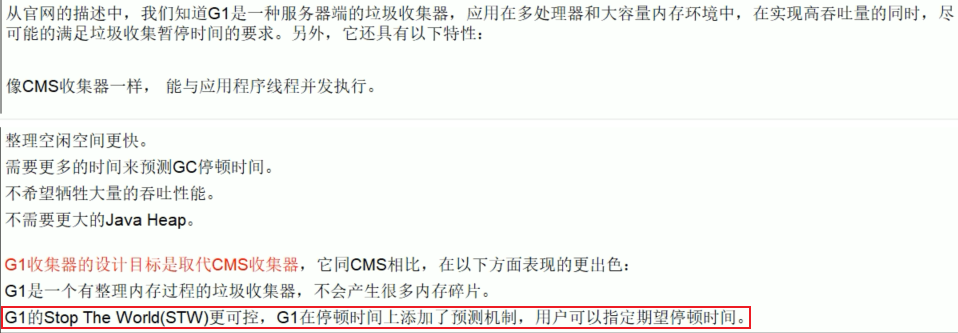
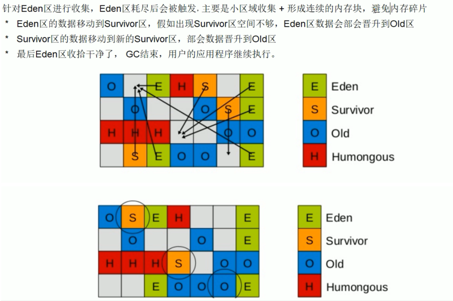

# 一 、jvm体系结构


**jvm是运行在操作系统之上的，他与硬件没有直接的交互**


## 1.1 类装载器ClassLoader

 	

​	负责加载class文件，class文件在**文件开头有特定的文件标示**，将class文件字节码内容加载到内存中，并将这些内容转换成方法区中的运行时数据结构,并且ClassLoader只负责class文件的加载，至于它是否可以运行，则由Execution Engine决定 


### 

### 1.1.1 jvm 类加载器3+1


#### 1.1.1.1   **Bootstrap ClassLoader/启动类加载器** 


**启动（Bootstrap）类加载器**：引导类装入器是用**本地代码**实现的类装入器，它负责将 /lib 下面的类库加载到内存中。由于引导类加载器涉及到虚拟机本地实现细节，开发者无法直接获取到启动类加载器的引用，所以不允许直接通过引用进行操作。

 主要负责`jre/lib/rt.jar`导入


#### 1.1.1.2   **Extension ClassLoader/扩展类加载器** 


ExtClassLoader（sun.misc.Launcher$ExtClassLoader） 实现的。它负责将

< Java_Runtime_Home >/lib/ext 或者由系统变量 java.ext.dir 指定位置中的类库加载到内存中。开发者可以直接使用标准扩展类加载器。

 主要负责`jre/lib/ext/*.jar`文件的加载


#### 1.1.1.3   Application ClassLoader/系统类加载器**


AppClassLoader（sun.misc.Launcher$AppClassLoader）实现的。它负责将系统类路径（CLASSPATH）中指定

的类库加载到内存中。开发者可以直接使用系统类加载器。

 主要负责java -classpath/-Djava.class.path所指的目录下的类与jar包装入工作. 

#### 1.1.1.4  User Custom ClassLoader/用户自定义类加载器


 在程序运行期间, 通过java.lang.ClassLoader的子类动态加载class文件, 体现java动态实时类装入特性. 


### 1.1.2 代码


```java
package com.yang.sh.jvm;

public class MyObject {
    public static void main(String[] args) {
        Object object = new Object();
        //System.out.println(object.getClass().getClassLoader().getParent().getParent());
        //Exception in thread "main" java.lang.NullPointerException
        //System.out.println(object.getClass().getClassLoader().getParent());
        //Exception in thread "main" java.lang.NullPointerException
        System.out.println(object.getClass().getClassLoader());
        //null

        MyObject myObject = new MyObject();
        System.out.println(myObject.getClass().getClassLoader().getParent().getParent());
        //null
        System.out.println(myObject.getClass().getClassLoader().getParent());
        //sun.misc.Launcher$ExtClassLoader@14ae5a5
        System.out.println(myObject.getClass().getClassLoader());
        //sun.misc.Launcher$AppClassLoader@18b4aac2
        
    }
}

```


### 1.1.3 双亲委派机制

> 一句话
>
> 避免内存中出现多个同样的字节码
>
> 保证了使用不同的类加载器加载类名相同的 对象的时候最终得到的都是同样一个 对象。 

当一个类加载器收到了类加载请求，他首先不会尝试自己去加载这个类，而是把这个请求委派给父类去完成，每一个层次类加载器都是如此，因此所有的加载请求都应该传送到启动类加载其中，只有当父类加载器反馈自己无法完成这个请求的时候（在它的加载路径下没有找到所需加载的Class），子类加载器才会尝试自己去加载。 


 这种层级关可以避免类的重复加载 

采用双亲委派的一个好处是比如加载位于 rt.jar 包中的类 java.lang.Object，不管是哪个加载器加载这个类，最终都是委托给顶层的启动类加载器进行加载，这样就保证了使用不同的类加载器最终得到的都是同样一个 Object对象。 


```java
package com.yang.sh.jvm;

public class classloader_01 {
    public static void main(String[] args) {
        System.out.println(ClassLoader.getSystemClassLoader());
        System.out.println(ClassLoader.getSystemClassLoader().getParent());
        System.out.println(ClassLoader.getSystemClassLoader().getParent().getParent());
        //sun.misc.Launcher$AppClassLoader@18b4aac2
        //sun.misc.Launcher$ExtClassLoader@14ae5a5
        //null
        
        //通过以上的代码输出，我们可以判定系统类加载器的父加载器是标准扩展类加载器，但是我们试图获取标准扩展类加载器的父类加载器时确得到了null，就是说标准扩展类加载器本身强制设定父类加载器为null
    }
}

```


```java
package java.lang;

import com.sun.org.apache.bcel.internal.generic.NEW;

public class String {
    public static void main(String[] args) {
        System.out.println("自定义java.lang.String");
        //错误: 在类 java.lang.String 中找不到 main 方法, 请将 main 方法定义为:
        //   public static void main(String[] args)
        //否则 JavaFX 应用程序类必须扩展javafx.application.Application

    }

}

```


### 1.1.3 沙箱安全机制

Java安全模型的核心就是Java沙箱（sandbox）

什么是沙箱？沙箱是一个限制程序运行的环境。沙箱机制就是将 Java 代码限定在虚拟机(JVM)特定的运行范围中，并且严格限制代码对本地系统资源访问，通过这样的措施来**保证对代码的有效隔离，防止对本地系统造成破坏**。沙箱**主要限制系统资源访问**，那系统资源包括什么？——`CPU、内存、文件系统、网络`。不同级别的沙箱对这些资源访问的限制也可以不一样。

所有的Java程序运行都可以指定沙箱，可以定制安全策略。


 在Java中将执行程序分成本地代码和远程代码两种，本地代码默认视为可信任的，而远程代码则被看作是不受信的。对于授信的本地代码，可以访问一切本地资源。而对于非授信的远程代码在早期的Java实现中，安全依赖于沙箱 (Sandbox) 机制。如下图所示 JDK1.0安全模型 


 但如此严格的安全机制也给程序的功能扩展带来障碍，比如当用户希望远程代码访问本地系统的文件时候，就无法实现。因此在后续的 Java1.1 版本中，针对安全机制做了改进，增加了`安全策略`，允许用户指定代码对本地资源的访问权限。如下图所示 JDK1.1安全模型 


  Java1.2 版本中，再次改进了安全机制，增加了`代码签名`。不论本地代码或是远程代码，都会按照用户的安全策略设定，由类加载器加载到虚拟机中权限不同的运行空间，来实现差异化的代码执行权限控制。如下图所示 JDK1.2安全模型 


 当前最新的安全机制实现，则引入了域 (Domain) 的概念。虚拟机会把所有代码加载到不同的系统域和应用域，系统域部分专门负责与关键资源进行交互，而各个应用域部分则通过系统域的部分代理来对各种需要的资源进行访问。虚拟机中不同的受保护域 (Protected Domain)，对应不一样的权限 (Permission)。存在于不同域中的类文件就具有了当前域的全部权限，如下图所示 最新的安全模型(jdk 1.6)


## 1.2  native


**native** 是一个关键字


有声明但是没有实现

因为它调用的是本地方法库

### 1.2.1 Native Interface 本地接口

​	本地接口的作用是融合不同的编程语言为 Java 所用，它的初衷是融合 C/C++程序，Java 诞生的时候是 C/C++横行的时候，要想立足，必须有调用 C/C++程序，于是就在内存中专门开辟了一块区域处理标记为native的代码，它的具体做法是 Native Method Stack中登记 native方法，在Execution Engine 执行时加载native libraies。

 目前该方法使用的越来越少了，除非是与硬件有关的应用，比如通过Java程序驱动打印机或者Java系统管理生产设备，在企业级应用中已经比较少见。因为现在的异构领域间的通信很发达，比如可以使用 Socket通信，也可以使用Web Service等等


### 1.2.2 Native Method Stack

它的具体做法是Native Method Stack中登记native方法，在Execution Engine 执行时加载本地方法库。


## 1.3 pc寄存器

> - 若正在执行的是java方法，则计数器记录的是正在执行的字节码指令的地址
> - 若正在执行的是native方法，则计数器为空
> - 该区域是唯一一个不会导致outofmemoryError的区域

每个线程都有一个程序计数器，是线程私有的,就是一个指针，指向方法区中的方法字节码（用来存储指向下一条指令的地址,也即将要执行的指令代码），由执行引擎读取下一条指令，是一个非常小的内存空间，几乎可以忽略不记。

这块内存区域很小，它是当前线程所执行的字节码的行号指示器，字节码解释器通过改变这个计数器的值来选取下一条需要执行的字节码指令。

**如果执行的是一个Native方法，那这个计数器是空的。**

用以完成分支、循环、跳转、异常处理、线程恢复等基础功能。不会发生内存溢出(OutOfMemory=OOM)错误


## 1.4 Method Area 方法区

> - 用来存放虚拟机加载的类信息，常量，静态变量，即时编译器编译后的代码等信息
> - GC会回收该区域的常量池和进行类型的卸载 *运行时常量池
> - ♣ Class文件的常量池用于存放编译期生成的各种字面量和符号引用，这部分内容将在类加载后存放在运行时常量池中
> - ♣ 还把翻译出来的直接引用也放在运行时常量池中，运行时产生的常量也放在里面

供**各线程共享**的运行时内存区域。它<u>存储了每一个**类的结构信息**</u>，例如**运行时常量池**（Runtime Constant Pool）、**字段和方法数据**、**构造函数和普通方法的字节码内容**。**上面讲的是规范，在不同虚拟机里头实现是不一样的，最典型的就是永久代(PermGen space)和元空间(Metaspace)。**

类似

空调 k1 = new 格力（）

方法区 f = new   永久代（）

方法区 f = new 元空间（）


**But**

**实例变量存在堆内存中,和方法区无关**

>  元空间使用本地内存，而永久代使用的是jvm内存


## 1.5  stack 栈

> 总结
>
> - 描述的是Java方法执行的内存模型：每个方法都会创建一个栈帧用于存储局部变量表，操作数栈、动态链接，方法出口等信息 
>
> - 局部变量表存放了编译期可知的基本数据类型，对象引用，和returnAddress类型（指向一条字节码指令地址），局部变量表的内存空间在编译器确定，在运行期不变 
> - 可导致两种异常：线程请求的栈深度大于虚拟机允许的深度-StackOverflowError；虚拟机无法申请到足够的内存-OutOfMemoryError

栈管运行，堆管存储**

​     栈也叫栈内存，主管Java程序的运行，是在线程创建时创建，它的生命期是跟随线程的生命期，线程结束栈内存也就释放，**对于栈来说不存在垃圾回收问题**，只要线程一结束该栈就Over，生命周期和线程一致，是线程私有的。

**8种基本类型的变量+对象的引用变量+实例方法都是在函数的栈内存中分配**  


### **1.5.1** 栈存储什么?


栈帧（java 方法）中主要保存3 类数据：


- 本地变量（Local Variables）:输入参数和输出参数以及方法内的变量；


- 栈操作（Operand Stack）:记录出栈、入栈的操作；


- 栈帧数据（Frame Data）:包括类文件、方法等等。

### 1.5.2 栈运行原理


栈中的数据都是以栈帧（Stack Frame）的格式存在，栈帧是一个内存区块，是一个数据集，是一个有关方法(Method)和运行期数据的数据集，当一个方法A被调用时就产生了一个栈帧 F1，并被压入到栈中，

A方法又调用了 B方法，于是产生栈帧 F2 也被压入栈，

B方法又调用了 C方法，于是产生栈帧 F3 也被压入栈，

……

执行完毕后，先弹出F3栈帧，再弹出F2栈帧，再弹出F1栈帧……


遵循“先进后出”/“后进先出”原则。


**每个方法执行的同时都会创建一个栈帧，用于存储局部变量表、操作数栈、动态链接、方法出口等信息**，每一个方法从调用直至执行完毕的过程，就对应着一个栈帧在虚拟机中入栈到出栈的过程。**栈的大小和具体JVM的实现有关，通常在256K~756K之间,约等于1Mb左右。**


图示在一个栈中有两个栈帧：

栈帧 2是最先被调用的方法，先入栈，

然后方法 2 又调用了方法1，栈帧 1处于栈顶的位置，

栈帧 2 处于栈底，执行完毕后，依次弹出栈帧 1和栈帧 2，

线程结束，栈释放


每执行一个方法都会产生一个栈帧，保存到栈(后进先出)的**顶部，顶部栈就是当前的方法，该方法执行完毕 后会自动将此栈帧出栈。**


### 1.5.3 常见错误 StackOverflowError

**Exception in thread "main" java.lang.StackOverflowError**


```java
package com.yang.sh.jvm;


public class stack_01 {

    //Exception in thread "main" java.lang.StackOverflowError 
    public static  void m1(){
        System.out.println("1");
        m1();

    }

    public static void main(String[] args) {
        System.out.println("main");
        m1();
    }
}

```


### 1.5.4 栈+堆+方法区的交互关系


HotSpot是使用指针的方式来访问对象：

Java堆中会存放访问**类元数据**的地址，

reference存储的就直接是对象的地址


## 1.6 堆heap

> - java堆是被所有线程共享的内存区域，在虚拟机启动时创建，用来分配对象实例和数组
> - 堆是垃圾回收器主要管理的区域，堆可分为新生代和老年代
> - 从内存分配角度看，堆可划分出多个线程私有的分配缓冲区（TLAB）
> - 大小可通过 -Xmx 和 -Xms 控制

一个JVM实例只存在一个堆内存，堆内存的大小是可以调节的。类加载器读取了类文件后，需要把类、方法、常变量放到堆内存中，保存所有引用类型的真实信息，以方便执行器执行，堆内存分为三部分  


- **Young Generation Space 新生区          Young/New**
- **Tenure generation space 养老区           Old/ Tenure**
- **lPermanent Space       永久区             Perm**


### 1.6.1 java7 之前


**java 8 之后 永生区变为了元数据区**

​	新生区是类的诞生、成长、消亡的区域，一个类在这里产生，应用，最后被垃圾回收器收集，结束生命。新生区又分为两部分： 伊甸区（Eden space）和幸存者区（Survivor pace） ，所有的类都是在伊甸区被new出来的。幸存区有两个： 0区（Survivor 0 space）和1区（Survivor 1 space）。当伊甸园的空间用完时，程序又需要创建对象，JVM的垃圾回收器将对伊甸园区进行垃圾回收(Minor GC)，将伊甸园区中的**不再被其他对象所引用的对象**进行销毁。然后**将伊甸园中的剩余对象移动到幸存 0区**。**若幸存 0区也满了，再对该区进行垃圾回收，然后移动到 1 区。那如果1 区也满了呢？再移动到养老区**。**若养老区也满了，那么这个时候将产生MajorGC（FullGC）**，**进行养老区的内存清理。若养老区执行了Full GC之后发现依然无法进行对象的保存，就会产生OOM异常“OutOfMemoryError”。**


**如果出现java.lang.OutOfMemoryError: Java heap space异常，**说明**Java虚拟机的堆内存不够**。原因有二：

（1）**Java虚拟机的堆内存设置不够**，可以通过参数-Xms、-Xmx来调整。

（2）代码中**创建了大量大对象，并且长时间不能被垃圾收集器收集（存在被引用）**。


### 1.6.2 MinorGC 的过程


**复制->清空->互换**


**1：eden、SurvivorFrom 复制到 SurvivorTo，年龄+**1 

首先，当Eden区满的时候会触发第一次GC,把还活着的对象拷贝到SurvivorFrom区，当Eden区再次触发GC的时候会扫描Eden区和From区域,对这两个区域进行垃圾回收，经过这次回收后还存活的对象,则直接复制到To区域（如果有对象的年龄已经达到了老年的标准，则赋值到老年代区），同时把这些对象的年龄+1


**2：清空 eden、SurvivorFrom** 

然后，清空Eden和SurvivorFrom中的对象，也即复制之后有交换，谁空谁是to


**3：SurvivorTo和 SurvivorFrom 互换** 

最后，SurvivorTo和SurvivorFrom互换，原SurvivorTo成为下一次GC时的SurvivorFrom区。部分对象会在From和To区域中复制来复制去,如此交换15次(由JVM参数MaxTenuringThreshold决定,这个参数默认是15),最终如果还是存活,就存入到老年代

### 1.6.3 HotSpot内存管理


​	实际而言，**方法区**（Method Area）和堆一样，是各个线程共享的内存区域，它**用于存储虚拟机加载的：类信息+普通常量+静态常量+编译器编译后的代码**等等，**虽然JVM规范将方法区描述为堆的一个逻辑部分，但它却还有一个别名叫做Non-Heap(非堆)，目的就是要和堆分开。**

 

 对于HotSpot虚拟机，很多开发者习惯将方法区称之为“永久代(Parmanent Gen)” ，但严格本质上说两者不同，或者说使用永久代来实现方法区而已，**永久代是方法区(相当于是一个接口interface)的一个实现**，**jdk1.7的版本中，已经将原本放在永久代的字符串常量池移走**。	


### 1.6.4 永生区（java7 之前有）

​	永久存储区是一个常驻内存区域，用于存放JDK自身所携带的 Class,Interface 的元数据，也就是说它存储的是运行环境必须的类信息，被装载进此区域的数据是不会被垃圾回收器回收掉的，关闭 JVM 才会释放此区域所占用的内存。


## 1.7 堆参数调优


### 1.7.0 三大调优参数

- ​	-Xss：规定了每个线程虚拟机栈（堆栈）的大小


- ​	 -Xms：堆的初始值（达到初始值后会自动扩容，直至最大值）


- ​	 -Xmx：堆能达到的最大值

**java7**


**java8**

​     **JDK 1.8之后将最初的永久代取消了，由元空间取代** 

 


在Java8中，永久代已经被移除，被一个称为**元空间**的区域所取代。元空间的本质和永久代类似。


元空间与永久代之间最大的区别在于：

永久带使用的JVM的堆内存，但是java8以后的**元空间并不在虚拟机中而是使用本机物理内存**。


因此，默认情况下，元空间的大小仅受本地内存限制。类的元数据放入 native memory, 字符串池和类的静态变量放入 java 堆中，这样可以加载多少类的元数据就不再由MaxPermSize 控制, 而由系统的实际可用空间来控制。 


### 1.7.1 堆内存调优参数01


```java
package com.yang.sh.jvm;

public class heap_01 {
    public static void main(String[] args) {
        long maxMemory = Runtime.getRuntime().maxMemory();
        long totalMemory = Runtime.getRuntime().totalMemory();
        System.out.println("-Xms:max_memory= "+maxMemory +"字节" +maxMemory/1024/1024 +"MB");
        System.out.println("-Xms:total_memory= "+totalMemory +"字节" +totalMemory/1024/1024 +"MB");
        //-Xms:max_memory= 1883242496字节1796MB
        //-Xms:total_memory= 128974848字节123MB
        //发现默认的情况下分配的内存是总内存的“1 / 4”、而初始化的内存为“1 / 64
    }
}

```


**修改参数 **      -Xms1024m -Xmx1024m -XX:+PrintGCDetails  


```java
package com.yang.sh.jvm;

public class heap_01 {
    public static void main(String[] args) {
        long maxMemory = Runtime.getRuntime().maxMemory();
        long totalMemory = Runtime.getRuntime().totalMemory();
        System.out.println("-Xms:max_memory= "+maxMemory +"字节" +maxMemory/1024/1024 +"MB");
        System.out.println("-Xms:total_memory= "+totalMemory +"字节" +totalMemory/1024/1024 +"MB");
        //-Xms:max_memory= 1029177344字节981MB
        //-Xms:total_memory= 1029177344字节981MB
        //Heap
        // PSYoungGen      total 305664K, used 20971K [0x00000000eab00000, 0x0000000100000000, 0x0000000100000000)
        //  eden space 262144K, 8% used [0x00000000eab00000,0x00000000ebf7afb8,0x00000000fab00000)
        //  from space 43520K, 0% used [0x00000000fd580000,0x00000000fd580000,0x0000000100000000)
        //  to   space 43520K, 0% used [0x00000000fab00000,0x00000000fab00000,0x00000000fd580000)
        // ParOldGen       total 699392K, used 0K [0x00000000c0000000, 0x00000000eab00000, 0x00000000eab00000)
        //  object space 699392K, 0% used [0x00000000c0000000,0x00000000c0000000,0x00000000eab00000)
        // Metaspace       used 3455K, capacity 4496K, committed 4864K, reserved 1056768K
        //  class space    used 381K, capacity 388K, committed 512K, reserved 1048576K
    }
}

```


- **PSYoungGen：**总堆内存的1/3
  - **eden**: 新生代堆空间的 8/10
  - **from**: 新生代堆空间的1/10
  - **to**: 新生代堆空间的1/10
- **ParoldGen**: 总堆内存的2/3

### 1.7.2 修改参数并且造成异常OutOfMemoryError


```java
package com.yang.sh.jvm;

import java.util.Random;

public class heap_02 {
    public static void main(String[] args) {
        String str = "6yang" ;
        while(true)
        {
            str += str + new Random().nextInt(88888888) + new Random().nextInt(999999999) ;
        }
        //[GC (Allocation Failure) [PSYoungGen: 2026K->482K(2560K)] 2026K->754K(9728K), 0.0175772 secs] [Times: user=0.00 sys=0.00, real=0.03 secs]
        //[GC (Allocation Failure) [PSYoungGen: 2412K->504K(2560K)] 2684K->1667K(9728K), 0.0008862 secs] [Times: user=0.00 sys=0.00, real=0.00 secs]
        //[GC (Allocation Failure) [PSYoungGen: 1933K->488K(2560K)] 3097K->2355K(9728K), 0.0005578 secs] [Times: user=0.00 sys=0.00, real=0.00 secs]
        //[GC (Allocation Failure) [PSYoungGen: 1928K->488K(2560K)] 5171K->4435K(9728K), 0.0007147 secs] [Times: user=0.00 sys=0.00, real=0.00 secs]
        //[GC (Allocation Failure) [PSYoungGen: 1222K->472K(2560K)] 6545K->5795K(9728K), 0.0005020 secs] [Times: user=0.00 sys=0.00, real=0.00 secs]
        //[GC (Allocation Failure) [PSYoungGen: 472K->456K(1536K)] 5795K->5779K(8704K), 0.0004721 secs] [Times: user=0.00 sys=0.00, real=0.00 secs]
        //[Full GC (Allocation Failure) [PSYoungGen: 456K->0K(1536K)] [ParOldGen: 5323K->2701K(7168K)] 5779K->2701K(8704K), [Metaspace: 3496K->3496K(1056768K)], 0.0054923 secs] [Times: user=0.00 sys=0.00, real=0.00 secs]
        //[GC (Allocation Failure) [PSYoungGen: 50K->144K(2048K)] 6879K->6973K(9216K), 0.0005970 secs] [Times: user=0.00 sys=0.00, real=0.00 secs]
        //[Full GC (Ergonomics) [PSYoungGen: 144K->0K(2048K)] [ParOldGen: 6829K->2033K(7168K)] 6973K->2033K(9216K), [Metaspace: 3501K->3501K(1056768K)], 0.0064742 secs] [Times: user=0.02 sys=0.02, real=0.01 secs]
        //[GC (Allocation Failure) [PSYoungGen: 40K->0K(2048K)] 6201K->6160K(9216K), 0.0004383 secs] [Times: user=0.00 sys=0.00, real=0.00 secs]
        //[Full GC (Ergonomics) [PSYoungGen: 0K->0K(2048K)] [ParOldGen: 6160K->4784K(7168K)] 6160K->4784K(9216K), [Metaspace: 3502K->3502K(1056768K)], 0.0071688 secs] [Times: user=0.00 sys=0.00, real=0.01 secs]
        //[GC (Allocation Failure) [PSYoungGen: 0K->0K(2048K)] 4784K->4784K(9216K), 0.0003575 secs] [Times: user=0.00 sys=0.00, real=0.00 secs]
        //[Full GC (Allocation Failure) [PSYoungGen: 0K->0K(2048K)] [ParOldGen: 4784K->4764K(7168K)] 4784K->4764K(9216K), [Metaspace: 3502K->3502K(1056768K)], 0.0070246 secs] [Times: user=0.05 sys=0.00, real=0.01 secs]
        //Heap
        // PSYoungGen      total 2048K, used 50K [0x00000000ffd00000, 0x0000000100000000, 0x0000000100000000)
        //  eden space 1024K, 4% used [0x00000000ffd00000,0x00000000ffd0ca68,0x00000000ffe00000)
        //  from space 1024K, 0% used [0x00000000ffe00000,0x00000000ffe00000,0x00000000fff00000)
        //  to   space 1024K, 0% used [0x00000000fff00000,0x00000000fff00000,0x0000000100000000)
        // ParOldGen       total 7168K, used 4764K [0x00000000ff600000, 0x00000000ffd00000, 0x00000000ffd00000)
        //  object space 7168K, 66% used [0x00000000ff600000,0x00000000ffaa7220,0x00000000ffd00000)
        // Metaspace       used 3534K, capacity 4502K, committed 4864K, reserved 1056768K
        //  class space    used 391K, capacity 394K, committed 512K, reserved 1048576K
        //Exception in thread "main" java.lang.OutOfMemoryError: Java heap space
        //	at java.util.Arrays.copyOf(Arrays.java:3332)
        //	at java.lang.AbstractStringBuilder.ensureCapacityInternal(AbstractStringBuilder.java:124)
        //	at java.lang.AbstractStringBuilder.append(AbstractStringBuilder.java:674)
        //	at java.lang.StringBuilder.append(StringBuilder.java:208)
        //	at com.yang.sh.jvm.heap_02.main(heap_02.java:10)

    }
}

```

### 1.7.3 GCDetail --- GC参数


```java
[GC (Allocation Failure) [PSYoungGen: 2026K->482K(2560K)] 2026K->754K(9728K), 0.0175772 secs] [Times: user=0.00 sys=0.00, real=0.03 secs]
```

### 1.7.4 GCDetail --- Full GC 参数


```java
[Full GC (Allocation Failure) [PSYoungGen: 456K->0K(1536K)] [ParOldGen: 5323K->2701K(7168K)] 5779K->2701K(8704K), [Metaspace: 3496K->3496K(1056768K)], 0.0054923 secs] [Times: user=0.00 sys=0.00, real=0.00 secs]
[Full GC (Allocation Failure) [PSYoungGen: 0K->0K(2048K)] [ParOldGen: 4784K->4764K(7168K)] 4784K->4764K(9216K), [Metaspace: 3502K->3502K(1056768K)], 0.0070246 secs] [Times: user=0.05 sys=0.00, real=0.01 secs]
---java.lang.OutOfMemoryError: Java heap space
```


## 1.8 元空间、堆、线程独占部分间的联系——内存角度


# 二、GC垃圾回收


## 2.1 GC是什么(分代收集算法)

堆内存不够时 发生GC垃圾回收 

- **次数上频繁收集Young区**
- **次数上较少收集Old区**
- **基本不动元空间**


## 2.2 判断对象已死的算法


### 2.2.1 引用计数法

> -   思想：给对象设置引用计数器，每引用该对象一次，计数器就+1，引用失效时，计数器就-1，当任意时候引用计数器的值都为0时，则该对象可被回收 
> -  Java不适用原因：**无法解决对象互相循环引用的问题** 


**循环引用举例**

```java
package com.yang.sh.jvm;

public class RefCountGC
{
  private byte[] bigSize = new byte[2 * 1024 * 1024];//这个成员属性唯一的作用就是占用一点内存
  Object instance = null;
 
  public static void main(String[] args)
  {
    RefCountGC objectA = new RefCountGC();
    RefCountGC objectB = new RefCountGC();
    objectA.instance = objectB;
    objectB.instance = objectA;
    objectA = null;
    objectB = null;
 
    System.gc();
  }
}
```

```java
[GC (System.gc()) [PSYoungGen: 7434K->840K(38400K)] 7434K->848K(125952K), 0.0009070 secs] [Times: user=0.08 sys=0.02, real=0.00 secs] 
[Full GC (System.gc()) [PSYoungGen: 840K->0K(38400K)] [ParOldGen: 8K->633K(87552K)] 848K->633K(125952K), [Metaspace: 3466K->3466K(1056768K)], 0.0045632 secs] [Times: user=0.00 sys=0.00, real=0.00 secs] 
Heap
 PSYoungGen      total 38400K, used 998K [0x00000000d5f00000, 0x00000000d8980000, 0x0000000100000000)
  eden space 33280K, 3% used [0x00000000d5f00000,0x00000000d5ff9b20,0x00000000d7f80000)
  from space 5120K, 0% used [0x00000000d7f80000,0x00000000d7f80000,0x00000000d8480000)
  to   space 5120K, 0% used [0x00000000d8480000,0x00000000d8480000,0x00000000d8980000)
 ParOldGen       total 87552K, used 633K [0x0000000081c00000, 0x0000000087180000, 0x00000000d5f00000)
  object space 87552K, 0% used [0x0000000081c00000,0x0000000081c9e458,0x0000000087180000)
 Metaspace       used 3481K, capacity 4496K, committed 4864K, reserved 1056768K
  class space    used 385K, capacity 388K, committed 512K, reserved 1048576K
```


可以从日志中看出存在7434k->848k 所以说明虚拟机不是通过引用计数来判定对象是否死亡的


### 2.2.1 可达性分析算法 根搜索算法（JVM采用的算法） 


概念：**设立若干种根对象，当任何一个根对象（GC Root）到某一个对象均不可达时，则认为这个对象是可以被回收的。**


可达性分析：

从根（GC root）的对象作为起始点，开始向下搜索，搜索所走过的路径称为“引用链”，当一个对象到GC root没有任何引用链相连（用凸轮的概念来讲，就是从GC Root到这个对象不可达）时，则证明此对象是不可用的。


 

如上图所示，ObjectD和ObjectE是互相关联的，但是由于GC root到这两个对象不可达，所以最终D和E还是会被当做GC的对象，**上图若是采用引用计数法，则A-E五个对象都不会被回收。** 

**根（GC roots）**

说到GC roots（GC根），在Java语言中，可以当做GC root的对象有以下几种：

> 1.栈（栈帧的本地变量表）中引用的对象
>
> 2.方法区中的静态属性引用的对象。
>
> 3.方法区中的常量引用的对象（全局变量）
>
> 4.本地方法栈中JNI（一般说是Native方法）引用的对象。

注意：第一和第四都是指的方法的本地变量表，第二种表达的意思比较清晰，第三种主要指的是生命为final的常量值。

 **一个对象真正不可用，要经历两次标记过程：** 

- 首先进行可达性分析，筛选出与GC Roots没用引用链的对象，进行第一次标记 
- 第一次标记后，再进行一次筛选，筛选条件是是否有必要执行finalize()方法。若对象有没有重写finalize()方法，或者finalize()是否已被jvm调用过，则没必要执行，GC会回收该对象 
- 若有必要执行，则该对象会被放入F-Queue中，由jvm开启一个低优先级的线程去执行它（但不一定等待finalize执行完毕）。 
- Finalize()是对象最后一次自救的机会，若对象在finalize()中重新加入到引用链中，则它会被移出要回收的对象的集合。其他对象则会被第二次标记，进行回收


## 2.3 垃圾收集算法

### 2.3.0 常用调优参数

-XX：survivorRatio : Eden 和 survivor的比例，默认8： 1

-XX：NewRatio :老年代和年轻代的比例：

-XX：MaxtenuringThreshold :对象从年轻代晋升到老年代经过的GC的最大次数


### 2.3.1 复制算法

> **复制算法的基本思想就是将内存分为两块，每次只用其中一块，当这一块内存用完，就将还活着的对象复制到另外一块上面。复制算法不会产生内存碎片。**

**年轻代**中使用的是Minor GC，这种GC算法采用的是复制算法(Copying)


Minor GC会把Eden中的所有活的对象都移到Survivor区域中，如果Survivor区中放不下，那么剩下的活的对象就被移到Old  generation中，**也即一旦收集后，Eden是就变成空的了**。
  当对象在 Eden ( 包括一个 Survivor 区域，这里假设是 from 区域 ) 出生后，在经过一次 Minor GC 后，如果对象还存活，并且能够被另外一块 Survivor 区域所容纳( 上面已经假设为 from 区域，这里应为 to 区域，即 to 区域有足够的内存空间来存储 Eden 和 from 区域中存活的对象 )，则使用复制算法将这些仍然还存活的对象复制到另外一块 Survivor 区域 ( 即 to 区域 ) 中，然后清理所使用过的 Eden 以及 Survivor 区域 ( 即 from 区域 )，并且将这些对象的年龄设置为1，以后对象在 Survivor 区每熬过一次 Minor GC，就将对象的年龄 + 1，当对象的年龄达到某个值时 ( 默认是 15 岁，通过-XX:MaxTenuringThreshold 来设定参数)，这些对象就会成为老年代。

**-XX:MaxTenuringThreshold — 设置对象在新生代中存活的次数**

 

因为年轻代中的对象基本都是朝生夕死的(90%以上)，所以在年轻代的垃圾回收算法使用的是复制算法，**复制算法的基本思想就是将内存分为两块，每次只用其中一块，当这一块内存用完，就将还活着的对象复制到另外一块上面。复制算法不会产生内存碎片。**


复制算法它的**缺点**也是相当明显的。 
　　1、它浪费了一半的内存，这太要命了。 
　　2、如果对象的存活率很高，我们可以极端一点，假设是100%存活，那么我们需要将所有对象都复制一遍，并将所有引用地址重置一遍。复制这一工作所花费的时间，在对象存活率达到一定程度时，将会变的不可忽视。 所以从以上描述不难看出，复制算法要想使用，最起码对象的存活率要非常低才行，而且最重要的是，我们必须要克服50%内存的浪费。


### 2.3.2 标记-清除算法


用通俗的话解释一下标记清除算法，就是当程序运行期间，若可以使用的内存被耗尽的时候，GC线程就会被触发**并将程序暂停**，随后将要回收的对象标记一遍，最终统一回收这些对象，完成标记清理工作接下来便让应用程序恢复运行。

主要进行两项工作，第一项则是标记，第二项则是清除。  
  标记：从引用根节点开始标记遍历所有的GC Roots， 先标记出要回收的对象。
  清除：遍历整个堆，把标记的对象清除。 

**缺点**：

1、首先，它的缺点就是效率比较低（递归与全堆对象遍历），而且**在进行GC的时候，需要停止应用程序**，这会导致用户体验非常差劲
2、其次，主要的缺点则是这种方式**清理出来的空闲内存是不连续的**，这点不难理解，我们的死亡对象都是随即的出现在内存的各个角落的，现在把它们清除之后，内存的布局自然会乱七八糟。而为了应付这一点，JVM就不得不维持一个内存的空闲列表，这又是一种开销。而且在分配数组对象的时候，寻找连续的内存空间会不太好找。 


### 2.3.3 标记-整理算法


**老年代一般是由标记清除或者是标记清除与标记整理的混合实现**


在整理压缩阶段，不再对标记的对像做回收，而是通过所有存活对像都向一端移动，然后直接清除边界以外的内存。
可以看到，标记的存活对象将会被整理，按照内存地址依次排列，而未被标记的内存会被清理掉。如此一来，当我们需要给新对象分配内存时，JVM只需要持有一个内存的起始地址即可，这比维护一个空闲列表显然少了许多开销。 

　　标记/整理算法不仅可以弥补标记/清除算法当中，内存区域分散的缺点，也消除了复制算法当中，内存减半的高额代价

**缺点**

标记/理算法唯一的缺点就是效率也不高，不仅要标记所有存活对象，还要整理所有存活对象的引整用地址。
从效率上来说，标记/整理算法要低于复制算法。


### 2.3.4 分代收集算法

**一句话就是根据对象的 活动周期的不同将内存划为几块**。一般是把java中的堆分为新生代和老年代，这样就可以对不同年代的特点采用合适的收集算法。

新生代中，每次垃圾回收都有大量对象死去，只有少量存活，那就采用复制算法。

而老年代中对象的存活率高，没有额外空间对它进行分配担保，那么就采用‘’标记-清除‘’ 和标记-整理算法来进行回收。


## 2.4 常见的垃圾回收器


### 2.4.1 Serial 收集器


### 2.4.2 ParNew 收集器


### 2.4.3 Parallel Scavenge收集器


### 2.4.4 Serial Old 收集器


### 2.4.5 Parallel Old 收集器


### 2.4.6 CMS 收集器


> 特点：是一种以获取最短回收停顿时间为目标的收集器，采用标记-清除算法
>
> 收集过程：
>
> 初始标记： stop the world 标记GC Roots能直接关联到的对象 
>
> 并发标记：进行GC Roots Tracing 
>
> 重新标记：stop the world；修正并发标记期间因用户程序继续运作而导致标记产生变动的 那一部分对象的标记记录 
>
> 并发清除：清除对象
>
> **优点**： 并发收集，低停顿
>
> **缺点**： 对CPU资源敏感
>
> ​		       无法处理浮动垃圾
>
> ​              产生大量的内存碎片 


> 初始标记只是对GC root 能直接关联到的对象进行标记
>
> 并发标记是根据GCroot 进行Tracing的过程
>
> 重新标记是修正并发标记那段时间发生变动的数据
>
> 并发清理执行清理过程

**缺点：**

> 1、CMS收集器对CPU非常敏感，由于和用户线程并发执行，所以会占用一部分的CPU资源，使应用程序变慢，吞吐量降低 

> 2、会产生浮动垃圾，CMS并发清理的时候用户线程也在运行，自然就会有垃圾不断产生，这些垃圾只能等下一次垃圾回收时被清理

> 3、由于基于标记-清除算法实现，会产生很多的内存碎片


### 2.4.7 G1收集器

> G1收集器将内存划分为多个大小相同的Region,每个Region分给各个年轻代和老年代。它虽然还保持了年轻代和老年代的概念，但是老年代和年轻代之间不再是物理隔离。并且每个Region在每个代之间可以自由切换。
>
> 并且G1收集器还有以下特点
>
> - 并发和并行，尽可能的缩短stop the world
>
> - 分代收集：采用不同的方式去处理不同代
>
> - G1整体上是采用标记整理算法，从两个region来看是采用复制算法实现的，所以 不会产生内存碎片
> - 可预测停顿，G1除了追求低停顿以外，还能 建立可预测停顿时间模型，可以在用户指定的时间内尽可能回收最大价值的Region
>
> G1的收集步骤包括以下四个步骤
>
> **初始标记:** 仅仅标记GC root能直接关联道德 对象 
>
> **并发标记** 进行GC root 向下搜索的一个过程
>
> **最终标记** ：修正在并发标记期间因为程序运行而导致变动的那一部分对象
>
> **筛选回收**：根据时间来进行最大价值进行回收


**以前收集器的特点**

> 年轻代和老年代是各自独立且连续的内存块
>
> 年轻代收集使用单eden+S0 +S进行复制算法
>
> 老年代收集必须扫描整个老年代区域
>
> 都是以尽可能少而快速地执行GC为设计原则



> 1. G1 能充分利用多CPU、多核环境的硬件优势，尽可能的缩短stop the world
> 2. G1 整体上采用标记整理算法，局部使用复制算法，**不会产生内存碎片**
> 3. 宏观上G1不分年轻代和老年代。而是把内存划分为多个独立的 子区域
> 4. G1将整个内存都混合在一起了，但是其本身依旧在小范围进行年轻代和老年代的区分。但是他们不再是物理隔离的，而是一个个Region区域，也就是说依旧会采用不同的GC方式来处理不同的区域。
> 5. G1虽然也是分代收集器，但是整个内存分区**不存在物理上**的年轻代和老年代的区别。G1只有**逻辑上的分代概念，**或者说每个分区都会随着G1的运行在不同代之前切换

#### 底层原理

区域化内存划片Region,整体编为了一些列不连续的内存区域，避免了全内存区的GC操作。
**核心思想**:是将整个堆内存区域分成大小相同的了区域（Region），在JVM启动时会自动设置这些子区域的大小，
在堆的使用上，**G1并不要求对象的存储一定是物理上连续的只要逻辑上连续即可**，**每个分区也不会固定地为某个代服务，可以按需在年轻代和老年代之间切换**。启动时可以通过参数`-XX:G1HeapRegionSize=n`可指定分区大小（1MB~32M，且必须是2的幂），默认将整堆划
分为2048个分区·大小范围在IMB、32M巳最多能设置2048个区域，也即能够支持的最大内存为：32M．2048=65536MB=64G内存


**最大好处是化整为零，避免全内存扫描，只需要按照区域来进行扫描即可**

#### 回收过程




### 和CMS相比的优势

> （1）G1不会产生内存碎片
>
> （2）可以精准停顿。每次根据允许停顿时间去收集垃圾最多的区域

 

## 2.5 强-软-弱-虚引用


