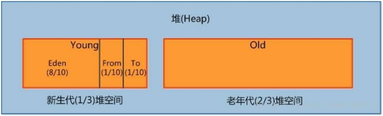
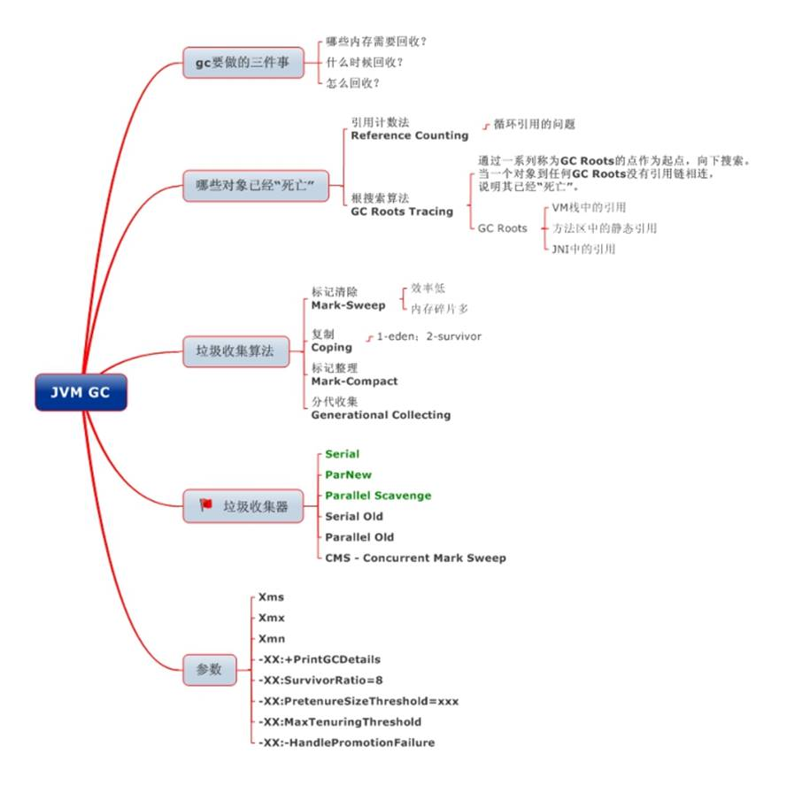
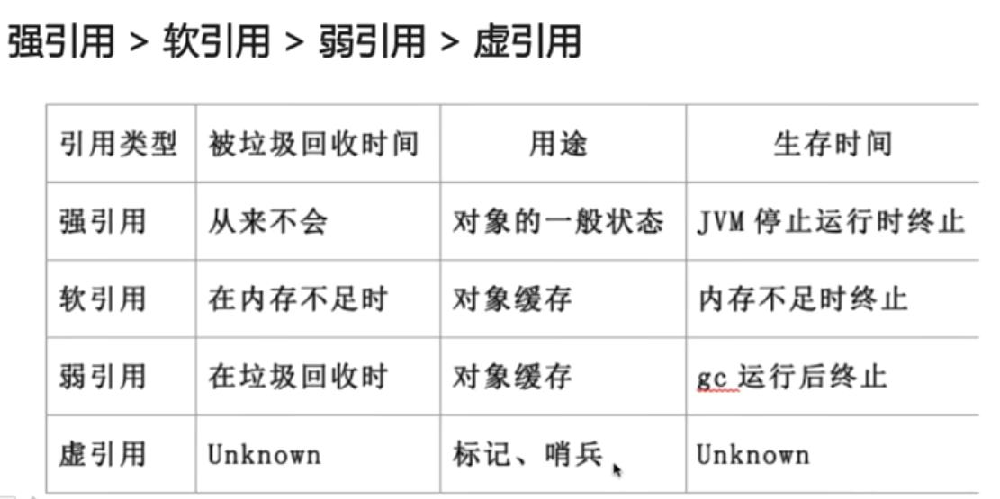

# 一 、jvm


<font color='cornflowerblue'>JVM 是可运行 Java 代码的假想计算机 ，包括一套字节码指令集、一组寄存器、一个栈、一个垃圾回收，堆 和 一个存储方法域。JVM 是运行在操作系统之上的，它与硬件没有直接的交互。</font>

## 1.1 jvm内存区域


### 1.1.1  程序计数器（线程私有）

一块较小的内存空间,<font color='red'> 是当前线程所执行的字节码的行号指示器</font>，每条线程都要有一个独立的程序计数器，这类内存也称为“线程私有”的内存。

<font color='cornflowerblue'>正在执行 java 方法的话，计数器记录的是虚拟机字节码指令的地址（当前指令的地址）。如果还是 Native 方法，则为空。</font>

这个内存区域是唯一一个在虚拟机中没有规定任何 OutOfMemoryError 情况的区域。

### 1.1.2  虚拟机栈（线程私有）

<font color='red'>是描述 java 方法执行的内存模型，每个方法在执行的同时都会创建一个栈帧（Stack Frame）用于存储局部变量表、操作数栈、动态链接、方法出口等信息</font>。<font color='cornflowerblue'> 每一个方法从调用直至执行完成的过程，就对应着一个栈帧在虚拟机栈中入栈到出栈的过程。 </font> 

栈帧（ Frame）是用来存储数据和部分过程结果的数据结构，同时也被用来处理动态链接(Dynamic Linking)、 方法返回值和异常分派（ Dispatch Exception）。栈帧随着方法调用而创建，随着方法结束而销毁——无论方法是正常完成还是异常完成（抛出了在方法内未被捕获的异常）都算作方法结束。


### 1.1.3  本地方法栈（线程私有）

本地方法区和<font color='cornflowerblue'> Java Stack 作用类似</font>, 区别是虚拟机栈为执行 Java 方法服务, <font color='cornflowerblue'>而本地方法栈则为Native 方法服务,</font> 如果一个 VM 实现使用 C-linkage 模型来支持 Native 调用, 那么该栈将会是一个C 栈，但 HotSpot VM 直接就把本地方法栈和虚拟机栈合二为一。

### 1.1.4  堆（线程公有）

是被线程共享的一块内存区域，<font color='red'> 创建的对象和数组都保存在 Java 堆内存中，也是垃圾收集器进行垃圾收集的最重要的内存区域 </font>。由于现代 VM 采用**分代收集算法**, 因此 Java 堆从 GC 的角度还可以细分为: **新生代**(Eden区、FromSu881qui,zrvivor区和 ToSurvivor区)和**老年代。**


### 1.1.5  方法区（线程公有）

即我们常说的**永久代**(Permanent **Generation)**, 用于存储**被** **JVM** **加载的类信息**、**常量**、**静态变量**、**即时编译器编译后的代码**等数据. HotSpot VM 把 GC 分代收集扩展至方法区, 即**使用** **Java**堆的永久代来实现方法区, 这样 HotSpot 的垃圾收集器就可以像管理 Java 堆一样管理这部分内存,而不必为方法区开发专门的内存管理器(永久带的内存回收的主要目标是针对**常量池的回收**和**类型的卸载**, 因此收益一般很小)。

<font color='red'>运行时常量池</font>（Runtime Constant Pool）是方法区的一部分。Class 文件中除了有类的版本、字段、方法、接口等描述等信息外，还有一项信息是常量池（Constant Pool Table），用于存放编译期生成的各种字面量和符号引用，这部分内容将在类加载后存放到方法区的运行时常量池中。 Java 虚拟机对 Class 文件的每一部分（自然也包括常量池）的格式都有严格的规定，每一个字节用于存储哪种数据都必须符合规范上的要求，这样才会被虚拟机认可、装载和执行。

### 1.1.6 堆参数调优


#### 1.1.6.1  三大调优参数

- ​	-Xss：规定了每个线程虚拟机栈（堆栈）的大小


- ​	 -Xms：堆的初始值（达到初始值后会自动扩容，直至最大值）


- ​	 -Xmx：堆能达到的最大值

**java7**


**java8**

​     **JDK 1.8之后将最初的永久代取消了，由元空间取代** 

 


在Java8中，永久代已经被移除，被一个称为**元空间**的区域所取代。元空间的本质和永久代类似。


元空间与永久代之间最大的区别在于：

永久带使用的JVM的堆内存，但是java8以后的**元空间并不在虚拟机中而是使用本机物理内存**。


因此，默认情况下，元空间的大小仅受本地内存限制。类的元数据放入 native memory, 字符串池和类的静态变量放入 java 堆中，这样可以加载多少类的元数据就不再由MaxPermSize 控制, 而由系统的实际可用空间来控制。 


#### 1.1.6.2  堆内存调优参数01


```java
package com.yang.sh.jvm;

public class heap_01 {
    public static void main(String[] args) {
        long maxMemory = Runtime.getRuntime().maxMemory();
        long totalMemory = Runtime.getRuntime().totalMemory();
        System.out.println("-Xms:max_memory= "+maxMemory +"字节" +maxMemory/1024/1024 +"MB");
        System.out.println("-Xms:total_memory= "+totalMemory +"字节" +totalMemory/1024/1024 +"MB");
        //-Xms:max_memory= 1883242496字节1796MB
        //-Xms:total_memory= 128974848字节123MB
        //发现默认的情况下分配的内存是总内存的“1 / 4”、而初始化的内存为“1 / 64
    }
}

```


**修改参数 **      -Xms1024m -Xmx1024m -XX:+PrintGCDetails  


```java
package com.yang.sh.jvm;

public class heap_01 {
    public static void main(String[] args) {
        long maxMemory = Runtime.getRuntime().maxMemory();
        long totalMemory = Runtime.getRuntime().totalMemory();
        System.out.println("-Xms:max_memory= "+maxMemory +"字节" +maxMemory/1024/1024 +"MB");
        System.out.println("-Xms:total_memory= "+totalMemory +"字节" +totalMemory/1024/1024 +"MB");
        //-Xms:max_memory= 1029177344字节981MB
        //-Xms:total_memory= 1029177344字节981MB
        //Heap
        // PSYoungGen      total 305664K, used 20971K [0x00000000eab00000, 0x0000000100000000, 0x0000000100000000)
        //  eden space 262144K, 8% used [0x00000000eab00000,0x00000000ebf7afb8,0x00000000fab00000)
        //  from space 43520K, 0% used [0x00000000fd580000,0x00000000fd580000,0x0000000100000000)
        //  to   space 43520K, 0% used [0x00000000fab00000,0x00000000fab00000,0x00000000fd580000)
        // ParOldGen       total 699392K, used 0K [0x00000000c0000000, 0x00000000eab00000, 0x00000000eab00000)
        //  object space 699392K, 0% used [0x00000000c0000000,0x00000000c0000000,0x00000000eab00000)
        // Metaspace       used 3455K, capacity 4496K, committed 4864K, reserved 1056768K
        //  class space    used 381K, capacity 388K, committed 512K, reserved 1048576K
    }
}

```


- **PSYoungGen：**总堆内存的1/3
  - **eden**: 新生代堆空间的 8/10
  - **from**: 新生代堆空间的1/10
  - **to**: 新生代堆空间的1/10
- **ParoldGen**: 总堆内存的2/3

#### 1.1.6.3 修改参数并且造成异常OutOfMemoryError


```java
package com.yang.sh.jvm;

import java.util.Random;

public class heap_02 {
    public static void main(String[] args) {
        String str = "6yang" ;
        while(true)
        {
            str += str + new Random().nextInt(88888888) + new Random().nextInt(999999999) ;
        }
        //[GC (Allocation Failure) [PSYoungGen: 2026K->482K(2560K)] 2026K->754K(9728K), 0.0175772 secs] [Times: user=0.00 sys=0.00, real=0.03 secs]
        //[GC (Allocation Failure) [PSYoungGen: 2412K->504K(2560K)] 2684K->1667K(9728K), 0.0008862 secs] [Times: user=0.00 sys=0.00, real=0.00 secs]
        //[GC (Allocation Failure) [PSYoungGen: 1933K->488K(2560K)] 3097K->2355K(9728K), 0.0005578 secs] [Times: user=0.00 sys=0.00, real=0.00 secs]
        //[GC (Allocation Failure) [PSYoungGen: 1928K->488K(2560K)] 5171K->4435K(9728K), 0.0007147 secs] [Times: user=0.00 sys=0.00, real=0.00 secs]
        //[GC (Allocation Failure) [PSYoungGen: 1222K->472K(2560K)] 6545K->5795K(9728K), 0.0005020 secs] [Times: user=0.00 sys=0.00, real=0.00 secs]
        //[GC (Allocation Failure) [PSYoungGen: 472K->456K(1536K)] 5795K->5779K(8704K), 0.0004721 secs] [Times: user=0.00 sys=0.00, real=0.00 secs]
        //[Full GC (Allocation Failure) [PSYoungGen: 456K->0K(1536K)] [ParOldGen: 5323K->2701K(7168K)] 5779K->2701K(8704K), [Metaspace: 3496K->3496K(1056768K)], 0.0054923 secs] [Times: user=0.00 sys=0.00, real=0.00 secs]
        //[GC (Allocation Failure) [PSYoungGen: 50K->144K(2048K)] 6879K->6973K(9216K), 0.0005970 secs] [Times: user=0.00 sys=0.00, real=0.00 secs]
        //[Full GC (Ergonomics) [PSYoungGen: 144K->0K(2048K)] [ParOldGen: 6829K->2033K(7168K)] 6973K->2033K(9216K), [Metaspace: 3501K->3501K(1056768K)], 0.0064742 secs] [Times: user=0.02 sys=0.02, real=0.01 secs]
        //[GC (Allocation Failure) [PSYoungGen: 40K->0K(2048K)] 6201K->6160K(9216K), 0.0004383 secs] [Times: user=0.00 sys=0.00, real=0.00 secs]
        //[Full GC (Ergonomics) [PSYoungGen: 0K->0K(2048K)] [ParOldGen: 6160K->4784K(7168K)] 6160K->4784K(9216K), [Metaspace: 3502K->3502K(1056768K)], 0.0071688 secs] [Times: user=0.00 sys=0.00, real=0.01 secs]
        //[GC (Allocation Failure) [PSYoungGen: 0K->0K(2048K)] 4784K->4784K(9216K), 0.0003575 secs] [Times: user=0.00 sys=0.00, real=0.00 secs]
        //[Full GC (Allocation Failure) [PSYoungGen: 0K->0K(2048K)] [ParOldGen: 4784K->4764K(7168K)] 4784K->4764K(9216K), [Metaspace: 3502K->3502K(1056768K)], 0.0070246 secs] [Times: user=0.05 sys=0.00, real=0.01 secs]
        //Heap
        // PSYoungGen      total 2048K, used 50K [0x00000000ffd00000, 0x0000000100000000, 0x0000000100000000)
        //  eden space 1024K, 4% used [0x00000000ffd00000,0x00000000ffd0ca68,0x00000000ffe00000)
        //  from space 1024K, 0% used [0x00000000ffe00000,0x00000000ffe00000,0x00000000fff00000)
        //  to   space 1024K, 0% used [0x00000000fff00000,0x00000000fff00000,0x0000000100000000)
        // ParOldGen       total 7168K, used 4764K [0x00000000ff600000, 0x00000000ffd00000, 0x00000000ffd00000)
        //  object space 7168K, 66% used [0x00000000ff600000,0x00000000ffaa7220,0x00000000ffd00000)
        // Metaspace       used 3534K, capacity 4502K, committed 4864K, reserved 1056768K
        //  class space    used 391K, capacity 394K, committed 512K, reserved 1048576K
        //Exception in thread "main" java.lang.OutOfMemoryError: Java heap space
        //	at java.util.Arrays.copyOf(Arrays.java:3332)
        //	at java.lang.AbstractStringBuilder.ensureCapacityInternal(AbstractStringBuilder.java:124)
        //	at java.lang.AbstractStringBuilder.append(AbstractStringBuilder.java:674)
        //	at java.lang.StringBuilder.append(StringBuilder.java:208)
        //	at com.yang.sh.jvm.heap_02.main(heap_02.java:10)

    }
}

```

#### 1.1.6.4  GCDetail --- GC参数


```java
[GC (Allocation Failure) [PSYoungGen: 2026K->482K(2560K)] 2026K->754K(9728K), 0.0175772 secs] [Times: user=0.00 sys=0.00, real=0.03 secs]
```

#### 1.1.6.4 GCDetail --- Full GC 参数


```java
[Full GC (Allocation Failure) [PSYoungGen: 456K->0K(1536K)] [ParOldGen: 5323K->2701K(7168K)] 5779K->2701K(8704K), [Metaspace: 3496K->3496K(1056768K)], 0.0054923 secs] [Times: user=0.00 sys=0.00, real=0.00 secs]
[Full GC (Allocation Failure) [PSYoungGen: 0K->0K(2048K)] [ParOldGen: 4784K->4764K(7168K)] 4784K->4764K(9216K), [Metaspace: 3502K->3502K(1056768K)], 0.0070246 secs] [Times: user=0.05 sys=0.00, real=0.01 secs]
---java.lang.OutOfMemoryError: Java heap space
```


### 1.1.7  元空间、堆、线程独占部分间的联系——内存角度


## 1.2 JVM 运行时内存

Java 堆从 GC 的角度还可以细分为: **新生代**(Eden区、FromSurvivor区和 ToSurvivor区)和**老年代。**



### 1.2.1  新生代

是用来存放新生的对象。一般占据堆的 1/3 空间。由于频繁创建对象，所以新生代会频繁触发

MinorGC 进行垃圾回收。新生代又分为<font color='red'>  Eden 区、ServivorFrom、ServivorTo </font> 三个区。

#### 1.2.1.1 Eden区

<font color='red'> Java 新对象的出生地 </font>（<font color='cornflowerblue'>如果新创建的对象占用内存很大，则直接分配到老年代</font>）。当 Eden 区内存不够的时候就会触发 MinorGC，对新生代区进行一次垃圾回收。

#### 1.2.1.2  ServivorFrom区

 上一次 GC 的幸存者，作为这一次 GC 的被扫描者  存放的区域

#### 1.2.1.3 ServivorTo区  

保留了一次 MinorGC 过程中的幸存者。


#### 1.2.1.4 <font color='red'>MinorGC的过程 （复制->清空->互换） </font>

MinorGC采用<font color='red'>复制算法</font>


##### 1   **eden、servicorFrom 复制到ServicorTo，年龄+1**  

首先，把 Eden 和 ServivorFrom 区域中存活的对象复制到 ServicorTo 区域（如果有对象的年龄以及达到了老年的标准，则赋值到老年代区），同时把这些对象的年龄+1（如果 ServicorTo 不够位置了就放到老年区）；

##### 2   **清空eden、servicorFrom**  

 然后，清空 Eden 和 ServicorFrom 中的对象  

##### 3    ServicorTo 和ServicorFrom 互换  

最后，ServicorTo 和 ServicorFrom 互换，原 ServicorTo 成为下一次 GC 时的 ServicorFrom区。


### 1.2.2 老年代

主要存放应用程序中生命周期长的内存对象。

老年代的对象比较稳定，所以 MajorGC 不会频繁执行。在进行 MajorGC 前一般都先进行了一次 MinorGC，使得有新生代的对象晋身入老年代，导致空间不够用时才触发。当无法找到足够大的连续空间分配给新创建的较大对象时也会提前触发一次 MajorGC 进行垃圾回收腾出空间。

MajorGC 采用<font color='red'> 标记清除算法 </font>：首先扫描一次所有老年代，标记出存活的对象，然后回收没有标记的对象。MajorGC 的耗时比较长，因为要扫描再回收。MajorGC 会产生内存碎片，为了减少内存损耗，我们一般需要进行合并或者标记出来方便下次直接分配。当老年代也满了装不下的时候，就会抛出 OOM（Out of Memory）异常。

### 1.2.3  永久代

指内存的永久保存区域，主要存放 Class 和 Meta（元数据）的信息,Class 在被加载的时候被放入永久区域，它和和存放实例的区域不同,<font color='red'> GC 不会在主程序运行期对永久区域进行清理 </font>。所以这也导致了永久代的区域会随着加载的 Class 的增多而胀满，最终抛出 OOM 异常。

#### 1.2.3.1 **JAVA8 与元数据**  

在 Java8 中，<font color='red'> 永久代已经被移除，被一个称为“元数据区”（元空间）的区域所取代 </font>。元空间的本质和永久代类似，元空间与永久代之间最大的区别在于：<font color='cornflowerblue'>元空间并不在虚拟机中，而是使用本地内存</font>。因此，默认情况下，元空间的大小仅受本地内存限制。<font color='cornflowerblue'>类的元数据放入 native memory, 字符串池和类的静态变量放入 java 堆中</font>，这样可以加载多少类的元数据就不再由MaxPermSize 控制, 而由系统的实际可用空间来控制。

## 1.3 垃圾回收与算法

​                        

### 1.3.1  如何确定垃圾

#### 1.3.1.1 引用计数法

-   思想：给对象设置引用计数器，每引用该对象一次，计数器就+1，引用失效时，计数器就-1，当任意时候引用计数器的值都为0时，则该对象可被回收 
-   <font color='red'>Java不适用原因：**无法解决对象互相循环引用的问题** </font>

#### 1.3.1.2 根搜索算法

为了解决引用计数法的循环引用问题，Java 使用了可达性分析的方法。<font color='cornflowerblue'>通过一系列的“GC roots”对象作为起点搜索</font>。如果在“GC roots”和一个对象之间没有可达路径，则称该对象是不可达的。
 要注意的是，不可达对象不等价于可回收对象，<font color='red'>不可达对象变为可回收对象至少要经过两次标记过程</font>。两次标记后仍然是可回收对象，则将面临回收。

<font color='cornflowerblue'>GC roots（GC根）</font>

> 1.栈（栈帧的本地变量表）中引用的对象
>
> 2.方法区中的静态属性引用的对象。
>
> 3.方法区中的常量引用的对象（全局变量）
>
> 4.本地方法栈中JNI（一般说是Native方法）引用的对象。

 **一个对象真正不可用，要经历两次标记过程：** 

- 首先进行可达性分析，筛选出与GC Roots没用引用链的对象，进行第一次标记 
- 第一次标记后，再进行一次筛选，筛选条件是是否有必要执行finalize()方法。若对象有没有重写finalize()方法，或者finalize()是否已被jvm调用过，则没必要执行，GC会回收该对象 
- 若有必要执行，则该对象会被放入F-Queue中，由jvm开启一个低优先级的线程去执行它（但不一定等待finalize执行完毕）。 
- Finalize()是对象最后一次自救的机会，若对象在finalize()中重新加入到引用链中，则它会被移出要回收的对象的集合。其他对象则会被第二次标记，进行回收


### 1.3.2 垃圾收集算法

#### 1.3.2.1 复制算法

​         为了解决 Mark-Sweep 算法内存碎片化的缺陷而被提出的算法。<font color='cornflowerblue'> 按内存容量将内存划分为等大小的两块。每次只使用其中一块，当这一块内存满后将尚存活的对象复制到另一块上去，把已使用的内存清掉 </font>

​                        

<font color='cornflowerblue'> 这种算法虽然实现简单，内存效率高，不易产生碎片 </font>，但是**最大的问题**是<font color='red'>可用内存被压缩到了原本的一半。且存活对象增多的话，Copying 算法的效率会大大降低。</font>

> **年轻代**中使用的是Minor GC，这种GC算法采用的是复制算法(Copying)


#### 1.3.2.2 **标记清除算法（Mark-Sweep）**  

最基础的垃圾回收算法，分为两个阶段，标<font color='cornflowerblue'> 注和清除。标记阶段标记出所有需要回收的对象，清除阶段回收被标记的对象所占用的空间 </font>。如图

​                        

从图中我们就可以发现，<font color='red'>该算法最大的问题是内存碎片化严重</font>，后续可能发生大对象不能找到可利用空间的问题。


#### 1.3.2.3 **标记整理算法**（Mark-Compact）

结合了以上两个算法，为了避免缺陷而提出。标记阶段和 Mark-Sweep 算法相同，<font color='cornflowerblue'> 标记后不是清理对象，而是将存活对象移向内存的一端。然后清除端边界外的对象 </font>。如图：

​                        

标记/理算法<font color='red'> 唯一的缺点就是效率也不高，不仅要标记所有存活对象，还要整理所有存活对象的引整用地址。 </font>

#### 1.3.2.4 分代收集算法

分代收集法是目前大部分 JVM 所采用的方法，其核心思想是<font color='cornflowerblue'>根据对象存活的不同生命周期将内存划分为不同的域，一般情况下将 GC 堆划分为老生代(Tenured/Old Generation)和新生代(Young Generation)</font>。<font color='cornflowerblue'>老生代的特点是每次垃圾回收时只有少量对象需要被回收，新生代的特点是每次垃圾回收时都有大量垃圾需要被回收</font>，因此可以根据不同区域选择不同的算法。

##### 1  **新生代-----复制算法**

目前大部分 JVM 的 GC 对于新生代都采取 Copying 算法，<font color='cornflowerblue'> 因为新生代中每次垃圾回收都要回收大部分对象，即要复制的操作比较少 </font>，但通常并不是按照 1：1 来划分新生代。一般将新生代划分为一块较大的 Eden 空间和两个较小的 Survivor 空间(From Space, To Space)，每次使用Eden 空间和其中的一块 Survivor 空间，当进行回收时，将该两块空间中还存活的对象复制到另一块 Survivor 空间中。

 

##### 2 老年代-----标记整理算法

<font color='red'> 而老年代因为每次只回收少量对象，因而采用 Mark-Compact 算法。 </font>

1. JAVA 虚拟机提到过的处于方法区的永生代(Permanet Generation)，<font color='cornflowerblue'>它用来存储 class 类，常量，方法描述等</font>对永生代的回收主要包括废弃常量和无用的类。

2. 对象的内存分配主要在新生代的 Eden Space 和 Survivor Space 的 From Space(Survivor 目

前存放对象的那一块)，少数情况会直接分配到老生代。

3. 当新生代的 Eden Space 和 From Space 空间不足时就会发生一次 GC，进行 GC 后，Eden Space 和 From Space 区的存活对象会被挪到 To Space，然后将 Eden Space 和 From Space 进行清理。

4. 如果 To Space 无法足够存储某个对象，则将这个对象存储到老生代。

5. 在进行 GC 后，使用的便是 Eden Space 和 To Space 了，如此反复循环。 

6. 当对象在 Survivor 区躲过一次 GC 后，其年龄就会+1。<font color='cornflowerblue'>默认情况下年龄到达 15 的对象会被移到老生代中</font>

### 1.3.3 MinorGC触发的条件

**一般是Eden区满时触发**

### 1.3.4 MajorGC触发的条件

- 执行System.gc()

>  此方法的调用是建议JVM进行Full GC,虽然只是建议而非一定,但很多情况下它会触发Major GC 

- 老年代空间不足

-  通过Minor GC后进入老年代的平均大小大于老年代的可用内存 

-  由Eden区、From Space区向To Space区复制时，对象大小大于To Space可用内存，则把该对象转存到老年代，且老年代的可用内存小于该对象大小 


## 2.4 java中的四种引用类型



### 2.4.1 强引用

在 Java 中最常见的就是强引<font color='cornflowerblue'>用，把一个对象赋给一个引用变量，这个引用变量就是一个强引用。当一个对象被强引用变量引用时</font>，它处于可达状态，它是不可能被垃圾回收机制回收的，即使该对象以后永远都不会被用到 JVM 也不会回收。因此强引用是造成 Java 内存泄漏的主要原因之一。

### 2.4.2 软引用

软引用需要用 SoftReference 类来实现，对于只有软引用的对象来说，<font color='cornflowerblue'> 当系统内存足够时它不会被回收，当系统内存空间不足时它会被回收 </font>。软引用通常用在对内存敏感的程序中。

### 2.4.3 弱引用 

弱引用需要用 WeakReference 类来实现，它比软引用的生存期更短，对于只有弱引用的对象来说，<font color='cornflowerblue'>只要垃圾回收机制一运行，不管 JVM 的内存空间是否足够，总会回收该对象占用的内存。</font>

### 2.4.4 虚引用

虚引用需要 PhantomReference 类来实现，<font color='cornflowerblue'>它不能单独使用，必须和引用队列联合使用。虚引用的主要作用是跟踪对象被垃圾回收的状态。</font>


## 2.5  **GC 分代收集算法 VS 分区收集算法**  

### 2.5.1 分代收集算法

当前主流 VM 垃圾收集都采用”分代收集”(Generational Collection)算法, <font color='cornflowerblue'> 这种算法会根据对象存活周期的不同将内存划分为几块, 如 JVM 中的 新生代、老年代、永久代，这样就可以根据各年代特点分别采用最适当的 GC 算法 </font>

#### **2.5.1.1.**   **在新生代-复制算法**

每次垃圾收集都能发现大批对象已死, 只有少量存活. 因此选用<font color='cornflowerblue'>复制算法</font>, 只需要付出少量 存活对象的复制成本就可以完成收集.

#### **2.5.1.2.**   **在老年代-标记整理算法**

<font color='cornflowerblue'> 因为对象存活率高、没有额外空间对它进行分配担保, 就必须采用“标记—清理”或“标记—整理”算法来进行回收 </font>, 不必进行内存复制, 且直接腾出空闲内存.

### **2.5.2.** **分区收集算法**

分区算法则将整个<font color='cornflowerblue'> 堆空间划分为连续的不同小区间, 每个小区间独立使用, 独立回收 </font>. 这样做的好处是可以控制一次回收多少个小区间 , 根据目标停顿时间, 每次合理地回收若干个小区间(而不是整个堆), 从而减少一次 GC 所产生的停顿。


## 2.6 GC垃圾收集器

[Java](http://lib.csdn.net/base/javase) 堆内存被划分为新生代和年老代两部分，新生代主要使用复制和标记-清除垃圾回收[算法](http://lib.csdn.net/base/datastructure)；年老代主要使用标记-整理垃圾回收算法，因此 java 虚拟中针对新生代和年老代分别提供了多种不

同的垃圾收集器，JDK1.6 中 Sun HotSpot 虚拟机的垃圾收集器如下：

​                         

### 2.6.1   Serial 垃圾收集器（单线程、复制算法）

<font color='cornflowerblue'>Serial（英文连续）是最基本垃圾收集器，使用复制算法，</font>曾经是 JDK1.3.1 之前新生代唯一的垃圾收集器。<font color='red'> Serial 是一个单线程的收集器，它不但只会使用一个 CPU 或一条线程去完成垃圾收集工作，并且在进行垃圾收集的同时，必须暂停其他所有的工作线程，直到垃圾收集结束。 </font>

Serial 垃圾收集器虽然在收集垃圾过程中需要暂停所有其他的工作线程，但是它简单高效，对于限定单个 CPU 环境来说，没有线程交互的开销，可以获得最高的单线程垃圾收集效率，因此 Serial垃圾收集器依然是<font color='cornflowerblue'> java 虚拟机运行在 Client 模式下默认的新生代垃圾收集器。</font>

### 2.6.2  **ParNew 垃圾收集器（Serial+多线程）**  

ParNew 垃圾收集器其实是 <font color='cornflowerblue'>Serial 收集器的多线程版本</font>，也使用复制算法，除了使用多线程进行垃圾收集之外，其余的行为和 Serial 收集器完全一样，ParNew 垃圾收集器在垃圾收集过程中同样也要暂停所有其他的工作线程。

ParNew 收集器默认开启和 CPU 数目相同的线程数，可以通过-XX:ParallelGCThreads 参数来限

 制垃圾收集器的线程数。【Parallel：平行的】

<font color='cornflowerblue'>ParNew 虽然是除了多线程外和 Serial 收集器几乎完全一样，但是 ParNew 垃圾收集器是很多 java虚拟机运行在 Server 模式下新生代的默认垃圾收集器。</font>

### 2.6.3  Parallel Scavenge 收集器（多线程复制算法、高效）

Parallel Scavenge 收集器也是一个新生代垃圾收集器，同样使用复制算法，也是一个多线程的垃圾收集器，<font color='cornflowerblue'> 它重点关注的是程序达到一个可控制的吞吐量 </font>（Thoughput，CPU 用于运行用户代码的时间/CPU 总消耗时间，即<font color='red'> 吞吐量=运行用户代码时间/(运行用户代码时间+垃圾收集时间)） </font>，高吞吐量可以最高效率地利用 CPU 时间，尽快地完成程序的运算任务，主要适用于在后台运算而不需要太多交互的任务。<font color='cornflowerblue'>自适应调节策略也是 ParallelScavenge 收集器与 ParNew 收集器的一个重要区别。</font>

### 2.6.4  **Serial** **Old** **收集器（单线程标记整理算法** **）**

<font color='cornflowerblue'> Serial Old 是 Serial 垃圾收集器年老代版本</font>，它同样是个单线程的收集器，使用标记-整理算法，这个收集器也主要是owerblue'>运行在 Client 默认的 java 虚拟机默认的年老代垃圾收集器。</font>

在 Server 模式下，主要有两个用途：

1. 在 JDK1.5 之前版本中与新生代的 Parallel Scavenge 收集器搭配使用。

2. 作为年老代中使用 CMS 收集器的后备垃圾收集方案。新生代 Serial 与年老代 Serial Old 搭配垃圾收集过程图：

   ​                        

新生代 Parallel Scavenge 收集器与 ParNew 收集器工作原理类似，都是多线程的收集器，都使用的是复制算法，在垃圾收集过程中都需要暂停所有的工作线程。新生代 Parallel Scavenge/ParNew 与年老代 Serial Old 搭配垃圾收集过程图：

​                        

### 2.6.5   **Parallel Old 收集器（多线程标记整理算法）**  

Parallel Old 收集器是 Parallel Scavenge 的年老代版本，使用多线程的标记-整理算法，在 JDK1.6才开始提供。

在 JDK1.6 之前，新生代使用 ParallelScavenge 收集器只能搭配年老代的 Serial Old 收集器，只能保证新生代的吞吐量优先，无法保证整体的吞吐量，<font color='cornflowerblue'>Parallel Old 正是为了在年老代同样提供吞吐量优先的垃圾收集器</font>，如果系统对吞吐量要求比较高，可以优先考虑新生代 Parallel Scavenge和年老代 Parallel Old 收集器的搭配策略。

新生代 Parallel Scavenge 和年老代 Parallel Old 收集器搭配运行过程图：

​                        

### 2.6.6  **CMS 收集器（多线程标记清除算法）**

Concurrent mark sweep(CMS)收集器是一种年老代垃圾收集器，其最<font color='cornflowerblue'>主要目标是获取最短垃圾回收停顿时间</font>，和其他年老代使用标记-整理算法不同，它使用多线程的标记-清除算法。最短的垃圾收集停顿时间可以为交互比较高的程序提高用户体验。

CMS 工作机制相比其他的垃圾收集器来说更复杂，整个过程分为以下 4 个阶段：

  <font color='red'>1、初始标记</font>

只是标记一下 GC Roots 能直接关联的对象，速度很快，仍然需要暂停所有的工作线程。

 <font color='red'>  2、并发标记 </font>

进行 GC Roots 跟踪的过程，和用户线程一起工作，不需要暂停工作线程。

<font color='red'>  3、重新标记</font>

为了修正在并发标记期间，因用户程序继续运行而导致标记产生变动的那一部分对象的标记

记录，仍然需要暂停所有的工作线程。

 <font color='red'>4、并发清除</font>

清除 GC Roots 不可达对象，和用户线程一起工作，不需要暂停工作线程。由于<font color='orange'>耗时最长的并发标记和并发清除过程中</font>，垃圾收集线程可以和用户现在一起并发工作，所以<font color='cornflowerblue'> 总体上来看CMS 收集器的内存回收和用户线程是一起并发地执行。 </font>

​                        

### 2.6.7  G1 收集器

Garbage first 垃圾收集器是目前垃圾收集器理论发展的最前沿成果，相比与 CMS 收集器，G1 收集器两个最突出的改进是：

1. <font color='cornflowerblue'> 基于标记-整理算法，不产生内存碎片。  </font>

2. <font color='cornflowerblue'>可以非常精确控制停顿时间，在不牺牲吞吐量前提下，实现低停顿垃圾回收。 </font>

<font color='cornflowerblue'>G1 收集器避免全区域垃圾收集，它把堆内存划分为大小固定的几个独立区域</font>，并且跟踪这些区域的垃圾收集进度，同时在后台维护一个优先级列表，每次根据所允许的收集时间，<font color='cornflowerblue'>优先回收垃圾最多的区域</font>。区域划分和优先级区域回收机制，确保 G1 收集器可以在有限时间获得最高的垃圾收集效率。

<font color='cornflowerblue'> G1整体上是采用标记整理算法，从两个region来看是采用复制算法实现的，所以 不会产生内存碎片 </font>

> <font color='red'> G1的收集步骤包括以下四个步骤 </font>
>
> **初始标记:** 仅仅标记GC root能直接关联道德 对象 
>
> **并发标记** 进行GC root 向下搜索的一个过程
>
> **最终标记** ：修正在并发标记期间因为程序运行而导致变动的那一部分对象
>
> **筛选回收**：根据时间来进行最大价值进行回收


#### 底层原理

区域化内存划片Region,整体编为了一些列不连续的内存区域，避免了全内存区的GC操作。
**核心思想**:是将整个堆内存区域分成大小相同的了区域（Region），在JVM启动时会自动设置这些子区域的大小，
在堆的使用上，**G1并不要求对象的存储一定是物理上连续的只要逻辑上连续即可**，**每个分区也不会固定地为某个代服务，可以按需在年轻代和老年代之间切换**。启动时可以通过参数`-XX:G1HeapRegionSize=n`可指定分区大小（1MB~32M，且必须是2的幂），默认将整堆划
分为2048个分区·大小范围在IMB、32M巳最多能设置2048个区域，也即能够支持的最大内存为：32M．2048=65536MB=64G内存


**最大好处是化整为零，避免全内存扫描，只需要按照区域来进行扫描即可**

## 2.7 jvm 类加载机制

JVM 类加载机制分为五个部分：<font color='red'> 加载，验证，准备，解析，初始化 </font>，下面我们就分别来看一下这五个过程。

​                        

### 2.7.1 加载

加载是类加载过程中的一个阶段，<font color='cornflowerblue'> 这个阶段会在内存中生成一个代表这个类的 java.lang.Class 对象，作为方法区这个类的各种数据的入口 </font>。注意这里不一定非得要从一个 Class 文件获取，这里既可以从 ZIP 包中读取（比如从 jar 包和 war 包中读取），也可以在运行时计算生成（动态代理），也可以由其它文件生成（比如将 JSP 文件转换成对应的 Class 类）。

### 2.7.2 验证

这一阶段的主要目的是为了<font color='cornflowerblue'>确保 Class 文件的字节流中包含的信息是否符合当前虚拟机的要求</font>，并且不会危害虚拟机自身的安全。 

### 2.7.3 准备

准备阶段是正式<font color='cornflowerblue'>为类变量分配内存并设置类变量的初始值阶段</font>，即<font color='cornflowerblue'> 在方法区中分配这些变量所使用的内存空间 </font>。注意这里所说的初始值概念，比如一个类变量定义为：

`public static int v = 8080;`

<font color='green'> 实际上变量 v 在准备阶段过后的初始值为 0 而不是 8080 </font>，将 v 赋值为 8080 的 put static 指令是程序被编译后，<font color='cornflowerblue'> 存放于类构造器<client>方法之中。 </font>

但是注意如果声明为：

`public static final int v = 8080;`

  在编译阶段会为 v 生成 ConstantValue 属性，<font color='cornflowerblue'>在准备阶段虚拟机会根据 ConstantValue 属性将 v赋值为 8080  </font>

### 2.7.4 解析

解析阶段是指<font color='cornflowerblue'>虚拟机将常量池中的符号引用替换为直接引用的过程</font>。符号引用就是 class 文件中的：

1. `CONSTANT_Class_info` 

2. `CONSTANT_Field_info` 

3. `CONSTANT_Method_info` 

等类型的常量。

<font color='red'>符号引用</font>

> 符号引用与虚拟机实现的布局无关，<font color='cornflowerblue'>引用的目标并不一定要已经加载到内存中。各种虚拟机实现的内存布局可以各不相同</font>，但是它们能接受的符号引用必须是一致的，因为符号引用的字面量形式明确定义在 Java 虚拟机规范的 Class 文件格式中。

<font color='red'> 直接引用 </font>

> 直接引用可以是<font color='cornflowerblue'>指向目标的指针，相对偏移量或是一个能间接定位到目标的句柄</font>。如果有了直接引用，<font color='cornflowerblue'> 那引用的目标必定已经在内存中存在 </font>。

### 2.7.5 初始化

初始化阶段是类加载最后一个阶段，前面的类加载阶段之后，除了在加载阶段可以自定义类加载

器以外，其它操作都由 JVM 主导。到了初始阶段，才开始真正执行类中定义的 Java 程序代码。

<font color='cornflowerblue'>执行类变量赋值和静态代码块</font>


## 2.8  类装载器ClassLoader

 	

​	负责加载class文件，class文件在**文件开头有特定的文件标示**，将class文件字节码内容加载到内存中，并将这些内容转换成方法区中的运行时数据结构,并且ClassLoader只负责class文件的加载，至于它是否可以运行，则由Execution Engine决定 


### 2.8.1 jvm 类加载器3+1


#### 1   **Bootstrap ClassLoader/启动类加载器** 


负责加载`JAVA_HOME\lib</font>` 目录中的，或通过<font color='cornflowerblue'>-`Xbootclasspath`</font> 参数指定路径中的，且被 

虚拟机认可（按文件名识别，如 rt.jar）的类。


#### 2   **Extension ClassLoader/扩展类加载器** 


负责加载 `JAVA_HOME\lib\ext` 目录中的，或通过 java.ext.dirs 系统变量指定路径中的类

库。

#### 3   Application ClassLoader/系统类加载器

负责加载`用户路径（classpath）`上的类库。

JVM 通过双亲委派模型进行类的加载，当然我们也可以通过继承 java.lang.ClassLoader实现自定义的类加载器。

#### 4  User Custom ClassLoader/用户自定义类加载器

 在程序运行期间, 通过`java.lang.ClassLoader`的子类动态加载class文件, 体现java动态实时类装入特性. 


```java
package com.yang.sh.jvm;

public class MyObject {
    public static void main(String[] args) {
        Object object = new Object();
        //System.out.println(object.getClass().getClassLoader().getParent().getParent());
        //Exception in thread "main" java.lang.NullPointerException
        //System.out.println(object.getClass().getClassLoader().getParent());
        //Exception in thread "main" java.lang.NullPointerException
        System.out.println(object.getClass().getClassLoader());
        //null

        MyObject myObject = new MyObject();
        System.out.println(myObject.getClass().getClassLoader().getParent().getParent());
        //null
        System.out.println(myObject.getClass().getClassLoader().getParent());
        //sun.misc.Launcher$ExtClassLoader@14ae5a5
        System.out.println(myObject.getClass().getClassLoader());
        //sun.misc.Launcher$AppClassLoader@18b4aac2
        
    }
}

```


### 1.1.3 双亲委派机制

<font color='cornflowerblue'> 当一个类收到了类加载请求，他首先不会尝试自己去加载这个类，而是把这个请求委派给父类去完成 </font>，每一个层次类加载器都是如此，因此所有的加载请求都应该传送到启动类加载，<font color='cornflowerblue'>只有当父类加载器反馈自己无法完成这个请求的时候（在它的加载路径下没有找到所需加载的Class）</font>，子类加载器才会尝试自己去加载。

 

采用双亲委派的一个好处是比如加载位于 rt.jar 包中的类 java.lang.Object，不管是哪个加载器加载这个类，最终都是委托给顶层的启动类加载器进行加载，这样就<font color='cornflowerblue'> 保证了使用不同的类加载器最终得到的都是同样一个 Object 对象。 </font>

​                        


