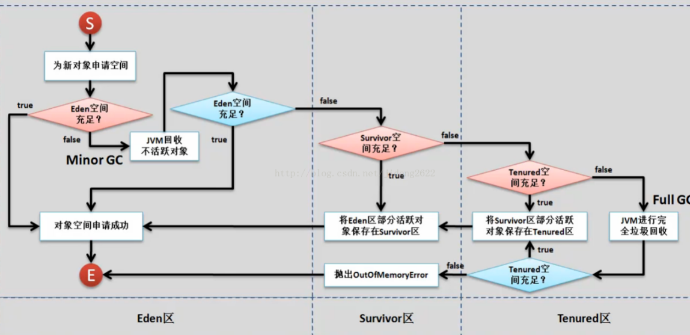

## 1 .平台无关性如何实现


javac 编译 生成字节码， JVM解析，转换成特定平台的执行指令


## 2  JVM如何加载.class文件


> ​	ClassLoader：依据特定格式，加载class文件到内存,然后交给jvm虚拟机进行链接，初始化等操作
>

> ​	 Execution Engine：对命令进行解析

​	

## 3 谈一谈Classloader

### 3.1 classloader的种类

- ​	BootStrapClassLoader：C++编写，加载核心库java.*


- ​	 ExtClassLoader：java编写，加载拓展库javax.*


- ​	 APPClassLoader：java编写，加载程序所在目录


- ​	 自定义ClassLoader：java编写，定制化加载


### 3.3 classloader 的双亲委派机制

> 当一个类加载器收到了类加载请求，他首先不会尝试自己去加载这个类，而是把这个请求委派给父类去完成，每一个层次类加载器都是如此，因此所有的加载请求都应该传送到启动类加载其中，只有当父类加载器反馈自己无法完成这个请求的时候（在它的加载路径下没有找到所需加载的Class），子类加载器才会尝试自己去加载。 


**为什么要使用双亲委培机制去加载类？**

​	避免一份字节码多次加载 

> 比如加载位于 rt.jar 包中的类 java.lang.Object，不管是哪个加载器加载这个类，最终都是委托给顶层的启动类加载器进行加载，这样就保证了使用不同的类加载器最终得到的都是同样一个 Object对象。 


## ４.谈一谈类的装载过程（Class对象的生成过程）


## ５LoadClass和ForName的区别

-  **Class.forName得到的class是已经初始化完成的**


-  **ClassLoder.LoadClass得到的class是还没有链接的** 


> spring ioc 资源加载器获取要加载的资源的时候，即读取一些资源的配置文件的时候 
>
> 需要classloader.Loadclass来加载，实现lazy loader 延迟加载
>
>  即加载类的时候不需要初始化，等到需要的时候才进行链接加载


## 6 垃圾回收



### 6.1 Minor GC 触发的条件


**一般是Eden区满时触发**


### 7.1 Full GC 触发的条件


- 执行System.gc()

>  此方法的调用是建议JVM进行Full GC,虽然只是建议而非一定,但很多情况下它会触发 Full GC 


- 老年代空间不足


-  通过Minor GC后进入老年代的平均大小大于老年代的可用内存 


-  由Eden区、From Space区向To Space区复制时，对象大小大于To Space可用内存，则把该对象转存到老年代，且老年代的可用内存小于该对象大小 


## 8、强、软、弱、虚引用

**强引用**使我们常见的普通对象引用，Object obj = new Object(),只要强引用指向一个对象，就表明这个对象还活着

> JVM垃圾回收对于强引用对象不会回收


**软引用**：相对强引用软化了一些引用需要java.lang.SoftReference来实现

​	对于软引用的对象来说

> 当系统内存充足时，不会被回收
>
> 当系统内存不足时，会被回收

```java
public class reference_soft {
    public static void main(String[] args) {
        Object o1 = new Object();
        SoftReference<Object> softReference = new SoftReference<>(o1);
        System.out.println(o1);
        System.out.println(softReference.get());
        o1 = null;
        System.gc();
        System.out.println(o1);
        System.out.println(softReference.get());
        //内存足够不会回收
        //java.lang.Object@1540e19d
        //java.lang.Object@1540e19d
        //null
        //java.lang.Object@1540e19d
    }
}
```


**弱引用**：java.lang.ref.WeakReference ，比软引用存活时间更短

> 只要有垃圾回收，弱引用一律内回收

```java
import java.lang.ref.WeakReference;

public class reference_weak {
    public static void main(String[] args) {
        Object o1 = new Object();
        WeakReference<Object> weakReference = new WeakReference<>(o1);
        System.out.println(o1);
        System.out.println(weakReference.get());
        o1 = null;
        System.gc();
        System.out.println(o1);
        System.out.println(weakReference.get());
        //发生GC即回收
        //java.lang.Object@1540e19d
        //java.lang.Object@1540e19d
        //null
        //null
    }
}
```

**软引用和弱引用的适用场景**


**虚引用**  需要java.lang.ref.PhantomReference 类来实现

> 如果一个对象仅仅持有虚引用，那么就和他没有任何引用一样，在任何时候都会被垃圾回收器回收
>
> 需要配合引用队列来使用

设置虚引用的唯一目的就是这个对象被垃圾回收器回收的时候收到一个系统通知或者后续 添加进一步的处理


**引用队列** 回收之前被引用队列保存一下

```java

import java.lang.ref.PhantomReference;
import java.lang.ref.ReferenceQueue;

public class reference_phantom {
    public static void main(String[] args) {
        Object o1 = new Object();
        ReferenceQueue<Object> queue = new ReferenceQueue<>();
        PhantomReference<Object> phantomReference = new PhantomReference<>(o1, queue);

        System.out.println(o1); //java.lang.Object@1540e19d
        System.out.println(phantomReference.get()); //null
        System.out.println(queue.poll());//null
        o1 = null;
        System.gc();
        System.out.println(o1);//null
        System.out.println(phantomReference.get());//null
        System.out.println(queue.poll());//java.lang.ref.PhantomReference@677327b6

    }
}
```

**总结**


## 9 volatile

### 9.1 说说你对volatile关键字的理解

> 保证可见性和顺序性。Java把处理器的多级缓存抽象为JMM，即线程私有的工作内存和线程公有的主内存，每个线程从主内存拷贝所需数据到自己的工作内存。volatile的作用就是当线程修改被volatile修饰的变量时，要立即写入到主内存，当线程读取被volatile修饰的变量时，要立即到主内存中去读取，保证了可见性。禁止指令重排来保证顺序性。 

被volatile 修饰的共享变量就会有以下两点特性

1. **保证了不同线程对该变量修改的内存可见性**
2. **禁止指令重排**
3. 不保证原子性


### 9.2 能不能详细说下什么是内存可见性，什么又是重排序呢？

​	 JMM规定所有变量都是存在主存中的，每个线程又包含自己的工作内存 ，各个线程对主内存中共享变量的操作都是各个线程各自拷贝到自己的工作内存, 操作后再写回主内存中的.


**内存可见性** 一个线程修改了共享变量的值，其他线程也能看到最新修改的值 。 

**重排序**： 执行任务的时候，为了提高编译器和处理器的执行性能，编译器和处理器(包括内存系统，内存在行为没有重排但是存储的时候是有变化的)会对指令重排序


### 9.3  Volatile为什么不保证原子性

>  <u>java中只有对基本类型变量的赋值和读取是原子操作</u>，如i = 1的赋值操作，
>
> 但是像j = i或者i++这样的操作都不是原子操作，
>
> 因为他们都进行了多次原子操作，比如先读取i的值，再将i的值赋值给j，两个原子操作加起来就不是原子操作 

所以一个被volatile 修饰的变量在进行自增操作的时候其实是分为3步的

（1）首先执行getfiled获得原始值

（2）然后iadd进行加1操作

（3）执行putfile把累加后的值写回


###  9.4 Volatile怎么对变量操作保证原子性 

使用java.util.concurrent.atomic类中的原子包装类

atomicInteger();


## 10 什么情况下回爆出OOM ，堆栈什么时候会爆出

栈：递归太深的时候就会出现OOM

堆：堆空间太小的时候，会出现OOM XMS/XMX来调整堆内存空间大小


## 11、 当一个线程爆出OOM之后，其他线程和进程的状态 


其他线程还能够正常运行

当一个线程爆出OOM时，它所占据的内存资源会全部被释放掉，从而不会影响其他线程的运行！

 

## 12、 可以作为GCRoot的对象

- 栈帧中的 本地变量表所引用的对象
- 方法区中类静态属性所引用的对象
- 方法区中常量所引用的对象
- 本地方法栈中所引用的对象