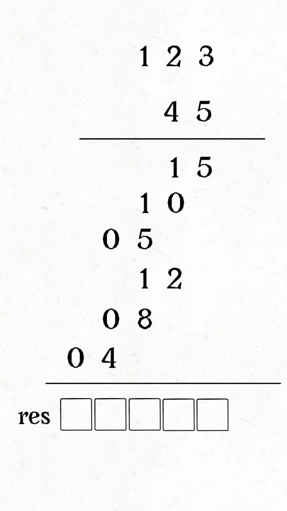
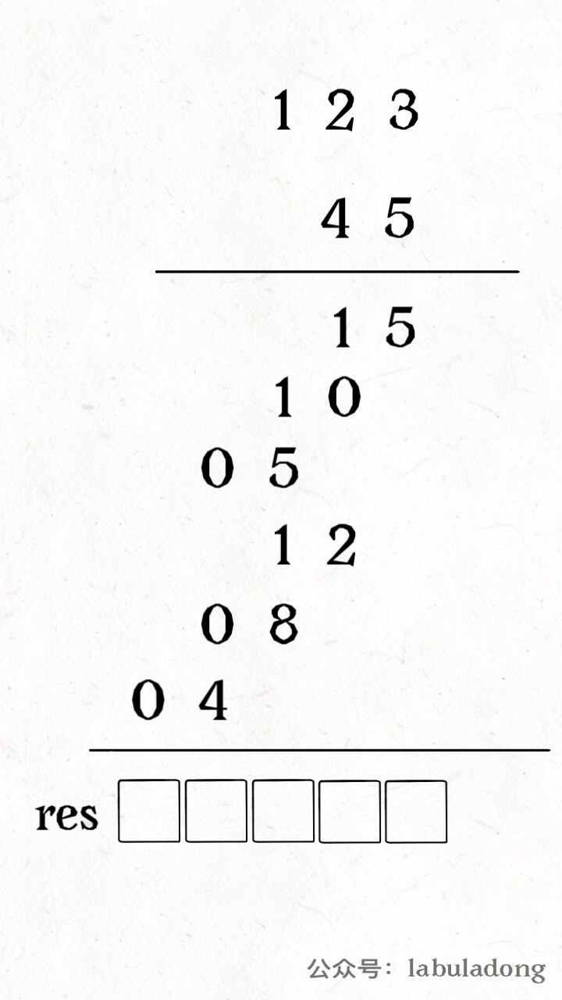
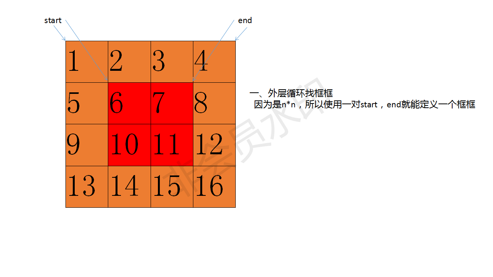
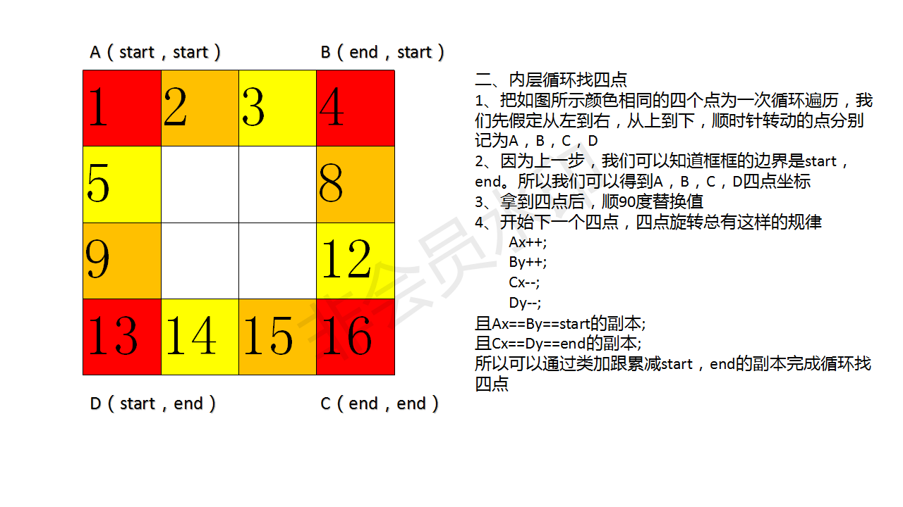
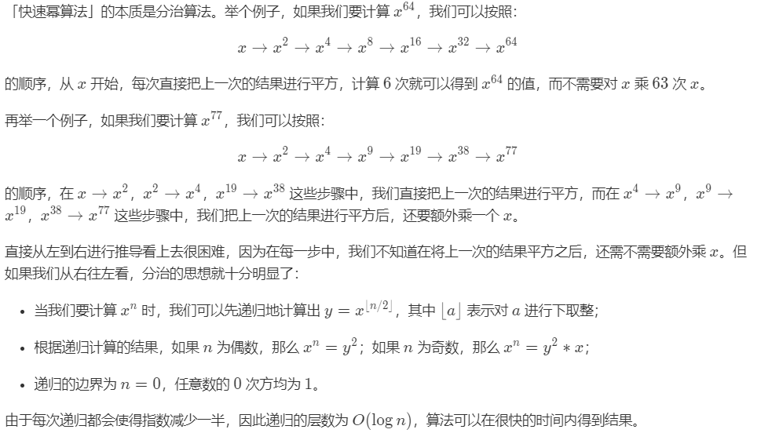

## 3、无重复字符的最长字

### 1、使用滑动窗口

> 思路：
>
> 滑动窗口

**使用HashSet作为滑动窗口实现**

```java
	//使用set的滑动窗口实现
    public static int lengthOfLongestSubstring_1(String s) {
        int n = s.length();
        Set<Character> set = new HashSet<>();
        int i = 0,j=0,res =0;
        while(i<n&&j<n){
            if(!set.contains(s.charAt(j))){
                set.add(s.charAt(j++));
                res = res>(j-i)?res:(j-i);
            }else{
                set.remove(s.charAt(i++));
            }
        }
        return res;
    }
```

**优化**

```java
	public static int lengthOfLongestSubstring(String s) {
        int n = s.length();
        Map<Character,Integer> map = new HashMap<>();
        int i=0,j=0,max = 0;
        while(j<n){
            if(map.containsKey(s.charAt(j))){
                i = Math.max(map.get(s.charAt(j))+1,i); // 跳过
            }
            max = Math.max(max,j-i+1);
            map.put(s.charAt(j),j);
            j++;
        }
        return max;
    }
```


## 5、最长回文子串

### 1、暴力法

> 思路，找出所有子串，最后判断最长回文子串

```java
	public String longestPalindrome_1(String s) {
        String ans = "";
        int max = 0;
        for (int i = 0; i < s.length(); i++) {
            for (int j = i+1; j <= s.length(); j++) {
                String test = s.substring(i,j);
                if(test.length()>max&&isPalindrome(test)){
                    ans = test;
                    max = Math.max(max,ans.length());
                }
            }
        }
        return ans;
    }

    public boolean isPalindrome(String s){
        for (int i = 0; i < s.length()/2; i++) {
            if(s.charAt(i)!=s.charAt(s.length()-1-i)){
                return false;
            }
        }
        return true;
    }
```

### 2、动态规划

> 我们用一个 `boolean dp[l][r]` 表示字符串从 i 到 j 这段是否为回文。试想如果 `dp[l+1][r-1]=true`，我们要判断 `dp[l][r] `是否为回文。只需要判断字符串在(l)和（r)两个位置是否为相同的字符，是不是减少了很多重复计算。
>
>  状态转移方程，`dp[l+1][r-1]=true` 并且(`l`)和（`r`)两个位置为相同的字符，此时 `dp[l][r]=true`。 
>
> 其中，`r-l<3`的作用就是初始化，因为  `[l+1,r-1]`达成区间的最小条件是
>
> `r-1-(l+1) +1> =2`   即`r-l>=3`才能构成区间  `r-l<3`是无法构成区间的,即也就是初始化的过程

```java
	public String longestPalindrome(String s) {
        if(s == null || s.length()<2) return s;
        int len = s.length();
        int maxLen = 1;
        int maxStart = 0;
        int maxEnd = 0;
        boolean[][] dp = new boolean[len][len];
        for (int r = 1; r < len; r++) {
            for (int l = 0; l < r; l++) {
                if(s.charAt(l)==s.charAt(r)&&(r-l<=2||dp[l+1][r-1])){
                    dp[l][r] = true;
                    if(r-l+1>maxLen){
                        maxStart = l;
                        maxEnd = r;
                        maxLen =  r-l+1;
                    }
                }
            }
        }
        return s.substring(maxStart,maxEnd+1);
    }
```

### 3、中心扩散法

```java
	public String longestPalindrome_2(String s) {
        if(s == null || s.length() == 0) return "";
        int strLen = s.length();
        int left,right;
        int maxLen = 0;
        int maxStart = 0;
        int len = 1;
        for (int i = 0; i < strLen; i++) {
            left = i-1;
            right = i+1;
            while(left>=0 && s.charAt(left) == s.charAt(i)){
                left--;
                len++;
            }
            while(right<strLen&&s.charAt(right) == s.charAt(i)){
                right++;
                len++;
            }
            while(left>=0&&right<strLen&&s.charAt(left) == s.charAt(right)){
                left--;
                right++;
                len +=2;
            }
            if(len >maxLen){
                maxLen = len;
                maxStart = left;
            }
            len = 1;
        }
        return s.substring(maxStart+1,maxStart+maxLen+1);
    }
```


## 6、Z字型变化

> 思路：
>
> 设置一个flag标签 ，判断是向上走还是向下走

**代码**

```java
	public String convert(String s, int numRows) {
        if(numRows<=2) return s;
        List<StringBuilder> list = new ArrayList<>();
        for (int i = 0; i < numRows; i++) list.add(new StringBuilder());
        int flag = -1;
        int i = 0;
        for (char c : s.toCharArray()) {
            list.get(i).append(c);
            if(i== 0 || i == numRows-1) flag = -flag;
            i+=flag;
        }
        for (int j = 1; j < numRows; j++) {
            list.get(0).append(list.get(j));
        }
        return list.get(0).toString();
    }
```


## 7、整数反转

> 需要考虑的就是整数反转之后的溢出，溢出的话就需要返回-1

**代码**

```java
	public int reverse(int x) {
        int res = 0;
        while(x!=0){
            int pop = x%10;
            x /=10;
            if(res>Integer.MAX_VALUE/10||(res==Integer.MAX_VALUE/10&&pop>7)) return 0; //判断是否溢出
            if(res<Integer.MIN_VALUE/10||(res==Integer.MIN_VALUE/10&&pop<-8)) return 0; // 判断是否需溢出
            res = res*10 +pop;
        }
        return res;
    }
```


## 8、字符串转整数

> 对数的考察一般的溢出处理上面
>
> 本题用一个limit 来表示溢出，如果字符串为负数那么limit为Integer.MIN_VALUE 如果为正数为-Integer.MAX_VALUE
>
> 溢出条件为 ans<(limit+digit)/10

**代码**

```java
	public int myAtoi(String str) {   
        char[] strChar = str.trim().toCharArray();
        if(strChar.length==0) return 0;
        int idx = 0;
        boolean negative = false;
        if(strChar[idx]=='-'){
            idx++;
            negative = true;
        }else  if(strChar[idx] == '+'){
            idx++;
        }else if(!Character.isDigit(strChar[idx])){
            return 0;
        }
        int ans = 0;
        //用负数保存正负数的边界，这样不会溢出
        //正数 -2147483647
        //负数 -2147483648
        int limit = negative?Integer.MIN_VALUE:-Integer.MAX_VALUE; 
        while(idx<strChar.length && Character.isDigit(strChar[idx])){
            int digit = strChar[idx] - '0';
            if(ans<(limit+digit)/10){  //溢出处理
                return negative?Integer.MIN_VALUE:Integer.MAX_VALUE;
            }
            ans = ans*10 -digit; //用减法；
            idx++;
        }
        return negative?ans:-ans; // 也要反过来
    }
```


## 9、回文数

> 不转化成字符串来实现

**代码**

```java
	//判断一个数字是否是回文数
    public boolean isPalindrome(int x) {
        //如果是负数不是
        //如果是10的倍数不是
        if(x<0||(x%10==0&&x!=0)) return false;
        //逆转一半，来判断逆转的这一半和另外一般是否相同
        int reverseNumber = 0;
        while(x>reverseNumber){
            reverseNumber = reverseNumber*10 + x%10;
            x/=10;
        }
        return x==reverseNumber || reverseNumber/10==x;
     }
```


## 11、盛水最多的容器

### 1、双指针法

> 思路：
>
> 在每一个状态下，无论长板或短板收窄 1 格，都会导致水槽 底边宽度 -1：
>
> 若向内移动短板，水槽的短板 min(h[i], h[j]) 可能变大，因此水槽面积 S(i, j)S 可能增大。
>
> 若向内移动长板，水槽的短板 min(h[i], h[j]) 不变或变小，下个水槽的面积一定小于当前水在每一个状态下，无论长板或短板收窄 1 格，都会导致水槽 底边宽度 -1：槽面积

```java
	public int maxArea(int[] height) {
        if(height.length==0) return 0;
        int i = 0;
        int j = height.length-1;
        int res = (j-i)*Math.min(height[i],height[j]);
        while(i<j){
            if (height[i] < height[j]) {
                i++;
            } else {
                j--;
            }
            res = Math.max(res,Math.min(height[i],height[j])*(j-i));
        }
        return res;
    }
```


## 14、最长公共前缀

**代码**

```java
public String longestCommonPrefix(String[] strs) {
        if(strs == null ||strs.length == 0)return "";
        for (int i = 0; i < strs[0].length(); i++) {
            char c = strs[0].charAt(i);
            for (int j = 1; j < strs.length; j++) {
                if(i == strs[j].length() || c!=strs[j].charAt(i)){
                    return strs[0].substring(0,i);
                }
            }
        }
        return strs[0];
    }
```


## 15、三数之和

### 1、双指针法

> 1 首先对数组进行排序，排序后固定一个数 nums[i]，再使用左右指针指向 nums[i]后面的两端，
>    数字分别为 nums[L] 和 nums[R]，计算三个数的和 sum ，判断是否满足为 0，满足则添加进结果集
> 2 如果 nums[i]大于 0，则三数之和必然无法等于 0，结束循环
> 3 nums[i] == nums[i-1] 结果重复
> 4 当sum == 0 ，nums[L] == nums[L+1] 结果重复跳过
> 5 当sum == 0 ，nums[R] == nums[R--] 结果重复跳过、

```java
public List<List<Integer>> threeSum(int[] nums) {
        List<List<Integer>> res = new ArrayList<>();
        int len = nums.length;
        if(nums == null || len<3) return res;
        Arrays.sort(nums);
        for(int i = 0;i<len;i++){
            if(nums[i]>0) break;
            if(i>0 && nums[i]==nums[i-1]) continue;
            int L = i+1;
            int R = len -1;
            while(L<R){
                int sum = nums[i]+nums[L]+nums[R];
                if(sum==0){
                    res.add(Arrays.asList(nums[i],nums[L],nums[R]));
                    while (L<R && nums[L] == nums[L+1]) L++;
                    while (L<R && nums[R] == nums[R-1]) R--;
                    L++;
                    R--;
                }else if(sum>0){
                    R--;
                }else{
                    L++;
                }
                
            }
        }
        return res;
        
    }
```


## 16、最接近的三数之和

### 1、双指针法

> 思路：
>
> 双指针法

```java
public int threeSumClosest(int[] nums, int target) {
        if(nums==null|| nums.length==0) return 0;
        Arrays.sort(nums);
        int closest = nums[0]+nums[1]+nums[2];
        int len = nums.length;
        for (int i = 0; i < len; i++) {
            int left = i+1;
            int right = len-1;
            while(left<right){
                int sum = nums[i]+ nums[left] +nums[right];
                if(Math.abs(target-sum) < Math.abs(target - closest)){
                    closest = sum;
                }
                if(sum>target){
                    right--;
                }else if(sum<target){
                    left++;
                }else{
                    return closest;
                }
            }
        }
        return closest;
    }
```

## 20、有效的括号

> 使用栈来解决

**代码**

```java
	public boolean isValid(String s) {
        Map<Character,Character> map = new HashMap<>();
        map.put(')','(');
        map.put(']','[');
        map.put('}','{');
        Stack<Character> stack = new Stack<>();
        for (int i = 0; i < s.length(); i++) {
            char c = s.charAt(i);
            if(map.containsKey(c)){
                char pop = stack.isEmpty() ? '#' : stack.pop();
                if(pop!=map.get(c)){
                    return false;
                }
            }else {
                stack.push(c);
            }
        }
        return stack.isEmpty();
    }
```


## 21、有序链表的合并

### 1、递归

```java
	public ListNode mergeTwoLists_1(ListNode l1, ListNode l2) {
        if(l1==null){
            return l2;
        }else if(l2==null){
            return l1;
        }else if(l1.val<l2.val){
            l1.next = mergeTwoLists_1(l1.next,l2);
            return l1;
        }else{
            l2.next = mergeTwoLists_1(l1,l2.next);
            return l2;
        }
    }
```

### 2、迭代

```java
	public ListNode mergeTwoLists(ListNode l1, ListNode l2) {
        ListNode res = new ListNode(0);
        ListNode p = res,q1 = l1 ,q2 = l2;
        while(q1!=null&&q2!=null){
            if(q1.val<q2.val){
                p.next = q1;
                q1 = q1.next;
            }else{
                p.next = q2;
                q2 = q2.next;
            }
            p = p.next;
        }
        if(q1!=null){
            p.next = q1;
        }
        if(q2!=null){
            p.next = q2;
        }
        return res.next;
    }
```


## 22、括号生成 

### 1 、DFS(回溯解法)


> 分析：
>
> 1 当前左右括号都有大于 0 个可以使用的时候，才产生分支；
>
> 2 产生左分支的时候，只看当前是否还有左括号可以使用；
>
> 3 产生右分支的时候，还受到左分支的限制，右边剩余可以使用的括号数量一定得在严格大于左边剩余的数量的时候，才可以产生分支；
>
> 4 在左边和右边剩余的括号数都等于 0 的时候结算。

**参考代码**

```java
	public List<String> generateParenthesis(int n) {
        List<String> res = new ArrayList<>();
        if(n==0){
            return res;
        }
        dfs("",n,n,res);
        return res;
    }
    private void dfs(String s, int left, int right, List<String> res) {
        // 因为每一次尝试，都使用新的字符串变量，所以无需回溯
        // 在递归终止的时候，直接把它添加到结果集即可
        if(left== 0&& right == 0){
            res.add(s);
            return;
        }
        if(left>right){ // 右边的使用多于左边的时候发生剪枝
            return;
        }
        if(left>0){
            dfs(s+"(",left-1,right,res);
        }
        if(right>0){
            dfs(s+")",left,right-1,res);
        }
    }
```


### 2 、广度优先遍历（层次遍历）

> 使用类似二叉树的层次遍历 ，把不需要的结果进行剪枝

```java
	class Node{
        private String res; // 拼接成的字符串
        private int left;   // 左括号剩下的数目
        private int right;  // 右括号剩下的数目

        public Node(String res, int left, int right) {
            this.res = res;
            this.left = left;
            this.right = right;
        }
    }
    public List<String> generateParenthesis_1(int n) {
        List<String> res = new ArrayList<>();
        if(n==0){
            return res;
        }
        Queue<Node> queue = new LinkedList<>();
        queue.offer(new Node("",n,n));
        while(!queue.isEmpty()){
            Node node = queue.poll();
            if(node.left==0&&node.right==0){
                res.add(node.res);
            }
            if(node.left>0){
                queue.offer(new Node(node.res+"(",node.left-1,node.right));
            }
            if(node.right>0 && node.left < node.right){ //不符合条件的被剪枝
                queue.offer(new Node(node.res+")",node.left,node.right-1));
            }
        }
        return res;
    }
```


## 23、合并K个排序链表 


### 1、使用优先队列

>  时间复杂度：O(n*log(k))*O*(*n*∗*l**o**g*(*k*))，`n` 是所有链表中元素的总和，`k` 是链表个数。 

```java
	public ListNode mergeKLists(ListNode[] lists) {
        if (lists.length == 0) return null;
        ListNode head = new ListNode(0);
        ListNode curr = head;
        PriorityQueue<ListNode> pqueue = new PriorityQueue<ListNode>((o1, o2) -> o1.val - o2.val);
        for (ListNode list : lists) { //先把头结点放入优先队列中
            if(list!=null){
                pqueue.add(list);
            }
        }
        while(!pqueue.isEmpty()){ 
            ListNode node = pqueue.poll();
            curr.next = node;
            curr = curr.next;
            if(node.next!=null){  //放入下一个节点
                pqueue.add(node.next);
            }
        }
        return head.next;
    }
```


### 2、使用分治大法

> 分而治之
>
> 链表两两合并


```java
	public ListNode mergeKLists_1(ListNode[] lists) {
        if(lists.length ==0) return null;
        int step = 1; // 设置初试步长
        while (step<lists.length){
            for (int i = 0; i < lists.length; i+=step*2) {
                if(i+step>lists.length-1){
                    lists[i] =  mergeTwoLists(lists[i],null);
                }else{
                    lists[i] =  mergeTwoLists(lists[i],lists[i+step]); //两两合并
                }
            }
            step *= 2;//更新步长
        }
        return lists[0];
    }
	//两个有序链表的合并
    public ListNode mergeTwoLists(ListNode l,ListNode r){
        if(l == null && r == null) return null;
        ListNode head = new ListNode(0);
        ListNode next = head;
        while (l!=null && r!=null){
            if(l.val<r.val){
                next.next = l;
                l = l.next;
            }else {
                next.next = r;
                r = r.next;
            }
            next = next.next;
        }
        if(l!=null){
            next.next =l;
        }
        if(r!=null){
            next.next = r;
        }
        return head.next;
    }
```


## 24、两两交换链表中的节点


```java
public ListNode swapPairs(ListNode head) {
        if(head == null ) return null;
        ListNode res = new ListNode(0);
        res.next =  head;
        ListNode pre  = res;
        ListNode p  = head;
        while(p!=null && p.next!=null){
            ListNode temp = p.next;
            pre.next = temp;
            p.next = temp.next;
            temp.next = p;
            pre = p;
            p = p.next;
        }
        return res.next;
    }
```


## 26、删除排序数组中的重复项

> 使用双指针法

```java
	public int removeDuplicates(int[] nums) {
        if(nums.length==1) return 1;
        int i = 0,j =1;
        while(j<nums.length){
            if(nums[i] != nums[j]){
                if(j-i > 1){ // 等于就跳过
                    nums[i + 1] = nums[j];
                }
                i++;
            }
            j++;
        }
        return i+1;
    }
```


## 29、两数相除

> 思路：看div函数

```java
public int divide(int dividend, int divisor) {
        if(divisor == -1 && dividend == Integer.MIN_VALUE) return Integer.MAX_VALUE;
        int sign = 1;
        if((dividend<0&&divisor>0)||(dividend>0&&divisor<0)){
            sign = -1;
        }
        if(divisor == 1) return dividend;
        if(divisor == -1){
            if(dividend>Integer.MIN_VALUE)  return -dividend;
            return Integer.MAX_VALUE;
        }
        long a = dividend;
        long b = divisor;
        a = a>0?a:-a;
        b = b>0?b:-b;
        long res = div(a,b);
        if(sign >0) return res>Integer.MAX_VALUE?Integer.MAX_VALUE: (int) res;
        return (int) -res;
    }

    private long div(long a, long b) {
        if(a<b) return 0;
        long tb  =  b;
        long count = 1;
        while((tb+tb <=a)){
            count+=count;
            tb+=tb;
        }
        return count+div(a-tb,b);
    }
```


## 32、最长有效括号

### 1、栈

```java
	public int longestValidParentheses(String s) {
        if(s==null ||s.length()<2) return 0 ;
        Stack<Integer> stack = new Stack<>();
        int max = 0;
        stack.add(-1);
        for (int i = 0; i < s.length(); i++) {
            if(s.charAt(i)=='('){
                stack.push(i);
            }else{
                stack.pop();
                if(stack.isEmpty()){
                    stack.push(i);
                }else{
                    max = max>(i-stack.peek())?max:(i-stack.peek());
                }
            }
        }
        return max;
    }
```


## 33、搜索旋转排序数组

### 1、二分法

> 对于这个题要分两种情况
>
> 1、如果 `nums[l]`<=`nums[mid]` 就说明数组前半部分L~mid部分是有序的，然后就可以分两种情况来搜索，前半部分有序的和后部分无序的
>
> 2、如果`nums[l]`>`nums[mid]`  就说明数组后半部分mid~R部分是有序的，依然可以分两种情况搜索，后半部分有序和前半部分无序 

**代码**

```java
	public int search(int[] nums, int target) {
        int l = 0,r = nums.length-1;
        while(l<=r){
            int mid = (l+r)>>1;
            if(nums[mid] == target) return mid;
            if(nums[l]<=nums[mid]){   //说明前半部分是有序的
                if(target>=nums[l]&&target<nums[mid]){
                    r = mid-1;
                }else{
                    l = mid+1;
                }
            }else{                    // 说明后半部分是有序的
                if(target>nums[mid]&&target<=nums[r]){
                    l = mid +1;
                }else{
                    r = mid -1;
                }
            }
        }
        return -1;
    }
```


## 34、在排序数组中查找元素的第一个和最后一个位置

### 1、二分法

**代码**

```java
	public int[] searchRange(int[] nums, int target) {
        int l = 0,r = nums.length-1;
        while(l<=r){
            int mid = (l+r)>>1;
            if(nums[mid] == target){
                l = mid;
                r = mid;
                while(l>=0&&nums[l]==target) l--;
                while(r<nums.length&&nums[r]==target) r++;
                return new int[]{l+1,r-1};
            }else if(nums[mid]>target){
                r = mid-1;
            }else{
                l = mid+1;
            }
        }
        return new int[]{-1,-1};
    }
```


## 36、有效数独

```java
public boolean isValidSudoku(char[][] board) {
        HashMap<Integer,Integer> [] rows = new HashMap[9];
        HashMap<Integer,Integer> [] cols = new HashMap[9];
        HashMap<Integer,Integer> [] box = new HashMap[9];
        for (int i = 0; i < 9; i++) {
            rows[i]  = new HashMap<>();
            cols[i] = new HashMap<>();
            box[i] = new HashMap<>();
        }
        for (int i = 0; i < 9; i++) {
            for (int j = 0; j < 9; j++) {
                if(board[i][j] != '.'){
                    int n = board[i][j]-'0';
                    int box_index = (i/3)*3+j/3;
                    rows[i].put(n,rows[i].getOrDefault(n,0)+1);
                    cols[j].put(n,cols[j].getOrDefault(n,0)+1);
                    box[box_index].put(n,box[box_index].getOrDefault(n,0)+1);
                    if(rows[i].get(n) >1 || cols[j].get(n)>1 || box[box_index].get(n) >1) return false;
                }
            }
        }
        return true;
    }
```

## 38、外观数列

```java
	public String countAndSay(int n) {
        StringBuilder s = new StringBuilder();
        int pl = 0;
        int cur = 1;
        if(n==1) return  "1";
        String str = countAndSay(n-1);
        for (cur = 1; cur < str.length(); cur++) {
            if(str.charAt(pl)!=str.charAt(cur)){
                int count = cur - pl;
                s.append(count).append(str.charAt(pl));
                pl = cur;
            }
        }
        if(pl!=cur){
            int count = cur - pl;
            s.append(count).append(str.charAt(pl));
        }
        return s.toString();
    }
```

## 41、缺少的第一个正数

> 思路:由于本题有空间复杂度o(1)时间复杂度o(n)的要求
>
> 所以第一种思路hash表不满足
>
> 但是我们可以用数组交换来实现数组hash

```java
	public int firstMissingPositive(int[] nums) {
        int len = nums.length;
        for (int i = 0; i < len; i++) { //数组交换的一个过程
            while(nums[i]>0 && nums[i]<=len&&nums[nums[i]-1]!=nums[i]){
                swap(nums,nums[i]-1,i);
            }
        }
        for (int i = 0; i < len; i++) {
            if(nums[i]!=i+1){
                return i+1;
            }
        }
        return len+1;
    }

    private void swap(int[] nums, int idx1, int idx2) {
        int temp = nums[idx1];
        nums[idx1] = nums[idx2];
        nums[idx2] = temp;
    }
```


## 42、接雨水

### 1、按列求

> 思路：
>
> "+每一列上的雨水量"
>
> 找到从该列到右边的最大值 maxLeft
>
> 找到从该列到左面的最大值 maxRight
>
> 然后比较，找出较小的那一个min =  Math.min(maxLeft ,maxRight)
>
> 比较nums[i]和min
>
> if(nums[i]>=min) 那么这一列的雨水为0
>
> if(nums[i]<min) 那么雨水数等于 min - nums[i]
>
> **时间复杂度： O（N²）** **空间复杂度：O（1）**

**代码**

```JAVA
	public int trap(int[] height) {
        if(height.length<3) return 0;
        int sum = 0;
        for (int i = 1; i < height.length-1; i++) {
            int maxLeft = 0;
            for (int j = i - 1; j >= 0; j--) {  //找到从左边走最大的
                if(height[j]>maxLeft){
                    maxLeft = height[j];
                }
            }
            int maxRight = 0;
            for (int j = i+1; j < height.length; j++) {
                if(height[j]>maxRight){  //找到从右边走最大的
                    maxRight = height[j];
                }
            }
            int min = Math.min(maxLeft,maxRight);  
            if(min >height[i]){
                sum = sum +(min - height[i]);
            }
        }
        return sum;
    }
```


### 2、动态规划

> 思路：
>
> 动态规划，空间换时间
>
> 定义两个数组 maxLeft[len] 和maxRight[len] 
>
> 把每个数的左边最大和右边最大分别存在数组中
>
> maxLeft[i] = Math.max(maxLeft[i-1],height[i-1]);  // 缓存当前值的右边的最大值
>
> maxRight[i] = Math.max(maxRight[i-1],height[i+1]); //缓存当前值左边的最大的值
>
> **时间复杂度O(N) 空间复杂度O(N)**

**代码**

```java
	public int trap(int[] height) {
        if(height.length<3) return 0;
        int sum = 0;
        int [] maxLeft = new int[height.length];
        int [] maxRight = new int[height.length];
        for (int i = 1; i < height.length - 1; i++) {
            maxLeft[i] = Math.max(maxLeft[i-1],height[i-1]);
        }
        for (int i = height.length-2; i >0; i--) {
            maxRight[i] = Math.max(maxRight[i-1],height[i+1]);
        }
        for (int i = 1; i < height.length - 1; i++) {
            int min = Math.min(maxLeft[i],maxRight[i]);
            if(height[i]<min){
                sum = sum + (min - height[i]);
            }
        }
        return sum;
    }
```

### 3、双指针法

> 思路：
>
> 对动态规划的空间进行优化
>
>  只要保证 `height [ left - 1 ] < height [ right + 1 ]` ，那么 `max_left` 就一定小于 `max_right` 
>
> **时间复杂度O(n) 空间复杂度O(1)**

**代码**

```java
	public int trap(int[] height) {
        if(height.length<3) return 0;
        int sum = 0;
        int maxLeft = 0;
        int maxRight = 0;
        int left = 1;
        int right = height.length-2;
        for (int i = 1; i < height.length - 1; i++) {
            if(height[left-1]<height[right+1]){ //从左向右
                maxLeft = Math.max(maxLeft,height[left-1]);
                if(maxLeft>height[left]){
                    sum = sum+(maxLeft-height[left]);
                }
                left++;
            }else{ //从右向左
                maxRight = Math.max(maxRight,height[right+1]);
                if(maxRight>height[right]){
                    sum = sum + (maxRight-height[right]);
                }
                right--;
            }
        }
        return sum;
    }
```


## 43、字符串相乘

> 思路，简单化



进一步



**代码**

```java
//字符串相乘
    public String multiply(String num1, String num2) {
        int n1 = num1.length();
        int n2 = num2.length();
        int [] res = new int[n1+n2];
        for (int i = n1-1; i >= 0; i--) {
            for (int j = n2-1; j >= 0; j--) {
                //还要加上进位位
                int mul = (num1.charAt(i)-'0')*(num2.charAt(j)-'0')+res[i+j+1];
                //叠加
                res[i+j+1] = mul%10;
                res[i+j] += mul/10;  //+++不要忘了
            }
        }
        int idx= 0;
        StringBuilder ans = new StringBuilder();
        while(idx<res.length&&res[idx]==0) idx++;
        while(idx<res.length) ans.append(res[idx++]);
        return ans.length()==0?"0":ans.toString();
    }
```

## 44、通配符匹配

### 1、动态规划

```java
public boolean isMatch(String s, String p) {
        int m = s.length();
        int n = p.length();
        boolean [][] dp = new boolean[m+1][n+1];
        dp[0][0] = true; //两个空字符串肯定为true
        for (int i = 1; i <= n; i++) {
            dp[0][i] = dp[0][i-1] && p.charAt(i-1) == '*'; //s为空 但是p为*
        }
        for (int i = 1; i <= m; i++) {
            for (int j = 1; j <= n; j++) {
                if(s.charAt(i-1) == p.charAt(j-1) || p.charAt(j-1) == '?'){
                    dp[i][j] = dp[i-1][j-1];
                }else if(p.charAt(j-1) == '*'){
                    dp[i][j]= dp[i-1][j] || dp[i][j-1];
                    //dp[i-1][j]表示的是abc ab*
                    //dp[i][j-1]表示的是ab ab*
                }
            }
        }
        return dp[m][n];
    }
```


## 45、跳跃游戏II

**思路**

> 1、如果某一个作为 起跳点 的格子可以跳跃的距离是 3，那么表示后面 3 个格子都可以作为 起跳点。
>
> 11. 可以对每一个能作为 起跳点 的格子都尝试跳一次，把 能跳到最远的距离 不断更新。
>
> 2、如果从这个 起跳点 起跳叫做第 1 次 跳跃，那么从后面 3 个格子起跳 都 可以叫做第 2 次 跳跃。
>
> 3、所以，当一次 跳跃 结束时，从下一个格子开始，到现在 能跳到最远的距离，都 是下一次 跳跃 的 起跳点。
>
> 31. 对每一次 跳跃 用 for 循环来模拟。
> 32. 跳完一次之后，更新下一次 起跳点 的范围。
> 33. 在新的范围内跳，更新 能跳到最远的距离。
>
> 4、记录 跳跃 次数，如果跳到了终点，就得到了结果。


```java
	public int jump(int[] nums) {
        int ans = 0;
        int start = 0;
        int end = 1;
        while(end<nums.length){
            int maxPos = 0;
            for (int i = start; i < end; i++) {
                maxPos = Math.max(maxPos,nums[i]+i);
            }
            start = end;
            end = maxPos+1;
            ans++;
        }
        return ans;
    }
```

**优化**

```java
 	public int jump(int[] nums) {
        int ans = 0;
        int maxPos= 0 ;
        int end = 0;
        for (int i = 0; i < nums.length - 1; i++) {
            maxPos = Math.max(maxPos,i+nums[i]);
            if(i==end){
                ans++;
                end = maxPos;
            }
        }
        return ans;
    }
```


## 46、全排列

### 1、回溯法

```java
List<List<Integer>> res = new LinkedList<>();
    public List<List<Integer>> permute(int[] nums) {
        LinkedList<Integer> track = new LinkedList<>();
        dfs(nums,track);
        return res;
    }

    private void dfs(int[] nums, LinkedList<Integer> track) {
        if(track.size() == nums.length){
            res.add(new LinkedList<>(track));
            return ;
        }
        for (int i = 0; i < nums.length; i++) {
            if(track.contains(nums[i])) continue; //排除重复选择
            track.add(nums[i]); //做选择
            dfs(nums,track);    //进入下一层决策树
            track.removeLast(); //撤销选择
        }
    }
```


## 47、全排列II

### 1、回溯法


**代码**

```java
	List<List<Integer>> res = new LinkedList<>();
    public List<List<Integer>> permuteUnique(int[] nums) {
        if(nums.length == 0 )return res;
        Arrays.sort(nums);    //排序
        LinkedList<Integer> track = new LinkedList<>();
        boolean[] used = new boolean[nums.length];
        dfs(nums,track,used);
        return res;
    }

    private void dfs(int[] nums, LinkedList<Integer> track,boolean[] used) {
        if(nums.length == track.size()){
            res.add(new LinkedList<>(track));
            return;
        }
        for (int i = 0; i < nums.length; i++) {
            if(used[i]) continue;
            if(i>0&&nums[i] == nums[i-1]&&!used[i-1]) continue;  //剪枝
            track.add(nums[i]);
            used[i] = true;
            dfs(nums,track,used);
            used[i] = false;
            track.removeLast();
        }
    }
```


## 48、旋转图像





```java
public void rotate(int[][] matrix) {
        int temp;
        for(int start = 0,end = matrix[0].length-1;start<end;start++,end--){
            for(int s = start,e = end ;s<end ;s++,e--){
                temp =  matrix[start][s];
                matrix[start][s] = matrix[e][start];
                matrix[e][start] = matrix[end][e];
                matrix[end][e] = matrix[s][end];
                matrix[s][end] = temp;
            }
        }
    }
```

## 49、字母异位分组

### 1、排序

```java
public List<List<String>> groupAnagrams_1(String[] strs) {
        Map<String,List<String>> map = new HashMap<>();
        for (int i = 0; i < strs.length; i++) {
            char[] strchars = strs[i].toCharArray();
            Arrays.sort(strchars);
            String s = String.valueOf(strchars);
            if(map.containsKey(s)){
                map.get(s).add(strs[i]);
            }else{
                List<String> list = new ArrayList<>();
                list.add(strs[i]);
                map.put(s,list);
            }
        }
        return new ArrayList<>(map.values());
    }
```

### 2、质数乘积

```java
public List<List<String>> groupAnagrams(String[] strs) {
        int[] prime = { 2, 3, 5, 7, 11, 13, 17, 19, 23, 29, 31, 41, 43, 47, 53, 59, 61, 67, 71, 73, 79, 83, 89, 97, 101, 103 };
        Map<Integer,List<String>> map = new HashMap<>();
        for (int i = 0; i < strs.length; i++) {
            int number = 1;
            for (int j = 0; j < strs[i].length(); j++) {
                number *= prime[strs[i].charAt(j)-'a'];
            }
            if(map.containsKey(number)){
                map.get(number).add(strs[i]);
            }else{
                List<String> list = new ArrayList<>();
                list.add(strs[i]);
                map.put(number,list);
            }
        }
        return new ArrayList<>(map.values());
    }
```


## 50、Pow(x,n)

### 1、快速幂 + 递归(分治)



```java
	public double myPow(double x, int n) {
        long N = n;
        return n>0?quickMul(x,n):1/quickMul(x,n);
    }

    private double quickMul(double x, int n) {
        if(n==0) return 1.0;
        double y = quickMul(x,n/2);
        return n%2==0?y*y:y*y*x;
    }
```

