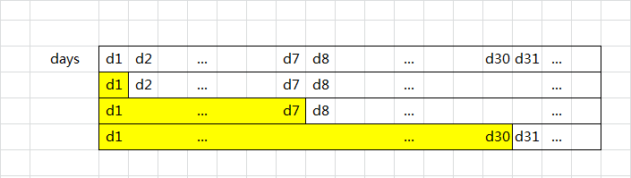

## 876、链表的中间节点

### 1、快慢指针

> 思路:
>
> 快慢指针

**代码**

```java
 	public ListNode middleNode(ListNode head) {
        if(head==null||head.next==null) return head;
        ListNode slow = head;
        ListNode fast = head;
        while(fast!=null && fast.next!=null){
            slow = slow.next;
            fast = fast.next.next;
        }
        return slow;
    }
```


## 322、零钱兑换

### 1、动态规划+递归


> 创建dp[amount+1] 数组来存储amount金额时候用到的最少的零钱数

**代码**

```java
	public int coinChange(int[] coins, int amount) {
        if(amount<1) return 0;
        return change(coins,amount,new int[amount+1]);
    }
    public int change(int [] coins,int amount,int[] dp){
        if(amount<0) return -1;
        if(amount==0) return 0;
        if(dp[amount]!=0) return dp[amount];
        int min = Integer.MAX_VALUE;
        for(int coin: coins){
            int res = change(coins,amount-coin,dp);
            if(res>=0&&res+1<min){
                min = res+1;
            }
        }
        dp[amount] = (min==Integer.MAX_VALUE)?-1:min;
        return dp[amount];
    }
```


### 2、DFS优化剪枝

>  ① 如果凑够了amount，说明得到了一个潜在答案，计算出目前能凑够amount的最少硬币数量ans，剪枝 
>
> ② 如果没凑够amount 
>
> （1）如果当前银币已经是最小硬币，无法凑出，那么说明这个凑法不合理，剪枝
>
> （2）如果(目前已选择的硬币数量 + 1) >= ans，说明继续往下凑，硬币数量不会小于ans，剪枝 
>
> （3）否则尝试选择面值比coin小的硬币去凑剩余的金额 


**代码**

```java
	int ans = Integer.MAX_VALUE;
    public int coinChange(int [] coins,int amount){
        if(coins == null || coins.length == 0 || amount == 0) return 0;
        Arrays.sort(coins);
        dfs(coins,amount,coins.length-1,0);
        return ans == Integer.MAX_VALUE?-1:ans;
    }
    /**
     * @param coins :硬币数组
     * @param amount:需要凑成的钱数
     * @param coinIdx：当前所用硬币的下标
     * @param countCoin：目前已经选择硬币的数量
     * @return ans: 最终答案
     */
    private void dfs(int[] coins, int amount, int coinIdx, int countCoin) {
        for (int i = amount/coins[coinIdx]; i >= 0; i--) {  //先用最大的去尝试
            int remainMoney = amount- i*coins[coinIdx];  //剩余的钱
            int curCountCoin = countCoin +1;  //需要的硬币数
            if(remainMoney == 0){ //如果钱花完了，剪枝
                ans = Math.min(ans,curCountCoin);
                return;
            }
            if(coinIdx==0) return;//最小的硬币已经无法凑成了，剪枝
            if(curCountCoin+1>=ans) return;  //再往下凑硬币数加1>=ans 剪枝 如果再往下凑的话硬币数目肯定加一
            // 选择较小的面值凑够剩余的金额
            dfs(coins,remainMoney,coinIdx-1,curCountCoin);
        }
    }
```


## 572、另一个树的子树

> 递归解

```java
	public boolean isSubtree(TreeNode s, TreeNode t) {
        if(t == null) return true;
        if(s == null) return false;
        return  checkSub(s,t) || isSubtree(s.left,t) || isSubtree(s.right,t) ;
    }

    private boolean checkSub(TreeNode s, TreeNode t) {
        if(s == null && t == null) return true;
        if(s == null || t==null) return false;
        if(s.val != t.val) return false;
        return checkSub(s.left,t.left) && checkSub(s.right,t.right);
    }
```


## 945、使数组唯一的最小增量


### 1、线性探测

> 线性探测加路径压缩

**代码**

```java
	int[] pos = new int [80000];
    public int minIncrementForUnique(int[] A) {
        Arrays.fill(pos, -1); // -1表示空位
        int move = 0;
        // 遍历每个数字a对其寻地址得到位置b, b比a的增量就是操作数。
        for (int a: A) {
            int b = findPos(a); 
            move += b - a;
        }
        return move;
    }
    // 线性探测寻址（含路径压缩）
    private int findPos(int a) {
        int b = pos[a];
        // 如果a对应的位置pos[a]是空位，直接放入即可。
        if (b == -1) { 
            pos[a] = a;
            return a;
        }
        // 否则向后寻址
        // 因为pos[a]中标记了上次寻址得到的空位，因此从pos[a]+1开始寻址就行了（不需要从a+1开始）。
        b = findPos(b + 1); 
        pos[a] = b; // 寻址后的新空位要重新赋值给pos[a]哦，路径压缩就是体现在这里。
        return b;
    }
```

### 2、排序

```java
	public int minIncrementForUnique_sort(int[] A) {
        Arrays.sort(A);
        int move = 0;
        for (int i = 1; i < A.length; i++) {
            if(A[i]<=A[i-1]){
                int pre = A[i];
                A[i] = A[i-1]+1;
                move+=A[i]-pre;
            }
        }
        return move;
    }
```

## 983、最低票价

### 1、动态规划


> dp[i] = min(决策1, 决策2, 决策3);
>       = min(c[0] + 1天后不包, c[1] + 7天后不包, c[2] + 30天不包);
>       = min(c[0] + dp[i + 1], c[1] + dp[i + 7], c[2] + dp[i + 30]);



```java
	public int mincostTickets(int[] days, int[] costs) {
        int len = days.length;
        int minDay = days[0];
        int maxDay = days[len-1];
        int []dp = new int[maxDay+31];  //dp数组
        for(int d = maxDay,i = len-1;d>=minDay ;d--){
            if(d == days[i]){
                dp[d] = Math.min(dp[d+1]+costs[0],dp[d+7]+costs[1]); // 一天后不包  七天后不包
                dp[d] = Math.min(dp[d+30]+costs[2],dp[d]);
                i--; //日期往前走一天
            }else{
                dp[d] = dp[d+1]; //说明不需要出门
            }
        }
        return dp[minDay];
    }
```


## 1143、最长公共子序列

### 1、动态规划

> 准备一个（m+1）*(n+1)的数组
>
> 然后存状态就好了

**代码**

```java
	public int longestCommonSubsequence(String text1, String text2) {
        int m = text1.length();
        int n = text2.length();
        int [][] dp = new int[m+1][n+1];
        for (int i = 1; i < m+1; i++) {
            for (int j = 1; j < n+1; j++) {
                if(text1.charAt(i-1) == text2.charAt(j-1)){
                    dp[i][j] = dp[i-1][j-1] + 1;
                }else{
                    dp[i][j] = Math.max(dp[i-1][j],dp[i][j-1]);
                }
            }
        }
        return dp[m][n];
    }
```

