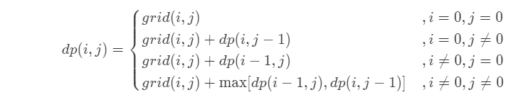
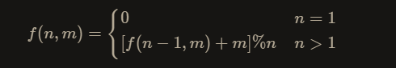

## 3、数组中重复的数字

```java
class Solution {
    public int findRepeatNumber(int[] nums) {
         if(nums == null || nums.length<0)
            return -1;
        for (int i = 0; i < nums.length; i++) {
            if(nums[i] != i){
                if(nums[nums[i]] == nums[i])
                    return nums[i];
                swap(nums,i,nums[i]);
            }
        }
        return -1;
    }
    private static void swap(int[] nums, int i, int j) {
        int t = nums[i];
        nums[i] = nums[j];
        nums[j] = t;

    }
}
```


## 4、二维数组中的查找

```java
class Solution {
    public boolean findNumberIn2DArray(int[][] matrix, int target) {
        if(matrix== null || matrix.length==0){
            return false;
        }
        int rows = matrix[0].length-1;
        int cols = matrix.length-1;
        int toDown = 0;
        int toLeft = rows;
        while(toDown <= cols && toLeft >=0){
            if(target == matrix[toDown][toLeft]){
                return true;
            }else if (target < matrix[toDown][toLeft]){
                toLeft-- ;
            }else if(target > matrix[toDown][toLeft]){
                toDown++;
            }
        }
        return false;
    }
}
```


## 5、替换空格

```java
 class Solution {
    public String replaceSpace(String s) {
        int len = s.length();
        char [] cs = new char[len*3];
        char[] c = s.toCharArray();
        int size = 0;
        for (int i = 0; i < len; i++) {
            if(c[i]==' '){
                cs[size++] = '%';
                cs[size++] = '2';
                cs[size++] = '0';
            }else{
                cs[size++] = c[i];
                
            }
        }
        return new String(cs,0,size);
    }
}
```

## 6、从尾到头打印链表

```java
public int[] reversePrint(ListNode head) {
        int length = 0;
        ListNode next = head;
        while(next!=null){
            length++;
            next = next.next;
        }
        int [] print = new int[length];
        next = head;
        for (int i = length - 1; i >= 0; i--) {
            print[i] = next.val;
            next = next.next;
        }
        return print;
    }
```


## 7、重建二叉树

```java
class Solution {
    HashMap<Integer, Integer> map = new HashMap<>();
    public TreeNode buildTree(int[] preorder, int[] inorder) {
        for (int i = 0; i < inorder.length; i++) {
            map.put(inorder[i],i);
        }
        return build(preorder,0,preorder.length-1,inorder,0,inorder.length-1);
    }
    public TreeNode build(int [] preOrder,int preL,int preR,int [] inOrder,int inL,int inR){
        if(preL>preR||inL>inR) return null;
        TreeNode root = new TreeNode(preOrder[preL]);
        int inCenter = map.get(preOrder[preL]);
        int inLeftSize = inCenter - inL;
        root.left = build(preOrder,preL+1,preL+inLeftSize,inOrder,inL,inCenter-1);
        root.right = build(preOrder,preL+inLeftSize+1,preR,inOrder,inCenter+1,inR);
        return root;
    }
}
```


## 9、用两个栈实现队列

```java
class CQueue {
    Stack<Integer> in;
    Stack<Integer> out;
    public CQueue() {
        in = new Stack<>();
        out = new Stack<>();
    }

    public void appendTail(int value) {
        in.push(value);
    }

    public int deleteHead() {
        if(out.empty()){
            if (in.empty()){
                return -1;
            }else{
                while (!in.empty()){
                    out.push(in.pop());
                }
                return out.pop();
            }
        }else{
            return out.pop();
        }
    }
}
```

## 10_I、斐波那契数列

```java
class Solution {
    public int fib(int n) {
        if (n <= 1) return n;
        int[] dp = new int[2];
        int temp ;
        dp[0] = 0;
        dp[1] = 1;
        for (int i = 2; i <= n; i++) {
            temp = (dp[0]+dp[1])%1000000007;
            dp[0] = dp[1];
            dp[1] = temp;
        }
        return dp[1];
    }
}
```


## 10_II、青蛙跳台阶问题

```java
class Solution {
   public int numWays(int n) {
        if (n <= 1) return 1;
        int[] dp = new int[2];
        dp[0] = 1;
        dp[1] = 1;
        int temp;
        for (int i = 2; i <= n; i++) {
            temp = (dp[0]+dp[1])%1000000007;
            dp[0] = dp[1];
            dp[1] = temp;
        }
        return dp[1];
    }
}
```


## 11、旋转数组的最小数字

```java
class Solution {
   public int minArray(int[] numbers) {
        int i = 0;
        int j = numbers.length - 1;
        while (i < j) {
            int mid = (i + j) / 2;
            if (numbers[j] > numbers[mid]) {
                j = mid;
            } else if (numbers[j] < numbers[mid]) {
                i = mid+1;
            }else{
                j--;
            }
        }
        return numbers[j];
    }
}
```

## 12、矩阵中的路径

```java
class Solution {
    public boolean exist(char[][] board, String word) {
        char[] words = word.toCharArray();
        for (int i = 0; i < board.length; i++) {
            for (int j = 0; j < board[0].length; j++) {
                if (dfs(board, words, i, j, 0)) return true;
            }
        }
        return false;
    }

    private boolean dfs(char[][] board, char[] words, int i, int j, int k) {
        if (i < 0 || i >= board.length || j < 0 || j >= board[0].length || board[i][j] != words[k]) return false;
        if (k == words.length - 1) return true;
        char temp = board[i][j];
        board[i][j] = '*';
        boolean res = dfs(board, words, i + 1, j, k + 1) ||
                dfs(board, words, i - 1, j, k + 1) ||
                dfs(board, words, i, j + 1, k + 1) ||
                dfs(board, words, i, j - 1, k + 1);
        board[i][j] = temp;
        return res;
    }
}
```

## 13、机器人的运动范围

<font color='cornflowerblue'>DFS</font>

```java
int m, n, k;
    boolean[][] visited;

    public int movingCount_dfs(int m, int n, int k) {
        this.m = m;
        this.n = n;
        this.k = k;
        this.visited = new boolean[m][n];
        return dfs(0, 0, 0, 0);
    }

    private int dfs(int i, int j, int mi, int mj) {
        if (i >= this.m || j >= this.n || mi + mj > k || visited[i][j]) return 0;
        visited[i][j] = true;
        // 1.当x或者y从n9进位成(n+1)0时，数位和减小了8
        //    设进位后数的数位和为n，差值为x，得出方程n=(n-1)+9+x，即x=-8
        return 1 + dfs(i + 1, j, (i + 1) % 10 != 0 ? mi + 1 : mi - 8, mj) +
                dfs(i, j, mi, (j + 1) % 10 != 0 ? mj + 1 : mj - 8);
    }
```

<font color='cornflowerblue'> BFS </font>

```JAVA
public int movingCount(int m, int n, int k) {
        int res = 0;
        boolean[][] visited = new boolean[m][n];
        Queue<int[]> queue = new LinkedList<>();
        queue.add(new int[]{0, 0, 0, 0});
        while (queue.size() > 0) {
            int[] x = queue.poll();
            int i = x[0], j = x[1], mi = x[2], mj = x[3];
            if (i >= m || j >= n || mi + mj > k || visited[i][j]) continue;
            res += 1;
            visited[i][j] = true;
            queue.add(new int[]{i + 1, j, (i + 1) % 10 != 0 ? mi + 1 : mi - 8, mj});
            queue.add(new int[]{i, j + 1, mi, (j + 1) % 10 != 0 ? mj + 1 : mj - 8});
        }
        return res;
    }
```


## 19、正则表达式匹配

```java
public boolean isMatch(String s, String p) {
        int a = s.length();
        int b = p.length();
        boolean [][] dp = new boolean[a+1][b+1];
        for (int i = 0; i <= a; i++) {
            for (int j = 0; j <= b; j++) {
                // 1这里if主要做了两个判断
                // 空串和空正则匹配
                // 非空串和空正则一定不匹配
                // 2在else中
                // 空串和非空正则不一定
                // 非空串和非空正则也不一定
                if(j==0){
                    dp[i][j] = i==0;
                }else {
                    // 在非空正则中分为 * 和 非*两种情况
                    if(p.charAt(j-1)!='*'){
                        // 碰到非*
                        if(i>0&&(s.charAt(i-1)==p.charAt(j-1)||p.charAt(j-1)=='.')){
                            dp[i][j] = dp[i-1][j-1];
                        }
                    }else {
                        // 如果 p 的最后一个字符是*它代表 p[m-2]=c 可以重复0次或多次，它们是一个整体 c*
                        // 情况一：s[n-1] 是 0 个 c，p 最后两个字符废了，能否匹配取决于 s{0..n-1}和 p{0..m-3}是否匹配
                        // 情况二：s[n-1]是多个 c 中的最后一个（这种情况必须 s[n-1]=c或者 c='.'，所以s匹配完往前挪一个，
                        // p继续匹配，因为可以匹配多个，继续看 s{0..n-2}和 p{0..m-1} 是否匹配。
                        // 碰到*了，分为看和不看两种情况
                        // 不看
                        if(j>=2){
                            dp[i][j] |= dp[i][j-2];
                        }
                        // 看
                        if(i>=1&&j>=2 && (s.charAt(i-1)==p.charAt(j-2)||p.charAt(j-2)=='.')){
                            dp[i][j] |= dp[i-1][j];
                        }
                    }
                }
            }
        }
        return dp[a][b];
    }
```


## 20、表示数值的字符串

```java
class Solution {
    private int index = 0;
    public boolean isNumber(String s) {
        if(s==null || s.length() == 0) return false;
        //添加结束标志
        s += '|';
        while(s.charAt(index)==' ') index++;
        boolean isNumeric = scanInteger(s);
        //如果出现’.‘ 接下来就是小数部分
        if(s.charAt(index)=='.'){
            index++;
            // 下面一行代码用||的原因：
            // 1. 小数可以没有整数部分，例如.123等于0.123；
            // 2. 小数点后面可以没有数字，例如233.等于233.0；
            // 3. 当然小数点前面和后面可以有数字，例如233.666
            isNumeric = scanUnsignInteger(s)||isNumeric;
        }
        // 如果出现'e'或者'E'，接下来跟着的是数字的指数部分
        if(s.charAt(index)=='e'||s.charAt(index)=='E'){
            index++;
            // 下面一行代码用&&的原因：
            // 1. 当e或E前面没有数字时，整个字符串不能表示数字，例如.e1、e1；
            // 2. 当e或E后面没有整数时，整个字符串不能表示数字，例如12e、12e+5.4
            isNumeric = isNumeric && scanInteger(s);
        }
        while(s.charAt(index)==' '){
            index++;
        }
        return isNumeric && s.charAt(index)=='|';
    }

    private boolean scanInteger(String s) {
        if(s.charAt(index)=='-' || s.charAt(index)=='+'){
            index++;
        }
        return scanUnsignInteger(s);
    }

    private boolean scanUnsignInteger(String s) {
        int befor = index;
        while(s.charAt(index)>='0'&&s.charAt(index)<='9'){
            index++;
        }
        return index>befor;
    }
}
```

## 39、数组中出现次数超过一半的数字

```java
	class Solution {
        public int majorityElement(int[] nums) {
            // 摩尔投票法
            int votes = 0, maj=0;
            for (int i = 0; i < nums.length; i++) {
                if (votes == 0) maj = nums[i];
                votes += maj == nums[i] ? 1 : -1; // 相等就+1 不相等就-1
            }
            return 0;
        }
    }
```


## 40、最小的K个数

**1、快排思路**

```java
	public int[] getLeastNumbers(int[] arr, int k) {
        if(arr.length==0 ) return new int[]{};
        quickSortK(arr,0,arr.length-1,k);
        int []res = new int[k];
        for (int i = 0; i < k; i++) {
            res[i] = arr[i];
        }
        return res;
    }

    private void quickSortK(int[] arr, int low, int high, int k) {
        if(low<high){
            int i = low;
            int j = high;
            int temp = arr[i];
            if(i == k) return ;
            while(i<j){
                while(i<j&&temp<arr[j]) j--;
                if(i<j){
                    arr[i] = arr[j];
                    i++;
                }
                while(i<j&&temp>arr[i]) i++;
                if(i<j){
                    arr[j] = arr[i];
                    j--;
                }
            }
            arr[i] = temp;
            quickSortK(arr,low,i-1,k);
            if(k>i){
                quickSortK(arr,i+1,high,k);
            }
        }
    }
```

**2、堆**

```java
	public int[] getLeastNumbers(int[] arr, int k) {
        if (k == 0 || arr.length == 0) {
            return new int[0];
        }
        // 默认是小根堆，实现大根堆需要重写一下比较器。
        Queue<Integer> pq = new PriorityQueue<>((v1, v2) -> v2 - v1);
        for (int num: arr) {
            if (pq.size() < k) {
                pq.offer(num);
            } else if (num < pq.peek()) {
                pq.poll();
                pq.offer(num);
            }
        }
        
        // 返回堆中的元素
        int[] res = new int[pq.size()];
        int idx = 0;
        for(int num: pq) {
            res[idx++] = num;
        }
        return res;
    }

```

## 41、数据流中的中位数

> 思路：采用两个堆
>
> 大根堆保存较小的一半
>
> 小跟堆保存较大的一半
>
> 如果奇数：那么从小根堆的顶部取
>
> 如果偶数：两个堆顶部加起来/2

```java
class MedianFinder {
        /**
         * initialize your data structure here.
         */
        Queue<Integer> smallHeap;
        Queue<Integer> bigHeap;

        public MedianFinder() {
            smallHeap = new PriorityQueue<>(); // 小顶堆，放较大的一半
            bigHeap = new PriorityQueue<>((v1,v2)->v2-v1); //大顶堆，放较小的一半
        }

        public void addNum(int num) {
            if(smallHeap.size() == bigHeap.size()){
                bigHeap.add(num);
                smallHeap.add(bigHeap.poll());
            }else{
                smallHeap.add(num);
                bigHeap.add(smallHeap.poll());
            }
        }

        public double findMedian() {
            return (smallHeap.size()+bigHeap.size())%2!=0?smallHeap.peek():(smallHeap.peek()+bigHeap.peek())/2.0;
        }
    }
```


## 42、连续子数组的最大和

```java
	public int maxSubArray(int[] nums) {
        int res = nums[0];
        for (int i = 1; i < nums.length; i++) {
            nums[i] += Math.max(nums[i-1],0);
            // dp数组复用nums数组
            // dp[i] = dp[i-1]+nums[i]   dp[i-1]>0
            // dp[i] = dp[i]             dp[i-1]<0
            res = Math.max(res,nums[i]);
        }
        return res;
    }
```


## 43、1-n整数中1出现的次数

> 思路：dfs

```java
	class Solution {
        public int countDigitOne(int n) {
            return dfs(n);
        }

        private int dfs(int n) {
            if(n<=0){
                return 0;
            }
            String number = String.valueOf(n);
            int high = number.charAt(0) - '0'; // 最高位n=2346,则high=2
            int belowPart = (int) Math.pow(10, number.length() - 1); // n=2346,则belowPart=2000
            int lastPart = n - high * belowPart;// n=2346则,lastPart=346
            if(high==1){
                // case 1234
                // 0-234 dfs(lastPart)
                // 0-999 dfs(belowPart-1)
                // 1000-1234 最高位1的个数,等于lastPart+1个
                return dfs(lastPart)+dfs(belowPart-1)+lastPart+1;
            }else{
                // case 3456
                // 0-456 dfs(lastPart)
                // 1000-1999 最高位1的个数，belowPart个
                // 0-999*3 3*dfs(below-1)
                return dfs(lastPart)+high*dfs(belowPart-1)+belowPart;
            }
        }
    }
```

## 44、数字序列中某一位的数字

> 思路：1.确定起始值和位
>
> ​			2.确定所在的数
>
> ​			3.确定在所在数的第几个数字

```java
	class Solution {
        public int findNthDigit(int n) {
            int digit = 1;
            long start = 1;
            long count = 9;
            // 1确定开始和位数
            while (n > count) {
                n -= count;
                digit += 1; //位数 0-9 1 | 10-99 2 | 100-999 3 | ...
                start *= 10;//开始 0-9 0 | 10-99 10 | 100-999 100 | ...
                count = 9 * start * digit; //数字个数 0-9 9 | 10-99 180 | 100-999 2700
            }
            // 2确定n所在的数字
            long num = start + (n - 1) / digit;
            // 3确定n所在数字第几个
            return Long.toString(num).charAt((n - 1) % digit) - '0';
        }
    }
```


## 45、把数组排成最小的数

> 思路：使用排序
>
> 如果 x+y > y+x 那么 x>y
>
> 如果 x+y < y+x 那么 y<x

**1、自定义快排**

```java
 public String minNumber_quickSort(int[] nums) {
            String[] strs = new String[nums.length];
            for (int i = 0; i < nums.length; i++) {
                strs[i] = String.valueOf(nums[i]);
            }
            quickSort(strs, 0, strs.length - 1);
            StringBuilder res = new StringBuilder();
            for (String str : strs) {
                res.append(str);
            }
            return res.toString();
        }

        // 排序规则  例子 3 32 68
        // 如果332>323，那么32就是较小的一方 32 3 68
        private void quickSort(String[] strs, int l, int r) {
            if (l < r) {
                int i = l;
                int j = r;
                String temp = strs[i];
                while (i < j) {
                    while ((strs[j] + strs[l]).compareTo(strs[l] + strs[j]) >= 0 && i < j) j--;
                    while ((strs[i] + strs[l]).compareTo(strs[l] + strs[i]) <= 0 && i < j) i++;
                    temp = strs[i];
                    strs[i] = strs[j];
                    strs[j] = temp;
                }
                strs[i] = strs[l];
                strs[l] = temp;
                quickSort(strs,l,i-1);
                quickSort(strs,i+1,r);
            }
        }
```

**2、使用jdk自带排序Arrays.sort()**

```java
 	public String minNumber(int[] nums) {
            String[] strs = new String[nums.length];
            for (int i = 0; i < nums.length; i++) {
                strs[i] = String.valueOf(nums[i]);
            }
            Arrays.sort(strs,(o1,o2)->(o1+o2).compareTo(o2+o1));
            StringBuilder res = new StringBuilder();
            for (String str : strs) {
                res.append(str);
            }
            return res.toString();
        }
```


## 46、把数字翻译成字符串

> 思路：动态规划
>
> 和跳台阶类似的一道题

**1、dp数组**

```java
		// 动态规划，跳台阶
        public int translateNum_dp(int num) {
            String str = String.valueOf(num);
            int[] dp = new int[str.length() + 1];
            dp[0] = 1;
            dp[1] = 1;
            for (int i = 2; i <= str.length(); i++) {
                String number = str.substring(i - 2, i);
                if (number.compareTo("10") >= 0 && number.compareTo("25") <= 0) {
                    dp[i] = dp[i - 1] + dp[i - 2];
                } else {
                    dp[i] = dp[i - 1];
                }
            }
            return dp[str.length()];
        }
```

**2、优化dp数组**

```Java
		// 动态规划，跳台阶 优化
        public int translateNum(int num) {
            String str = String.valueOf(num);
            int a = 1;
            int b = 1;
            for (int i = 2; i <= str.length(); i++) {
                String number = str.substring(i - 2, i);
                int c = number.compareTo("10") >= 0 && number.compareTo("25") <= 0 ? a + b : a;
                b = a;
                a = c;

            }
            return a;
        }
```


## 47、礼物的最大价值

**1、动态规划**

> 状态转移方程 
>
> **时间复杂度**：O（M*N）
>
> **空间复杂度**：O(1)



**代码**

```java
		public int maxValue(int[][] grid) {
            int m = grid.length;
            int n = grid[0].length;
            for (int i = 0; i < m; i++) {
                for (int j = 0; j < n; j++) {
                    if (i == 0 && j == 0) continue;
                    else if (i == 0) grid[i][j] += grid[i][j - 1];
                    else if (j == 0) grid[i][j] += grid[i - 1][j];
                    else grid[i][j] += Math.max(grid[i - 1][j], grid[i][j - 1]);
                }
            }
            return grid[m - 1][n - 1];
        }
```


## 48、最长不含重复字符的子字符串

> 思路：双指针加哈希

```java
	class Solution {
        public int lengthOfLongestSubstring(String s) {
            if (s == null || s.length() == 0) return 0;
            HashMap<Character, Integer> map = new HashMap<>();
            int i = -1;
            int res = 0;
            for (int j = 0; j < s.length(); j++) {
                if (map.containsKey(s.charAt(j))) {
                    i = Math.max(i, map.get(s.charAt(j)));
                }
                map.put(s.charAt(j), j);
                res = Math.max(res, j - i);
            }
            return res;
        }
    }
```

## 49、丑数

> 思路：动态规划

```java
	class Solution {
        // 一个十分巧妙的动态规划问题
        // 1.我们将前面求得的丑数记录下来，后面的丑数就是前面的丑数*2，*3，*5
        // 2.但是问题来了，我怎么确定已知前面k-1个丑数，我怎么确定第k个丑数呢
        // 3.采取用三个指针的方法，p2,p3,p5
        // 4.index2指向的数字下一次永远*2，p3指向的数字下一次永远*3，p5指向的数字永远*5
        // 5.我们从2*p2 3*p3 5*p5选取最小的一个数字，作为第k个丑数
        // 6.如果第K个丑数==2*p2，也就是说前面0-p2个丑数*2不可能产生比第K个丑数更大的丑数了，所以p2++
        // 7.p3,p5同理
        // 8.返回第n个丑数
        public int nthUglyNumber(int n) {
            int p2 = 0, p3 = 0, p5 = 0;
            int [] dp = new int[n];
            dp[0] = 1; // 1是丑数
            for (int i = 1; i < n; i++) {
                dp[i] = Math.min(dp[p2]*2,Math.min(dp[p3]*3,dp[p5]*5));
                if(dp[i]==dp[p2]*2) p2++;
                if(dp[i]==dp[p3]*3) p3++;
                if(dp[i]==dp[p5]*5) p5++;
            }
            return dp[n-1];
        }
    }
```


## 50、第一次出现一次的字符

> 思路：先把字符出现的次数全部放在new  int[26] 的数组中
>
> 然后对字符串在进行一次扫描，找第一次只出现一次的字符

```java
	public char firstUniqChar(String s) {
        int [] charN = new int[26];
        for (int i = 0; i < s.length(); i++) {
            charN[s.charAt(i)-'a']++;
        }
        for (int i = 0; i < s.length(); i++) {
            if(charN[s.charAt(i)-'a']==1){
                return s.charAt(i);
            }
        }
        return ' ';
    }
```


## 51、数组中的逆序对

> 思路： 归并排序 ，如果左边最大的大于右边最大的
>
> 那么result += left -mid个

```java
	class Solution {
        int result = 0;

        public int reversePairs(int[] nums) {
            if (nums == null || nums.length < 2) return 0;
            mSort(nums, 0, nums.length - 1);
            return result;
        }

        private void mSort(int[] nums, int l, int r) {
            if (l < r) {
                int mid = l + (r - l) / 2;
                mSort(nums, l, mid);
                mSort(nums, mid + 1, r);
                mergeSort(nums, l, mid, r);
            }

        }

        private void mergeSort(int[] nums, int l, int mid, int r) {
            int[] help = new int[r - l + 1];
            int p = help.length - 1;
            int temp = mid + 1;
            while (mid >= l && r >= temp) {
                result += nums[mid] > nums[r] ? r - temp + 1 : 0;
                help[p--] = nums[mid] > nums[r] ? nums[mid--] : nums[r--];
            }
            while (r >= temp) help[p--] = nums[r--];
            while (mid >= l) help[p--] = nums[mid--];
            for (int i = 0; i < help.length; i++) {
                nums[l + i] = help[i];
            }
        }
```


## 52、两个链表的第一个公共节点

```java
	public class Solution {
        public ListNode getIntersectionNode(ListNode headA, ListNode headB) {
            ListNode p1 = headA;
            ListNode p2 = headB;
            while (p1 != p2) {
                p1 = p1 != null ? p1.next : headB;
                p2 = p2 != null ? p2.next : headA;
            }
            return p1;
        }
    }
```

## 53_I、在排序数组中查找数字 

> 思路：二分查找

```java
	class Solution {
        public int search(int[] nums, int target) {
            int l = 0, r = nums.length-1;
            while (l <= r) {
                int mid = (l + r) / 2;
                if (nums[mid] > target) {
                    r = mid - 1;
                } else if (nums[mid] < target) {
                    l = mid + 1;
                } else {
                    l = mid-1;
                    r = mid+1;
                    while(l>=0&&nums[l] == target) l--;
                    while(r<=nums.length-1&&nums[r] == target) r++;
                    return r-l-1;
                }
            }
            return 0;
        }
    }
```

## 53_II、0～n-1中缺失的数字

> 思路：二分

```java
	class Solution {
        public int missingNumber(int[] nums) {
            int l = 0;
            int r = nums.length - 1;
            while (l <= r) {
                int mid = (l + r) / 2;
                if(nums[mid] == mid){
                    l = mid+1;
                }else{
                    r = mid-1;
                }
            }
            return l;
        }
```

## 54、二叉搜索树的第k大节点

> 思路：逆中序遍历

```java
class Solution {
    //思路：二插搜索树的中序遍历递增有序的（左中右）
    //所以要寻找第k大个只需要逆中序遍历就可以
    //逆中序遍历的是递减的（右中左）
    int res,k;
    public int kthLargest(TreeNode root, int k) {
        if(root == null) return 0;
        this.k = k;
        reverseMiddleOrder(root);
        return res;
    }

    private void reverseMiddleOrder(TreeNode root) {
        if(root!=null){
            reverseMiddleOrder(root.right);
            if(--k ==0) {
                res = root.val;
                return;
            }
            reverseMiddleOrder(root.left);
        }

    }
}
```

## 55_I、二叉树的深度

```java
class Solution {
        public int maxDepth(TreeNode root) {
            return root == null ? 0 : Math.max(maxDepth(root.left), maxDepth(root.right)) + 1;
        }

    }
```

## 55_II、平衡二叉树

> 上面一题的复用

```java
class Solution {
        //思路：二叉树最大深度的复用
        public boolean isBalanced(TreeNode root) {
            if(root == null) return true;
            if(Math.abs(maxDepth(root.left)-maxDepth(root.right))>1){
                return false;
            }else {
                return isBalanced(root.left)&&isBalanced(root.right);
            }
        }

        public int maxDepth(TreeNode root) {
            return root == null ? 0 : Math.max(maxDepth(root.left), maxDepth(root.right)) + 1;
        }
    }
```

## 56_I、数组中数字出现的次数

> 思路：分组异或

```java
	class Solution {
        //先对所有数字进行一次异或，得到两个出现一次的数字的异或值。
        //
        //在异或结果中找到任意为 1 的位。
        //
        //根据这一位对所有的数字进行分组。
        //
        //在每个组内进行异或操作，得到两个数字。
        public int[] singleNumbers(int[] nums) {
            int twoXor = 0;  // 两个只出现一次的数的异或
            for (int num : nums) {
                twoXor ^= num;
            }
            //找出两个数只出现一次数的分组点
            int div = 1;
            while ((div & twoXor) == 0) {
                div <<= 1;
            }
            int[] res = new int[2];
            for (int num : nums) {
                if ((num & div) == 0) {
                    res[0] ^= num;
                } else {
                    res[1] ^= num;
                }
            }

            return res;
        }
    }
```

## 56_II、数组中数字出现的次数 II

> 思路：统计数组中每个数的每个位出现的次数
>
> 然后对统计结果对3取余
>
> 然后剩下位上为1的就是

```java
class Solution {
        public int singleNumber(int[] nums) {
            //统计每一位的数字的个数
            int[] count = new int[32];
            for (int num : nums) {
                for (int i = 0; i < 32; i++) {
                    count[i] += num & 1;
                    num >>>= 1;
                }
            }
            //然后把count数组对3取余，留下来的位数就是只出现一次的数出现的位置
            int res =0;
            for (int i = 0; i < 32; i++) {
                res <<=1;
                res |= count[31-i]%3;
            }
            return res;
        }
    }
```

## 57_I、和为s的两个数字

> 思路：双指针法

```java
class Solution {
        public int[] twoSum(int[] nums, int target) {
            //双指针法
            int l = 0, r = nums.length - 1;
            while(l<r){
                int sum = nums[l] + nums[r];
                if(target>sum) l++;
                else if(target<sum) r--;
                else return new int[]{nums[l],nums[r]};
            }
            return new int[0];
        }
    }
```

## 57_II、和为s的连续正数序列

> 思路：滑动窗口

```java
class Solution {
        //滑动窗口
        public int[][] findContinuousSequence(int target) {
            int l = 1;
            int r = 1;
            int sum = 0;
            List<int[]> res = new ArrayList<>();
            while (l <= target / 2) {
                if (sum < target) sum += r++;
                else if (sum >target) sum -=l++;
                else {
                    int [] arr = new int[r-l];
                    for (int i = l; i < r; i++) {
                        arr[i-l] = i;
                    }
                    res.add(arr);
                    sum-=l++;

                }
            }
            return res.toArray(new int[res.size()][]);
        }
    }
```


## 58_I、翻转单词顺序

```java
class Solution {
    public String reverseWords(String s) {
        String[] strs = s.trim().split(" ");
        StringBuilder sb = new StringBuilder();
        for (int i = strs.length-1; i >= 0; i--) {
            if(!"".equals(strs[i])){
                sb.append(strs[i].trim());
                if(i>0) sb.append(" ");
            }
        }
        return sb.toString();
    }
}
```


## 58_II、左旋转字符串

```java
class Solution {
        public String reverseLeftWords(String s, int n) {
            char[] stc = s.toCharArray();
            swap(stc, 0, n - 1);
            swap(stc, n, s.length() - 1);
            swap(stc, 0, s.length()-1);
            return String.valueOf(stc);
        }

        private void swap(char[] stc, int i, int j) {
            char temp;
            while (i < j) {
                temp = stc[i];
                stc[i++] =stc[j];
                stc[j--] = temp;
            }
        }

    }
```


## 59_I、滑动窗口的最大值

```java
class Solution {
        // 如何在每次窗口滑动后，将 “获取窗口内最大值” 的时间复杂度从 O(k) 降低至 O(1)
        public int[] maxSlidingWindow(int[] nums, int k) {
            if(nums.length==0 || k == 0) return new int[0];
            Deque<Integer> dq = new LinkedList<>();
            int [] res = new int[nums.length-k+1];
            //0-k
            for (int i = 0; i < k; i++) {
                while(!dq.isEmpty()&&nums[i]>dq.peekLast()){
                    dq.removeLast();
                }
                dq.addLast(nums[i]);
            }
            res[0] = dq.peekFirst();
            // k-nums.length-1
            for (int i = k; i < nums.length; i++) {
                if(nums[i-k] == dq.peekFirst())
                    dq.removeFirst();
                while(!dq.isEmpty()&&nums[i]> dq.peekLast()){
                    dq.removeLast();
                }
                dq.addLast(nums[i]);
                res[i-k+1] = dq.peekFirst();
            }
            return res;
        }
    }
```


## 59_II、队列的最大值

> 思路：双端队列

```java
	class MaxQueue {

        Queue<Integer> queue;
        Deque<Integer> maxQueue;

        public MaxQueue() {
            queue = new LinkedList<>();
            maxQueue = new LinkedList<>();
        }

        public int max_value() {
            return maxQueue.isEmpty()?-1:maxQueue.getFirst();
        }

        public void push_back(int value) {
            queue.add(value);
            while(!maxQueue.isEmpty() && value > maxQueue.getLast()){
                maxQueue.removeLast();
            }
            maxQueue.add(value);
        }

        public int pop_front() {
            if(queue.isEmpty()) return -1;
            int res = queue.poll();
            if(res == maxQueue.peekFirst()){
                maxQueue.pollFirst();
            }
            return res;
        }
    }
```


## 60、n个骰子的点数

```java
	public double[] twoSum(int n) {
        double [] pre = {1/6d,1/6d,1/6d,1/6d,1/6d,1/6d}; // 初始化一个骰子出现的几率
        for (int i = 2; i <= n; i++) {
            double [] temp = new double[i*5+1];   // 每组筛子点数的长度
            for (int j = 0; j < pre.length; j++) {
                for (int k = 0; k < 6; k++) {
                    temp[j+k] += pre[j]*(1/6d); // 更新每增加一个筛子当前点数出现的几率
                }
            }
            pre = temp;
        }
        return pre;
    }
```


## 61、扑克牌中的顺子

```java
	class Solution {
        public boolean isStraight(int[] nums) {
            Set<Integer> repeat = new HashSet<>();
            int max = 0, min = 14;
            for (int num : nums) {
                if (num == 0) continue; //大小王跳过
                max = Math.max(num, max);
                min = Math.min(num, min);
                if (repeat.contains(num)) return false;
                repeat.add(num);
            }
            return max - min < 5;
        }
    }
```


## 62、约瑟夫环

**1、数学递推法**

> 公式
>
> 

**代码**

```java
class Solution {
    public int lastRemaining(int n, int m) {
        int pos = 0 ; // 最后留在圈的人的索引
        //从两个人开始模拟
        for (int i = 2; i <= n; i++) {
            pos = (pos + m )%i; //如果圈里面有两个人时候 ，留在圈里人的索引，倒退
        }
        return pos;
    }
}
```


## 63、股票的最大利润

>  动态规划 
>
>  转移方程： dp[i] = max(dp[i-1],prices[i]-min(price[0-i]))

```java
    class Solution {
        // 转移方程： dp[i] = max(dp[i-1],prices[i]-min(price[0-i]))
        public int maxProfit(int[] prices) {
            int res = 0,minPrice = Integer.MAX_VALUE;
            for (int i = 0; i < prices.length; i++) {
                minPrice = Math.min(minPrice,prices[i]);
                res = Math.max(res,prices[i]-minPrice);
            }
            return res;
        }
    }
```

## 64、求1+2+…+n

> 递归+逻辑运算符的短路效应

```java
class Solution {
    // 思路 ：逻辑运算符的短路效应
    // if(A && B)  // 若 A 为 false ，则 B 的判断不会执行（即短路），直接判定 A && B 为 false
    // if(A || B) // 若 A 为 true ，则 B 的判断不会执行（即短路），直接判定 A || B 为 true
    int res = 0;
    public int sumNums(int n) {
        boolean x = n>1 && sumNums(n-1)>0;
        res +=n;
        return res;
    }
}
```

## 65、不用加减乘除做加法

> 思路：使用异或运算和与运算来代替+

```java
class Solution {
    //思路：利用异或运算和与运算
    //与运算得出的是两数相加需要进位的数字c
    //异或得出的是两数相加不需要进位的数字a
    //然后a+b 再次循环直到需要进位的数字为0结束循环
    public int add(int a, int b) {
        while (b != 0) {
            int c = (a & b) << 1; //进位的数字
            a ^= b; //未进位的数字
            b = c; //直到进位的数为0
        }
        return a;
    }
}
```


## 66、构建乘积数组

> 分别计算左右数字  左右数字相乘就可以得到

```java
class Solution {
    public int[] constructArr(int[] a) {
        if (a.length==0) return new int[0];
        int [] b = new int[a.length];
        b[0] = 1;
        int tmp = 1;
        for (int i = 1; i < a.length; i++) {
            b[i] = b[i-1]*a[i-1];
        }
        for (int i = a.length-2; i >= 0; i--) {
            tmp *= a[i+1];
            b[i] *=tmp;
        }
        return b;
    }
}
```

## 67、把字符串转换成整数

> 思路，注意正负号和越界问题

```java
class Solution {
    public int strToInt(String str) {
        char[] c = str.trim().toCharArray();
        if(c.length==0) return 0;
        int res = 0,sign = 1;
        int i = 1,rp = Integer.MAX_VALUE/10;
        if(c[0] == '-') sign =-1;
        else if(c[0]!='+') i=0;
        for (int j = i; j < c.length; j++) {
            if(c[j]<'0' || c[j] >'9') break;
            if(res > rp || (res == rp&&c[j]>'7')) return sign ==1 ? Integer.MAX_VALUE :Integer.MIN_VALUE;
            res = res *10 +(c[j] - '0');
        }
        return res*sign;
    }
}
```


## 68_I、二叉搜索树的最近公共祖先

> 最近公共祖先一定是大于左边p 小于右边q 的节点

**1、递归**

```java
	public TreeNode lowestCommonAncestor(TreeNode root, TreeNode p, TreeNode q) {
        if(root == null) return null;
        if(root.val>p.val && root.val>q.val)
            return lowestCommonAncestor(root.left,p,q);
        if(root.val<p.val && root.val<q.val)
            return lowestCommonAncestor(root.right,p,q);
        return root;
    }
```

**2、迭代**

```java
   public TreeNode lowestCommonAncestor(TreeNode root, TreeNode p, TreeNode q) {
        if(root == null) return null;
        TreeNode cur = root;
        while(cur!=null){
            if(cur.val > p.val && cur.val > q.val)
                cur = cur.left;
            else if(cur.val < q.val && cur.val < p.val)
                cur = cur.right;
            else
                break;
        }
        return cur;
    }
```


## 68_II、二叉树的最近公共祖先

**【思路】**
因为lowestCommonAncestor(root, p, q)的功能是找出以root为根节点的两个节点p和q的最近公共祖先，所以递归体分三种情况讨论：

如果p和q分别是root的左右节点，那么root就是我们要找的最近公共祖先
如果p和q都是root的左节点，那么返回lowestCommonAncestor(root.left,p,q)
如果p和q都是root的右节点，那么返回lowestCommonAncestor(root.right,p,q)
**边界条件讨论：**

如果root是null，则说明我们已经找到最底了，返回null表示没找到
如果root与p相等或者与q相等，则返回root
如果左子树没找到，递归函数返回null，证明p和q同在root的右侧，那么最终的公共祖先就是右子树找到的结点
如果右子树没找到，递归函数返回null，证明p和q同在root的左侧，那么最终的公共祖先就是左子树找到的结点

```java
	public TreeNode lowestCommonAncestor(TreeNode root, TreeNode p, TreeNode q) {
        if(root == null || root == p || root == q) return root;
        TreeNode left = lowestCommonAncestor(root.left, p, q);
        TreeNode right = lowestCommonAncestor(root.right, p, q);
        if (left==null) return right;
        if (right==null) return left;
        return root;
    }
```

