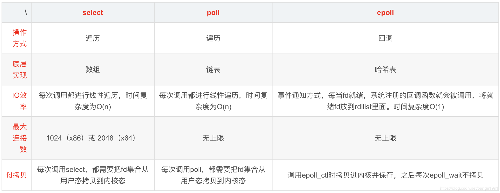
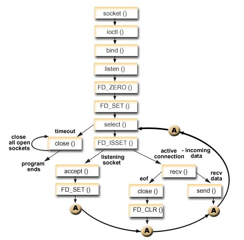

## 1. find 指令  查找指定文件

​	

​	· find ~ -name “target3.java”：精确查找文件

​	· find ~ -name “target*”：模糊查找文件

​	· find ~ -iname “target*”：不区分文件名大小写去查找文件

​	· ~ 为路径   不指定则从当前目录递归查找


## 2. grep 检索文件内容

 作用：<u>查找文件里符合条件的字符串</u>


### 管道操作符|

可将指令连接起来，前一个指令的输出作为后一个指令的输入


**使用管道注意的要点**

- 只处理前一个命令正确输入，不处理错误输出

- 右边命令必须能够接受标准输入流，否则传递过程中数据会被抛弃

- sed,awk,grep,cut,head,top,less,more,wc,join,sort,split等


### 常用方式

· grep ‘partial\\[true\\]’  bcs-plat-al-data.info.log

> 查找包含某个内容的文件，并将相关行展示出来

​	· grep -o ‘engine\\[[0-9a-z*\\]’

> 筛选出符合正则表达式的内容

​	· grep -v ‘grap’

> 过滤掉包含相关字符串的内容


## 3. awk 对文件内容做统计


-F：以什么符号作为分隔符进行切片


## 4. sed 指令

​	· 全名stream editor，流编辑器

​	· 适合用于对文本的行内容进行处理

> `sed` ‘/[要替换的内容]/[替换后的内容]/’，^str表示以str打头的字符串，开头s表示是对字符串进行的操作

> 默认是将变更的内容输出到终端，并不改变文件的内容


> 加入-i，则可以替换文本内容


> 句号换成分号，$表示以某某结尾


> 若加入g，则会全部替换，否则只替换一个


> 要删除空行，因为不是字符串，所以开头不加s，最后的d表示删除


> 根据Integer删除其所在行


## 5 I/O模型

### 阻塞式IO

- 使用系统调用，并一直阻塞直到内核将数据准备好，之后再由内核缓冲区复制到用户态，在等待内核准备的这段时间什么也干不了

- 下图函数调用期间，一直被阻塞，直到数据准备好且从内核复制到用户程序才返回，这种IO模型为阻塞式IO

- 阻塞式IO式最流行的IO模型 

  

### 非阻塞式IO

- 内核在没有准备好数据的时候会返回错误码，而调用程序不会休眠，而是不断轮询询问内核数据是否准备好

- 下图函数调用时，如果数据没有准备好，不像阻塞式IO那样一直被阻塞，而是返回一个错误码。数据准备好时，函数成功返回。

- 应用程序对这样一个非阻塞描述符循环调用成为轮询。

- 非阻塞式IO的轮询会耗费大量cpu，通常在专门提供某一功能的系统中才会使用。通过为套接字的描述符属性设置非阻塞式，可使用该功能 

  

### IO多路复用

- 类似与非阻塞，只不过轮询不是由用户线程去执行，而是由内核去轮询，内核监听程序监听到数据准备好后，调用内核函数复制数据到用户态

- 下图中select这个系统调用，充当代理类的角色，不断轮询注册到它这里的所有需要IO的文件描述符，有结果时，把结果告诉被代理的recvfrom函数，它本尊再亲自出马去拿数据

- IO多路复用至少有两次系统调用，如果只有一个代理对象，性能上是不如前面的IO模型的，但是由于它可以同时监听很多套接字，所以性能比前两者高 

  

- 多路复用包括： 

  - select：线性扫描所有监听的文件描述符，不管他们是不是活跃的。有最大数量限制（32位系统1024，64位系统2048）
  - poll：同select，不过数据结构不同，需要分配一个pollfd结构数组，维护在内核中。它没有大小限制，不过需要很多复制操作
  - epoll：用于代替poll和select，没有大小限制。使用一个文件描述符管理多个文件描述符，使用红黑树存储。同时用事件驱动代替了轮询。epoll_ctl中注册的文件描述符在事件触发的时候会通过回调机制激活该文件描述符。epoll_wait便会收到通知。最后，epoll还采用了mmap虚拟内存映射技术减少用户态和内核态数据传输的开销

### 信号驱动式IO

- 使用信号，内核在数据准备就绪时通过信号来进行通知

- 首先开启信号驱动io套接字，并使用sigaction系统调用来安装信号处理程序，内核直接返回，不会阻塞用户态

- 数据准备好时，内核会发送SIGIO信号，收到信号后开始进行io操作 

  

### 异步IO

- 异步IO依赖信号处理程序来进行通知

- 不过异步IO与前面IO模型不同的是：前面的都是数据准备阶段的阻塞与非阻塞，异步IO模型通知的是IO操作已经完成，而不是数据准备完成

- 异步IO才是真正的非阻塞，主进程只负责做自己的事情，等IO操作完成(数据成功从内核缓存区复制到应用程序缓冲区)时通过回调函数对数据进行处理

- unix中异步io函数以aio_或lio_打头 

  

### 各种IO模型对比

- 前面四种IO模型的主要区别在第一阶段，他们第二阶段是一样的：数据从内核缓冲区复制到调用者缓冲区期间都被阻塞住！

- 前面四种IO都是同步IO：IO操作导致请求进程阻塞，直到IO操作完成

- 异步IO：IO操作不导致请求进程阻塞 

  


## 6 I/0多路复用

 I/O多路复用就是`通过一种机制，一个线程可以监视多个描述符，一旦某个描述符就绪（一般是读就绪或者写就绪），能够通知程序进行相应的读写操作`。 

 目前支持I/O多路复用的系统调用有 `select，poll，epoll` 



### 1、select

Linux提供的select相关函数接口如下：

```c

#include <sys/select.h>
#include <sys/time.h>
 
int select(int max_fd, fd_set *readset, fd_set *writeset, fd_set *exceptset, struct timeval *timeout)
FD_ZERO(int fd, fd_set* fds)   //清空集合
FD_SET(int fd, fd_set* fds)    //将给定的描述符加入集合
FD_ISSET(int fd, fd_set* fds)  //将给定的描述符从文件中删除  
FD_CLR(int fd, fd_set* fds)    //判断指定描述符是否在集合中

```

1. select函数的返回值就绪描述符的数目，超时时返回0，出错返回-1。
2. 第一个参数max_fd指待测试的fd个数，它的值是待测试的最大文件描述符加1，文件描述符从0开始到max_fd-1都将被测试。
3. 中间三个参数readset、writeset和exceptset指定要让内核测试**读、写**和**异常**条件的fd集合，如果不需要测试的可以设置为NULL。

整体的使用流程如下图：



基于select的I/O复用模型的是单进程执行，占用资源少，可以为多个客户端服务。但是select需要轮询每一个描述符，在高并发时仍然会存在效率问题，同时select能支持的最大连接数通常受限。

 

### 2、poll

poll的机制与select类似，与select在本质上没有多大差别，管理多个描述符也是进行轮询，根据描述符的状态进行处理，但是poll没有最大文件描述符数量的限制。

Linux提供的poll函数接口如下：

```c
#include <poll.h>
int poll(struct pollfd fds[], nfds_t nfds, int timeout);
 
typedef struct pollfd {
        int fd;                         // 需要被检测或选择的文件描述符
        short events;                   // 对文件描述符fd上感兴趣的事件
        short revents;                  // 文件描述符fd上当前实际发生的事件*/
} pollfd_t;
```

1. poll()函数返回fds集合中就绪的读、写，或出错的描述符数量，返回0表示超时，返回-1表示出错；
2. fds是一个struct pollfd类型的数组，用于存放需要检测其状态的socket描述符，并且调用poll函数之后fds数组不会被清空；
3. nfds记录数组fds中描述符的总数量；
4. timeout是调用poll函数阻塞的超时时间，单位毫秒；
5. 一个pollfd结构体表示一个被监视的文件描述符，通过传递fds[]指示 poll() 监视多个文件描述符。其中，结构体的events域是监视该文件描述符的事件掩码，由用户来设置这个域，结构体的revents域是文件描述符的操作结果事件掩码，内核在调用返回时设置这个域。events域中请求的任何事件都可能在revents域中返回。


合法的事件如下：
POLLIN 有数据可读 
POLLRDNORM 有普通数据可读
POLLRDBAND 有优先数据可读
POLLPRI 有紧迫数据可读 
POLLOUT 写数据不会导致阻塞 
POLLWRNORM 写普通数据不会导致阻塞 POLLWRBAND 写优先数据不会导致阻塞 POLLMSGSIGPOLL 消息可用
当需要监听多个事件时，使用**POLLIN | POLLRDNORM**设置 events 域；当poll调用之后检测某事件是否发生时，**fds[i].revents & POLLIN**进行判断。

### 3、epoll

epoll在Linux2.6内核正式提出，是基于事件驱动的I/O方式，相对于select和poll来说，epoll没有描述符个数限制，使用一个文件描述符管理多个描述符，将用户关心的文件描述符的事件存放到内核的一个事件表中，这样在用户空间和内核空间的copy只需一次。优点如下：

1. 没有最大并发连接的限制，能打开的fd上限远大于1024（1G的内存能监听约10万个端口）
2. 采用回调的方式，效率提升。只有**活跃可用**的fd才会调用callback函数，也就是说 epoll 只管你“活跃”的连接，而跟连接总数无关，因此在实际的网络环境中，epoll的效率就会远远高于select和poll。
3. 内存拷贝。使用mmap()文件映射内存来加速与内核空间的消息传递，减少复制开销。

epoll对文件描述符的操作有两种模式：LT(level trigger，水平触发)和ET(edge trigger)。

- **水平触发：**默认工作模式，即当epoll_wait检测到某描述符事件就绪并通知应用程序时，应用程序可以不立即处理该事件；下次调用epoll_wait时，会再次通知此事件。
- **边缘触发：**当epoll_wait检测到某描述符事件就绪并通知应用程序时，应用程序必须立即处理该事件。如果不处理，下次调用epoll_wait时，不会再次通知此事件。（直到你做了某些操作导致该描述符变成未就绪状态了，也就是说边缘触发只在状态由未就绪变为就绪时通知一次）。

ET模式很大程度上减少了epoll事件的触发次数，因此效率比LT模式下高。

Linux中提供的epoll相关函数接口如下：

```c

#include <sys/epoll.h>
int epoll_create(int size);
int epoll_ctl(int epfd, int op, int fd, struct epoll_event *event);
int epoll_wait(int epfd, struct epoll_event * events, int maxevents, int timeout);
```

1. **epoll_create**函数创建一个epoll句柄，参数size表明内核要监听的描述符数量。调用成功时返回一个epoll句柄描述符，失败时返回-1。
2. **epoll_ct**l函数注册要监听的事件类型。四个参数解释如下：
    epfd表示epoll句柄；
    op表示fd操作类型：**EPOLL_CTL_ADD**（注册新的fd到epfd中），**EPOLL_CTL_MOD**（修改已注册的fd的监听事件），**EPOLL_CTL_DEL**（从epfd中删除一个fd）
    fd是要监听的描述符；
    event表示要监听的事件
   epoll_event结构体定义如下：

```c

struct epoll_event {
    __uint32_t events;  /* Epoll events */
    epoll_data_t data;  /* User data variable */
};
 
typedef union epoll_data {
    void *ptr;
    int fd;
    __uint32_t u32;
    __uint64_t u64;
} epoll_data_t;
```

3、 **epoll_wait**函数等待事件的就绪，成功时返回就绪的事件数目，调用失败时返回 -1，等待超时返回 0。
 epfd是epoll句柄
 events表示从内核得到的就绪事件集合
 maxevents告诉内核events的大小
 timeout表示等待的超时事件 