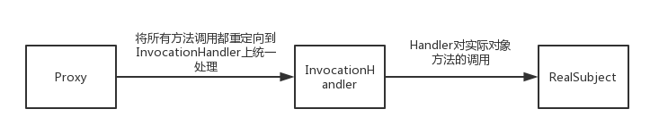
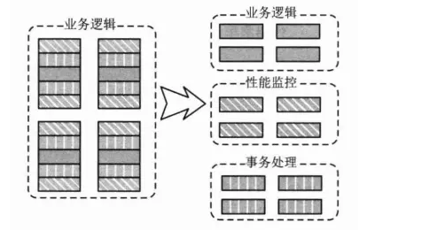
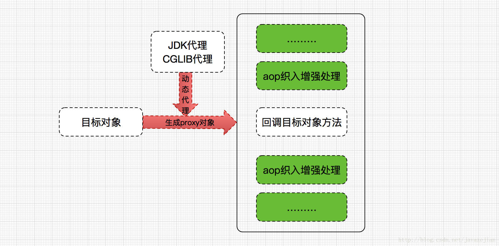

## 0、 aop 的动态代理


### 0.1 基于jdk的动态代理

> jdk动态代理是基于反射机制来实现的

```java
interface IHello{
    void sayHello();
}

class IHelloImpl implements IHello{

    @Override
    public void sayHello() {
        System.out.println("say hello ");
    }
}

class MyInvocationHandler implements InvocationHandler{

    private Object target;

    public MyInvocationHandler(Object target) {
        this.target = target;
    }

    /**
     * 执行目标对象的方法
     * @param proxy 代理对象
     * @param method 代理方法
     * @param args 方法参数
     * @return
     * @throws Throwable
     */
    @Override
    public Object invoke(Object proxy, Method method, Object[] args) throws Throwable {
        System.out.println("方法之前调用");
        Object result = method.invoke(target, args);
        System.out.println("方法之后调用");
        return result;
    }
}

public class DynamicProxy_JDK {
    public static void main(String[] args) {
        IHelloImpl iHello = new IHelloImpl();
        MyInvocationHandler handler = new MyInvocationHandler(iHello);
        //获取目标对象的代理对象
        IHello proxyHello = (IHello)Proxy.newProxyInstance(IHelloImpl.class.getClassLoader(),
                IHelloImpl.class.getInterfaces(),
                handler);
        //调用代理方法
        proxyHello.sayHello();
        //执行结果
        //方法之前调用
        //say hello
        //方法之后调用
    }
}


```

 从上面的例子中可以看出，代理对象的生成是通过`Proxy.newProxyInstance()`来完成的 

`newProxyInstance()`方法主要以下三个参数

- 类加载器(ClassLoader)用来加载动态代理类
- 一个要实现接口的数组，从这点就可以看出，要想**使用JDK动态代理，必须要有接口类**
- InvocactionHandler接口的一个实现



动态代理可以将所有调用重定向到调用处理器，因此通常上会向调用处理器的构造器传递一个"实际"对象的引用，从而使得处理器在执行任务时，可以请求转发。


### 0.2 利用cglib实现动态代理

>  CGLIB包的底层是通过使用一个小而快的字节码处理框架ASM，来转换字节码并生成新的类。 

```java
class HelloService{
    public HelloService() {
        System.out.println("hello Service 构造");
    }
    public void sayHello(){
        System.out.println("hello service");
    }
}

class MyMethodInterceptor implements MethodInterceptor{
    /**
     * sub：cglib生成的代理对象
     * method：被代理对象方法
     * objects：方法入参
     * methodProxy: 代理方法
     */
    @Override
    public Object intercept(Object sub, Method method, Object[] objects, MethodProxy methodProxy) throws Throwable {
        System.out.println(" --- 插入前置通知----");
        Object object = methodProxy.invokeSuper(sub, objects);
        System.out.println(" --- 插入后置通知----");
        return object;
    }
}

public class DynamicProxy_CGlib {
    public static void main(String[] args) {
        //Enhancer是CGLIB的核心工具类,是一个字节码增强器，它可以方便的对类进行扩展
        Enhancer enhancer = new Enhancer();
        //设置enhancer对象的父类
        enhancer.setSuperclass(HelloService.class);
        //设置enhancer的回调对象
        enhancer.setCallback(new MyMethodInterceptor());
        //创建代理对象
        HelloService proxy = (HelloService) enhancer.create();
        //通过代理对象调用目标方法
        proxy.sayHello();
        //打印结果
        //hello Service 构造
        // --- 插入前置通知----
        //hello service
        // --- 插入后置通知----
    }
}

```


### 0.3 两者实现的区别

-   CGlib是针对类实现代理，对指定的类生成一个子类，并覆盖其中的方法，这种通过继承类的实现方式，不能代理final修饰的类。 
-  JDK利用反射机制生成一个实现代理接口的匿名类，在调用具体方法前调用InvokeHandler来处理。 

## 1、  Spring Ioc（控制反转）

https://blog.csdn.net/javazejian/article/details/54561302 

IOC面向对象编程的一种设计原则，可以用来减轻代码之间的耦合度。他包括依赖注入（DI）和依赖查找（DL）

 通过 Spring提供的 IoC容器，可以将对象间的依赖关系交由 Spring进行控制，避免硬编码所造 成的过度程序耦合


> 通过这种方式，对象之间的关系不需要再由传统的 方式控制，而是交给spring容器来统一对这些对象进行创建、协调、销毁。我们在使用的时候只需要将对象注入进来即可

IOC 的核心思想就是： 让你脱离对依赖对象的维护，只需要随用随取，不需要关心依赖对象的任何过程 

 **控制的什么被反转了？就是：获得依赖对象的方式反转了。** 

## 2、 Spring Aop

>  Aop讲的很好的一篇文章
>
> https://blog.csdn.net/javazejian/article/details/56267036

**spring AOP： 将相同逻辑的重复代码横向抽取出来，使用动态代理技术将这些重复代码织入到目标对象的方法中，实现和原来一样的功能**

AOP之前**

日志处理业务，性能监控，事务处理，采用`纵向抽取`的原则

将代码放在父类中，或者将代码抽出来放在一个专门的类中

------

AOP的理念：就是将**分散在各个业务逻辑代码中相同的代码通过横向切割的方式**抽取到一个独立的模块中！ 



 其实Spring AOP的底层原理就是**动态代理**！ 

 Spring AOP**默认是使用JDK动态代理**，如果代理的类**没有接口则会使用CGLib代理**。 

 如果是**单例的我们最好使用CGLib代理**，如果是多例的我们最好使用JDK代理 




这样一来写代码时候只用关心业务代码，而不用关心关心业务无关的代码

**AOP术语**

**连接点**(Join point)：

- **能够被拦截的地方**：Spring AOP是基于动态代理的，所以是方法拦截的。每个成员方法都可以称之为连接点~

**切点**(Poincut)：

- **具体定位的连接点**：上面也说了，每个方法都可以称之为连接点，我们**具体定位到某一个方法就成为切点**。

**增强/通知**(Advice)：

- 表示添加到切点的一段逻辑代码，并定位连接点的方位信息 
  - 简单来说就定义了是干什么的，具体是在哪干
  - Spring AOP提供了5种Advice类型给我们：前置、后置、返回、异常、环绕给我们使用！

**织入**(Weaving)：

- 将`增强/通知`添加到目标类的具体连接点上的过程。

**引入/引介**(Introduction)：

- `引入/引介`允许我们**向现有的类添加新方法或属性**。是一种**特殊**的增强！

**切面**(Aspect)：

- 切面由切点和`增强/通知`组成，它既包括了横切逻辑的定义、也包括了连接点的定义。


## 3、 Spring使用的设计模式

### 3.1  单例模式

#### 单例注册表

> 首先，我们先来写一个案例。这个案例中，我们通过 Map 缓存单例对象，实现单例注册表。值得注意的是，我采用了 ConcurrentHashMap 是出于线程安全的考量。 

```java
public class SingletonReg {
    private final static Map<String, Object> singletonObjects = new ConcurrentHashMap<String, Object>(64);

    static {
        SingletonReg singletonReg = new SingletonReg();
        singletonObjects.put(singletonReg.getClass().getName(), singletonReg);
    }

    private SingletonReg() {}

    public static SingletonReg getInstance(String name) {
        if (name == null) {
            name = "com.lianggzone.designpattern.singleton.sample.SingletonReg";
        }
        if (singletonObjects.get(name) == null) {
            try {
                singletonObjects.put(name, Class.forName(name).newInstance());
            } catch (Exception ex) {
                ex.printStackTrace();
            }
        }
        return (SingletonReg) singletonObjects.get(name);
    }
}
```

 我们来分析下，上面案例中的源码。 

>  private final **static** Map<String, Object> singletonObjects = **new** ConcurrentHashMap<String, Object>(64); 

此外，getInstance() 方法通过传入类名进行判断，如果参数为 null，我们默认分配一个 SingletonReg 实例对象，如果实例对象在不存在，我们注册到单例注册表中。第二次获取时，直接从缓存的单例注册表中获取。 


#### spring源码分析

实际上，Spring 就是采用了这种单例注册表的特殊方式实现单例模式。

```java
public abstract class AbstractBeanFactory extends FactoryBeanRegistrySupport implements ConfigurableBeanFactory {

    @SuppressWarnings("unchecked")
    protected <T> T doGetBean(
            final String name, final Class<T> requiredType, final Object[] args, boolean typeCheckOnly)
            throws BeansException {
        // 对 Bean 的 name 进行处理，防止非法字符
        final String beanName = transformedBeanName(name);
        Object bean;
        // 从单例注册表中检查是否存在单例缓存
        Object sharedInstance = getSingleton(beanName);
        if (sharedInstance != null && args == null) {
            // ...忽略代码
            // 返回缓存实例 
            bean = getObjectForBeanInstance(sharedInstance, name, beanName, null);
        }
        else {
            // ...忽略代码
            try {
                // ...忽略代码

                // 单例模式，处理分支
                if (mbd.isSingleton()) {
                    sharedInstance = getSingleton(beanName, new ObjectFactory<Object>() {
                        @Override
                        public Object getObject() throws BeansException {
                            try {
                                return createBean(beanName, mbd, args);
                            }
                            catch (BeansException ex) {
                                // ...忽略代码
                            }
                        }
                    });
                    bean = getObjectForBeanInstance(sharedInstance, name, beanName, mbd);
                }
                // 原型模式，处理分支
                else if (mbd.isPrototype()) {

                }
                // 其他
                else {

                }
            }
            catch (BeansException ex) {
                // ...忽略代码
            }
        }
        return (T) bean;
    }
}
```

其中，最重要的核心代码是 getSingleton() 方法。下面，我们再深入分析下这个方法。

```java
public class DefaultSingletonBeanRegistry extends SimpleAliasRegistry implements SingletonBeanRegistry {

    // 通过 Map 实现单例注册表
    private final Map<String, Object> singletonObjects = new ConcurrentHashMap<String, Object>(64);

    public Object getSingleton(String beanName, ObjectFactory<?> singletonFactory) {
        Assert.notNull(beanName, "'beanName' must not be null");
        synchronized (this.singletonObjects) {
            // 检查缓存中是否存在实例  
            Object singletonObject = this.singletonObjects.get(beanName);
            if (singletonObject == null) {
                // ...忽略代码
                try {
                    singletonObject = singletonFactory.getObject();
                }
                catch (BeanCreationException ex) {
                    // ...忽略代码
                }
                finally {
                    // ...忽略代码
                }
                // 如果实例对象在不存在，我们注册到单例注册表中。
                addSingleton(beanName, singletonObject);
            }
            return (singletonObject != NULL_OBJECT ? singletonObject : null);
        }
    }

    protected void addSingleton(String beanName, Object singletonObject) {
        synchronized (this.singletonObjects) {
            this.singletonObjects.put(beanName, (singletonObject != null ? singletonObject : NULL_OBJECT));

        }
    }
}
```

此时，我们得出一个结论， Spring 对 Bean 实例的创建是采用单例注册表的方式进行实现的，而这个注册表的缓存是 ConcurrentHashMap 对象。