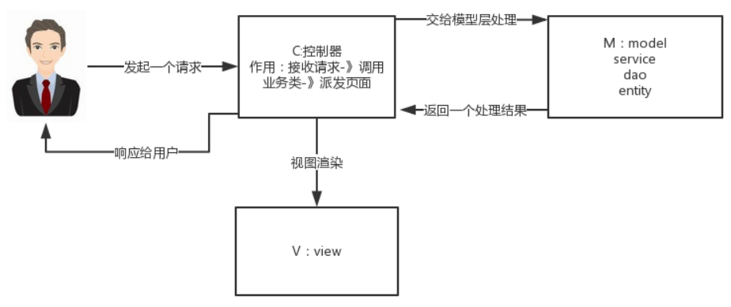
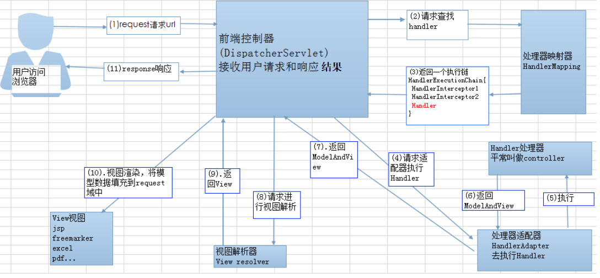

##  **1、什么是Spring MVC ？简单介绍下你对springMVC的理解?** 

 Spring MVC是一个基于Java的实现了MVC设计模式的请求驱动类型的轻量级Web框架，通过把Model，View，Controller分离，将web层进行职责解耦，把复杂的web应用分成逻辑清晰的几部分，简化开发，减少出错，方便组内开发人员之间的配合。 

**MVC原理**

##  **2、SpringMVC的流程？** 

> **流程说明**
>
> （1）浏览器发送请求，直接请求到DispatcherServlet前端控制器
>
> （2）DispathcherServlet根据请求信息调用HandlerMapping，解析请求对应的Handler
>
> （3）获取到对应的Handler后，开始由HandlerAdapter处理器适配器处理
>
> （4）handlderAdapter会调用Handler处理器（controller）来处理相应的业务逻辑 
>
> （5）Handler 处理业务后，会返回一个modelAndView对象
>
> （6）ViewResolver视图解析器根据逻辑View 返回实际的View
>
> （7）DispaterServlet 把返回的Model传给View进行视图渲染
>
> （8）DispaterServlet把View返回浏览器

##  **3、Spring MVC的主要组件？** 

> （1）前端控制器 DispatcherServlet（不需要程序员开发）
>

作用：接收请求、响应结果，相当于转发器，有了DispatcherServlet 就减少了其它组件之间的耦合度。 它就相当于mvc模式中的c，DispatcherServlet是整个流程控制的中心，由它调用其它组件处理用户的请求，DispatcherServlet的存在降低了组件之间的耦合性 

> （2）处理器映射器HandlerMapping（不需要程序员开发）
>

作用：根据请求的URL来查找Handler

 SpringMVC提供了不同的映射器实现不同的映射方式，例如：配置文件方式，实现接口方式，注解方式等。 

> （3）处理器适配器HandlerAdapter
>

注意：在编写Handler的时候要按照HandlerAdapter要求的规则去编写，这样适配器HandlerAdapter才可以正确的去执行Handler。

> （4）处理器Handler（需要程序员开发）

 由于Handler涉及到具体的用户业务请求，所以一般情况需要工程师根据业务需求开发Handler。 

> （5）视图解析器 ViewResolver（不需要程序员开发）
>

作用：进行视图的解析，根据视图逻辑名解析成真正的视图（view）

springmvc框架提供了很多的View视图类型，包括：jstlView、freemarkerView、pdfView等 

> （6）视图View（需要程序员开发jsp）
>

View是一个接口， 它的实现类支持不同的视图类型（jsp，freemarker，pdf等等）

## 4、**SpringMVC常用的注解有哪些？** 

`@RequestMapping`：用于处理请求 url 映射的注解，可用于类或方法上。用于类上，则表示类中的所有响应请求的方法都是以该地址作为父路径。

`@RequestBody`：注解实现接收http请求的json数据，将json转换为java对象。

`@ResponseBody`：注解实现将conreoller方法返回对象转化为json对象响应给客户。
`@Controller`: 控制器的注解

`@RestController`:  @ResponseBody ＋ @Controller 

`@GetMapping`

`@PostMapping`

