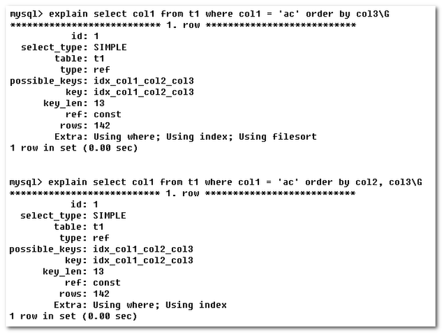
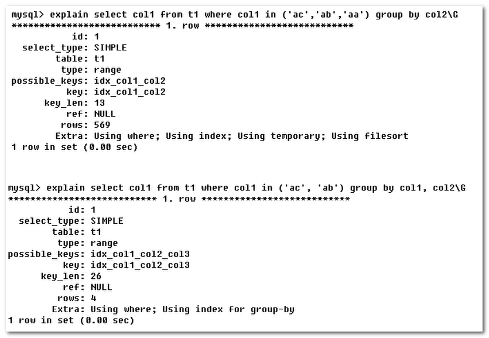
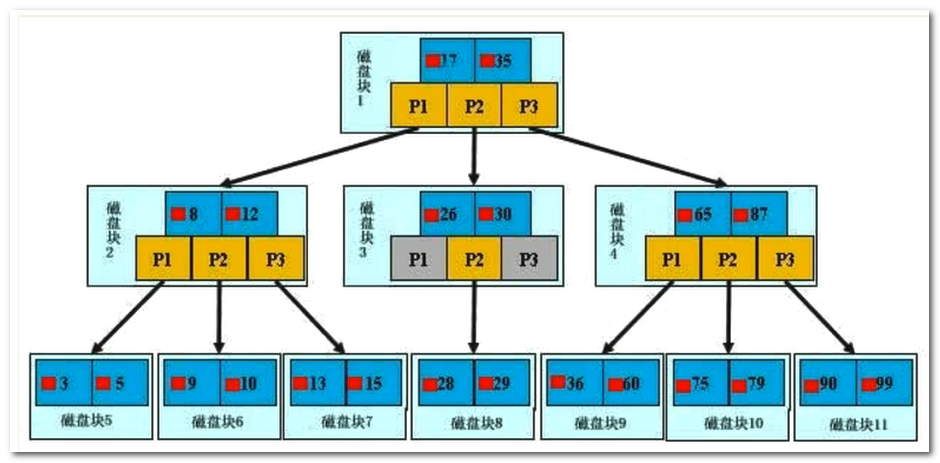
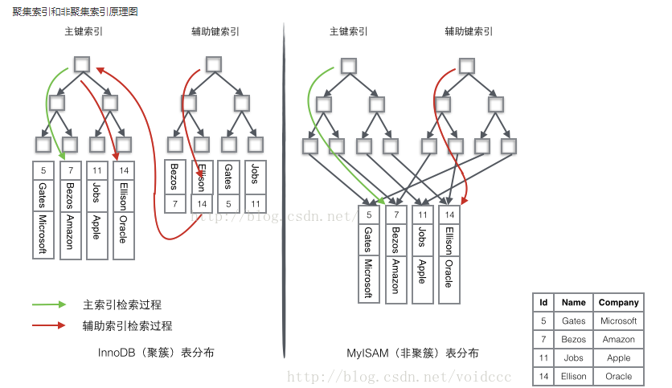
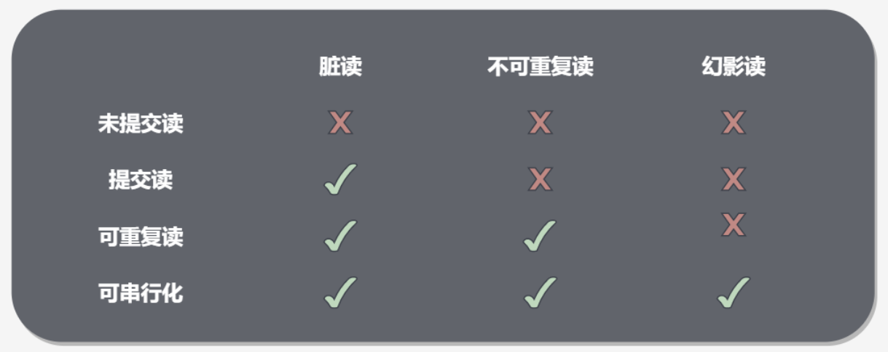
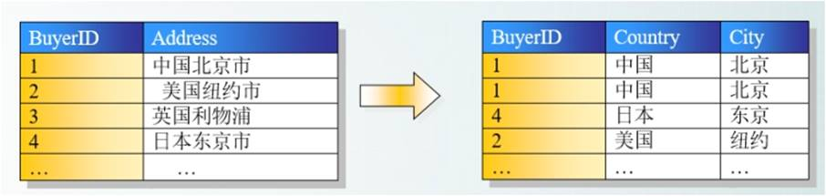
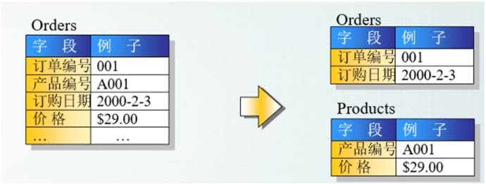
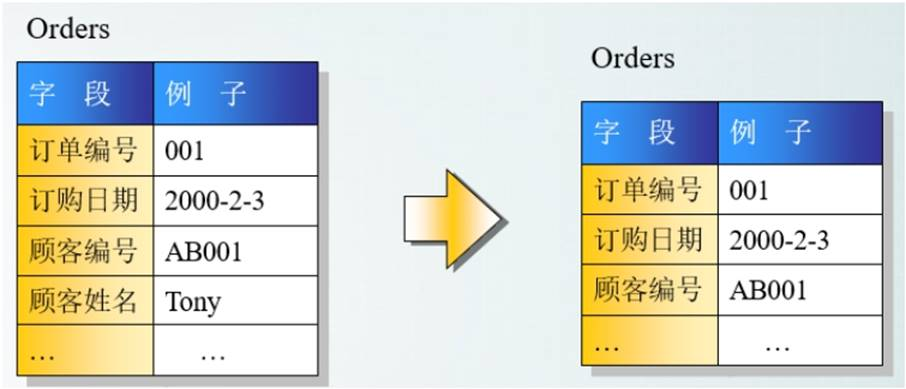

##  1 myIsam 和 Innodb的区别


- **事务**：innodb支持事务，myISAM 不支持事务

- **索引**：innodb 为聚簇索引，MyISAM为非聚簇索引

  >  聚簇索引的文件存放在主键索引的叶子节点上，因此 InnoDB 必须要有主键，通过主键索引效率很高。  是辅助索引需要两次查询，先查询到主键，然后再通过主键查询到数据
  >
  > 而 MyISAM 是非聚集索引，数据文件是分离的，索引保存的是数据文件的指针。主键索引和辅助索引是独立的。 

- **锁**：  InnoDB 最小的锁粒度是行锁，MyISAM 最小的锁粒度是表锁 

  >  MyISAM一个更新语句会锁住整张表，导致其他查询和更新都会被阻塞，因此并发访问受限。这也是 MySQL 将默认存储引擎从 MyISAM 变成 InnoDB 的重要原因之一； 

- COUNT(*):  InnoDB 不保存表的具体行数，执行 select count(*) from table 时需要全表扫描。而MyISAM 用一个变量保存了整个表的行数，执行上述语句时只需要读出该变量即可，速度很快； 


## 2  讲一下undo log

undo log 是InnoDB MVCC事务特性的重要组成部分，我们对记录做了变更操作就会产生undo记录

MVCC多版本是指多个版本的快照，快照存储在undo日志中。 该日志通过回滚指针把一个数据块上的所有快照连接起来

> 插入操作产生的undo log在事务提交之后就会被删除，因为插入的数据没有历史版本，不需要维护undo log 
>
> 而对于 update delete 需要维护多版本信

MVCC维护了一个Read View 的结构主要包含了当前系统未提交的事务列表TRX_IDS,还有列表中的最小值TRX_IDS_MIN和最大值TRX_IDS_MAX 

在进行Select 时候，会根据数据行快照的事务ID和Read_view  列表中的最大事务ID和最小事务ID的关系，来判断数据行快照是否可以使用

> TRX_ID > TRX_ID_MAX 表示这个数据行快照是在事务启动之后被更改的，因此不可以使用
>
> TRX_ID< TRX_ID_MIN 表示这个数据行快照是在当前所有为提交事务之前更改的，因此就可以使用
>
>  TRX_ID_MIN <= TRX_ID <= TRX_ID_MAX，需要根据隔离级别再进行判断： 

 在数据行快照不可使用的情况下，需要沿着 Undo Log 的回滚指针 ROLL_PTR 找到下一个快照，再进行上面的判断。 


## 3. 数据库锁 


### 3.1 共享锁和排他锁

共享锁又称读锁S

>  若事务T对数据对象A加上S锁，则事务T可以读A但不能修改A，其他事务只能再对A加S锁，而不能加X锁，直到T释放A上的S锁。这保证了其他事务可以读A，但在T释放A上的S锁之前不能对A做任何修改。 

排他锁又称写锁X

>  又称写锁。若事务T对数据对象A加上X锁，事务T可以读A也可以修改A，其他事务不能再对A加任何锁，直到T释放A上的锁。这保证了其他事务在T释放A上的锁之前不能再读取和修改A。 

对于共享锁大家可能很好理解，就是多个事务只能读数据不能改数据。
对于排他锁大家的理解可能就有些差别，我当初就犯了一个错误，**以为排他锁锁住一行数据后，其他事务就不能读取和修改该行数据**，其实不是这样的。**排他锁指的是一个事务在一行数据加上排他锁后，其他事务不能再在其上加其他的锁**。mysql InnoDB引擎默认的修改数据语句：update,delete,insert都会自动给涉及到的数据加上排他锁，**select语句默认不会加任何锁类型，如果加排他锁可以使用select …for update语句，加共享锁可以使用select … lock in share mode语句。**所以加过排他锁的数据行在其他事务种是不能修改数据的，也不能通过for update和lock in share mode锁的方式查询数据，**但可以直接通过select …from…查询数据，因为普通查询没有任何锁机制。**

另外，为了允许行锁和表锁共存，实现多粒度锁机制，InnoDB还有两种内部使用的意向锁（Intention Locks），**这两种意向锁都是表锁。**

**意向共享锁（IS）**：事务打算给数据行共享锁，事务在给一个数据行加共享锁前必须先取得该表的IS锁。
**意向排他锁（IX）**：事务打算给数据行加排他锁，事务在给一个数据行加排他锁前必须先取得该表的IX锁。


### 3.2 乐观锁和悲观锁

#### 悲观锁

> 它指的是对数据被外界修改持保守态度(悲观)，因此，在整个数据处理过程中，将数据处于锁定状态。  （包括本系统当前的其他事务，以及来自外部系统的事务处理）

  **悲观锁的实现，往往依靠数据库提供的锁机制** 

**在数据库中悲观锁的实现**

1. 在对任意记录进行修改前，先尝试为该记录加上排他锁（exclusive locking）。
2. 如果加锁失败，说明该记录正在被修改，那么当前查询可能要等待或者抛出异常。 具体响应方式由开发者根据实际需要决定。
3. 如果成功加锁，那么就可以对记录做修改，事务完成后就会解锁了。
4. 其间如果有其他对该记录做修改或加排他锁的操作，都会等待我们解锁或直接抛出异常。

**MySQL InnoDB中使用悲观锁**

要使用悲观锁，我们必须关闭mysql数据库的自动提交属性，因为MySQL默认使用autocommit模式，也就是说，当你执行一个更新操作后，MySQL会立刻将结果进行提交。 set autocommit=0;

```sql
//0.开始事务
begin;/begin work;/start transaction; (三者选一就可以)
//1.查询出商品信息
select status from t_goods where id=1 for update;
//2.根据商品信息生成订单
insert into t_orders (id,goods_id) values (null,1);
//3.修改商品status为2
update t_goods set status=2;
//4.提交事务
commit;/commit work;
```

> 上面的查询语句中，我们使用了 select…for update 的方式，这样就通过开启排他锁的方式实现了悲观锁。此时在t_goods表中，id为1的 那条数据就被我们锁定了，其它的事务必须等本次事务提交之后才能执行。这样我们可以保证当前的数据不会被其它事务修改。
>
> 上面我们提到，使用 select…for update 会把数据给锁住，不过我们需要注意一些锁的级别，**MySQL InnoDB默认行级锁。行级锁都是基于索引的，如果一条SQL语句用不到索引是不会使用行级锁的，会使用表级锁把整张表锁住**，这点需要注意。

**缺点**

 悲观并发控制实际上是“先取锁再访问”的保守策略，为数据处理的安全提供了保证。但是在效率方面，处理加锁的机制会让数据库产生额外的开销，还有增加产生死锁的机会；另外，在只读型事务处理中由于不会产生冲突，也没必要使用锁，这样做只能增加系统负载；还有会降低了并行性，一个事务如果锁定了某行数据，其他事务就必须等待该事务处理完才可以处理那行数 


#### 乐观锁

>  乐观锁假设认为数据一般情况下不会造成冲突，所以在数据进行提交更新的时候，才会正式对数据的冲突与否进行检测，如果发现冲突了，则让返回用户错误的信息，让用户决定如何去做。 

**版本号机制实现乐观锁**

 为数据增加的一个版本标识。当读取数据时，将版本标识的值一同读出，数据每更新一次，同时对版本标识进行更新。当我们提交更新的时候，判断数据库表对应记录的当前版本信息与第一次取出来的版本标识进行比对，如果数据库表当前版本号与第一次取出来的版本标识值相等，则予以更新，否则认为是过期数据。 

**实现**

 实现数据版本有两种方式，第一种是使用版本号，第二种是使用时间戳 

**使用版本号机制实现乐观锁**

```sql
1.查询出商品信息
select (status,status,version) from t_goods where id=#{id}
2.根据商品信息生成订单
3.修改商品status为2
update t_goods 
set status=2,version=version+1
where id=#{id} and version=#{version};
```


## 4 .数据库优化

### 4.1 explain 

**能干嘛？**

1. 表的读取顺序（id 字段）
2. 数据读取操作的操作类型（select_type 字段）
3. 哪些索引可以使用（possible_keys 字段）
4. 哪些索引被实际使用（keys 字段）
5. 表之间的引用（ref 字段）
6. 每张表有多少行被优化器查询（rows 字段）

> explain select score from SC ORDER BY score;


#### 1. select_type

**select_type：查询的类型，主要用于区别普通查询、联合查询、子查询等复杂查询**

1. SIMPLE：简单的select查询，查询中不包含子查询或者UNION
2. PRIMARY：查询中若包含任何复杂的子部分，最外层查询则被标记为PRIMARY
3. SUBQUERY：在SELECT或者WHERE列表中包含了子查询
4. DERIVED：在FROM列表中包含的子查询被标记为DERIVED（衍生）MySQL会递归执行这些子查询，把结果放在临时表里
5. UNION：若第二个SELECT出现在UNION之后，则被标记为UNION；若UNION包含在FROM子句的子查询中，外层SELECT将被标记为：DERIVED
6. UNION RESULT：从UNION表获取结果的SELECT

#### 2. table 

 **table：显示这一行的数据是关于哪张表的** 

#### 3. type 

 **type：访问类型排列，显示查询使用了何种类型** 

**type**：访问数据库的方式—— 常见的有全表扫描（all）、遍历索引（index）、区间查询（range）、常量或等值查询（ref、eq_ref）、主键等值查询（const）、当表中只有一条记录时（system）。

> system > const > eq_ref > ref > range > index > all    （效率排序）

#### 4. **possible_keys** 

1. 显示**可能**应用在这张表中的索引，一个或多个
2. <font color='#e54d42'> 若查询涉及的字段上存在索引，则该索引将被列出，但不一定被查询实际使用 </font>

####  5.  **key** 

1. **实际**使用的索引，如果为null，则没有使用索引
2. **若查询中使用了覆盖索引，则该索引仅出现在key列表中**

#### 6.  **key_len** 

1. **表示索引中使用的字节数**，可通过该列计算查询中使用的索引的长度。在不损失精确性的情况下，长度越短越好
2. key_len显示的值为**索引最大可能长度**，并非实际使用长度，即key_len是根据表定义计算而得，不是通过表内检索出的

#### 7.  **ref** 

1. **显示索引哪一列被使用了**，如果可能的话，最好是一个常数。哪些列或常量被用于查找索引列上的值
2. 由key_len可知t1表的索引idx_col1_col2被充分使用，t1表的col1匹配t2表的col1，t1表的col2匹配了一个常量，即’ac’

#### 8. rows

**rows** ：表示查询过程中可能需要扫描的行数，这个数据不一定准确，是mysql 抽样统计的一个数据。 

#### 9. Extra

**Extra**： 表示一些额外的信息，通常会显示是否使用了索引，是否需要排序，是否会用到临时表等。 

>  Using filesort ：使用了外部排序
>
> Using temporary 表示使用了临时表  ，一般GROUP BY 会产生临时表

<font color='#e54d42'>Using filesort（文件排序）</font>：

- MySQL中无法利用索引完成排序操作成为“文件排序”
- 说明mysql会对数据使用一个外部的索引排序，而不是按照表内的索引顺序进行读取
- **出现 Using filesort 不好（九死一生），需要尽快优化 SQL**
- 示例中第一个查询只使用了 col1 和 col3，原有索引派不上用场，所以进行了外部文件排序
- 示例中第二个查询使用了 col1、col2 和 col3，原有索引派上用场，无需进行文件排序



<font color='#e54d42'>Using temporary（创建临时表）：</font>

- 使用了临时表保存中间结果，MySQL在对查询结果排序时使用临时表。常见于排序 order by 和分组查询 group by
- **出现 Using temporary 超级不好（十死无生），需要立即优化 SQL**
- 示例中第一个查询只使用了 col1，原有索引派不上用场，所以创建了临时表进行分组
- 示例中第二个查询使用了 col1、col2，原有索引派上用场，无需创建临时表




## 5.索引是什么

 **索引 = 排序 + 查找** 

>  索引就是加快检索表中数据的方法。数据库的索引类似于书籍的索引。
>
>  在书籍中，索引允许用户不必翻阅完整个书就能迅速地找到所需要的信息。在数据库中，索引也允许数据库程序迅速地找到表中的数据，而不必扫描整个数据库。  


### 5.1索引分类

**普通索引**：最基本的索引，没有任何限制
**唯一索引**：与"普通索引"类似，不同的就是：索引列的值必须唯一，但允许有空值。
**主键索引**：它 是一种特殊的唯一索引，不允许有空值。 
**全文索引**：仅可用于 MyISAM 表，针对较大的数据，生成全文索引很耗时好空间。
**组合索引**：为了更多的提高mysql效率可建立组合索引，遵循”最左前缀“原则。

### 5.2 索引结构

#### **B树(B-tree)**

【初始化介绍】

1. 一颗 b 树， **浅蓝色的块我们称之为一个磁盘块**， 可以看到每个磁盘块包含几个**数据项（深蓝色所示） 和指针（黄色所示）**
2. 如磁盘块 1 包含数据项 17 和 35， 包含指针 P1、 P2、 P3
3. P1 表示小于 17 的磁盘块， P2 表示在 17 和 35 之间的磁盘块， P3 表示大于 35 的磁盘块
4. <font color='#e54d42'>真实的数据存在于叶子节点和非叶子节点中</font>

【查找过程】

1. 如果要查找数据项 29， 那么首先会把磁盘块 1 由磁盘加载到内存， 此时发生一次 IO， 在内存中用二分查找确定 29在 17 和 35 之间， 锁定磁盘块 1 的 P2 指针， 内存时间因为非常短（相比磁盘的 IO） 可以忽略不计
2. 通过磁盘块 1的 P2 指针的磁盘地址把磁盘块 3 由磁盘加载到内存， 发生第二次 IO， 29 在 26 和 30 之间， 锁定磁盘块 3 的 P2 指针
3. 通过指针加载磁盘块 8 到内存， 发生第三次 IO， 同时内存中做二分查找找到 29， 结束查询， 总计三次 IO。



#### **B+树**

【B+Tree 与 BTree 的区别】

B-树的关键字（数据项）和记录是放在一起的； B+树的非叶子节点中只有关键字和指向下一个节点的索引， 记录只放在叶子节点中。

【B+Tree 与 BTree 的查找过程】

1. 在 B 树中， 越靠近根节点的记录查找时间越快， 只要找到关键字即可确定记录的存在； 而 B+ 树中每个记录的查找时间基本是一样的， 都需要从根节点走到叶子节点， 而且在叶子节点中还要再比较关键字。
2. 从这个角度看 B 树的性能好像要比 B+ 树好， 而在实际应用中却是 B+ 树的性能要好些。 因为 B+ 树的非叶子节点不存放实际的数据，这样每个节点可容纳的元素个数比 B 树多， 树高比 B 树小， 这样带来的好处是减少磁盘访问次数。
3. 尽管 B+ 树找到一个记录所需的比较次数要比 B 树多， 但是一次磁盘访问的时间相当于成百上千次内存比较的时间， 因此实际中B+ 树的性能可能还会好些， 而且 B+树的叶子节点使用指针连接在一起， 方便顺序遍历（范围搜索）， 这也是很多数据库和文件系统使用 B+树的缘故。

【性能提升】

真实的情况是， 3 层的 B+ 树可以表示上百万的数据， 如果上百万的数据查找只需要三次 IO， 性能提高将是巨大的，如果没有索引， 每个数据项都要发生一次 IO， 那么总共需要百万次的 IO， 显然成本非常非常高。

【思考： 为什么说 B+树比 B-树更适合实际应用中操作系统的文件索引和数据库索引？】

1. B+树的磁盘读写代价更低：B+树的内部结点并没有指向关键字具体信息的指针。 因此其内部结点相对 B 树更小。 如果把所有同一内部结点的关键字存放在同一盘块中， 那么盘块所能容纳的关键字数量也越多。 一次性读入内存中的需要查找的关键字也就越多。 相对来说 IO 读写次数也就降低了。
2. B+树的查询效率更加稳定：由于非终结点并不是最终指向文件内容的结点， 而只是叶子结点中关键字的索引。 所以任何关键字的查找必须走一条从根结点到叶子结点的路。 所有关键字查询的路径长度相同， 导致每一个数据的查询效率相当。


**（百度百科算法结构示意图）**


**（维基百科算法结构示意图）**


- **特点**


1、B+**树的层级更少**：相较于B树B+每个**非叶子**节点存储的关键字数更多，树的层级更少所以查询数据更快；

2、B+**树查询速度更稳定**：B+所有关键字数据地址都存在**叶子**节点上，所以每次查找的次数都相同所以查询速度要比B树更稳定;

3、B+**树天然具备排序功能：**B+树所有的**叶子**节点数据构成了一个有序链表，在查询大小区间的数据时候更方便，数据紧密性很高，缓存的命中率也会比B树高。

4、B+**树全节点遍历更快：**B+树遍历整棵树只需要遍历所有的**叶子**节点即可，，而不需要像B树一样需要对每一层进行遍历，这有利于数据库做全表扫描。

**B树**相对于**B+树**的优点是，如果经常访问的数据离根节点很近，而**B树**的**非叶子**节点本身存有关键字其数据的地址，所以这种数据检索的时候会要比**B+树**快。

 

### 5.1 建立索引是应该注意哪些问题

1. 给常用字段建立索引
2. 对建立的联合索引的字段进行查询是应该符合最左匹配原则
3. 表记录太少不需要建立索引
4. 经常插入删除的表应该减少索引


### 5.2   聚簇索引&非聚簇索引 



> InnoDB使用的是聚簇索引，将主键组织到一棵B+树中，而行数据就储存在叶子节点上，若使用"where id = 14"这样的条件查找主键，则按照B+树的检索算法即可查找到对应的叶节点，之后获得行数据。若对Name列进行条件搜索，则需要两个步骤：第一步在辅助索引B+树中检索Name，到达其叶子节点获取对应的主键。第二步使用主键在主索引B+树种再执行一次B+树检索操作，最终到达叶子节点即可获取整行数据。

<font color='#f37b1d'>聚簇索引的数据的物理存放顺序与索引顺序是一致的，即：只要索引是相邻的，那么对应的数据一定也是相邻地存放在磁盘上的</font>。聚簇索引要比非聚簇索引查询效率高很多。聚集索引这种主+辅索引的好处是，当发生数据行移动或者页分裂时，辅助索引树不需要更新，因为辅助索引树存储的是主索引的主键关键字，而不是数据具体的物理地址。

> <u>MyISAM的是非聚簇索引，B+Tree的叶子节点上的data，并不是数据本身，而是数据存放的地址</u>。主索引和辅助索引没啥区别，只是主索引中的key一定得是唯一的。这里的索引都是非聚簇索引。非聚簇索引的两棵B+树看上去没什么不同，节点的结构完全一致只是存储的内容不同而已，主键索引B+树的节点存储了主键，辅助键索引B+树存储了辅助键。表数据存储在独立的地方


### 5.3 索引的最佳左匹配原则

 如果索引了多例，要遵守最左前缀法则。指的是查询从索引的最左前列开始并且不跳过索引中的列。 

mysql会一直向右匹配索引直到遇到范围查询（>、<、between、like）就停止匹配

**比如a = 3 and b = 4 and c > 5 and d = 6 如果建立（a,b,c,d)顺序的索引，d是用不到索引的，如果变为(a,b,d,c)的索引则都可以用到**，a,b,d的顺序可以任意调整


### 5.4  索引失效

1. 全值匹配我最爱
2. 最佳左前缀法则：如果索引了多例，要遵守最左前缀法则。指的是查询从索引的最左前列开始并且不跳过索引中的列。
3. 不在索引列上做任何操作（计算、函数、（自动or手动）类型转换），会导致索引失效而转向全表扫描
4. 存储引擎不能使用索引中范围条件右边的列
5. 尽量使用覆盖索引（只访问索引的查询（索引列和查询列一致）），减少`select *`
6. mysql在使用不等于（!=或者<>）的时候无法使用索引会导致全表扫描
7. `is null`，`is not null` 也无法使用索引（早期版本不能走索引，后续版本应该优化过，可以走索引）
8. like以通配符开头（’%abc…’）mysql索引失效会变成全表扫描操作
9. 字符串不加单引号索引失效
10. 少用or，用它连接时会索引失效

### 5.4 使用B+数作为索引的好处

- 单一节点存储更多的元素，使得查询IO次数更少
- 所有查询都要到叶子节点，查询性能稳定
- 所有子节点组成链表，有例与范围查询


## 6.事务

> 是访问和操作各种数据项的一个数据库操作序列，这些操作要么全部执行，要么全部不执行
>
> 是一个不可分割的单位

### 6.1 事务的四大特性

ACID

- 原子性： 事务包含的所有操作，要不全部执行，要么全部失败回滚 
- 一致性： 事务应确保数据库的状态从一致状态转向另外一个一致状态，一致状态指数据库的数据应满足完整性约束 
- 隔离性： 多个事务并发执行时，一个事务不应该影响其他事务 
- 持久性： 一个事务一旦提交，他对数据库的修改应该永久保存在数据库中，在于DBMS的恢复性能 

### 6.2 事务的二段提交机制？ 

二阶段提交(Two-phaseCommit)是指，在计算机网络以及数据库领域内，为了使基于分布式系统架构下的所有节点在进行事务提交时保持一致性而设计的一种算法(Algorithm)。通常，二阶段提交也被称为是一种协议(Protocol))。在分布式系统中，每个节点虽然可以知晓自己的操作时成功或者失败，却无法知道其他节点的操作的成功或失败。当一个事务跨越多个节点时，为了保持事务的 ACID 特性，需要引入一个作为协调者的组件来统一掌控所有节点(称作参与者)的操作结果并最终指示这些节点是否要把操作结果进行真正的提交(比如将更新后的数据写入磁盘等等)。因此，二阶段提交的算法思路可以概括为：<font color='cornflowerblue'>参与者将操作成败通知协调者，再由协调者根据所有参与者的反馈情报决定各参与者是否要提交操作还是中止操作</font>。

### 6.3 事务隔离级别

- 未提交读 READ UNCOMMITTED：事务中的修改，即使没有提交，对其它事务也是可见的
- 提交读 READ COMMITTED： 一个事务只能读取已经提交的事务所做的修改。换句话说，一个事务所做的修改在提交之前对其它事务是不可见的。 
- 可重复读 ： 保证在同一个事务中多次读取同一数据的结果是一样的 
- 可串行化： 强制事务串行执行，这样多个事务互不干扰，不会出现并发一致性问题。 



### 6.4 并发一致性问题

- 丢失修改 

  >  T1 和 T2 两个事务都对一个数据进行修改，T1 先修改，T2 随后修改，T2 的修改覆盖了 T1 的修改。 

- 读脏数据

  >  T1 修改一个数据，T2 随后读取这个数据。如果 T1 撤销了这次修改，那么 T2 读取的数据是脏数据。 》提交读就可以避免

- 不可重复读

  >  T2 读取一个数据，T1 对该数据做了修改。如果 T2 再次读取这个数据，此时读取的结果和第一次读取的结果不同。 》可重复读以上就能避免

- 幻影读

  >  T1 读取某个范围的数据，T2 在这个范围内插入新的数据，T1 再次读取这个范围的数据，此时读取的结果和和第一次读取的结果不同。 》可串行化可以避免


## 7 当前读&快照读

**快照读：**

​	读取的是数据的可见版本（可能是过期数据），不用加锁

> 当执行select的时候，innodb会默认执行快照读，相当于给你目前的状态找了一张照片，以后执行select的时候就会返回里面的数据
>
> **照片是什么时候生成的呢？**
>
> 不是开启事务的时候，而是第一次执行select的时候
>
> 也就是说当A开启的事务，然后B插入了一条数据，然后提交。这时候A执行了select操作，此时就生成了一张快照，之后在有事务提交都没关系，因为照片已经生成了，在A事务提交之前都会参考这张照片

**当前读**：

​	读取的是数据记录的最新版本，并且返回的记录都会加上锁，保证其他事务不会并发修改这条记录

> 当执行update ,insert ,delete 操作的时候就会执行当前读，也就是会读取最新的记录
>
> update过程
>
> 首先会执行当前读，然后把返回的数据加锁，之后执行update。
>
> 加锁是防止别的事务在这个时候对这条记录做什么，默认加的是排他锁，也就是你读都不可以，这样就可以保证数据不会出错了。
>
> 但注意一点，就算你这里加了写锁，别的事务也还是能访问的，是不是很奇怪？数据库采取了一致性非锁定读，别的事务会去读取一个快照数据。


## 8 **drop、delete**与**truncate**的区别 

>  SQL中的**drop、delete、truncate**都表示删除，但是三者有一些差别 
>
> - **delete和truncate**只删除表的数据不删除表的结构
> - 速度,一般来说: **drop> truncate >delete**
> - **delete**语句是dml,这个操作会放到**rollback segement**中,事务提交之后才生效;
>   如果有相应的**trigger**,执行的时候将被触发. **truncate,drop**是ddl, 操作立即生效,原数据不放到r**ollback segment**中,不能回滚. 操作不触发**trigger**.

- 不再需要一张表的时候，用**drop**
- 想删除部分数据行时候，用**delete**，并且带上where子句
- 保留表而删除所有数据的时候用**truncate**

## 9. 数据库3范式

### 第一范式         **(1st NF** －列都是不可再分)  

第一范式的目标是确保每列的原子性:如果每列都是不可再分的最小数据单元（也称为最小的原子单元），则满足第一范式（1NF）

​                        


### **第二范式****(2nd** **NF**－每个表只描述一件事情)

首先满足第一范式，并且表中非主键列不存在对主键的部分依赖。 <font color='cornflowerblue'> 第二范式要求每个表只描述一件事情。 </font>

​                         

### 第三范式(3rd **NF－ 不存在对非主键列的传递依赖)

第三范式定义是，满足第二范式，并且表中的列不存在对非主键列的传递依赖。除了主键订单编

 号外，顾客姓名依赖于非主键顾客编号。

​                        