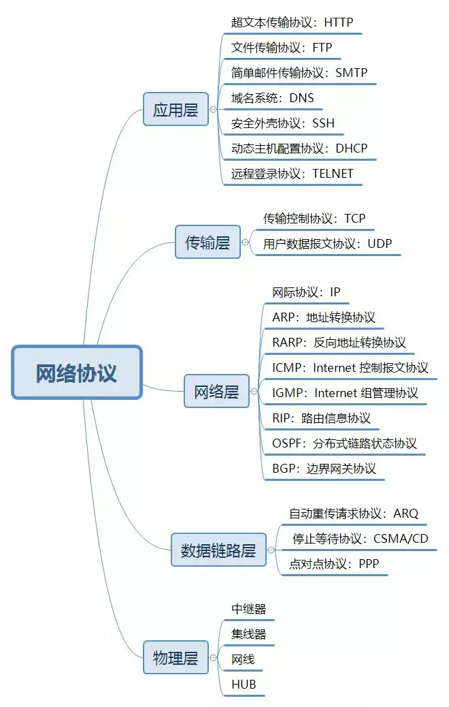
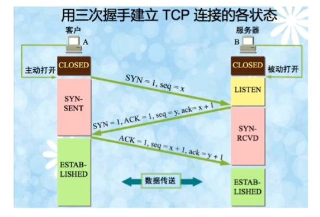
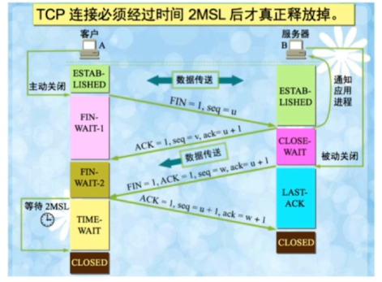

##  一 OSI与TCP/IP各层的结构与功能,都有哪些协议?

学习计算机网络时我们一般采用折中的办法，也就是中和 OSI 和 TCP/IP 的优点，采用一种只有五层协议的体系结构，这样既简洁又能将概念阐述清楚。

[](https://camo.githubusercontent.com/5bf7c14046570425f50bca412a3cf3710514ccff/68747470733a2f2f6d792d626c6f672d746f2d7573652e6f73732d636e2d6265696a696e672e616c6979756e63732e636f6d2f323031392f372f2545342542412539342545352542312538322545342542442539332545372542332542422545372542422539332545362539452538342e706e67)

结合互联网的情况，自上而下地，非常简要的介绍一下各层的作用。




### 1.1 应用层

**应用层(application-layer）的任务是通过应用进程间的交互来完成特定网络应用。\**应用层协议定义的是应用进程（进程：主机中正在运行的程序）间的通信和交互的规则。对于不同的网络应用需要不同的应用层协议。在互联网中应用层协议很多，如\**域名系统DNS**，支持万维网应用的 **HTTP协议**，支持电子邮件的 **SMTP协议**等等。我们把应用层交互的数据单元称为报文。

**域名系统**

> 域名系统(Domain Name System缩写 DNS，Domain Name被译为域名)是因特网的一项核心服务，它作为可以将域名和IP地址相互映射的一个分布式数据库，能够使人更方便的访问互联网，而不用去记住能够被机器直接读取的IP数串。（百度百科）例如：一个公司的 Web 网站可看作是它在网上的门户，而域名就相当于其门牌地址，通常域名都使用该公司的名称或简称。例如上面提到的微软公司的域名，类似的还有：IBM 公司的域名是 [www.ibm.com、Oracle](http://www.ibm.xn--comoracle-xj3h/) 公司的域名是 [www.oracle.com、Cisco公司的域名是](http://www.oracle.xn--comcisco-hm3g8360a63fhh376bwz2c1gzc/) [www.cisco.com](http://www.cisco.com/) 等。

**HTTP协议**

> 超文本传输协议（HTTP，HyperText Transfer Protocol)是互联网上应用最为广泛的一种网络协议。所有的 WWW（万维网） 文件都必须遵守这个标准。设计 HTTP 最初的目的是为了提供一种发布和接收 HTML 页面的方法。（百度百科）

### 1.2 运输层

**运输层(transport layer)的主要任务就是负责向两台主机进程之间的通信提供通用的数据传输服务**。应用进程利用该服务传送应用层报文。“通用的”是指并不针对某一个特定的网络应用，而是多种应用可以使用同一个运输层服务。由于一台主机可同时运行多个线程，因此运输层有复用和分用的功能。所谓复用就是指多个应用层进程可同时使用下面运输层的服务，分用和复用相反，是运输层把收到的信息分别交付上面应用层中的相应进程。

**运输层主要使用以下两种协议:**

1. **传输控制协议 TCP**（Transmission Control Protocol）--提供**面向连接**的，**可靠的**数据传输服务。
2. **用户数据协议 UDP**（User Datagram Protocol）--提供**无连接**的，尽最大努力的数据传输服务（**不保证数据传输的可靠性**）。

**TCP 与 UDP 的对比见问题三。**

### 1.3 网络层

**在 计算机网络中进行通信的两个计算机之间可能会经过很多个数据链路，也可能还要经过很多通信子网。网络层的任务就是选择合适的网间路由和交换结点， 确保数据及时传送。** 在发送数据时，网络层把运输层产生的报文段或用户数据报封装成分组和包进行传送。在 TCP/IP 体系结构中，由于网络层使用 **IP 协议**，因此分组也叫 **IP 数据报** ，简称 **数据报**。

这里要注意：**不要把运输层的“用户数据报 UDP ”和网络层的“ IP 数据报”弄混**。另外，无论是哪一层的数据单元，都可笼统地用“分组”来表示。

这里强调指出，网络层中的“网络”二字已经不是我们通常谈到的具体网络，而是指计算机网络体系结构模型中第三层的名称.

互联网是由大量的异构（heterogeneous）网络通过路由器（router）相互连接起来的。互联网使用的网络层协议是无连接的网际协议（Intert Protocol）和许多路由选择协议，因此互联网的网络层也叫做**网际层**或**IP层**。

### 1.4 数据链路层

**数据链路层(data link layer)通常简称为链路层。两台主机之间的数据传输，总是在一段一段的链路上传送的，这就需要使用专门的链路层的协议。** 在两个相邻节点之间传送数据时，**数据链路层将网络层交下来的 IP 数据报组装成帧**，在两个相邻节点间的链路上传送帧。每一帧包括数据和必要的控制信息（如同步信息，地址信息，差错控制等）。

在接收数据时，控制信息使接收端能够知道一个帧从哪个比特开始和到哪个比特结束。这样，数据链路层在收到一个帧后，就可从中提出数据部分，上交给网络层。 控制信息还使接收端能够检测到所收到的帧中有误差错。如果发现差错，数据链路层就简单地丢弃这个出了差错的帧，以避免继续在网络中传送下去白白浪费网络资源。如果需要改正数据在链路层传输时出现差错（这就是说，数据链路层不仅要检错，而且还要纠错），那么就要采用可靠性传输协议来纠正出现的差错。这种方法会使链路层的协议复杂些。

### 1.5 物理层

在物理层上所传送的数据单位是比特。 **物理层(physical layer)的作用是实现相邻计算机节点之间比特流的透明传送，尽可能屏蔽掉具体传输介质和物理设备的差异。** 使其上面的数据链路层不必考虑网络的具体传输介质是什么。“透明传送比特流”表示经实际电路传送后的比特流没有发生变化，对传送的比特流来说，这个电路好像是看不见的。

在互联网使用的各种协中最重要和最著名的就是 TCP/IP 两个协议。现在人们经常提到的TCP/IP并不一定单指TCP和IP这两个具体的协议，而往往表示互联网所使用的整个TCP/IP协议族。

### 1.6 总结一下

上面我们对计算机网络的五层体系结构有了初步的了解，下面附送一张七层体系结构图总结一下。图片来源：https://blog.csdn.net/yaopeng_2005/article/details/7064869

[](https://camo.githubusercontent.com/62a81cdf1d9840226e1a49625e5821f17e655cfd/68747470733a2f2f6d792d626c6f672d746f2d7573652e6f73732d636e2d6265696a696e672e616c6979756e63732e636f6d2f323031392f372f2545342542382538332545352542312538322545342542442539332545372542332542422545372542422539332545362539452538342545352539422542452e706e67)

## 二 TCP 三次握手和四次挥手(面试常客)

为了准确无误地把数据送达目标处，TCP协议采用了三次握手策略。

### 2.1 TCP 三次握手

刚开始客户端处于 Closed 的状态，服务端处于 Listen 状态。
进行三次握手：

- 第一次握手：客户端给服务端发一个 SYN 报文，并指明客户端的初始化序列号 ISN(c)。此时客户端处于`SYN_SENT`状态。

  首部的同步位SYN=1，初始序号seq=x，SYN=1的报文段不能携带数据，但要消耗掉一个序号。

- 第二次握手：服务器收到客户端的 SYN 报文之后，会以自己的 SYN 报文作为应答，并且也是指定了自己的初始化序列号 ISN(s)。同时会把客户端的 ISN + 1 作为ACK 的值，表示自己已经收到了客户端的 SYN，此时服务器处于`SYN_RCVD`的状态。

  在确认报文段中SYN=1，ACK=1，确认号ack=x+1，初始序号seq=y。

- 第三次握手：客户端收到 SYN 报文之后，会发送一个 ACK 报文，当然，也是一样把服务器的 ISN + 1 作为 ACK 的值，表示已经收到了服务端的 SYN 报文，此时客户端处于`ESTABLISHED`状态。服务器收到 ACK 报文之后，也处于`ESTABLISHED`状态，此时，双方已建立起了连接。

  确认报文段ACK=1，确认号ack=y+1，序号seq=x+1（初始为seq=x，第二个报文段所以要+1），ACK报文段可以携带数据，不携带数据则不消耗序号。

发送第一个SYN的一端将执行主动打开（active open），接收这个SYN并发回下一个SYN的另一端执行被动打开（passive open）。

在socket编程中，客户端执行connect()时，将触发三次握手。




### 2.2 为什么要三次握手

**三次握手的目的是建立可靠的通信信道，说到通讯，简单来说就是数据的发送与接收，而三次握手最主要的目的就是双方确认自己与对方的发送与接收是正常的。**

- 第一次握手：客户端发送网络包，服务端收到了。
  这样服务端就能得出结论：客户端的发送能力、服务端的接收能力是正常的。
- 第二次握手：服务端发包，客户端收到了。
  这样客户端就能得出结论：服务端的接收、发送能力，客户端的接收、发送能力是正常的。不过此时服务器并不能确认客户端的接收能力是否正常。
- 第三次握手：客户端发包，服务端收到了。
  这样服务端就能得出结论：客户端的接收、发送能力正常，服务器自己的发送、接收能力也正常。

因此，需要三次握手才能确认双方的接收与发送能力是否正常。

试想如果是用两次握手，则会出现下面这种情况：

> 如客户端发出连接请求，但因连接请求报文丢失而未收到确认，于是客户端再重传一次连接请求。后来收到了确认，建立了连接。数据传输完毕后，就释放了连接，客户端共发出了两个连接请求报文段，其中第一个丢失，第二个到达了服务端，但是第一个丢失的报文段只是在**某些网络结点长时间滞留了，延误到连接释放以后的某个时间才到达服务端**，此时服务端误认为客户端又发出一次新的连接请求，于是就向客户端发出确认报文段，同意建立连接，不采用三次握手，只要服务端发出确认，就建立新的连接了，此时客户端忽略服务端发来的确认，也不发送数据，则服务端一致等待客户端发送数据，浪费资源。

### 2.3 为什么要传回 SYN

接收端传回发送端所发送的 SYN 是为了告诉发送端，我接收到的信息确实就是你所发送的信号了。

> SYN 是 TCP/IP 建立连接时使用的握手信号。在客户机和服务器之间建立正常的 TCP 网络连接时，客户机首先发出一个 SYN 消息，服务器使用 SYN-ACK 应答表示接收到了这个消息，最后客户机再以 ACK(Acknowledgement[汉译：确认字符 ,在数据通信传输中，接收站发给发送站的一种传输控制字符。它表示确认发来的数据已经接受无误。 ]）消息响应。这样在客户机和服务器之间才能建立起可靠的TCP连接，数据才可以在客户机和服务器之间传递。

### 2.4 传了 SYN,为啥还要传 ACK

双方通信无误必须是两者互相发送信息都无误。传了 SYN，证明发送方到接收方的通道没有问题，但是接收方到发送方的通道还需要 ACK 信号来进行验证。

[](https://camo.githubusercontent.com/66e3447783e22d736f7db9c7d121e8eba54f07c0/68747470733a2f2f6d792d626c6f672d746f2d7573652e6f73732d636e2d6265696a696e672e616c6979756e63732e636f6d2f323031392f372f5443502545352539422539422545362541432541312545362538432541352545362538392538422e706e67)

断开一个 TCP 连接则需要“四次挥手”：

- 客户端-发送一个 FIN，用来关闭客户端到服务器的数据传送
- 服务器-收到这个 FIN，它发回一 个 ACK，确认序号为收到的序号加1 。和 SYN 一样，一个 FIN 将占用一个序号
- 服务器-关闭与客户端的连接，发送一个FIN给客户端
- 客户端-发回 ACK 报文确认，并将确认序号设置为收到序号加1

### 2.5 四次挥手



建立一个连接需要三次握手，而终止一个连接要经过四次挥手（也有将四次挥手叫做四次握手的）。这由TCP的**半关闭**（half-close）造成的。所谓的半关闭，其实就是TCP提供了连接的一端在结束它的发送后还能接收来自另一端数据的能力。

TCP 的连接的拆除需要发送四个包，因此称为四次挥手(Four-way handshake)，客户端或服务器均可主动发起挥手动作。

刚开始双方都处于 ESTABLISHED 状态，假如是客户端先发起关闭请求。四次挥手的过程如下：

- <font color='#f37b1d'>第一次挥手：客户端发送一个 FIN 报文，报文中会指定一个序列号</font>。此时客户端处于 `FIN_WAIT1` 状态。
  即发出<font color='#f37b1d'>**连接释放报文段**（FIN=1，序号seq=u）</font>，并停止再发送数据，主动关闭TCP连接，进入FIN_WAIT1（终止等待1）状态，等待服务端的确认。
- <font color='#f37b1d'> 第二次挥手：服务端收到 FIN 之后，会发送 ACK 报文，且把客户端的序列号值 +1 作为 ACK 报文的序列号值，表明已经收到客户端的报文了，此时服务端处于 `CLOSE_WAIT` 状态。 </font>
  即服务端收到连接释放报文段后即发出<font color='#f37b1d'>**确认报文段**（ACK=1，确认号ack=u+1，序号seq=v）</font>，服务端进入<font color='#e54d42'>CLOSE_WAIT（关闭等待）状态，此时的TCP处于半关闭状态，客户端到服务端的连接释放</font>。客户端收到服务端的确认后，进入FIN_WAIT2（终止等待2）状态，等待服务端发出的连接释放报文段。
- <font color='#f37b1d'>第三次挥手：如果服务端也想断开连接了，和客户端的第一次挥手一样，发给 FIN 报文，且指定一个序列号。此时服务端处于 `LAST_ACK` 的状态</font>。
  即服务端没有要向客户端发出的数据，<font color='#e54d42'>服务端发出**连接释放报文段**（FIN=1，ACK=1，序号seq=w，确认号ack=u+1），服务端进入LAST_ACK（最后确认）状态，等待客户端的确认</font>
- <font color='#f37b1d'>第四次挥手：客户端收到 FIN 之后，一样发送一个 ACK 报文作为应答，且把服务端的序列号值 +1 作为自己 ACK 报文的序列号值，此时客户端处于 `TIME_WAIT` 状态</font>。需要过一阵子以确保服务端收到自己的 ACK 报文之后才会进入 CLOSED 状态，服务端收到 ACK 报文之后，就处于关闭连接了，处于 `CLOSED` 状态。
  即客户端收到服务端的连接释放报文段后，<font color='#f37b1d'>对此发出**确认报文段**（ACK=1，seq=u+1，ack=w+1）</font>，客户端进入TIME_WAIT（时间等待）状态。此时TCP未释放掉，需要经过时间等待计时器设置的时间2MSL后，客户端才进入CLOSED状态。

收到一个FIN只意味着在这一方向上没有数据流动。**客户端执行主动关闭并进入TIME_WAIT是正常的，服务端通常执行被动关闭，不会进入TIME_WAIT状态。**

### 2.6 为什么要四次挥手

>  <font color='#f37b1d'> 原因是因为tcp是全双工模式，接收到FIN时意味将没有数据再发来，但是还是可以继续发送数据  </font>

任何一方都可以在数据传送结束后发出连接释放的通知，待对方确认后进入半关闭状态。当另一方也没有数据再发送的时候，则发出连接释放通知，对方确认后就完全关闭了TCP连接。

举个例子：A 和 B 打电话，通话即将结束后，A 说“我没啥要说的了”，B回答“我知道了”，但是 B 可能还会有要说的话，A 不能要求 B 跟着自己的节奏结束通话，于是 B 可能又巴拉巴拉说了一通，最后 B 说“我说完了”，A 回答“知道了”，这样通话才算结束。

上面讲的比较概括，推荐一篇讲的比较细致的文章：https://blog.csdn.net/qzcsu/article/details/72861891

### 2.7 等待2MSL的意义

> **MSL**是Maximum Segment Lifetime的英文缩写，可译为“最长报文段寿命”，它是任何报文在网络上存在的最长时间，超过这个时间报文将被丢弃。

<font color='#f37b1d'>为了保证客户端发送的最后一个ACK报文段能够到达服务器。因为这个ACK有可能丢失，从而导致处在LAST-ACK状态的服务器收不到对FIN-ACK的确认报文。服务器会超时重传这个FIN-ACK，接着客户端再重传一次确认，重新启动时间等待计时器</font>。最后客户端和服务器都能正常的关闭。假设客户端不等待2MSL，而是在发送完ACK之后直接释放关闭，一但这个ACK丢失的话，服务器就无法正常的进入关闭连接状态。

**两个理由**：

1. 保证客户端发送的最后一个ACK报文段能够到达服务端。
   这个ACK报文段有可能丢失，使得处于LAST-ACK状态的B收不到对已发送的FIN+ACK报文段的确认，服务端超时重传FIN+ACK报文段，而客户端能在2MSL时间内收到这个重传的FIN+ACK报文段，接着客户端重传一次确认，重新启动2MSL计时器，最后客户端和服务端都进入到CLOSED状态，若客户端在TIME-WAIT状态不等待一段时间，而是发送完ACK报文段后立即释放连接，则无法收到服务端重传的FIN+ACK报文段，所以不会再发送一次确认报文段，则服务端无法正常进入到CLOSED状态。
2. 防止“已失效的连接请求报文段”出现在本连接中。
   客户端在发送完最后一个ACK报文段后，再经过2MSL，就可以使本连接持续的时间内所产生的所有报文段都从网络中消失，使下一个新的连接中不会出现这种旧的连接请求报文段。

### 2.8 SYN flood攻击

>  SYN Flood是当前最流行的DoS(拒绝服务攻击)与DDoS(分布式拒绝服务攻击)的方式之一，它是利用TCP协议缺陷，发送大量伪造的TCP连接请求，从而使得被攻击方资源耗尽(CPU满负荷或内存不足)的攻击方式，最终导致系统或服务器宕机。 

 SYN Flood攻击正是利用了TCP连接的三次握手，假设一个用户向服务器发送了SYN报文(第一次握手)后突然死机或掉线，那么服务器在发出SYN+ACK应答报文(第二次握手)后是无法收到客户端的ACK报文的(第三次握手无法完成)，这种情况下服务器端一般会重试(再次发送SYN+ACK给客户端)并等待一段时间后丢弃这个未完成的连接，这段时间的长度我们称为SYN Timeout，一般来说这个时间是分钟的数量级(大约为30秒-2分钟)；一个用户出现异常导致服务器的一个线程等待1分钟并不会对服务器端造成什么大的影响，但如果有大量的等待丢失的情况发生，服务器端将为了维护一个非常大的半连接请求而消耗非常多的资源。我们可以想象大量的保存并遍历也会消耗非常多的CPU时间和内存，再加上服务器端不断对列表中的IP进行SYN+ACK的重试，服务器的负载将会变得非常巨大。如果服务器的TCP/IP栈不够强大，最后的结果往往是堆栈溢出崩溃。相对于攻击数据流，正常的用户请求就显得十分渺小，服务器疲于处理攻击者伪造的TCP连接请求而无暇理睬客户的正常请求，此时从正常客户会表现为打开页面缓慢或服务器无响应，这种情况就是我们常说的服务器端SYN Flood攻击(SYN洪水攻击)。 

**从防御角度来讲，存在几种的解决方法：**

   第一种是缩短SYN Timeout时间，由于SYN Flood攻击的效果取决于服务器上保持的SYN半连接数，这个值=SYN攻击的频度 x SYN Timeout，所以通过缩短从接收到SYN报文到确定这个报文无效并丢弃改连接的时间，例如设置为20秒以下，可以成倍的降低服务器的负荷。但过低的SYN Timeout设置可能会影响客户的正常访问。

　　第二种方法是设置SYN Cookie，就是给每一个请求连接的IP地址分配一个Cookie，如果短时间内连续受到某个IP的重复SYN报文，就认定是受到了攻击，并记录地址信息，以后从这个IP地址来的包会被一概丢弃。这样做的结果也可能会影响到正常用户的访问。

　　上述的两种方法只能对付比较原始的SYN Flood攻击，缩短SYN Timeout时间仅在对方攻击频度不高的情况下生效，SYN Cookie更依赖于对方使用真实的IP地址，如果攻击者以数万/秒的速度发送SYN报文，同时利用SOCK_RAW随机改写IP报文中的源地址，以上的方法将毫无用武之地。

## 三 TCP,UDP 协议的区别

[](https://camo.githubusercontent.com/582cf0bd58f1b7859ff7696d0345200d133bee88/68747470733a2f2f6d792d626c6f672d746f2d7573652e6f73732d636e2d6265696a696e672e616c6979756e63732e636f6d2f323031392d31312f7463702d76732d7564702e6a7067)

UDP 在传送数据之前不需要先建立连接，远地主机在收到 UDP 报文后，不需要给出任何确认。虽然 UDP 不提供可靠交付，但在某些情况下 UDP 确是一种最有效的工作方式（一般用于即时通信），比如： QQ 语音、 QQ 视频 、直播等等

TCP 提供面向连接的服务。在传送数据之前必须先建立连接，数据传送结束后要释放连接。 TCP 不提供广播或多播服务。由于 TCP 要提供可靠的，面向连接的传输服务（TCP的可靠体现在TCP在传递数据之前，会有三次握手来建立连接，而且在数据传递时，有确认、窗口、重传、拥塞控制机制，在数据传完后，还会断开连接用来节约系统资源），这一难以避免增加了许多开销，如确认，流量控制，计时器以及连接管理等。这不仅使协议数据单元的首部增大很多，还要占用许多处理机资源。TCP 一般用于文件传输、发送和接收邮件、远程登录等场景。

## 四 TCP 协议如何保证可靠传输

1. **一、综述**

   1、确认和重传：接收方收到报文就会确认，发送方发送一段时间后没有收到确认就重传。

   2、数据校验

   3、数据合理分片和排序：

   　　UDP：IP数据报大于1500字节,大于MTU.这个时候发送方IP层就需要分片(fragmentation).把数据报分成若干片,使每一片都小于MTU.而接收方IP层则需要进行数据报的重组.这样就会多做许多事情,而更严重的是,由于UDP的特性,当某一片数据传送中丢失时,接收方便无法重组数据报.将导致丢弃整个UDP数据报.

   　　tcp会按MTU合理分片，接收方会缓存未按序到达的数据，重新排序后再交给应用层。

   4、流量控制：当接收方来不及处理发送方的数据，能提示发送方降低发送的速率，防止包丢失。

   5、拥塞控制：当网络拥塞时，减少数据的发送。

    

   **二、滑动窗口**

   　　上面笼统地说了tcp保证可靠传输的机制，下面说说如何用滑动窗口来实现。

   为什么要使用滑动窗口

   ​    因为发送端希望在收到确认前，继续发送其它报文段。比如说在收到0号报文的确认前还发出了1-3号的报文，这样提高了信道的利用率。但可以想想，0-4发出去后可能要重传，所以需要一个缓冲区维护这些报文，所以就有了窗口。

      

   　　RTT：往返时间。

   窗口是什么

   接收窗口：

    　

   　　“接收窗口”大小取决于应用（比如说tomcat：8080端口的监听进程）、系统、硬件的限制。图中，接收窗口是31~50，大小为20。

   　　在接收窗口中，黑色的表示已收到的数据，白色的表示未收到的数据。

   　　当收到窗口左边的数据，如27，则丢弃，因为这部分已经交付给主机；

   　　当收到窗口左边的数据，如52，则丢弃，因为还没轮到它；

   　　当收到已收到的窗口中的数据，如32，丢弃；

   　　当收到未收到的窗口中的数据，如35，缓存在窗口中。

   发送窗口：

      

   　　发送窗口的大小swnd=min（rwnd，cwnd）。rwnd是接收窗口，cwnd用于拥塞控制，暂时可以理解为swnd= rwnd =20。

   　　图中分为四个区段，其中P1到P3是发送窗口。

   　　tips：发送窗口以字节为单位。为了方便画图，图中展示得像以报文为单位一样。但这不影响理解。

      

   **三、重传和确认**

   什么时候发确认：这是一个复杂的策略。我们这里先简单地认为每收到一个报文就发一个确认。

   怎么确认（累计确认）：

   　　情况1：发送ack=31（为什么这个也要发，这个确认可以用于后面的拥塞控制）

      

   　　情况2：发送ack=34，并把接收窗口左边缘设置成34，右边缘设置成53

    　

   　　累计确认的好处：情况1中ack=31比描述收到32和33简单；坏处：可能要重传已经接收的数据。

   发送方收到确认时怎么处理：

   　　 

   　　情况1：收到ack=31，什么都不做，或者说继续发送可用窗口中的内容，如42~50

   　　情况2：收到ack=34，发送窗口窗口的左边缘设置成34，右边缘设置成53

   什么时候重传：因为每个报文都有超时计数器，超时才重传。超时重传时间的选择也是一个策略。

      

   tcp缓存和窗口的关系：窗口是缓存的一部分。

   发送缓存=发送窗口+ P3右边的一部分

   接收缓存=接收窗口+部分已确认但主机还没处理完的数据。

    

   **四、流量控制**

   一图流，简单来说就是接收方处理不过来的时候，就把窗口缩小，并把窗口值告诉发送端。

   　　

   当窗口值为0，而接受方把窗口值恢复（比如ACK=1，ack=601，rwnd=200），但确认丢失，进入相互等待的死锁局面。所以如果窗口值为0，发送端就会开启一个持续计数器，每个一段时间询问一下接收方。

    

   **五、拥塞控制**

   swnd=min（rwnd，cwnd），cwnd就是拥塞窗口大小。

   慢开始和拥塞避免

    

   ssthresh：处理拥塞时参照的一个参数。例子中初始值为16，后来变为12。

   当cwnd> ssthresh，cwnd以慢开始的方法指数增长；

   当cwnd< ssthresh，cwnd以拥塞避免的方法线性增长。

   值得注意的几个点

   1上图是cwnd随传输轮次的变化，每过一个RTT就算一轮。

   2超时就可以认为是拥塞了

    

   快重传和快恢复：上一个算法的加强版

    

   快重传：收到3个同样的确认就立刻重传，不等到超时；

   快恢复：cwnd不是从1重新开始。

## 五 在浏览器中输入url地址 ->> 显示主页的过程(面试常客)

百度好像最喜欢问这个问题。

> 打开一个网页，整个过程会使用哪些协议

图解（图片来源：《图解HTTP》）：

[](https://camo.githubusercontent.com/07ae8275dfa810865986f72535ca7e242857038a/68747470733a2f2f6d792d626c6f672d746f2d7573652e6f73732d636e2d6265696a696e672e616c6979756e63732e636f6d2f323031392d31312f75726ce8be93e585a5e588b0e5b195e7a4bae587bae69da5e79a84e8bf87e7a88b2e6a7067)

总体来说分为以下几个过程:

1. DNS解析
2. TCP连接
3. 发送HTTP请求
4. 服务器处理请求并返回HTTP报文
5. 浏览器解析渲染页面
6. 连接结束

具体可以参考下面这篇文章：

- https://segmentfault.com/a/1190000006879700

## 六 状态码

[](https://camo.githubusercontent.com/08ea24912a75db4a06bfd17995ce464ee4b4af48/68747470733a2f2f6d792d626c6f672d746f2d7573652e6f73732d636e2d6265696a696e672e616c6979756e63732e636f6d2f323031392f372f2545372538412542362545362538302538312545372541302538312e706e67)

301 ：永久重定向

302 ：临时重定向，请求资源还在，但是暂时需要另外一个URL来访问


## 七 各种协议与HTTP协议之间的关系

一般面试官会通过这样的问题来考察你对计算机网络知识体系的理解。

图片来源：《图解HTTP》

[](https://camo.githubusercontent.com/d70c1d9edab4a7e4d8320e123e2935ef0375e8f5/68747470733a2f2f6d792d626c6f672d746f2d7573652e6f73732d636e2d6265696a696e672e616c6979756e63732e636f6d2f323031392f372f254535253930253834254537254137253844254535253844253846254538254145254145254534254238253845485454502545352538442538462545382541452541452545342542392538422545392539372542342545372539412538342545352538352542332545372542332542422e706e67)

## 八 HTTP长连接,短连接

在HTTP/1.0中默认使用短连接。也就是说，客户端和服务器每进行一次HTTP操作，就建立一次连接，任务结束就中断连接。当客户端浏览器访问的某个HTML或其他类型的Web页中包含有其他的Web资源（如JavaScript文件、图像文件、CSS文件等），每遇到这样一个Web资源，浏览器就会重新建立一个HTTP会话。

而从HTTP/1.1起，默认使用长连接，用以保持连接特性。使用长连接的HTTP协议，会在响应头加入这行代码：

```
Connection:keep-alive
```

在使用长连接的情况下，当一个网页打开完成后，客户端和服务器之间用于传输HTTP数据的TCP连接不会关闭，客户端再次访问这个服务器时，会继续使用这一条已经建立的连接。Keep-Alive不会永久保持连接，它有一个保持时间，可以在不同的服务器软件（如Apache）中设定这个时间。实现长连接需要客户端和服务端都支持长连接。

**HTTP协议的长连接和短连接，实质上是TCP协议的长连接和短连接。**

—— [《HTTP长连接、短连接究竟是什么？》](https://www.cnblogs.com/gotodsp/p/6366163.html)

## 九 HTTP是不保存状态的协议,如何保存用户状态?

HTTP 是一种不保存状态，即无状态（stateless）协议。也就是说 HTTP 协议自身不对请求和响应之间的通信状态进行保存。那么我们保存用户状态呢？Session 机制的存在就是为了解决这个问题，Session 的主要作用就是通过服务端记录用户的状态。典型的场景是购物车，当你要添加商品到购物车的时候，系统不知道是哪个用户操作的，因为 HTTP 协议是无状态的。服务端给特定的用户创建特定的 Session 之后就可以标识这个用户并且跟踪这个用户了（一般情况下，服务器会在一定时间内保存这个 Session，过了时间限制，就会销毁这个Session）。

在服务端保存 Session 的方法很多，最常用的就是内存和数据库(比如是使用内存数据库redis保存)。既然 Session 存放在服务器端，那么我们如何实现 Session 跟踪呢？大部分情况下，我们都是通过在 Cookie 中附加一个 Session ID 来方式来跟踪。

**Cookie 被禁用怎么办?**

最常用的就是利用 URL 重写把 Session ID 直接附加在URL路径的后面。

[](https://camo.githubusercontent.com/bb933f4dcc039d22ffb579335038fb0e000c7051/68747470733a2f2f6d792d626c6f672d746f2d7573652e6f73732d636e2d6265696a696e672e616c6979756e63732e636f6d2f323031392d362f485454502545362539382541462545362539372541302545372538412542362545362538302538312545372539412538342e706e67)

## 十 Cookie的作用是什么?和Session有什么区别？

Cookie 和 Session都是用来跟踪浏览器用户身份的会话方式，但是两者的应用场景不太一样。

**Cookie 一般用来保存用户信息** 比如①我们在 Cookie 中保存已经登录过得用户信息，下次访问网站的时候页面可以自动帮你登录的一些基本信息给填了；②一般的网站都会有保持登录也就是说下次你再访问网站的时候就不需要重新登录了，这是因为用户登录的时候我们可以存放了一个 Token 在 Cookie 中，下次登录的时候只需要根据 Token 值来查找用户即可(为了安全考虑，重新登录一般要将 Token 重写)；③登录一次网站后访问网站其他页面不需要重新登录。**Session 的主要作用就是通过服务端记录用户的状态。** 典型的场景是购物车，当你要添加商品到购物车的时候，系统不知道是哪个用户操作的，因为 HTTP 协议是无状态的。服务端给特定的用户创建特定的 Session 之后就可以标识这个用户并且跟踪这个用户了。

Cookie 数据保存在客户端(浏览器端)，Session 数据保存在服务器端。

Cookie 存储在客户端中，而Session存储在服务器上，相对来说 Session 安全性更高。如果要在 Cookie 中存储一些敏感信息，不要直接写入 Cookie 中，最好能将 Cookie 信息加密然后使用到的时候再去服务器端解密。

## 十一 HTTP 1.0、HTTP 1.1和 HTTP2.0 的主要区别是什么?


👍 4


> 这部分回答引用这篇文章 https://mp.weixin.qq.com/s/GICbiyJpINrHZ41u_4zT-A? 的一些内容。

|            | Http 1.0                                                     | Http 1.1                                                     | Http 2.0 |
| ---------- | ------------------------------------------------------------ | ------------------------------------------------------------ | -------- |
| 长连接     | 不支持，需要Keepalive 参数设置                               | 默认支持                                                     | 默认支持 |
| 缓存处理   | 强缓存expired、协商缓存last-modified\if-modified-since 有一定的缺陷 | 增加了强缓存cache-control、协商缓存etag\if-none-match 是对http/1 缓存的优化 |          |
| 多路复用   |                                                              |                                                              | √        |
| 数据压缩   |                                                              |                                                              | √        |
| 服务器推送 |                                                              |                                                              | √        |

HTTP1.0最早在网页中使用是在1996年，那个时候只是使用一些较为简单的网页上和网络请求上，而HTTP1.1则在1999年才开始广泛应用于现在的各大浏览器网络请求中，同时HTTP1.1也是当前使用最为广泛的HTTP协议。 主要区别主要体现在：

1. **长连接** : **在HTTP/1.0中，默认使用的是短连接**，也就是说每次请求都要重新建立一次连接。HTTP 是基于TCP/IP协议的,每一次建立或者断开连接都需要三次握手四次挥手的开销，如果每次请求都要这样的话，开销会比较大。因此最好能维持一个长连接，可以用个长连接来发多个请求。**HTTP 1.1起，默认使用长连接** ,默认开启Connection： keep-alive。 **HTTP/1.1的持续连接有非流水线方式和流水线方式** 。流水线方式是客户在收到HTTP的响应报文之前就能接着发送新的请求报文。与之相对应的非流水线方式是客户在收到前一个响应后才能发送下一个请求。
2. **错误状态响应码** :在HTTP1.1中新增了24个错误状态响应码，如409（Conflict）表示请求的资源与资源的当前状态发生冲突；410（Gone）表示服务器上的某个资源被永久性的删除。
3. **缓存处理** :在HTTP1.0中主要使用header里的If-Modified-Since,Expires来做为缓存判断的标准，HTTP1.1则引入了更多的缓存控制策略例如Entity tag，If-Unmodified-Since, If-Match, If-None-Match等更多可供选择的缓存头来控制缓存策略。
4. **带宽优化及网络连接的使用** :HTTP1.0中，存在一些浪费带宽的现象，例如客户端只是需要某个对象的一部分，而服务器却将整个对象送过来了，并且不支持断点续传功能，HTTP1.1则在请求头引入了range头域，它允许只请求资源的某个部分，即返回码是206（Partial Content），这样就方便了开发者自由的选择以便于充分利用带宽和连接。

## 十二 URI和URL的区别是什么?

- URI(Uniform Resource Identifier) 是统一资源标志符，可以唯一标识一个资源。
- URL(Uniform Resource Location) 是统一资源定位符，可以提供该资源的路径。它是一种具体的 URI，即 URL 可以用来标识一个资源，而且还指明了如何 locate 这个资源。

URI的作用像身份证号一样，URL的作用更像家庭住址一样。URL是一种具体的URI，它不仅唯一标识资源，而且还提供了定位该资源的信息。

## 十三 HTTP 和 HTTPS 的区别？

1. **端口** ：HTTP的URL由“http://”起始且默认使用端口80，而HTTPS的URL由“https://”起始且默认使用端口443。

2. 安全性和资源消耗：

    

   HTTP协议运行在TCP之上，所有传输的内容都是明文，客户端和服务器端都无法验证对方的身份。HTTPS是运行在SSL/TLS之上的HTTP协议，SSL/TLS 运行在TCP之上。所有传输的内容都经过加密，加密采用对称加密，但对称加密的密钥用服务器方的证书进行了非对称加密。所以说，HTTP 安全性没有 HTTPS高，但是 HTTPS 比HTTP耗费更多服务器资源。

   - 对称加密：密钥只有一个，加密解密为同一个密码，且加解密速度快，典型的对称加密算法有DES、AES等；
   - 非对称加密：密钥成对出现（且根据公钥无法推知私钥，根据私钥也无法推知公钥），加密解密使用不同密钥（公钥加密需要私钥解密，私钥加密需要公钥解密），相对对称加密速度较慢，典型的非对称加密算法有RSA、DSA等。

## 十四 HTTP特点

1.支持客户/服务器模式。

2.简单快速：客户向服务器请求服务时，只需传送请求方法和路径。请求方法常用的有GET、HEAD、POST。每种方法规定了客户与服务器联系的类型不同。由于HTTP协议简单，使得HTTP服务器的程序规模小，因而通信速度很快。

3.灵活：HTTP允许传输任意类型的数据对象。正在传输的类型由Content-Type（Content-Type是HTTP包中用来表示内容类型的标识）加以标记。

4.无连接：无连接的含义是限制每次连接只处理一个请求。服务器处理完客户的请求，并收到客户的应答后，即断开连接。采用这种方式可以节省传输时间。

5.无状态：HTTP协议是无状态协议。无状态是指协议对于事务处理没有记忆能力。缺少状态意味着如果后续处理需要前面的信息，则它必须重传，这样可能导致每次连接传送的数据量增大。另一方面，在服务器不需要先前信息时它的应答就较快。

## 十五  Https访问过程

一、HTTP 访问过程

抓包如下：


如上图所示，HTTP请求过程中，客户端与服务器之间没有任何身份确认的过程，数据全部明文传输，“裸奔”在互联网上，所以很容易遭到黑客的攻击，如下：


可以看到，客户端发出的请求很容易被黑客截获，如果此时黑客冒充服务器，则其可返回任意信息给客户端，而不被客户端察觉，所以我们经常会听到一词“劫持”，现象如下：


下面两图中，浏览器中填入的是相同的URL，左边是正确响应，而右边则是被劫持后的响应。


所以 HTTP 传输面临的风险有：

（1） 窃听风险：黑客可以获知通信内容。

（2） 篡改风险：黑客可以修改通信内容。

（3） 冒充风险：黑客可以冒充他人身份参与通信。

二、HTTP 向 HTTPS 演化的过程

第一步：为了防止上述现象的发生，人们想到一个办法：对传输的信息加密（即使黑客截获，也无法破解）


如上图所示，此种方式属于对称加密，双方拥有相同的密钥，信息得到安全传输，但此种方式的缺点是：

（1）不同的客户端、服务器数量庞大，所以双方都需要维护大量的密钥，维护成本很高

（2）因每个客户端、服务器的安全级别不同，密钥极易泄露

第二步：既然使用对称加密时，密钥维护这么繁琐，那我们就用非对称加密试试


如上图所示，客户端用公钥对请求内容加密，服务器使用私钥对内容解密，反之亦然，但上述过程也存在缺点：

（1）公钥是公开的（也就是黑客也会有公钥），所以第 ④ 步私钥加密的信息，如果被黑客截获，其可以使用公钥进行解密，获取其中的内容

第三步：非对称加密既然也有缺陷，那我们就将对称加密，非对称加密两者结合起来，取其精华、去其糟粕，发挥两者的各自的优势


如上图所示

（1）第 ③ 步时，客户端说：（咱们后续回话采用对称加密吧，这是对称加密的算法和对称密钥）这段话用公钥进行加密，然后传给服务器

（2）服务器收到信息后，用私钥解密，提取出对称加密算法和对称密钥后，服务器说：（好的）对称密钥加密

（3）后续两者之间信息的传输就可以使用对称加密的方式了

遇到的问题：

（1）客户端如何获得公钥

（2）如何确认服务器是真实的而不是黑客

第四步：获取公钥与确认服务器身份


1、获取公钥

（1）提供一个下载公钥的地址，回话前让客户端去下载。（缺点：下载地址有可能是假的；客户端每次在回话前都先去下载公钥也很麻烦）
（2）回话开始时，服务器把公钥发给客户端（缺点：黑客冒充服务器，发送给客户端假的公钥）

2、那有木有一种方式既可以安全的获取公钥，又能防止黑客冒充呢？  那就需要用到终极武器了：SSL 证书


如上图所示，在第 ② 步时服务器发送了一个SSL证书给客户端，SSL 证书中包含的具体内容有：

（1）证书的发布机构CA

（2）证书的有效期

（3）公钥

（4）证书所有者

（5）签名

………

3、客户端在接受到服务端发来的SSL证书时，会对证书的真伪进行校验，以浏览器为例说明如下：

（1）首先浏览器读取证书中的证书所有者、有效期等信息进行一一校验

（2）浏览器开始查找[操作系统](http://lib.csdn.net/base/operatingsystem)中已内置的受信任的证书发布机构CA，与服务器发来的证书中的颁发者CA比对，用于校验证书是否为合法机构颁发 

（3）如果找不到，浏览器就会报错，说明服务器发来的证书是不可信任的。

（4）如果找到，那么浏览器就会从操作系统中取出  颁发者CA  的公钥，然后对服务器发来的证书里面的签名进行解密

（5）浏览器使用相同的hash算法计算出服务器发来的证书的hash值，将这个计算的hash值与证书中签名做对比

（6）对比结果一致，则证明服务器发来的证书合法，没有被冒充

（7）此时浏览器就可以读取证书中的公钥，用于后续加密了

4、所以通过发送SSL证书的形式，既解决了公钥获取问题，又解决了黑客冒充问题，一箭双雕，HTTPS加密过程也就此形成

所以相比HTTP，HTTPS 传输更加安全

（1） 所有信息都是加密传播，黑客无法窃听。

（2） 具有校验机制，一旦被篡改，通信双方会立刻发现。

（3） 配备身份证书，防止身份被冒充。

### **总结**

------

综上所述，相比 HTTP 协议，HTTPS 协议增加了很多握手、加密解密等流程，虽然过程很复杂，但其可以保证数据传输的安全。所以在这个互联网膨胀的时代，其中隐藏着各种看不见的危机，为了保证数据的安全，维护网络稳定，建议大家多多推广HTTPS。

HTTPS 缺点：

（1）SSL 证书费用很高，以及其在服务器上的部署、更新维护非常繁琐

（2）HTTPS 降低用户访问速度（多次握手）

（3）网站改用HTTPS 以后，由HTTP 跳转到 HTTPS 的方式增加了用户访问耗时（多数网站采用302跳转）

（4）HTTPS 涉及到的安全算法会消耗 CPU 资源，需要增加大量机器（https访问过程需要加解密）

## 十六、Get和Post的区别

<font color='#f37b1d'>http报文层面：</font>

get信息放在URL中

post信息存放在报文体中

<font color='#f37b1d'>数据库层面：</font> 

get符合幂等性和安全性

post不符合

<font color='#f37b1d'>其他方面</font>

Get可以被缓存

post不行