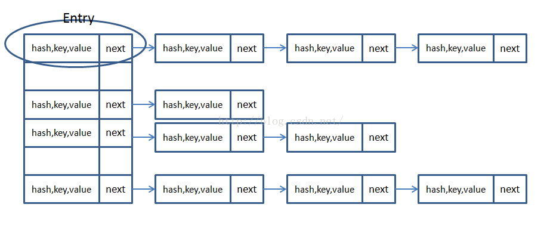
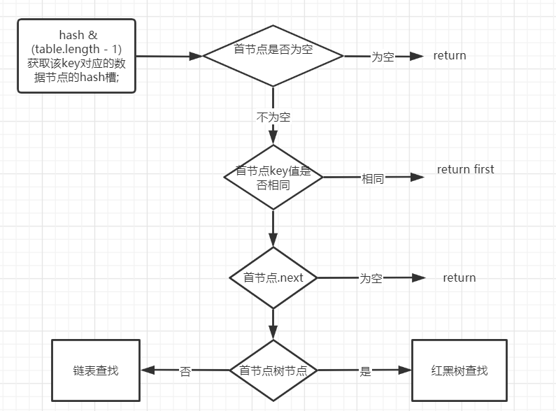
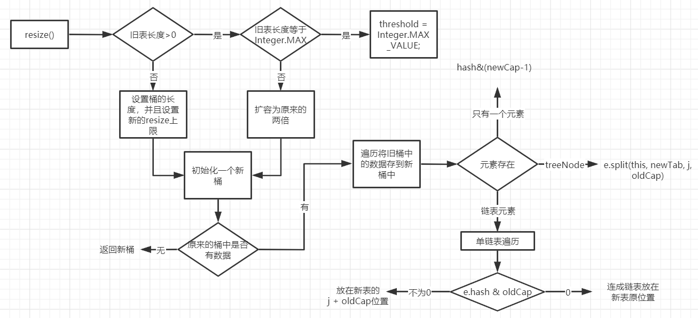
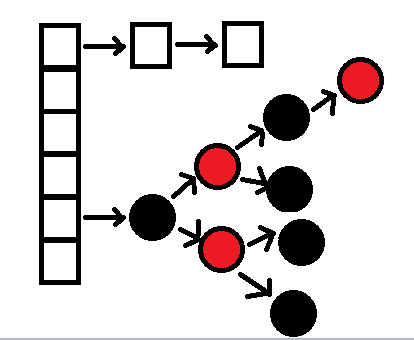

# 1、HashMap

在JDK1.6，JDK1.7中，HashMap采用位桶+链表实现，即使用链表处理冲突，同一hash值的链表都存储在一个链表里。但是当位于一个桶中的元素较多，即hash值相等的元素较多时，通过key值依次查找的效率较低。而JDK1.8中，HashMap采用位桶+链表+红黑树实现，当链表长度超过阈值（8）时，将链表转换为红黑树，这样大大减少了查找时间。

简单说下HashMap的实现原理：

首先有一个每个元素都是链表（可能表述不准确）的数组，当添加一个元素（key-value）时，就首先计算元素key的hash值，以此确定插入数组中的位置，但是可能存在同一hash值的元素已经被放在数组同一位置了，这时就添加到同一hash值的元素的后面，他们在数组的同一位置，但是形成了链表，同一各链表上的Hash值是相同的，所以说数组存放的是链表。而当链表长度太长时，链表就转换为红黑树，这样大大提高了查找的效率。

当链表数组的容量超过初始容量的0.75时，再散列将链表数组扩大2倍，把原链表数组的搬移到新的数组中

即HashMap的原理图是：



###  **1、JDK1.8中的涉及到的数据结构** 

1，位桶数组

```java
transient Node<k,v>[] table;//存储（位桶）的数组</k,v>
```

2，数组元素Node<K,V>实现了Entry接口

```java
	//Node是单向链表，它实现了Map.Entry接口
static class Node<k,v> implements Map.Entry<k,v> {
    final int hash;
    final K key;
    V value;
    Node<k,v> next;
    //构造函数Hash值 键 值 下一个节点
    Node(int hash, K key, V value, Node<k,v> next) {
        this.hash = hash;
        this.key = key;
        this.value = value;
        this.next = next;
    }
 
    public final K getKey()        { return key; }
    public final V getValue()      { return value; }
    public final String toString() { return key + = + value; }
 
    public final int hashCode() {
        return Objects.hashCode(key) ^ Objects.hashCode(value);
    }
 
    public final V setValue(V newValue) {
        V oldValue = value;
        value = newValue;
        return oldValue;
    }
    //判断两个node是否相等,若key和value都相等，返回true。可以与自身比较为true
    public final boolean equals(Object o) {
        if (o == this)
            return true;
        if (o instanceof Map.Entry) {
            Map.Entry<!--?,?--> e = (Map.Entry<!--?,?-->)o;
            if (Objects.equals(key, e.getKey()) &&
                Objects.equals(value, e.getValue()))
                return true;
        }
        return false;
	}
```


3，红黑树

```java
//红黑树
static final class TreeNode<k,v> extends LinkedHashMap.Entry<k,v> {
    TreeNode<k,v> parent;  // 父节点
    TreeNode<k,v> left; //左子树
    TreeNode<k,v> right;//右子树
    TreeNode<k,v> prev;    // needed to unlink next upon deletion
    boolean red;    //颜色属性
    TreeNode(int hash, K key, V val, Node<k,v> next) {
        super(hash, key, val, next);
    }
 
    //返回当前节点的根节点
    final TreeNode<k,v> root() {
        for (TreeNode<k,v> r = this, p;;) {
            if ((p = r.parent) == null)
                return r;
            r = p;
        }
	}
```

###  **2、源码中的数据域** 

加载因子（默认0.75）：为什么需要使用加载因子，为什么需要扩容呢？因为如果填充比很大，说明利用的空间很多，如果一直不进行扩容的话，链表就会越来越长，这样查找的效率很低，因为链表的长度很大（当然最新版本使用了红黑树后会改进很多），扩容之后，将原来链表数组的每一个链表分成奇偶两个子链表分别挂在新链表数组的散列位置，这样就减少了每个链表的长度，增加查找效率

 HashMap本来是以空间换时间，所以填充比没必要太大。但是填充比太小又会导致空间浪费。如果关注内存，填充比可以稍大，如果主要关注查找性能，填充比可以稍小。 

```java

public class HashMap<k,v> extends AbstractMap<k,v> implements Map<k,v>, Cloneable, Serializable {
    private static final long serialVersionUID = 362498820763181265L;
    static final int DEFAULT_INITIAL_CAPACITY = 1 << 4; // aka 16
    static final int MAXIMUM_CAPACITY = 1 << 30;//最大容量
    static final float DEFAULT_LOAD_FACTOR = 0.75f;//填充比
    //当add一个元素到某个位桶，其链表长度达到8时将链表转换为红黑树
    static final int TREEIFY_THRESHOLD = 8;
    static final int UNTREEIFY_THRESHOLD = 6;
    static final int MIN_TREEIFY_CAPACITY = 64;
    transient Node<k,v>[] table;//存储元素的数组
    transient Set<map.entry<k,v>> entrySet;
    transient int size;//存放元素的个数
    transient int modCount;//被修改的次数fast-fail机制
    int threshold;//临界值 当实际大小(容量*填充比)超过临界值时，会进行扩容 
    final float loadFactor;//填充比（......后面略）
```

###  **3、HashMap的构造函数** 

HashMap的构造方法有4种，主要涉及到的参数有，指定初始容量，指定填充比和用来初始化的Map

```java
//构造函数1
public HashMap(int initialCapacity, float loadFactor) {
    //指定的初始容量非负
    if (initialCapacity < 0)
        throw new IllegalArgumentException(Illegal initial capacity:  +
                                           initialCapacity);
    //如果指定的初始容量大于最大容量,置为最大容量
    if (initialCapacity > MAXIMUM_CAPACITY)
        initialCapacity = MAXIMUM_CAPACITY;
    //填充比为正
    if (loadFactor <= 0 || Float.isNaN(loadFactor))
        throw new IllegalArgumentException(Illegal load factor:  +
                                           loadFactor);
    this.loadFactor = loadFactor;
    this.threshold = tableSizeFor(initialCapacity);//新的扩容临界值
}
 
//构造函数2
public HashMap(int initialCapacity) {
    this(initialCapacity, DEFAULT_LOAD_FACTOR);
}
 
//构造函数3
public HashMap() {
    this.loadFactor = DEFAULT_LOAD_FACTOR; // all other fields defaulted
}
 
//构造函数4用m的元素初始化散列映射
public HashMap(Map<!--? extends K, ? extends V--> m) {
    this.loadFactor = DEFAULT_LOAD_FACTOR;
    putMapEntries(m, false);
}
```

### 4、**HashMap的get/post** 

 **1，HashMap如何getValue值，看源码**

 

```java

public V get(Object key) {
        Node<K,V> e;
        return (e = getNode(hash(key), key)) == null ? null : e.value;
    }
	  /**
     * Implements Map.get and related methods
     *
     * @param hash hash for key
     * @param key the key
     * @return the node, or null if none
     */
	final Node<K,V> getNode(int hash, Object key) {
        Node<K,V>[] tab;//Entry对象数组
	Node<K,V> first,e; //在tab数组中经过散列的第一个位置
	int n;
	K k;
	/*找到插入的第一个Node，方法是hash值和n-1相与，tab[(n - 1) & hash]*/
	//也就是说在一条链上的hash值相同的
        if ((tab = table) != null && (n = tab.length) > 0 &&(first = tab[(n - 1) & hash]) != null) {
	/*检查第一个Node是不是要找的Node*/
            if (first.hash == hash && // always check first node
                ((k = first.key) == key || (key != null && key.equals(k))))//判断条件是hash值要相同，key值要相同
                return first;
	  /*检查first后面的node*/
            if ((e = first.next) != null) {
                if (first instanceof TreeNode)
                    return ((TreeNode<K,V>)first).getTreeNode(hash, key);
				/*遍历后面的链表，找到key值和hash值都相同的Node*/
                do {
                    if (e.hash == hash &&
                        ((k = e.key) == key || (key != null && key.equals(k))))
                        return e;
                } while ((e = e.next) != null);
            }
        }
        return null;
    }
```

get(key)方法时获取key的hash值，计算hash&(n-1)得到在链表数组中的位置first=tab[hash&(n-1)],先判断first的key是否与参数key相等，不等就遍历后面的链表找到相同的key值返回对应的Value值即可 

 **2，HashMap如何put(key，value);看源码** 


```java

 1 public V put(K key, V value) {
 2     // 对key的hashCode()做hash
 3     return putVal(hash(key), key, value, false, true);
 4 }
 5 
 6 final V putVal(int hash, K key, V value, boolean onlyIfAbsent,
 7                boolean evict) {
 8     Node<K,V>[] tab; Node<K,V> p; int n, i;
 9     // 步骤①：tab为空则创建
10     if ((tab = table) == null || (n = tab.length) == 0)
11         n = (tab = resize()).length;
12     // 步骤②：计算index，并对null做处理 
13     if ((p = tab[i = (n - 1) & hash]) == null) 
14         tab[i] = newNode(hash, key, value, null);
15     else {
16         Node<K,V> e; K k;
17         // 步骤③：节点key存在，直接覆盖value
18         if (p.hash == hash &&
19             ((k = p.key) == key || (key != null && key.equals(k))))
20             e = p;
21         // 步骤④：判断该链为红黑树
22         else if (p instanceof TreeNode)
23             e = ((TreeNode<K,V>)p).putTreeVal(this, tab, hash, key, value);
24         // 步骤⑤：该链为链表
25         else {
26             for (int binCount = 0; ; ++binCount) {
27                 if ((e = p.next) == null) {
28                     p.next = newNode(hash, key,value,null);
                        //链表长度大于8转换为红黑树进行处理
29                     if (binCount >= TREEIFY_THRESHOLD - 1) // -1 for 1st  
30                         treeifyBin(tab, hash);
31                     break;
32                 }
                    // key已经存在直接覆盖value
33                 if (e.hash == hash &&
34                     ((k = e.key) == key || (key != null && key.equals(k)))) 
35							break;
36                 p = e;
37             }
38         }
39         
40         if (e != null) { // existing mapping for key
41             V oldValue = e.value;
42             if (!onlyIfAbsent || oldValue == null)
43                 e.value = value;
44             afterNodeAccess(e);
45             return oldValue;
46         }
47     }

48     ++modCount;
49     // 步骤⑥：超过最大容量 就扩容
50     if (++size > threshold)
51         resize();
52     afterNodeInsertion(evict);
53     return null;
54 }

```

下面简单说下添加键值对put(key,value)的过程：
1，判断键值对数组tab[]是否为空或为null，否则以默认大小resize()；
2，根据键值key计算hash值得到插入的数组索引i，如果tab[i]==null，直接新建节点添加，否则转入3
3，判断当前数组中处理hash冲突的方式为链表还是红黑树(check第一个节点类型即可),分别处理

### 5、HasMap的扩容机制resize();** 

 ***\*构造hash表时，如果不指明初始大小，默认大小为16（即Node数组大小16），如果Node[]数组中的元素达到（填充比\*Node.length）重新调整HashMap大小 变为原来2倍大小,\****扩容很耗时 



```java
/**
     * Initializes or doubles table size.  If null, allocates in
     * accord with initial capacity target held in field threshold.
     * Otherwise, because we are using power-of-two expansion, the
     * elements from each bin must either stay at same index, or move
     * with a power of two offset in the new table.
     *
     * @return the table
     */
    final Node<K,V>[] resize() {
        Node<K,V>[] oldTab = table;
        int oldCap = (oldTab == null) ? 0 : oldTab.length;
        int oldThr = threshold;
        int newCap, newThr = 0;
		
	/*如果旧表的长度不是空*/
        if (oldCap > 0) {
            if (oldCap >= MAXIMUM_CAPACITY) {
                threshold = Integer.MAX_VALUE;
                return oldTab;
            }
	/*把新表的长度设置为旧表长度的两倍，newCap=2*oldCap*/
            else if ((newCap = oldCap << 1) < MAXIMUM_CAPACITY &&
                     oldCap >= DEFAULT_INITIAL_CAPACITY)
	      /*把新表的门限设置为旧表门限的两倍，newThr=oldThr*2*/
                newThr = oldThr << 1; // double threshold
        }
     /*如果旧表的长度的是0，就是说第一次初始化表*/
        else if (oldThr > 0) // initial capacity was placed in threshold
            newCap = oldThr;
        else {               // zero initial threshold signifies using defaults
            newCap = DEFAULT_INITIAL_CAPACITY;
            newThr = (int)(DEFAULT_LOAD_FACTOR * DEFAULT_INITIAL_CAPACITY);
        }
		
		
		
        if (newThr == 0) {
            float ft = (float)newCap * loadFactor;//新表长度乘以加载因子
            newThr = (newCap < MAXIMUM_CAPACITY && ft < (float)MAXIMUM_CAPACITY ?
                      (int)ft : Integer.MAX_VALUE);
        }
        threshold = newThr;
        @SuppressWarnings({"rawtypes","unchecked"})
	/*下面开始构造新表，初始化表中的数据*/
        Node<K,V>[] newTab = (Node<K,V>[])new Node[newCap];
        table = newTab;//把新表赋值给table
        if (oldTab != null) {//原表不是空要把原表中数据移动到新表中	
            /*遍历原来的旧表*/		
            for (int j = 0; j < oldCap; ++j) {
                Node<K,V> e;
                if ((e = oldTab[j]) != null) {
                    oldTab[j] = null;
                    if (e.next == null)//说明这个node没有链表直接放在新表的e.hash & (newCap - 1)位置
                        newTab[e.hash & (newCap - 1)] = e;
                    else if (e instanceof TreeNode)
                        ((TreeNode<K,V>)e).split(this, newTab, j, oldCap);
	/*如果e后边有链表,到这里表示e后面带着个单链表，需要遍历单链表，将每个结点重*/
                    else { // preserve order保证顺序
					////新计算在新表的位置，并进行搬运
                        Node<K,V> loHead = null, loTail = null;
                        Node<K,V> hiHead = null, hiTail = null;
                        Node<K,V> next;
						
                        do {
                            next = e.next;//记录下一个结点
			  //新表是旧表的两倍容量，实例上就把单链表拆分为两队，
　　　　　　　　　　　　　　//e.hash&oldCap为偶数一队，e.hash&oldCap为奇数一对
                            if ((e.hash & oldCap) == 0) {
                                if (loTail == null)
                                    loHead = e;
                                else
                                    loTail.next = e;
                                loTail = e;
                            }
                            else {
                                if (hiTail == null)
                                    hiHead = e;
                                else
                                    hiTail.next = e;
                                hiTail = e;
                            }
                        } while ((e = next) != null);
						
                        if (loTail != null) {//lo队不为null，放在新表原位置
                            loTail.next = null;
                            newTab[j] = loHead;
                        }
                        if (hiTail != null) {//hi队不为null，放在新表j+oldCap位置
                            hiTail.next = null;
                            newTab[j + oldCap] = hiHead;
                        }
                    }
                }
            }
        }
        return newTab;
    }
```

###  6、**JDK1.8使用红黑树的改进** 

在java jdk8中对HashMap的源码进行了优化，在jdk7中，HashMap处理“碰撞”的时候，都是采用链表来存储，当碰撞的结点很多时，查询时间是O（n）。
在jdk8中，HashMap处理“碰撞”增加了红黑树这种数据结构，当碰撞结点较少时，采用链表存储，当较大时（>8个），采用红黑树（特点是查询时间是O（logn））存储（有一个阀值控制，大于阀值(8个)，将链表存储转换成红黑树存储）



问题分析：

你可能还知道哈希碰撞会对hashMap的性能带来灾难性的影响。如果多个hashCode()的值落到同一个桶内的时候，这些值是存储到一个链表中的。最坏的情况下，所有的key都映射到同一个桶中，这样hashmap就退化成了一个链表——查找时间从O(1)到O(n)。


随着HashMap的大小的增长，get()方法的开销也越来越大。由于所有的记录都在同一个桶里的超长链表内，平均查询一条记录就需要遍历一半的列表。

JDK1.8HashMap的红黑树是这样解决的：

如果某个桶中的记录过大的话（当前是TREEIFY_THRESHOLD = 8），HashMap会动态的使用一个专门的treemap实现来替换掉它。这样做的结果会更好，是O(logn)，而不是糟糕的O(n)。

它是如何工作的？前面产生冲突的那些KEY对应的记录只是简单的追加到一个链表后面，这些记录只能通过遍历来进行查找。但是超过这个阈值后HashMap开始将列表升级成一个二叉树，使用哈希值作为树的分支变量，如果两个哈希值不等，但指向同一个桶的话，较大的那个会插入到右子树里。如果哈希值相等，HashMap希望key值最好是实现了Comparable接口的，这样它可以按照顺序来进行插入。这对HashMap的key来说并不是必须的，不过如果实现了当然最好。如果没有实现这个接口，在出现严重的哈希碰撞的时候，你就并别指望能获得性能提升了。

