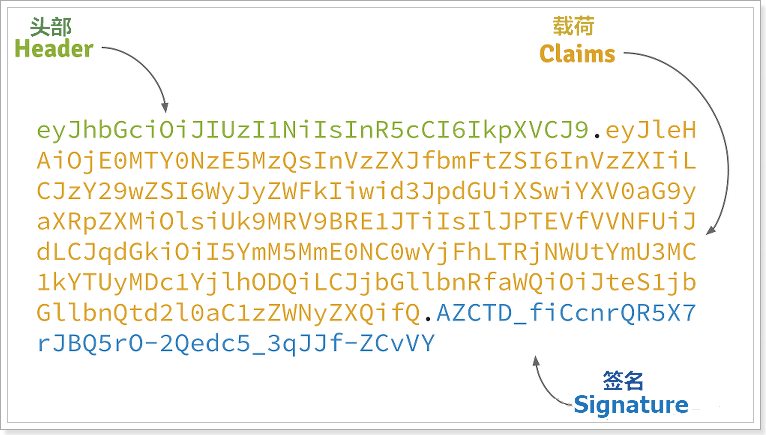

# 一 登录部分

## 1 无状态登录

### 1.1 什么是有状态登录

有状态服务，即服务端需要记录每次会话的客户端信息，从而识别客户端身份，根据用户身份进行请求的处理，典型的设计如tomcat中的session。

例如登录：用户登录后，我们把登录者的信息保存在服务端session中，并且给用户一个cookie值，记录对应的session。然后下次请求，用户携带cookie值来，我们就能识别到对应session，从而找到用户的信息。

> 缺点：
>
> - 服务端保存大量数据，增加服务端压力
> - 服务端保存用户状态，无法进行水平扩展
> - 客户端请求依赖服务端，多次请求必须访问同一台服务器
>

### 1.2 什么是无状态

- 服务端不保存任何客户端请求者信息
- 客户端的每次请求必须具备自描述信息，通过这些信息识别客户端身份

> 优点：
>
> - 客户端请求不依赖服务端的信息，任何多次请求不需要必须访问到同一台服务
> - 服务端的集群和状态对客户端透明
> - 服务端可以任意的迁移和伸缩
> - 减小服务端存储压力

### 1.3 怎么实现无状态

- 当客户端第一次请求服务时，服务端对用户进行信息认证（登录）
- 认证通过，将用户信息进行加密形成token，返回给客户端，作为登录凭证
- 以后每次请求，客户端都携带认证的token
- 服务的对token进行解密，判断是否有效。

> 整个登录过程中，最关键的点是什么？
>
> **token的安全性**
>
> token是识别客户端身份的唯一标示，如果加密不够严密，被人伪造那就完蛋了。
>
> 采用何种方式加密才是安全可靠的呢？
>
> 我们将采用`JWT + RSA非对称加密`
>

## 2 JWT

### 2.1 数据格式

> JWT，全称是Json Web Token

- **Header：头部，通常头部有两部分信息：**

  - 声明类型，这里是JWT

  我们会对头部进行base64编码，得到第一部分数据

- **Payload：载荷，就是有效数据，一般包含下面信息**：

  - 用户身份信息（注意，这里因为采用base64编码，可解码，因此不要存放敏感信息）
  - 注册声明：如token的签发时间，过期时间，签发人等

  这部分也会采用base64编码，得到第二部分数据

- **Signature：签名，是整个数据的认证信息。**

  一般根据前两步的数据，再加上服务的的密钥（secret）（不要泄漏，最好周期性更换），通过加密算法生成。用于验证整个数据完整和可靠性

<u>生成的数据格式：token==个人证件  jwt=个人身份证</u>

### 2.2 jwt 流程

> 因为JWT签发的token中已经包含了用户的身份信息，并且每次请求都会携带，这样服务的就无需保存用户信息，甚至无需去数据库查询，完全符合了Rest的无状态规范。

## 3 结合zuul网关的鉴权流程 

> secret是签名的关键，因此一定要保密，我们放到鉴权中心保存，其它任何服务中都不能获取secret。

### 3.1 没有RSA加密时候

- 1、用户请求登录
- 2、Zuul将请求转发到授权中心，请求授权
- 3、授权中心校验完成，颁发JWT凭证
- 4、客户端请求其它功能，携带JWT
- 5、Zuul将jwt交给授权中心校验，通过后放行
- 6、用户请求到达微服务
- 7、微服务将jwt交给鉴权中心，鉴权同时解析用户信息
- 8、鉴权中心返回用户数据给微服务
- 9、微服务处理请求，返回响应

> 发现什么问题了？
>
> 每次鉴权都需要访问鉴权中心，系统间的网络请求频率过高，效率略差，鉴权中心的压力较大。

### 3.2 有RSA加密的时候

- 我们首先利用RSA生成公钥和私钥。私钥保存在授权中心，公钥保存在Zuul和各个信任的微服务
- 用户请求登录
- 授权中心校验，通过后用私钥对JWT进行签名加密
- 返回jwt给用户
- 用户携带JWT访问
- Zuul直接通过公钥解密JWT，进行验证，验证通过则放行
- 请求到达微服务，微服务直接用公钥解析JWT，获取用户信息，无需访问授权中心

## 4 授权中心

接下来，我们需要在`leyou-auth-servcice`编写一个接口，对外提供登录授权服务。基本流程如下：

- 客户端携带用户名和密码请求登录
- 授权中心调用用户中心接口（feign），根据用户名和密码查询用户信息
- 如果用户名密码正确，能获取用户，否则为空，则登录失败
- 如果校验成功，则生成JWT并返回

